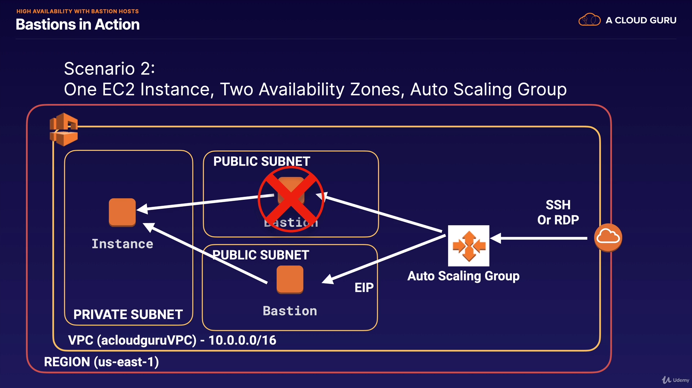

## Domains

### Design Resilient Architecture

- reliable and resilient storage
  - EFS // TODO
  - EBS // TODO
  - S3 // TODO
- design decoupling mechanisms
  - SQS //TODO
  - load balancer
  - elastic IP: decouple IP addresses from the server
- multi-tier architecture solutions
- high availability and/or fault-tolerant solutions:
  - user can access service under any circumstances; can allow certain performance degradation
  - fault tolerance: user does not experience any issue; more strict requirements
  - RTO vs. RPO
    - Recovery Time Objective: **time** to recover from a failure without causing significant performance degradation
    - Recovery Performance Objective: the **amount of data** that can be lost before significant performance degradation occurs

#### HA: Highly Available architecture

- Always design for failure
- use multiple AZs and regions wherever you can
- multi-AZ vs. read replicas for RDS // TODO
- scaling out vs. scaling up
  - scaling out: use auto-scaling groups(add instances)
  - scaling up: increase resources inside EC2 instance (e.g. increase CPU, memory, storage)beware of the cost element
- different S3 storage classes

##### HA Architecture Example

##### HA Bastion Hosts

- Option1: separate hosts in different AZs; use a network load balancer with static IP address and health checks to ensure that the host is up
  - layer 4 load balancer needed, so it cannot be an application load balancer // TODO
  

- OPtion2: one host in a single AZ behind an Auto Scaling Group with health checks and a fixed EIP,
  - if the host fails, the health check will fail and the auto-scaling group will automatically provision a new EC2 instance.
  - not 100 percent fault-tolerant, but can be used as a backup; will take some time to recover from a failure
  - **lowest cost option**

> 总体来说，理解为`BFF层`与`Service层`即可
> 无论4层负载均衡还是Auto Scaling Group策略，与health check一起都属于BFF层
> BFF->Service(Public SN)->DB(Private SN)

> 这里这么说只是为了帮助理解，BFF层的存在意义是进行鉴权、安全、限流、数据转换与组装等与业务无关的逻辑等业务无关逻辑的处理
