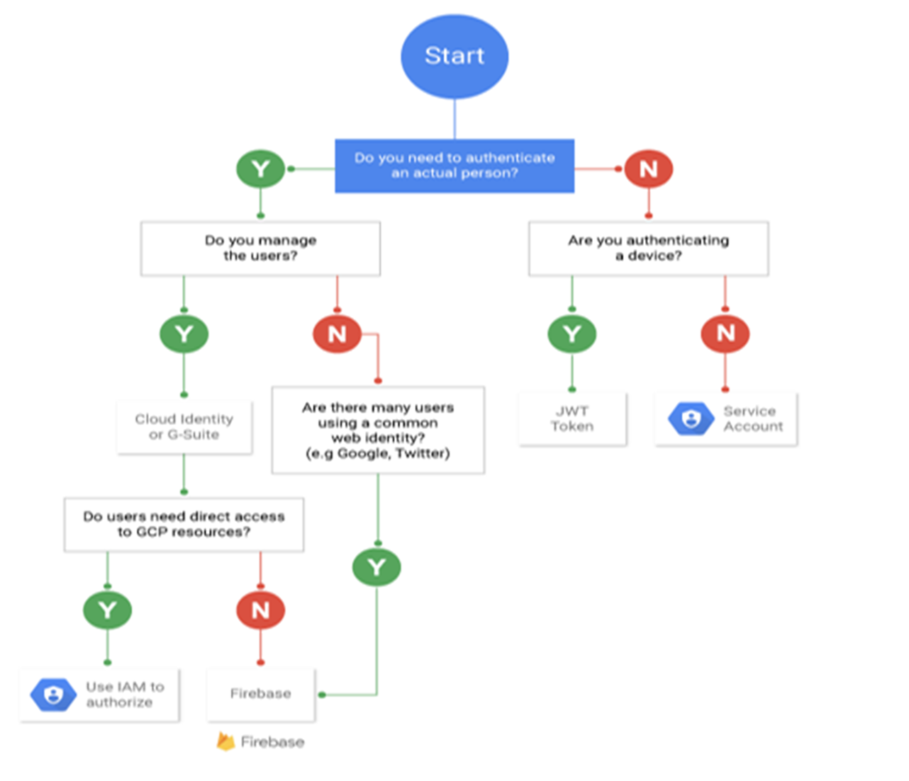
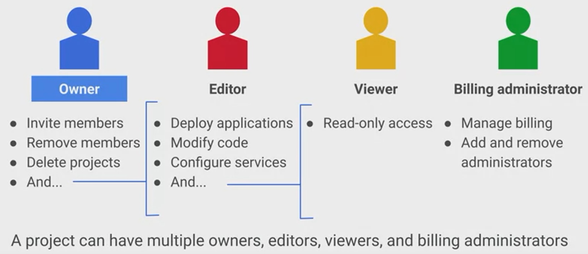

## Cloud IAM of GCP

> [Google Documentation](https://cloud.google.com/iam/docs)

> IAM: All about **Providing**, **Preventing** and **Adopting**.

- Providing: Granting granular access to resources.
- Preventing: Preventing unauthorized/unwanted access to resources.
- Adopting: Adopting the security principle of least privilege.

## Core Components of IAM

**Who | can do What | Where (on Which resource)**

- Members (Who)
  - Person (Google Account)
  - Google Group -> Image group of accounts
  - Service Account -> Account for applications which can be identified by `<project-number/id>@developer.gserviceaccount.com`.
- Permissions and Roles (What)
  - Permissions
    - Gives access to a given resource.
    - Identified by `<service>.<resource>.<verb>`.
      - e.g. `pubsub.subscriptions.consume`
  - Roles
    - A collection of permissions. (To use or manage GCP resources)
    - Roles are assigned to users.
- Resources (Where)
  - Resource Hierarchy
    - Organization → Folder → Project → Resource
    - **Project**: control access to resources
    - **Project ID**: unique identifier for a project, cannot be changed.
    - **Project Name**: can be customized.
    - **Project Number**: GCP assigns a unique number to each project.

And here are policies:
- Policies bind Members to Roles at a hierarchy level.
- Collection of Roles that define who has what type of access.
- Parents overruling children policies.

## Service Account

- **Global**
- Similar to AWS Role
- This is a special type of GCP account that represents an application, not a person(end user).
- Can be assumed by applications or individual users when authorized.

### Service Account Keys

- **GCP-managed keys**
  - Keys used by GCP services such as APP Engine amd Compute Engine.
  - Key cannot be downloaded.
  - Rotated automatically on a weekly basis.
- **User-Managed keys**
  - Keys are created and managed by the user.
  - Downloadable.
  - Expires 10 years after creation.
  
## Primitive, Predefined and Custom Roles

### Primitive Roles (Basic)

Basic roles are very coarse-grained.

Scope: Project, Folder
Historical roles before Cloud IAM was implemented.

Types:

- **Viewer**: Read-only access.
- **Editor**: Read and write access.
- **Owner**: Full access.
  - Read Write
  - Manage access to Project and resources
  - Setup Project Billing

### Predefined Roles

predefined roles are fine-grained permissions on particular services

