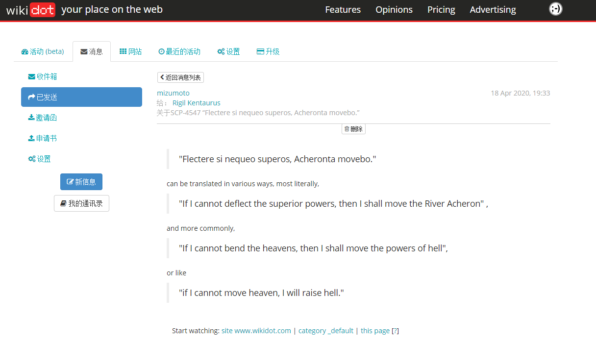

<!-- ## "Flectere si nequeo superos, Acheronta movebo." -->

> "Flectere si nequeo superos, Acheronta movebo."

这是我昨天在逛SCP中文分部的时候发现的一句拉丁语诗。
出现在 [<u>__SCP-4547__</u>](http://scp-wiki-cn.wikidot.com/scp-4547)
文档的`附录4547-1：SCP-4547发来的星际探索任务记录`部分，
作为“星际特遣队`Interstellar Task Force, ITF Aleph-4`”
的代号。

翻译文档的小朋友很年轻，只是查了一下谷歌翻译就放弃了翻译这段话。
我通过站内信私信的方式将这段话的翻译告诉了他。

> "Flectere si nequeo superos, Acheronta movebo."

can be translated in various ways, most literally,

> "If I cannot deflect the superior powers, then I shall move the River Acheron" ,

and more commonly,

> "If I cannot bend the heavens, then I shall move the powers of hell",

or just be like,

> "if I cannot move heaven, I will raise hell."

 

如果要翻译成SCP翻译腔的话，我想大约会是 ：

> 星际特遣队 “如果我无法撼动上苍”

或是

> 星际特遣队 “如果我无法触碰天堂”。

   

Mizumoto&nbsp;&nbsp;&nbsp;&nbsp;&nbsp;&nbsp;&nbsp;&nbsp;&nbsp; 
Wuhan, Hubei, China 04 - 19 - 2020&nbsp;&nbsp;&nbsp;&nbsp;&nbsp;&nbsp; 

   

[<u>Back to HomePage</u>](https://mizumoto-cn.github.io)

    

Attachment:  

