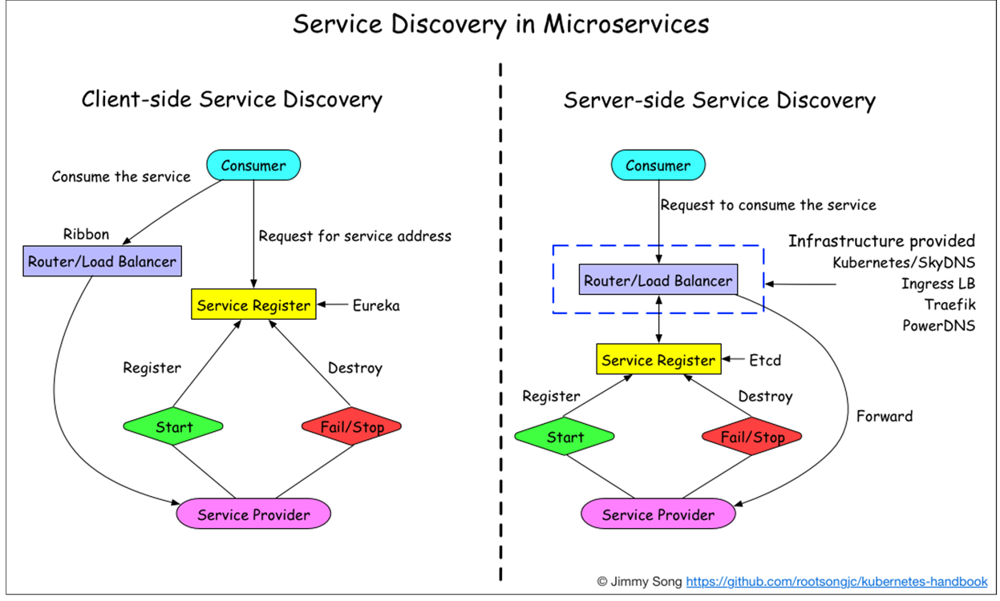
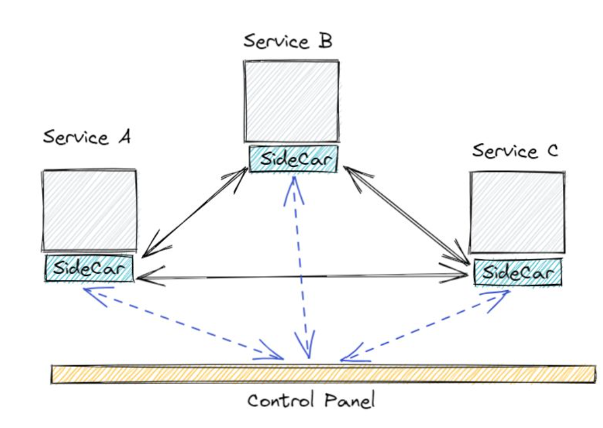

[Last article](2022-06-26-Go-MicroServices-Forword-1.md) we talked about why shall we use **globally consistent** inter-service communication tools such as gRPC.

And now, after we discussed the definition of microservices, how shall we expose them to the public, etc. In addition to the exposure to the public, services also need to call and interact with each other, using the same communication protocol.

And that is "Health Check" and "Service Discovery".

### Health Check

`gRPC` provides a mechanism to check the health of a service.

Positive health checks can perceive the health status of a service by checking its heartbeat. When a service provider is not in a stable status, it will be marked as unhealthy and taken out of the balancing pool. It will be registered and put into the pool again when the service-registry receives its normal heartbeat signal again.

This can also be used in plug-in containers( k8s liveness and readiness)

> A typical kubernetes swift deployment example:
>
> - Kubernetes sends a terminate request to the discovery service
> - Kubernetes then sends a SIGTERM signal to the APP container, graceful quitting process shall be performed.
> - Clients, being informed by the service discovery, will be notified about the service being unavailable, and will quit in a given ttl timeout.(2 heartbeats, for example) Usually, they will qui
> - Kubernetes will force quit after timeout (10~60 seconds for most of the situations) (SIGKILL)

#### Graceful Startup&Shutdown

##### Graceful Startup


- The service provider starts, and the Kubernetes startup script will check the health status of the service with a certain interval.
- Once the health status is healthy, the service registration script registers the service with the registry (rpc://ip:port).
- The consumers will regularly fetch/receive the service list from the registry.
- Consumers will send requests to the service after confirming it passes the health check.
  - and if a problem occurs with the health check, the service will be marked as unhealthy and removed from the registry list as well as the load.

##### Graceful Shutdown


- There is an advantage to implementing it in the release deployment platform, as you don't have to implement the same logic for each application.
- It is also possible for an application to initiate a shutdown process after it has received a SIGTERM signal.
- Noted that there is an interval between registry deletion and consumers receiving the updated service list.
- registry deletion time out is usually 2 heartbeats.
- SIGKILL timeout is usually 10~60 seconds.

##### Graceful Startup&Shutdown in Gin

<!-- markdownlint-disable MD010 MD033 -->

The following code can be found [here](./gin-graceful/).

```golang
package main

import (
  "context"
	"fmt"
	"log"
	"net/http"
	"os"
	"os/signal"
	"strconv"
	"syscall"
	"time"

	"github.com/gin-gonic/gin"
)

// 模拟慢请求
func sleep(ctx *gin.Context) {
	t := ctx.Query("t")
	s, err := strconv.Atoi(t)
	if err != nil {
		ctx.JSON(http.StatusBadRequest, gin.H{"msg": "参数错误: " + t})
		return
	}

	time.Sleep(time.Duration(s) * time.Second)
	ctx.JSON(http.StatusOK, gin.H{"msg": fmt.Sprintf("sleep %d s", s)})
}

const (
	stateHealth   = "health"
	stateUnHealth = "unhealth"
)

var state = stateHealth

func health(ctx *gin.Context) {
	status := http.StatusOK
	if state == stateUnHealth {
		status = http.StatusServiceUnavailable
	}
	ctx.JSON(status, gin.H{"data": state})
}

func main() {
	e := gin.Default()
	e.GET("/health", health)
	e.GET("/sleep", sleep)

	server := &http.Server{
		Addr:    ":8080",
		Handler: e,
	}

	go func() {
		if err := server.ListenAndServe(); err != nil && err != http.ErrServerClosed {
			log.Fatalf("server run err: %+v", err)
		}
	}()

	// 用于捕获退出信号
	quit := make(chan os.Signal)

	// kill (no param) default send syscall.SIGTERM
	// kill -2 is syscall.SIGINT
	// kill -9 is syscall.SIGKILL but can't be catch, so don't need add it
	signal.Notify(quit, syscall.SIGINT, syscall.SIGTERM)
	<-quit
	log.Println("Shutting down server...")

	// 捕获到退出信号之后将健康检查状态设置为 unhealth
	state = stateUnHealth
	log.Println("Shutting down state: ", state)

	// 设置超时时间，两个心跳周期，假设一次心跳 3s
	ctx, cancel := context.WithTimeout(context.Background(), 6*time.Second)
	defer cancel()

	// Shutdown 接口，如果没有新的连接了就会释放，传入超时 context
	// 调用这个接口会关闭服务，但是不会中断活动连接
	// 首先会将端口监听移除
	// 然后会关闭所有的空闲连接
	// 然后等待活动的连接变为空闲后关闭
	// 如果等待时间超过了传入的 context 的超时时间，就会强制退出
	// 调用这个接口 server 监听端口会返回 ErrServerClosed 错误
	// 注意，这个接口不会关闭和等待websocket这种被劫持的链接，如果做一些处理。可以使用 RegisterOnShutdown 注册一些清理的方法
	if err := server.Shutdown(ctx); err != nil {
		log.Fatal("Server forced to shutdown:", err)
	}

	log.Println("Server exiting")
}
```

<!-- add shade for the next section 
<style>
.shade {
  background-color: #f5f5f5;
  padding: 10px;
}
</style>
<p class="shade">
  <a href="sdaadsa">sdaadsa</a>
</p>
-->

##### Service Discovery in Microservices



###### client-side service discovery

- Client-side microservice discovery connects directly and takes one step less than the server-side service discovery.
-Consumers require specific service-discovering clients and discovery logic built inside.
  + Load balancing logic can be decoupled by throwing it into the `sidecar` container.



<p class="shade">

> The Sidecar app is not necessarily part of the service itself, but only connected to it. It's like a sidecar motorbike, each with its own separate auxiliary part which starts or stops with the main application. Because the sidecar is actually a standalone service, we can do a lot of things on it, such as communicate between sidecars, or control the sidecar through a unified node, thus reaching Service Mesh.

</p>


