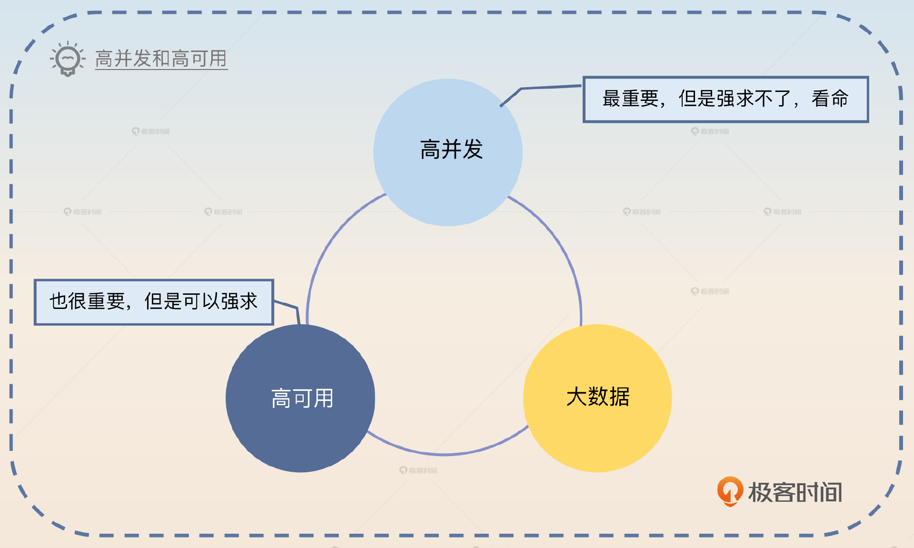
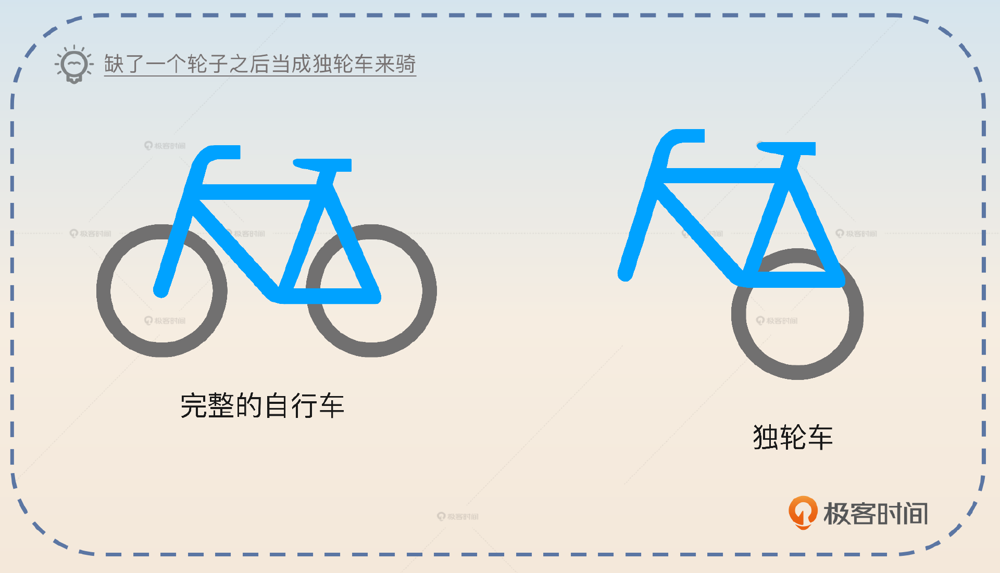
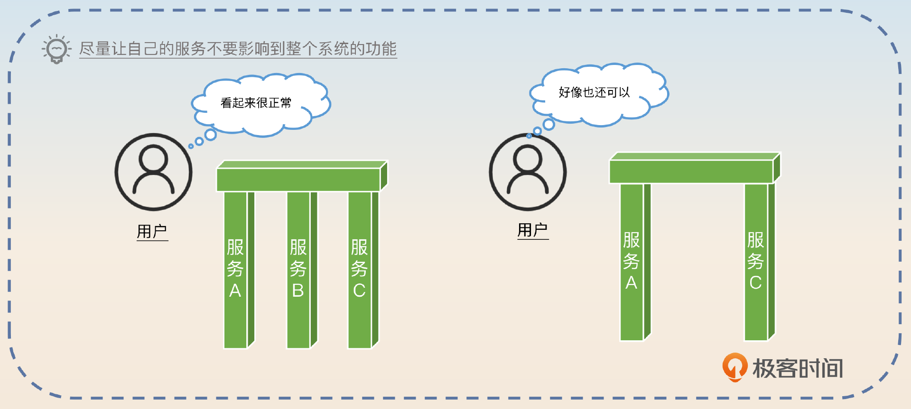
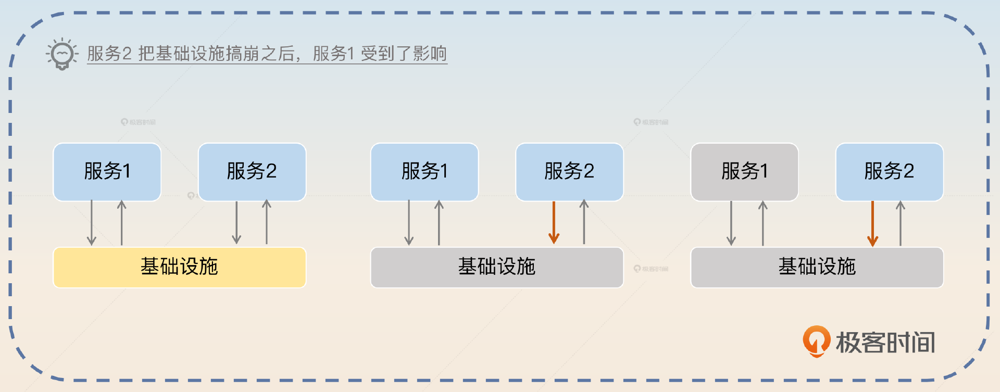
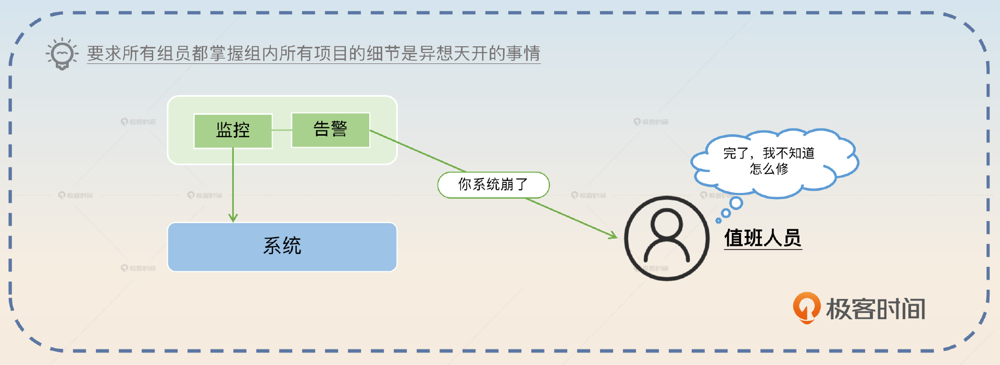
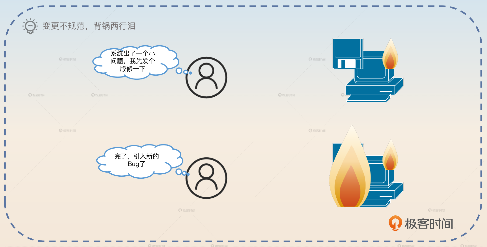
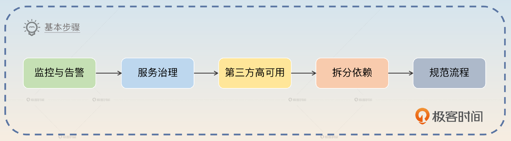
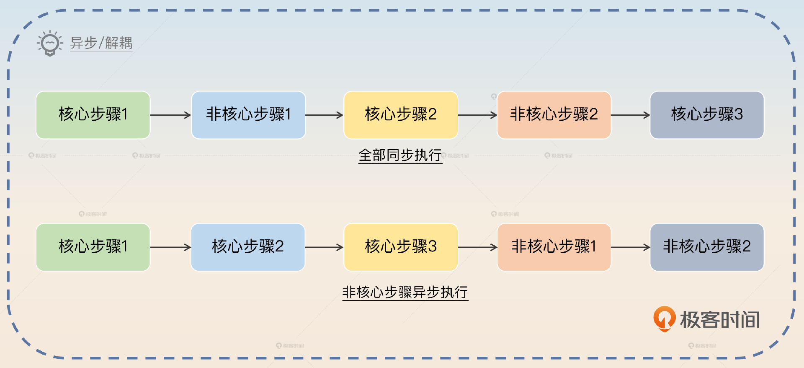
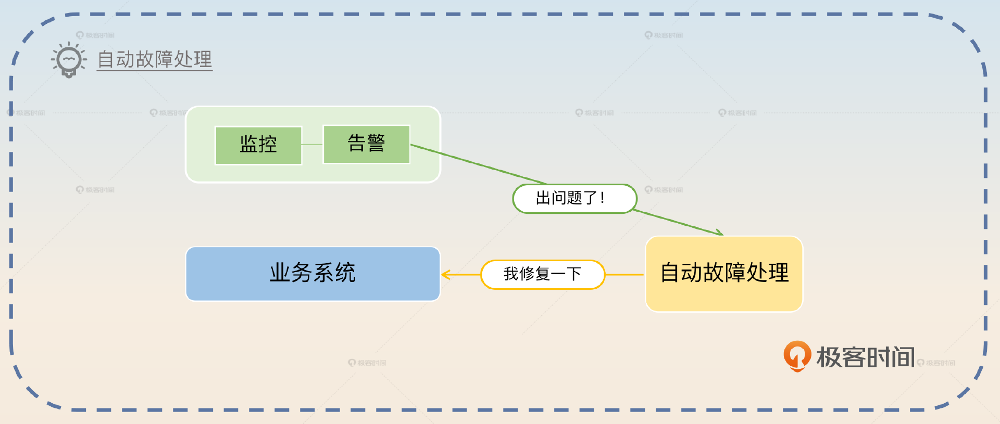
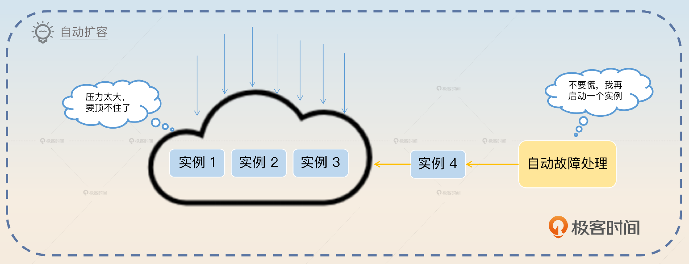

# 09｜综合服务治理方案：怎么保证微服务应用的高可用？
你好，我是大明。今天我们来聊一个综合性的话题：给你一个微服务应用，你怎么保证它的高可用？

在面试互联网相关岗位的时候，大部分公司都会看重 **高并发**、 **高可用** 和 **大数据** 相关的经验。不过有没有高并发和大数据的项目经验有点儿看命。因为如果你不是在大厂的核心部门，你是很难遇到真正的高并发和大数据场景的。

高可用不一样，即便你维护的系统月活只有一万人，依旧可以把自己的系统做成高可用的。所以相比之下，高可用就可以成为我们面试的主要发力点。

当然你也需要意识到，一个类似淘宝那种量级的系统的高可用和一个简单的后台管理系统的高可用，含金量是不一样的。但还是那句话，又有几个人真的有机会接触到淘宝那种项目呢？所以如果你真的不知道怎么把自己平凡的项目说得比较有特色，那么就可以参考这节课的内容。

## 前置知识

一般衡量可用性，我们都是用 **SLA**（Service Level Aggrement）指标，通常用 N 个九来说明。例如，当我们说微服务的可用性是三个九，是指系统在一段时间内（一般是一年）正常提供服务的时间超过了 99.9%。

那么高可用究竟有多高？一般是指可用性需要达到三个九。当然有些人会认为需要达到四个九，这并没有硬性的标准。那么怎么做到高可用呢？

核心有四点：

- 容错；
- 限制故障影响范围；
- 出现故障可以快速发现，快速修复；
- 规范变更流程。

### 容错

容错是指不管发生了什么，你的系统都能正常提供服务，也就是所谓的 Design for Failure。用一句俗语来说，就是 **凑合用**。

系统中可能出问题的组件包括你的服务本身、你依赖的服务，还包括你依赖的硬件基础设施和软件基础设施。

在面试的时候，最重要的是描述怎么保证自己的服务即便在遇到了一些故障的情况下，整个系统也能继续为用户提供服务。

其次是软件基础设施如果出问题了，你是否能保证你的服务还能正常运作。如果你的服务不能正常运作，系统整体也要能运作，这主要考虑两个点。

1. 在公司内使用软件基础设施的高可用方案。比如说在使用 Redis 的时候就不再是使用单机 Redis，而是改成 Redis Cluster 或者直接使用云厂商的 Redis 服务。
2. 做好万一软件崩溃的容错手段。比如说前面我提到如果 Redis 崩溃了，你可以使用限流来保护数据库。

剩余的内容除了依赖第三方这一个特殊的场景外，在面试中出现得很少，这里我们就不展开说了。

容错的问题就是不管你怎么容错，最终都有可能出错，所以到了真出错的时候，你就要考虑限制故障影响范围。

### 限制故障影响范围

限制故障影响范围是指万一真的出现了故障，也要尽可能减轻它的影响范围。影响范围可以从三个角度来考虑，尽可能使故障造成的业务损失更小、被影响的用户更少，还有被影响的其他组件更少。

限制影响范围的最佳策略就是 **隔离**。一个复杂的系统被划分成独立的不同的服务，服务内部再进一步细分模块、核心服务与非核心服务，尽量降低相互之间的影响。

但是普遍来说，想要缩小影响范围总是面临两个难点。

- **服务互相依赖，** 这种依赖一部分源自业务本身的复杂度，另外一部分则源自设计不合理。我们可以通过改进设计来降低服务之间的依赖，但是不可能做到彻底没有依赖。比如说后面提到的解耦方案，就是通过改进设计来降低服务之间依赖的一个例子。
- **服务共享一部分基础设施**。理论上只要你有足够多的钱，能够为每一个服务提供完全独立的基础设施，就可以彻底解决这个问题。但是实际中大部分公司连部署两套 Redis 都舍不得，所以我们经常听到某某公司因为共享基础设施导致系统崩溃的事故。

在限制了故障影响范围后，你就要考虑快速发现和快速修复故障。

### 快速发现和快速修复故障

快速发现强调的是 **完备的观测和告警系统**。观测不仅要观测服务本身，也要对各种基础设施、第三方依赖进行观测。尤其是在你核心链路上依赖的东西，你都需要进行全方位地观测。有了观测之后，还要设置合理的告警。 **没有告警的观测是没有灵魂的**。

快速恢复则是尽可能减少服务不可用的时间。快速修复与其说是一个工程技术问题，不如说是一个组织建设问题。它实际上要求每一个组都需要安排人 24 小时值班，并且每个值班的人都需要了解整个组所维护的项目的细节，否则出了故障都没人响应，或者不知道怎么响应。

所以要想真正做到快速修复，不能依赖于研发个人的自觉性，而是要依赖于自动处理故障的机制，后面我们再详细介绍这一机制。

### 规范变更流程

规范变更流程是指任何一个人都不能随意发布新版本，也不能随意修改配置。任何一个变更都要经过 review，并且做好回退的准备。

实际上，我们在实践中最害怕的就是发布新版本或者新配置。因为原本系统都运作得非常好，但是一旦上线新功能或者变更配置，就很容易出现线上故障。特别是有些时候因为急着修 Bug，根本没有测试就直接发布新代码或者配置，导致不仅已有的 Bug 没修好，还造成了新的问题。

因此变更流程是一定要搞好的，搞好了变更流程，可用性就能大幅提升。不过这一点和快速修复一样，都是一个组织问题而不是一个工程技术问题。

## 面试准备

在面试前，你需要准备一个 **从前端到后端全方位的、完整的** 高可用方案，而且要仔细思考其中的几个环节。

- 所有面向前端用户的接口有没有限流之类的措施，防止攻击者伪造大量请求把你的系统搞崩。
- 你所依赖的第三方组件，包括缓存（如 Redis）、数据库（如 MySQL）、消息队列（如 Kafka）是否启用了高可用方案。
- 如果你依赖的某个第三方组件崩溃了，你维护的服务会发生什么事情，整个系统是否还能正常提供服务。
- 你的所有服务是否选择了合适的负载均衡算法，是否有熔断、降级、限流和超时控制等治理措施。
- 你所在公司的上线流程、配置变更流程等和研发息息相关的流程，或者说你认为会对系统可用性产生影响的各种流程。

我在接下来的内容里给出了一个非常全面的高可用方案，你要做的就是根据你的真实项目经历来改造一下，并且重新组织一下语言。

我在这里使用的都是一些比较普适的例子，也就是说即便你在中小企业也能用上这些例子。但是如果你在大厂，有机会接触到一些更加高级的高可用方案，此时你应该优先使用那些高级高可用方案。我建议你在面试前将整个内容写出来。面试讲究的是有备无患，千万别考验自己的临机应变能力。

最佳的面试策略就是在自我介绍的时候提到自己在高可用微服务架构方面的经历，然后在介绍项目的时候，展示自己在入职之后大幅度提高了系统可用性的成果。之后面试官大概率会详细问你这个项目，以及你是怎么提高可用性的。这时候你就可以用到下面的话术了。

## 基本思路

整个思路可以拆解成几个部分，分别是 **发现问题、计划方案、落地实施、取得效果、后续改进。** 而且发现问题和取得效果这两个步骤可以通过前后对比来凸显你在这个过程中起到的作用。

### 发现问题

第一个部分发现问题由项目的核心困难、困难的具体体现、具体难点三个部分组成。

> 某某业务是我们公司的核心业务，它的核心困难是需要保证高可用。在我刚入职的时候，这个系统的可用性还是比较低的。比如说我刚入职的第一个月就出了一个比较严重的线上故障，别的业务组突然上线了一个功能，带来了非常多的 Redis 大对象操作，以至于 Redis 响应非常慢，把我们的核心服务搞超时了。
>
> 后面经过调研，我总结下来，系统可用性不高主要是这三个原因导致的。
>
> 1. 缺乏监控和告警，导致我们难以发现问题，难以定位问题，难以解决问题。
> 2. 缺乏服务治理，导致某一个服务出现故障的时候，整个系统都不可用了。
> 3. 缺乏合理的变更流程。我们每次复盘 Bug 时候，都觉得如果有更加合理的变更流程的话，那么大部分事故都是可以避免的。

### 计划方案

这里有一个常见的误区，就是你在现实中可能做过类似的事情，但是都是东一榔头西一棒槌，也就是说想到了啥就做啥。但是面试的时候，你一定要将这些内容组织得非常有条理、有计划。

你要给面试官留下的印象不仅仅是你能解决问题，更是你能够有计划地解决问题。所以你一定要有一个非常清晰的、可执行性高的 **计划**。

> 针对这些具体的点，我的可用性改进计划分成了几个步骤。
>
> 1. 引入全方位的监控与告警，这一步是为了快速发现问题和定位问题。
> 2. 引入各种服务治理措施，这一步是为了提高服务本身的可用性，并且降低不同服务相互之间的影响。
> 3. 为所有第三方依赖引入高可用方案，这一步是为了提高第三方依赖的可用性。
> 4. 拆分核心业务与非核心业务的共同依赖。这一步是为了进一步提高核心业务的可用性。
> 5. 规范变更流程，降低因为变更而引入 Bug 的可能性。

如果你们公司有非常完善的基础设施和强大的技术实力，那么你可以加上像全链路压测、混沌工程、故障演练等高端方案，作为你整个计划中的一部分。

### 落地实施

然后你再讲落地实施。落地实施的时候你要补充细节，同时也可以掺杂一些落地过程中的痛点。

> 在第一个步骤里面，就监控来说，既要为业务服务添加监控和告警，又要为第三方依赖增加监控，比如说监控数据库、Redis 和消息队列。而告警则要综合考虑告警频率、告警方式以及告警信息的内容是否足够充足，减少误报和谎报。本身这个东西并不是很难，就是非常琐碎，要一个个链路捋过去，一个个业务查漏补缺。
>
> 就第二个步骤来说，服务治理包括的范围比较广，我使用过的方案也比较多，比如说限流熔断等等。
>
> 第三个步骤遇到了比较大的阻力，主要是大部分第三方依赖的高可用方案都需要资金投入。比如说最开始我们使用的 Redis 就是一个单机 Redis，那么后面我尝试引入 Redis Cluster 的时候，就需要部署更多的实例。
>
> 第四个步骤也是执行得不彻底。现在的策略就是新的核心业务会启用新的第三方依赖集群，比如说 Redis 集群，但是老的核心业务就保持不动。

你可能发现了，我在上面的回答中，谈到第三点和第四点的时候都说执行得不太好。这会不会给面试官留下不好的印象呢？

其实不会。因为我陈述的基本上都是事实，这些困难都是实打实的，而且也是面试官能理解的。另一方面，一个方案不可能十全十美，适当地暴露一些问题能够增强说服力。

第五个步骤有点特殊，取决于你在公司的地位。如果你在公司很有话语权，甚至本身就在带团队，那么你可以直接说你推行了新的变更流程。如果你是一个纯粹的“搬砖”工程师，那么可以参考这个回答，关键词是 **建议**。

> 第五个步骤是我在公司站稳脚跟之后跟领导建议过几次，后来领导就制定了新的规范，主要是上线规范，包括上线流程、回滚计划等内容。

### 取得效果

既然我们这里讨论的是可用性，那么你取得的效果肯定就是可用性方面有多大的改进。一般来说，我建议你说可用性达到了 **三个九**，而不是四个九，毕竟四个九的可用性有点过于夸张了。

> 经过我的改进之后，现在我维护的服务的可用性从原来不足两个九提升到了三个九。

你也可以比较幽默地回答。

> 现在 Bug 数量也减少了。Bug 复盘的时候我已经不再是那个挨骂的人了，变成了看别人挨骂的人。

同时你还可以强调一下，系统中超出你影响力范围的部分，可用性还是比较差。

> 不过我的服务还依赖于一些同事提供的服务，而他们的服务可用性就还是比较差。我这边只能是说尽量做到容错，比如说提供有损服务。后面要想进一步提高可用性，还是得推动同事去提高可用性。

如果面试官质疑你为什么三个九也敢说是高可用，你要怎么回答呢？

其实不用慌，你可以解释一下，也可以理解为认怂，关键词是 **影响力有限**。

> 我也一直在想办法进一步提高可用性，但是整个系统要做到四个九还是非常难的，需要整个公司技术人员一起努力才能达到。我在公司的影响力还局限在我们部门，困难比较多，暂时做不到那么高的可用性。

### 后续改进

最后你要补充一下你的改进计划。一般来说，改进计划都是针对已有方案的缺点，所以你要先讲已有方案的缺点。

> 目前我的服务，尤其是一些老服务，相互之间还是在共享一些基础设施。一个出问题就很容易牵连其他服务，所以我还需要进一步将这些老服务解耦。

然后你可以再举一个非常具体的改进措施，来增强说服力。

> 比如说，我一定要让我的全部服务都使用我自己所在组的数据库实例，省得因为别组的同事搞崩了数据库，牵连到我的业务。大家一起用一个东西，出了事别人死不认账，甩锅都甩不出去。

讲改进方案有一个好处，就是它还没实施，你就可以随便讲，什么高大上你就讲什么。

## 亮点方案

掌握了面试的基本思路之后，实际上你在这次面试中就基本上能给面试官留下一个不错的印象了。这里我再额外补充一些方案，你可以选择其中一两个来进一步强化你在面试官心目中的形象。

### 异步/解耦

这个方案适用于什么情况呢？就是你的某一个业务可以分成两部分。一部分是必须要同步执行成功的关键步骤，另外一部分则是可以异步执行的非关键步骤。

比如说在一个简单的创建订单的场景中，创建订单、支付是必须要同步执行成功的。但是另外一些部分，比如说发邮件通知你下单成功、为你增加积分这种就不是一定要立刻执行成功的。

因此在设计高可用微服务的时候有一个技巧或者说原则，就是能够异步执行的绝对异步执行，能够解耦的必须解耦。

这种理念用一句话来形容就是 **多做多错，少做少错，不做不错**。

因此你可以用这个话术来介绍你的方案，关键词是 **异步/解耦**。

> 我还全面推行了异步/解耦。我将核心业务的逻辑一个个捋过去，再找产品经理确认，最终将所有的核心业务中能够异步执行的都异步执行，能够解耦的都解耦。这样在我的业务里面，需要同步执行的步骤就大大减少了。而后续异步执行的动作，即便失败了也可以引入重试机制，所以整个可用性都大幅度提升了。
>
> 比如说在某个场景下，整个逻辑可以分成很明显的两部分，必须要同步执行的 A 步骤和可以异步执行的 B 步骤。那么在 A 步骤成功之后，再发一条消息到消息队列。另外一边消费消息，执行 B 步骤。

### 自动故障处理

严格来说，熔断、限流和降级也算是自动故障处理。不过我这里说的是有一个独立的系统来处理业务系统发生的故障。

一个问题从发现到找出临时应对方案、再到付诸实施，一不留神一个小时就过去了。所以在达成三个九以后，如果你还想进一步提升可用性，那就要么降低出事故的概率，要么提高反应速度。

人本身做不到长时间精神紧绷 24 小时待命，并且同一个项目组的项目也很难说了如指掌，所以自动故障处理机制的重要性不言而喻。甚至可以说，如果没有自动故障处理机制，是不可能达到四个九的可用性的。

这里我给你一个例子：微服务集群自动扩容。它是指对整个微服务集群进行监控，如果发现集群负载过高那么就会自动扩容。

所以你可以这么回答，关键词是 **自动扩容**。

> 为了进一步提高整个集群服务的可用性，我跟运维团队进行密切合作，让他们支持了自动扩容。整个设计方案是允许不同的业务方设置不同的扩容条件，满足条件之后运维就会自动扩容。比如说我为我的服务设置了 CPU 90% 的指标。如果我这个服务所有节点的 CPU 使用率都已经超过了 90%，并且持续了一段时间，那么就会触发自动扩容，每次扩容会新增一个节点。

这里我用的例子比较简单，决策的理由也比较简单。

> CPU 使用率长期处于高位，基本上代表节点处于高负载状态。并且我强调的是集群里面的节点都超过了这个指标，防止单一节点超过该指标之后引起不必要的扩容。比如说，万一某个节点非常不幸，处理的都是复杂的请求，那么它就会处于高负载的状态，但是其他节点其实负载还很低。那么这个时候扩容，并没有什么效果。

还有一些常见的方案，你可以参考。

- 自动修复数据，最常见的就是有一个定时任务比对不同的业务数据，如果数据不一致，就会发出告警，同时触发自动修复动作。
- 自动补发消息，也是通过定时任务等机制来比对业务数据，如果发现某条消息还没发，就会触发告警，同时触发补发消息动作。

但凡你的业务有很多需要人手工介入处理的数据问题，你都可以考虑设计一个自动恢复程序，去自动地发现和修复不一致的数据。

## 面试思路总结

我要强调一下，这里给出的整个话术和方案，你要根据你的实际经验来做调整。业界有非常多的高可用方案，你可以多学几个，纳入你的面试方案里面。

你不需要掌握全部的高可用方案，因为实在太多学不过来。你只需要重点掌握几种，然后在面试的时候注重引导和把控面试节奏，将面试内容限制在你所了解的那几种上就可以。

## 思考题

1. 四个九代表全年不可用时间不超过 53 分钟，那么你知道三个九和五个九又各自代表多少时间吗？从你个人经历出发，你认为四个九的可用性，究竟难不难达成？
2. 除了我这里提到的各种措施以外，你自己有没有做过其他提高可用性的事情？你怎么把它整合进你的面试方案里面？

欢迎你把思考后的结果分享给我，我们一起讨论，同时也欢迎你把这节课分享给需要的朋友，我们下节课再见！