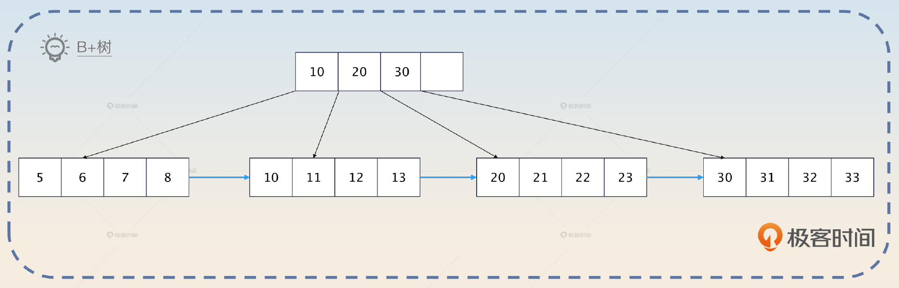
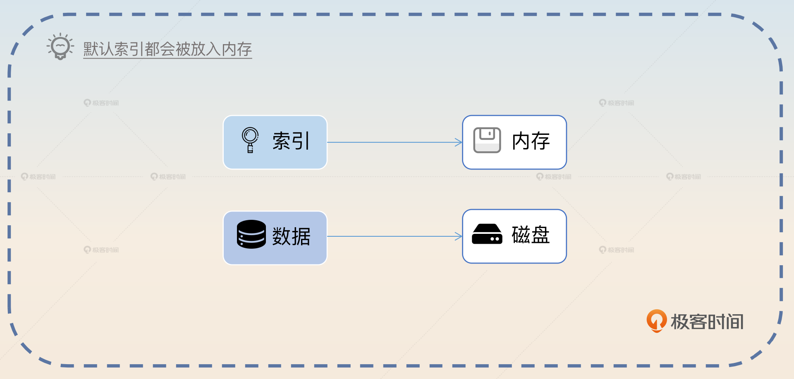
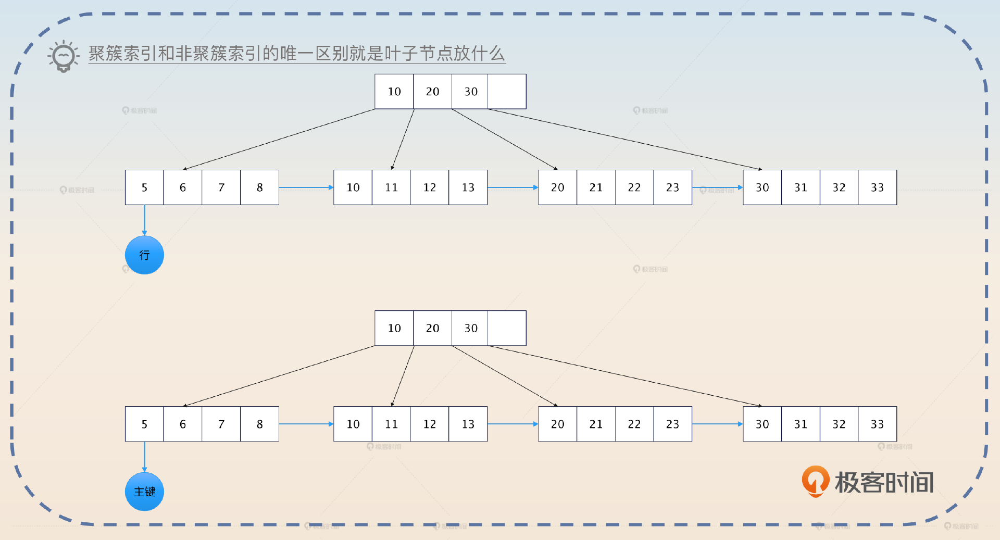
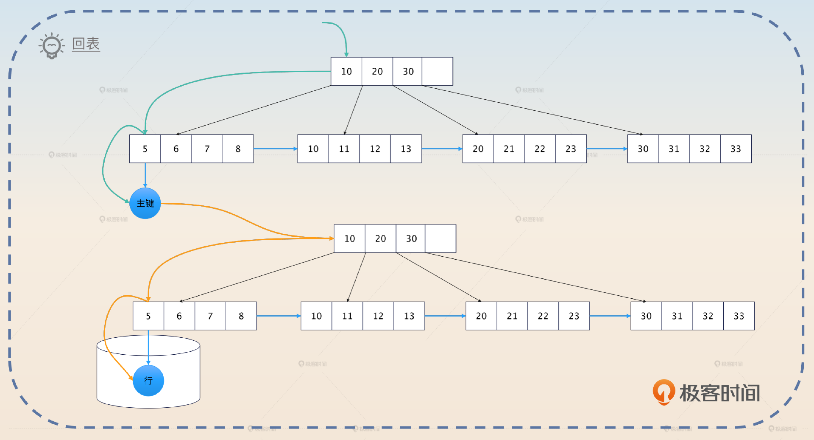
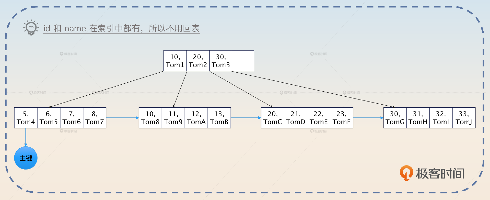
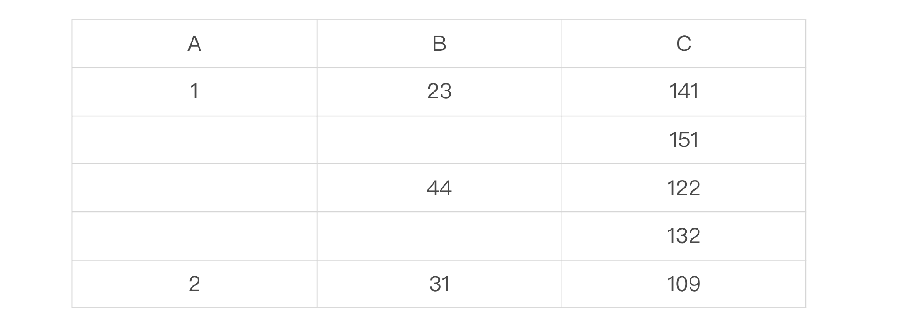
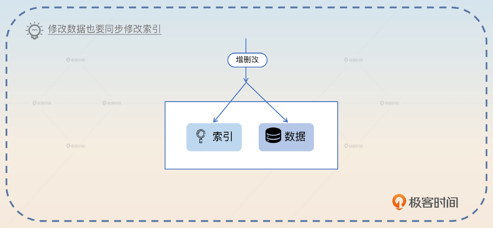
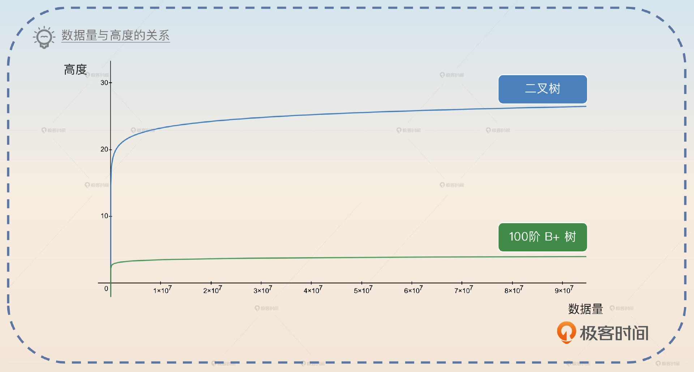
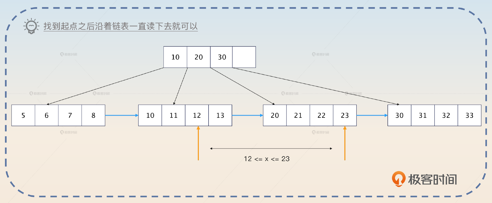
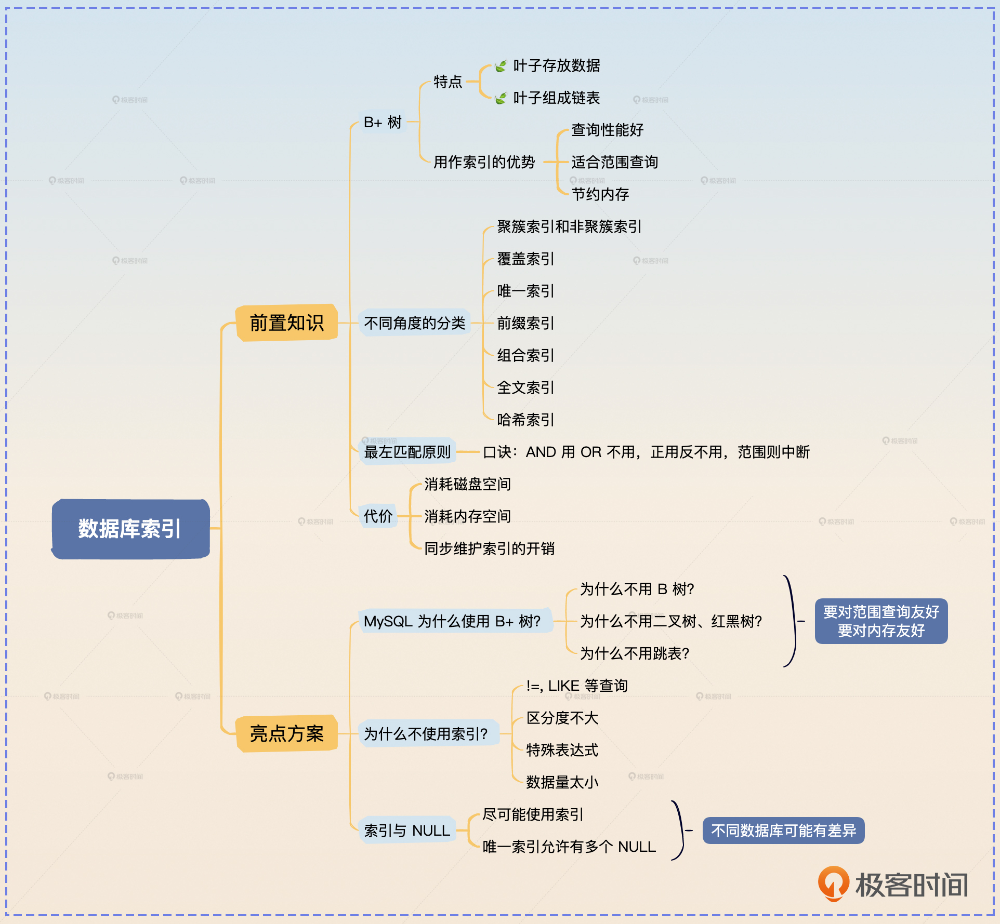

# 10｜数据库索引：为什么MySQL用B+树而不用B树？
你好，我是大明。

从这节课开始，我们将进入数据库这一章。在实际工作中，数据库设计得好不好、SQL 写得好不好将极大程度影响系统性能。而且，即便是再小的公司，也不可能说没有数据库，所以如果你担忧自己因为没有微服务架构经验难以通过面试，那么数据库就可以成为你反败为胜的一个点。

所以今天我们来聊一聊数据库中的第一个话题——索引。

索引在数据库面试中占据了相当大的比重。但是大部分人面试索引的时候都非常机械，所以难以在面试官心中留下深刻印象。索引是一个理论和实践的结合，今天这节课我先带你分析索引的基本原理，下节课我再在 SQL 优化这一个大主题下进一步带你分析索引设计和优化的实战案例。

索引的内容还是非常多的，尤其是有很多非常细碎的、不成体系的点，记起来非常难。所以这一节课我就会尽量用非常简单的话，以及一些奇妙的比喻来帮助你记忆和索引有关的内容。

## 前置知识

索引是用来加速查找的数据结构。绝大多数跟存储、查找有关的中间件都有索引功能，但是它们的原理不尽相同。

我们先来了解一下B+树的定义与特征。

### B+ 树

B+ 树是一种多叉树，一棵m阶的B+树定义如下：

1. 每个节点最多有 m 个子女。
2. 除根节点外，每个节点至少有 `[m/2]` 个子女，根节点至少有两个子女。
3. 有 k 个子女的节点必有 k 个关键字。

这里的关键字你可以直观地理解为就是索引全部列的值。B+ 树还有两个特征。

- **叶子存放了数据**，而非叶子节点只是存放了关键字。
- **叶子节点被链表串联起来了。**



前面 B+ 树的定义你记不住没关系，但是这两个特征你一定要记住。为了帮助你理解和记忆，我给你打个比方。

一棵 B+ 树就像是一个部门。部门分成管理人员（非叶子节点）和基层员工（叶子节点），而管理人员只是负责传达命令（只放索引关键字），具体的事务（存放数据）都是由基层员工来执行的。

基层员工之间为了合作顺畅，私底下互相都有联系，对应到B+树上就是叶子节点被链表连在一起。

B+ 树用于数据库索引有3大优势。

1. B+ 树的高度和二叉树之类的比起来更低，树的高度代表了查询的耗时，所以 **查询性能更好**。
2. B+ 树的叶子节点都被串联起来了， **适合范围查询**。
3. B+ 树的非叶子节点没有存放数据，所以 **适合放入内存中**。

很多人都能记住 B+ 树的前两个优势，但是很容易忽略第三个优势。事实上，我们在讨论使用索引提高查询性能的时候，一个默认的前提就是索引本身会全部装进内存中，只有真实的数据行会放在磁盘上。否则，索引也放在磁盘上的话，使用索引的效果也就不明显了。



## 索引分类

这算是你在学习索引过程中一个非常容易迷惘的点，因为 MySQL 的索引站在不同的角度，就有不同的说法。

- 根据叶子节点是否存储数据来划分，可以分成 **聚簇索引** 和 **非聚簇索引**。
- 如果某个索引包含某个查询的所有列，那么这个索引就是 **覆盖索引**。
- 如果索引的值必须是唯一的，不能重复，那么这个索引就是 **唯一索引。**
- 如果索引的某个列，只包含该列值的前一部分，那么这个索引就是 **前缀索引**。比如说在一个类型是 varchar(128) 的列上，选择前 64 个字符作为索引。
- 如果某个索引由多个列组成，那么这个索引就是 **组合索引，** 也叫做联合索引。
- **全文索引** 是指用于支持文本模糊查询的索引。
- **哈希索引** 是指使用哈希算法的索引，但是 MySQL 的InnoDB 引擎并不支持这种索引。

一个索引可以同时是覆盖索引、唯一索引、前缀索引和组合索引，你站在不同的角度去看待索引就会有不同的说法。

### 聚簇索引和非聚簇索引

如果索引叶子节点存储的是数据行，那么它就是聚簇索引，否则就是非聚簇索引。

简单来说，某个数据表本身你就可以看作是一棵使用主键搭建起来 B+ 树，这棵树的叶子节点放着表的所有行。而其他索引也是 B+ 树，不同的是它们的叶子节点存放的是主键。



有了这种区分，你就能理解所谓的 **回表** 了。如果你查询一张表，用到了索引，那么数据库就会先在索引里面找到主键，然后再根据主键去聚簇索引中查找，最终找出数据。



如图所示，查询的时候先沿着绿色的线条在非聚簇索引中找到主键。然后拿着主键再去下面沿着黄色的线条找到数据行。这个数据行存放在磁盘里，所以触发磁盘 IO 之后能够读取出来。磁盘 IO 是非常慢的，因此回表性能极差，你在实践中要尽可能避免回表。

### 覆盖索引

如果你查询的列全部都在某个索引里面，那么数据库可以直接把索引存储的这些列的值给你，而不必回表。

比如说你有一个用户表 user\_tab，在上面的 id 和 name 两列上创建了一个组合索引 `<id, name>`，那么对于这个查询来说 `SELECT id, name FROM user_tab WHERE id = 123`, SELECT 关键字后面的 id 和 name 两列都在这个索引里，那么就可以直接用索引的数据，不必回表查询了。



那么， **这个索引在这个查询下就是一个覆盖索引**。所以覆盖索引并不是一个独立的索引，而是某个索引相对于某个查询而言的。

针对这个特性，优化 SQL 性能里面有两种常见的说法。

1. 只查询需要的列。
2. 针对最频繁的查询来设计覆盖索引。

这两种说法本质上都是为了避免回表。

### 索引的最左匹配原则

索引在查询中是按照最左匹配原则来使用的，细究起来这个原则还是有点难以理解。我用一个例子来给你解释最左匹配原则的运行机制。比如说你创建了一个在 A、B、C 三个列上的组合索引 `<A, B, C>`。我用一个表格来展示一下索引列的值的关系。



我们可以看到：A 是绝对有序的；在 A 确定的情况下，B 是有序的；在 A 和 B 都确定的情况下，C 是有序的。

那么反过来说：

- 如果 A 的值不确定，那么 B 和 C 都是无序的。例如当 A 取值可能为 1 或者 2 的时候，B 的取值可能是 `(23, 44, 31)`。
- 如果 A 的值确定，但是 B 的值不确定，那么 C 是无序的。例如当 A=1 而 B 可能是 44 或者 31 的时候，C 的值可能是 `(122, 132, 109)`。

所以执行一个 `WHERE A=a1 AND B=b1 AND C=c1` 的查询就类似于：

```go
for a in A {
  if a == a1 {
    for b in B {
      if b == b1 {
        for c in C {
          if c == c1 {
            // 这就是你要的数据，拿到主键之后去磁盘里面加载出来
          }
        }
      }
    }
  }
}

```

你从这个角度出发，就能理解其他最左匹配原则的情况了。

- 如果查询条件是 `WHERE A = a1 AND B = b1`，那么你可以推断出来，数据库只会应用外层的两重循环，不会对 C 进行过滤。

```go
for a in A {
  if a == a1 {
      for b in B {
        if b == b1 {
          // 这就是你要的结果，去磁盘里面读取
        }
      }
  }
}

```

- 如果查询条件是 `WHERE A = a1 OR B = b1`，那么这个查询并不会使用这个索引。

```go
for a in A {
  if a == a1 {
      as = append(as, a)
  }
}
for b in B {
  if b == b1 {
      bs = append(bs, b)
  }
}
// as 和 bs 的并集就是你要的结果

```

- 如果查询条件是 `WHERE A=a1 AND B > b1 AND C = c1`，那么这个查询只会使用索引的 A 和 B 两列。

```go
for a in A {
  if a == a1 {
      for b in B {
        if b > b1 {
          // C 是无序的，所以用不了。你可以从前面的表格里面看出来
          // 比如说 b > 23 之后，对应的 C 是乱序的
          // 这就是你要的结果，去磁盘里面读取
        }
      }
  }
}

```

- 如果查询条件是 `WHERE A !=a1`，那么这个查询也不会使用索引。

我给你整理了一个简单的口诀用于判断会不会使用索引。按照组成索引的列的顺序，从左往右： **AND 用 OR 不用，正用反不用，范围则中断**。

这个口诀是一个简化之后的版本，还有一些意外情况是不符合这个口诀描述的规律的。比如说 `M = 1 OR N = 2`，如果单列 M 上有一个索引，并且单列 N 上也有一个索引，那么还是可能会使用 M 和 N 上的两个索引。

在实践中，用索引还是不用索引，就一个原则： **看 EXPLAIN 命令的输出**。

### 索引的代价

索引并不是没有代价的，它会消耗很多的系统资源。

1. 索引本身需要存储起来，消耗磁盘空间。
2. 在运行的时候，索引会被加载到内存里面，消耗内存空间。
3. 在增删改的时候，数据库还需要同步维护索引，引入额外的消耗。



这部分内容你也需要记住，因为现在有一些面试官的套路就是突然问你违反直觉的问题。例如正常我们都认为索引非常好，有很多优点，那么面试官就可能突然问你“使用索引有什么问题”“索引有什么坏处”等问题。

## 面试准备

首先你要弄清楚公司内使用索引的情况，或者你所在公司使用过的各种索引，以及有没有出现索引设计不当引发的线上故障。

如果你有意为自己打造掌握了高性能架构的人设，那么你面试索引的最佳策略就是在自我介绍或者介绍项目的时候提及索引和索引优化。

在面试中有一种情况是比较棘手的，即面试官给出一个表定义，然后手写一个 SQL，要你判断这个 SQL 会不会使用索引。你平时要刻意练习一下，省得面试的时候被打个措手不及。遇到这种题目，你还要注意强调一点，就是你的回答都是建立在 **一般情况** 下。因为有些面试官会故意不告诉你表中数据大小，有没有其他索引等情况。

在你回答完之后，他可能会批评你没有考虑到数据库压根不使用索引的可能性。所以回答完他的问题之后，你加一段话。

> 我刚才的分析都是基于一般情况，但是如果说数据库还有别的索引，或者查询条件过滤效果不好导致数据库压根不使用索引的情况，那就是另外一个问题了。

这个“免责声明”也能够将面试官引导到后面的进阶亮点“为什么数据库不使用索引”中。

如果面试官问到了这些问题，那么你可以将话题引导到索引下。

- 你有没有做过性能优化？
- 你是否了解 B 树、B+ 树？
- 你知道聚簇索引、覆盖索引吗？
- 数据库一定会使用索引吗？
- 使用索引性能一定好吗？这个问题你要综合考虑索引本身的开销，以及数据库压根不用索引的情况。

## 基本思路

如果你在简历、自我介绍或者项目介绍任何一个地方提及了自己懂索引原理、索引设计和优化技巧，那么面试官肯定就会问你索引有关的东西。

如果面试官问索引问得非常细，例如“什么是覆盖索引”这种，只需要按照前置知识里面的内容回答就可以。

如果面试官问得比较笼统，你就可以用这里我给你的这个介绍索引的话术，你可以根据自己的需要选择回答全部或者只使用一部分。这个话术由 **B+树、索引分类、最左匹配原则** 三个部分组成。

> 从数据结构上来说，在 MySQL 里面索引主要是 B+ 树索引。它的查询性能更好，适合范围查询，也适合放在内存里。
>
> MySQL 的索引又可以从不同的角度进一步划分。比如说根据叶子节点是否包含数据分成聚簇索引和非聚簇索引，还有包含某个查询的所有列的覆盖索引等等。数据库使用索引遵循最左匹配原则。但是最终数据库会不会用索引，也是一个比较难说的事情，跟查询有关，也跟数据量有关。在实践中，是否使用索引以及使用什么索引，都要以 EXPLAIN 为准。

在这样一个话术中，我设计了几个可以引导的点，面试官是比较有可能进一步追问的。

1. 为什么 MySQL 用了 B+ 树，而没有用 B 树？在这个问题的基础上，面试官可能会进一步问，二叉树、红黑树和跳表之类的数据结构用作索引是否合适。
2. 回表以及和回表密切相关的覆盖索引。从这一个问题又可以进一步引申到索引优化和 SQL 优化上。这些索引的内容我们下节课会学习。
3. 数据库不使用索引的几种可能。

这些问题我们来一一解决。

## 亮点1：MySQL 为什么使用 B+ 树？

回答这个问题，你就不能仅仅局限在 B+ 树和 B 树上，你要连带着二叉树、红黑树、跳表一起讨论。总结起来，在用作索引的时候，其他数据结构都有一些难以容忍的缺陷。

- 与B+ 树相比，平衡二叉树、红黑树在同等数据量下， **高度更高，性能更差**，而且它们会频繁执行再平衡过程，来保证树形结构平衡。



- 与B+ 树相比，跳表在极端情况下会退化为链表， **平衡性差**，而数据库查询需要一个可预期的查询时间，并且跳表需要更多的内存。
- 与B+ 树相比，B 树的数据存储在全部节点中， **对范围查询不友好。** 非叶子节点存储了数据， **导致内存中难以放下全部非叶子节点**。如果内存放不下非叶子节点，那么就意味着查询非叶子节点的时候都需要磁盘 IO。



因此一个数据结构是否适合数据库索引，取决于这种数据结构的增删改查性能。并且在关系型数据库里面，还额外要求对范围查询友好，减少内存消耗。

## 亮点2：为什么数据库不使用索引？

实际上，数据库在一些特殊的情况下可能并不会使用任何索引。例如在前面的索引 `<A, B, C>` 的例子中，假设 A 的所有值都是正数，然后查询条件 `WHERE A > -1`，那么这个时候数据库会觉得还不如直接全表扫描，那么虽然有一个索引看起来能用，但是最终并不会用。

我也在面试准备那部分提醒过你，要小心面试官挖坑让你掉下去。总结起来，数据库可能不使用索引的原因有以下几种：

- 使用了 `!=`、 `LIKE` 之类的查询。
- 字段区分度不大。比如说你的 status 列只有 0 和 1 两个值，那么数据库也有可能不用。
- 使用了特殊表达式，包括数学运算和函数调用。
- 数据量太小，或者 MySQL 觉得全表扫描反而更快的时候。

我稍微强调一下，这里说的是“ **可能** 不使用索引”，不是说一定不使用索引。比如说 LIKE 查询，如果只是 LIKE abc% 这种前缀查询，那么还是可能用索引的。

你还可以进一步解释 FORCE INDEX（强迫使用索引）、USE INDEX（使用索引）或者 IGNORE INDEX（忽略索引）之类的 SQL 提示，关键词是 **取决于数据库。**

> 虽然很多数据库都支持类似于 FORCE INDEX 、USE INDEX 和 IGNORE INDEX 之类的特性，但是使用这一类功能的时候，要千万注意数据库是怎么支持的。有些数据库是根本不管这些提示，有些则是特定情况下不管。当然最佳实践还是不要用这些东西，逼不得已的时候比如说要优化性能了再考虑使用。

然后你可以以一种比较轻松的语气来引导到下一个亮点。

> 有一种说法是含有 NULL 的列上的索引会失效，不过这个说法并不准确，实际上 MySQL 还是会尽可能用索引的。

之所以要让语气比较轻松，是害怕对面的面试官就抱有这种错误的观点。你语气轻松比较不容易激起逆反心理。

## 亮点3：索引与 NULL

我们通常用 NULL 来表达“不知道”“不存在”“不合法”等语义。而数据库通常也会针对 NULL 来做一些特殊的处理。

MySQL 的索引对 NULL 的支持稍微有点与众不同。首先 MySQL 本身会尽可能使用索引，即便索引的某个列里面有零值，并且 IS NULL 和 IS NOT NULL 都可以使用索引。

其次 MySQL 的唯一索引允许有多行的值都是 NULL。也就是说你可以有很多行唯一索引的列的值都是 NULL。但是不管怎么说，使用 NULL 都是一个比较差的实践。

## 面试思路总结

这一节课我们主要学习了索引的基本原理。你需要重点掌握索引的数据结构、B+ 树原理、索引分类、回表，以及索引在查询中的运行原理。

此外如果想要在面试中刷出亮点，你需要从下面几个方向去努力。

- MySQL 为什么使用 B+ 树？你要综合对比不同的数据结构的特性。
- 为什么数据库不使用索引？
- 索引与 NULL 的特殊之处。

我在前面还提到了一个有趣的面试场景。即面试官会问你某个具体场景的问题，但是不会告诉你细节和约束。比如说给你一个查询语句，让你判断会不会走索引。

虽然我不太喜欢这种面试套路，但是不得不说很多面试官就喜欢这样搞。他们的出发点是希望考察候选人思维是否缜密，能不能考虑到各种异常情况、边缘场景。

但是很多时候面试官出题根本没有考虑到候选人的技术背景。比如说你本职是做支付相关的，而他出的题是订单相关的。那么在这种专业不对口的情况下，你基本上不可能答好。这也是我认为这种面试套路实际上并不太能考察出候选人真实水平的核心原因。

应付这种面试套路也很简单，你只需要保持警惕。当面试官问你一个具体问题的时候，你先尽可能问清楚一些约束条件，最常见的就是并发量有多高、数据量有多大、可用性要求多高、一致性要求多高。

如果面试官不告诉你，让你考虑。或者你自己不打算问，那么你可以采用防御性的面试策略，在回答具体方案的时候先自己交代清楚这个方案的约束。



# 思考题

- 你有没有遇到过索引设计不合理引发的线上故障？如果有，当时你是怎么定位问题、怎么解决问题的？
- 你有没有因为 NULL 而出现过奇奇怪怪的问题？

欢迎你把你的经历和体会分享到评论区，和我一起交流讨论，也欢迎你把这节课分享给需要的朋友，邀他一起学习，我们下节课再见！