# 12｜数据库锁：明明有行锁，怎么突然就加了表锁？
你好，我是大明。今天我们来聊一聊 MySQL 中锁的问题。

锁在整个数据库面试中都是属于偏难，而且偏琐碎的一类问题。但是偏偏锁又很重要，比如说实践中遇到死锁影响了性能，这都要求我们必须对锁有一定的了解。并且锁的原理和索引、隔离级别都有关，所以很容易从锁这个角度联想到另外两个地方，又或者从索引和隔离级别里面跳到锁这里。

因此，一句话总结就是 **锁既难又琐碎还热门**。那么今天这节课我会带你彻底捋清楚锁，并且告诉你在面试过程中如何展示出你的亮点。

## 前置知识

### 锁与索引

在 MySQL 的 InnoDB 引擎里面，锁是借助索引来实现的。或者说，加锁锁住的其实是索引项，更加具体地来说，就是锁住了 **叶子节点**。

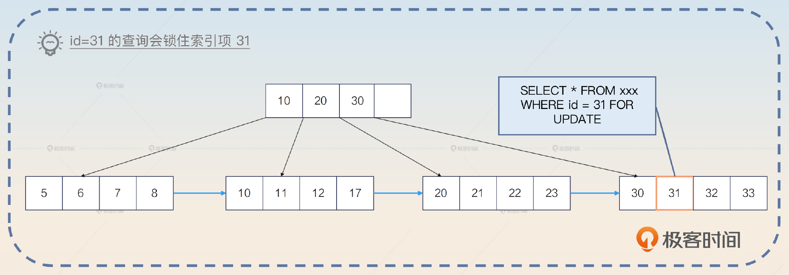

你从这个角度出发，就能理解大部分跟锁有关的千奇百怪的问题了。

一个表有很多索引，锁的是哪个索引呢？其实就是查询最终使用的那个索引。万一查询没有使用任何索引呢？那么锁住的就是整个表，也就是此时退化为表锁。

如果查询条件的值并不存在，例如：

```sql
SELECT * FROM your_tab WHERE id = 15 FOR UPDATE

```

id = 15 的值根本不存在，那么怎么锁？InnoDB 引擎会利用最接近 15 的相邻的两个节点，构造一个临键锁。

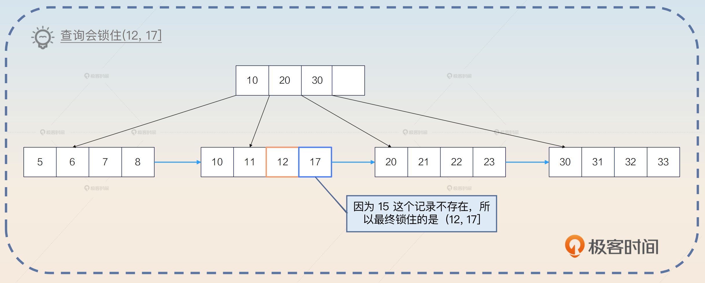

此时如果别的事务想要插入一个 id=15 的记录，就不会成功。

那么范围查询呢？也是利用索引上的数据，构造一个恰好能够装下这个范围的临键锁。例如：

```sql
SELECT * FROM your_tab WHERE id > 33 FOR UPDATE

```

InnoDB 引擎会构造一个(33，supremum\] 的临键锁，锁住整个范围。supremum 你可以直观理解为 MySQL 认为的一个虚拟的最大值。

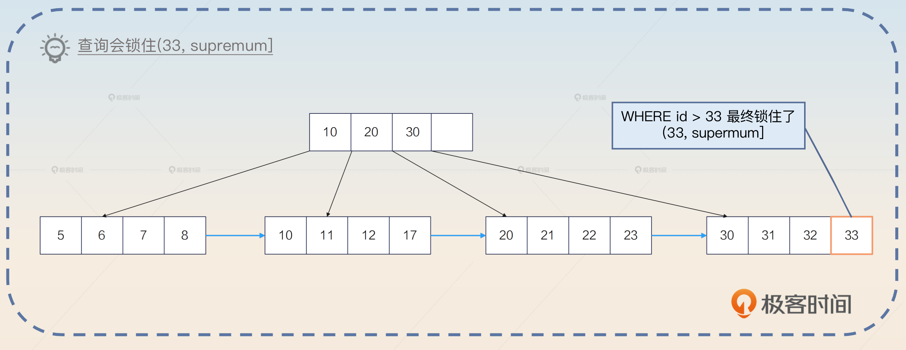

因此，我们得出了一个结论： **锁和索引密切相关。**

### 释放锁时机

大部分人在学习锁的时候有一个误区，就是认为锁是在语句执行完毕之后就立刻释放掉的。其实并不是，它是在整个事务结束之后才释放的。换句话来说，当一个事务内部给数据加上锁之后， **只有在执行 Rollback 或者 Commit 的时候，锁才会被释放掉**。

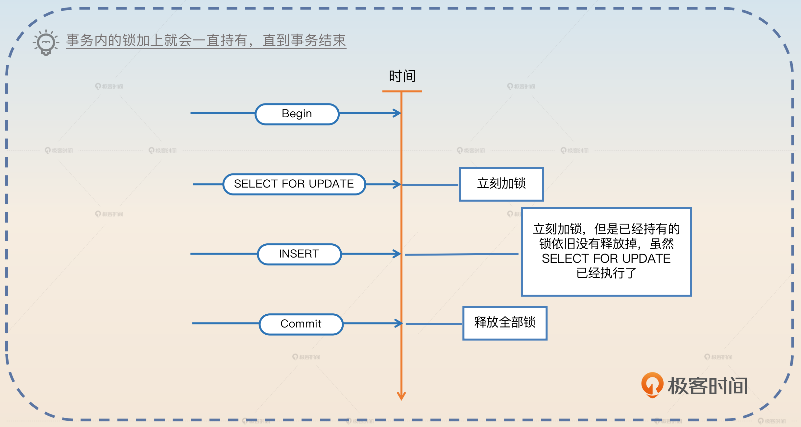

### 乐观锁与悲观锁

乐观锁和悲观锁实际上是一种逻辑概念，它们是并发控制中常用的两种锁机制。

- 乐观锁是直到要修改数据的时候，才检测数据是否已经被别人修改过。
- 悲观锁是在初始时刻就直接加锁保护好临界资源。

乐观锁在数据库中通常指利用 CAS 的思路进行的更新操作。一般的使用形态就是下面这样的。

```sql
SELECT * FROM your_tab WHERE id = 1; // 在这里拿到了 a = 1
// 一大堆的业务操作
UPDATE your_tab SET a = 3, b = 4 WHERE id = 1 AND a =1

```

在上面的这个语句里面，预期数据库中 a 的值为 1 才会进行更新。如果此时数据库中的值已经被修改了，那么这个 UPDATE 语句就会失败。业务方通过检测受影响的行数是否为 0，来判断更新是否成功。

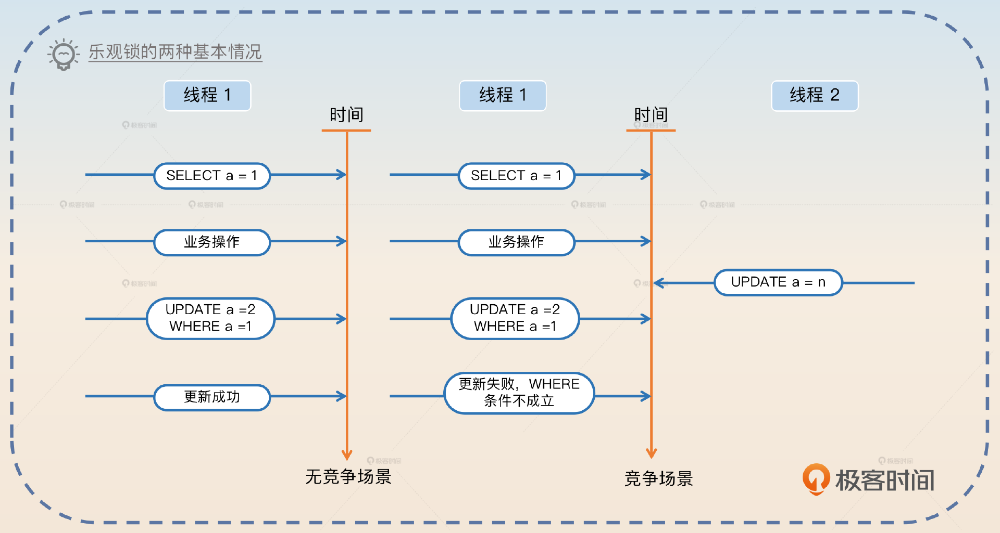

悲观锁是指在写入数据时直接加锁。还拿上面这个例子来说吧，就是从最开始的 SELECT 语句就直接加上了锁。

```sql
SELECT * FROM your_tab WHERE id = 1 FOR UPDATE; // 在这里拿到了 a = 1
// 一大堆的业务操作
UPDATE your_tab SET a = 3, b = 4 WHERE id = 1

```

在加上锁之后，就可以直接更新了。这个时候不需要担心别人可以在 SELECT 和 UPDATE 之间将 a 更新为别的值。

在使用乐观锁和悲观锁时，需要考虑数据一致性和并发性的问题。乐观锁适用于读多写少的场景，互联网中大部分应用都属于这一类。而悲观锁则适用于写多读少的场景，比如在金融领域里面对金额的操作就是以写为主。

相比之下，乐观锁的性能要比悲观锁好很多。不过因为乐观锁的代码写起来比较复杂，所以很多人偷懒就会直接使用悲观锁。

### 行锁与表锁

行锁与表锁都是根据锁的范围来划分的。一般来说，行锁是指锁住行，可能是锁住一行，也可能是锁住多行。表锁则是直接将整个表都锁住。

那么在 MySQL 里面，InnoDB 引擎同时支持行锁和表锁。但是行锁是借助索引来实现的，也就是说，如果你的查询没有命中任何的索引，那么 InnoDB 引擎是用不了行锁的，只能使用表锁。当然，如果用的是 MySQL，类似于 MyISAM 引擎，那么只能使用表锁，因为这些引擎不支持行锁。

### 共享锁与排它锁

共享锁和排它锁是在互斥的角度上看待锁的。

- 共享锁是指一个线程加锁之后，其他线程还是可以继续加同类型的锁。
- 排它锁是指一个线程加锁之后，其他线程就不能再加锁了。


这两个概念非常接近读锁和写锁。因为读锁本身就是共享的，而写锁就是排它的。

### 意向锁

意向锁相当于一个信号，就是告诉别人我要加锁了，所以意向锁并不是一个真正物理意义上的锁。

意向锁和共享锁、排它锁相结合，就有了意向共享锁和意向排它锁。

- 意向共享锁即你希望获得一个共享锁。
- 意向排它锁即你希望获得一个排它锁。

注意，意向锁的意向强调的就是你想要拿到这个锁，但是你最终能否拿到这个锁，是不确定的。

在 MySQL 里面，使用意向锁的典型场景是在增删改查的时候，对表结构定义加一个意向共享锁，防止在查询的时候有人修改表结构。而在修改表结构的时候，则会加一个意向排它锁。这也就是修改表结构的时候会直接阻塞掉所有的增删改查语句的原因。 **使用意向锁能够提高数据库的并发性能，并且避免死锁问题。**

### 记录锁、间隙锁和临键锁

这是面试中最难理解的三个概念，而且要是面试官对细节非常了解，那么你就很容易挂在这一个部分。但是反过来说，如果你能将这部分的细节都说清楚，本身就是一个很大的亮点了。

#### 记录锁

**记录锁是指锁住了特定的某一条记录的锁**。例如这样一条语句：

```sql
SELECT * FROM your_tab WHERE id = 31 FOR UPDATE

```

在你使用了主键作为查询条件，并且是相等条件下，将只命中一条记录。这一条记录就会被加上记录锁。

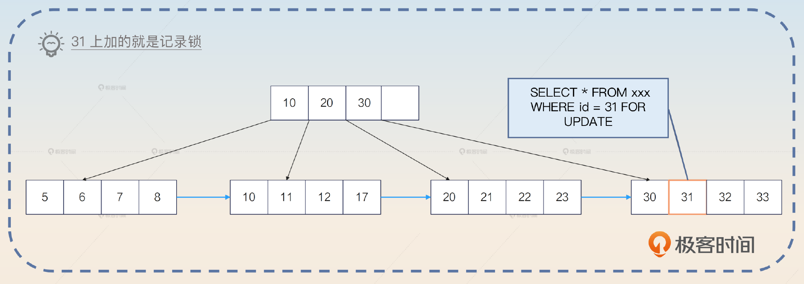

但是如果查询条件没有命中任何记录，那么就不会使用记录锁，而是使用间隙锁。又或者你使用了唯一索引作为条件，比如说在 user 表里面在列 email 上有一个唯一索引。

```sql
SELECT * FROM your_tab WHERE email='your_email' FOR UPDATE

```

那么这条查询语句此时也是使用了记录锁。类似地，如果 email=‘your\_email’ 这条记录不存在，那么会变成一个间隙锁。

举个例子，如果数据库中只有 id 为（1，4，7）的三条记录，也就是 id= 3 这个条件没有命中任何数据，那么这条语句会在（1，4）加上间隙锁。所以你可以看到， **在生产环境里面遇到了未命中索引的情况，对性能影响极大。**

我这里稍微解释一下，实际上MySQL本身是加上临键锁的，但是临键锁本身是由间隙锁和记录锁合并组成的，所以这里我就先用间隙锁来描述了。

#### 间隙锁

间隙锁是锁住了某一段记录的锁。直观来说就是你锁住了一个范围的记录。比如说你在查询的时候使用了 <、<=、BETWEEN 之类的范围查询条件，就会使用间隙锁。

```sql
SELECT * FROM your_tab WHERE id BETWEEN 50 AND 100 FOR UPDATE

```

间隙锁会锁住 (50，100) 之间的数据，而 50 和 100 本身会被记录锁锁住。类似地，<= 这种查询你也可以认为 = 的那个值会被记录锁锁住。

如果你的表里面没有 50，那么数据库就会一直向左，找到第一个存在的数据，比如说 40；如果你的表里面没有 100，那么数据库就会一直向右，找到第一个存在的数据，比如说 120。那么使用的间隙锁就是 (40，120)。如果此时有人想要插入一个主键为 70 的行，是无法插入的，它需要等这个 SELECT 语句释放掉间隙锁。

间隙锁我们一般都说两边都是开的，即端点是没有被间隙锁锁住的。 **记录锁和记录锁是排它的，但是间隙锁和间隙锁不是排它的**。也就是说两个间隙锁之间即便重叠了，也还是可以加锁成功的。

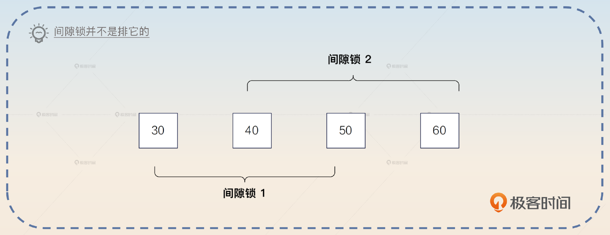

#### 临键锁

临键锁（Next-Key Locks）是很独特的一种锁，直观上来说可以看做是一个记录锁和间隙锁的组合。也就是说 **临键锁不仅仅是会用记录锁锁住命中的记录，也会用间隙锁锁住记录之间的空隙**。临键锁和数据库隔离级别的联系最为紧密，它可以解决在可重复读隔离级别之下的幻读问题。

间隙锁是左开右开，而临键锁是 **左开右闭**。还是用前面的例子来说明。如果 id 只有（1，4，7）三条记录，那么临键锁就将（1，4\]锁住。

### 小结一下

我这里依旧给你准备了简洁版的记忆口诀，让你用来判断使用的是记录锁、间隙锁还是临键锁。

- **遇事不决临键锁**。你可以认为，全部都是加临键锁的，除了下面两个子句提到的例外情况。
- **右边缺省间隙锁**。例如你的值只有（1，4，7）三个，但是你查询的条件是 WHERE id < 5，那么加的其实是间隙锁，因为 7 本身不在你的条件范围内。
- **等值查询记录锁**。这个其实针对的是主键和唯一索引，普通索引只适用上面两条。

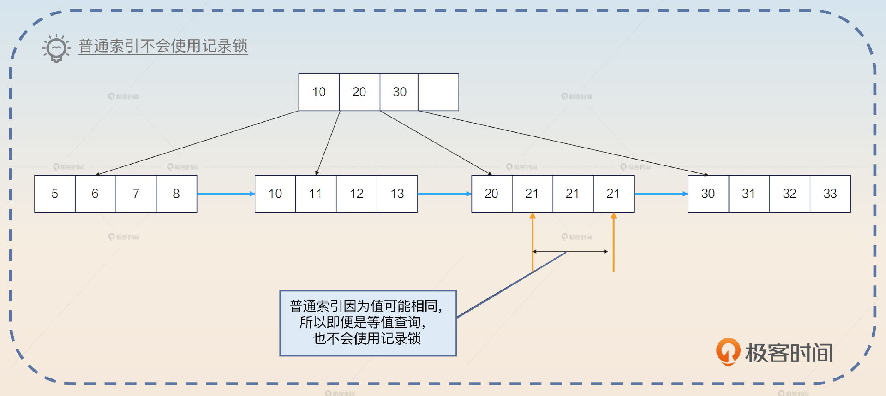

## 面试准备

为了更好地面试锁，你需要在公司内部收集一些信息。

- 公司出现过的死锁，包含排查过程、解决方案。
- 其他锁使用不当的场景，比如因为锁使用不当造成的一些性能问题。
- 收集至少一个使用乐观锁的场景，并且看看相关的 SQL 是怎么写的，做到心中有数。
- 收集公司内使用悲观锁的场景，并且尝试使用乐观锁来进行优化。

这些案例非常重要，如果你自己没有亲自遇到，也要找同事问清楚，或者在互联网上搜集一些案例来实际看看锁的应用。

类似索引，面试官可能会直接写一个 SQL 语句，问你可能加什么锁。这种问题总体上还是偏难的，你在准备面试的时候可以先刻意练习一下。

- 在主键或唯一索引上使用等值查询，例如 `WHERE email = 'abc@qq.com'`，区分记录存在与不存在两种情况。
- 在主键或唯一索引上使用范围查询，例如 `WHERE email >= 'abc@qq.com'`。
- 在普通索引上使用等值查询。
- 在普通索引上使用范围查询。
- 执行查询，但是该查询不会使用任何索引。

不管你怎么回答，都要记得强调间隙锁和临键锁是在可重复读的隔离级别下才有效果的。

在面试中，如果你非常熟悉 MySQL 锁，那么你可以抓住机会展示一下。

> 我觉得我对 MySQL 的锁机制还是非常了解的，只要您写出来 SQL，告诉我表结构定义，我就可以告诉您这个语句会加什么锁，会不会阻塞别的语句。

此外，你和面试官在聊到一些话题的时候，你可以尝试把话题引导到锁机制上。

- 索引： MySQL 的 InnoDB 引擎是借助索引来实现行锁的。
- 性能问题：锁使用不当引起的性能问题。
- 乐观锁：比如说原子操作中的 CAS 操作，你可以借助 CAS 这个关键词，聊一聊在 MySQL 层面上怎么利用类似的 CAS 操作来实现一个乐观锁。
- 语言相关的锁：比如说 Go 语言的 mutex 和 Java 的 Lock，都可以引申到数据库的锁。
- 死锁：聊一聊公司的数据库死锁案例。

整体来说，数据库锁优化在整个性能优化领域里面也算是一个比较高级的点了，很有竞争优势，不可错过。

## 基本面试

锁这边的问题会有非常多的问法。一开始引起锁的话题的时候，面试官可能这么问。

- 你知道 MySQL 的锁机制吗？
- 你了解 MySQL 的锁吗？

那么类似的问题你就可以先综合回答，介绍一下 MySQL 里面的五花八门的锁。

> MySQL 里面的锁机制特别丰富，这里我以 InnoDB 引擎为例。首先，从锁的范围来看，可以分成行锁和表锁。其次，从排它性来看，可以分成排它锁和共享锁。还有意向锁，结合排它性，就分为排它意向锁和共享意向锁。还有三个重要的锁概念，记录锁、间隙锁和临键锁。记录锁，是指锁住某条记录；间隙锁，是指锁住两条记录之间的位置；临键锁可以看成是记录锁与间隙锁的组合情况。
>
> 还有一种分类方法，是乐观锁和悲观锁。那么在数据库里面使用乐观锁，本质上是一种应用层面的 CAS 操作。

紧接着，你不要深入去解释各种锁，而是先从大方向上解释清楚锁的根本特性： **锁是和索引、隔离级别密切相关的**。

> 在 MySQL 的 InnoDB 引擎里面，锁和索引、隔离级别都是有密切关系的。在 InnoDB 引擎里面，锁是依赖于索引来实现的。或者说，锁都是加在索引项上的。因此，如果一个查询用了索引，那么会用行锁，如果没用到任何索引，那么就会用表锁。此外，在 MySQL 里面，间隙锁和临键锁是只工作在可重复读这个隔离级别下的。

然后你就等着面试官进一步追问细节。正常情况下，他可能问下面这些问题。

- 某一种锁的具体含义。
- 某一种锁的使用场景，这里稍微注意一点意向锁就可以，其他的都比较简单。
- 怎么在数据库里面使用乐观锁，或者你用乐观锁解决过什么问题？
- 你有没有优化过锁，或者解决过死锁？
- 详细介绍记录锁、间隙锁和临键锁，也有可能问你 MySQL 在可重复读的隔离级别下，会不会有幻读问题？

这里，你可以详细分析记录锁、间隙锁和临键锁，不过如果想要百分之百征服面试官，你还是需要用一些实际的锁优化的案例来证明你的能力。

## 亮点方案

这里我先说一个最简单的锁优化的方案。我们前面提到，MySQL 的锁是依赖索引机制来实现的。而如果查询没有使用任何索引，就会使用表锁。那么很显然最简单的方案就是给这种查询创建一个索引，避免使用表锁。

你可以这么回答，关键词是 **缺索引**。

> 早期我发现我们的业务有一个神奇的性能问题，就是响应时间偶尔会突然延长。后来经过我们排查，确认响应时间是因为数据库查询变慢引起的。但是这些变长的查询，SQL 完全没有问题，我用 EXPLAIN 去分析，都很正常，也走了索引。
>
> 直到后面我们去排查业务代码的提交记录，才发现新加了一个功能，这个功能会执行一个 SQL，但是这个 SQL 本身不会命中任何索引。于是数据库就会使用表锁，偏偏这个 SQL 因为本身没有命中索引，又很慢，导致表锁一直得不到释放。结果其他正常的 SQL 反而被它拖累了。最终我们重新优化了这个使用表锁的 SQL，让它走了一个索引，就解决了这个问题。

不过这个方案说起来还是太简单，我们需要一些更复杂的方案来打动面试官。那么接下来我再给你提供两个稍微复杂一些的方案：临键锁引发的死锁和弃用悲观锁。

### 临键锁引发的死锁

在一个业务中，有一个场景是先从数据库中查询数据并锁住。如果这个数据不存在，那么就需要执行一段逻辑，计算出一个数据，然后插入。如果已经有数据了，那么就将原始的数据取出来，再利用这个数据执行一段逻辑，计算出来一个结果，执行更新。

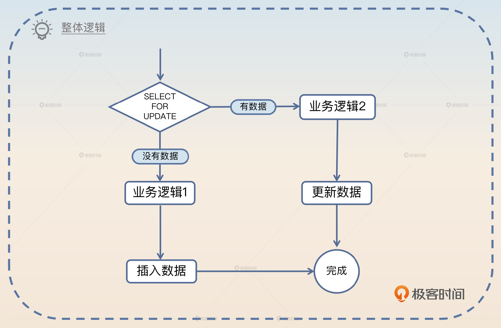

因为两段运算逻辑不同，所以不能简单地使用 INSERT ON DUPLICATE 的语句来取代。

只看没有数据的逻辑，在计算之后插入新数据，如果用伪代码来描述，就是下面这样的。

```sql
BEGIN;
SELECT * FROM biz WHERE id = ? FOR UPDATE
// 中间有很多业务操作
INSERT INTO biz(id, data) VALUE(?, ?);
COMMIT;

```

看起来是不是没有任何问题？实际上，这个地方会引起 **死锁**。

假设说现在数据库中 ID 最大的值是 78。那么如果两个业务进来，同时执行这个逻辑。一个准备插入 id=79 的数据，一个准备插入 id = 80 的数据。如果它们的执行时序如下图，那么你就会得到一个死锁错误。

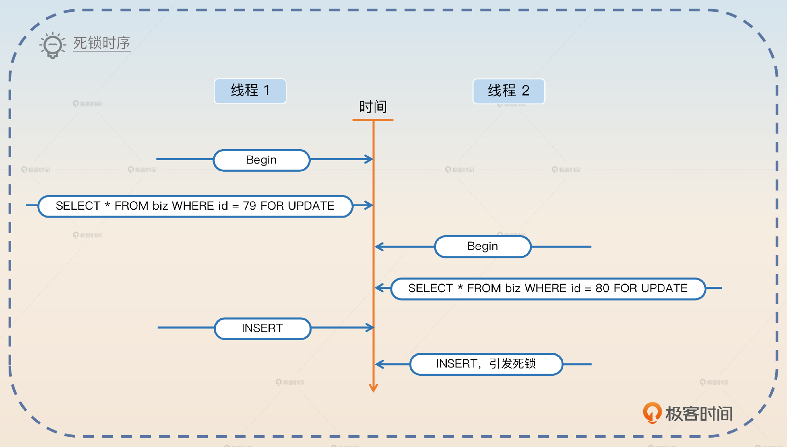

```go
[40001][1213] Deadlock found when trying to get lock; try restarting transaction

```

造成死锁的原因也很简单。在线程 1 执行 SELECT FOR UPDATE 的时候，因为 id=79 的数据不存在，所以实际上数据库会产生一个(78，supremum\] 的临键锁。类似地，线程 2 也会产生一个(78，supremum\] 临键锁。

当线程 1 想要执行插入的时候，它想要获得 id = 79 的行锁。当线程 2 想要执行插入的时候，它想要获得 id = 80 的行锁，这个时候就会出现死锁。因为线程1 和线程 2 同时还在等着对方释放掉持有的间隙锁。

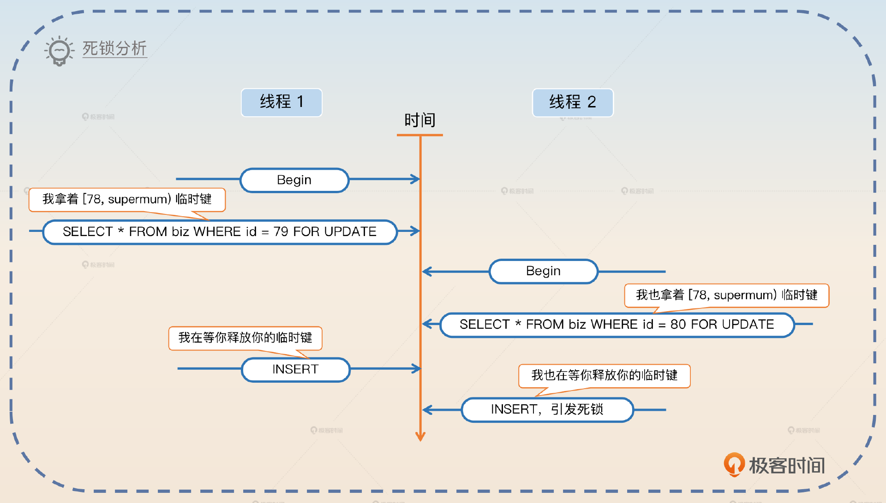

从理论上来说，解决方案有三种。

- 不管有没有数据，先插入一个默认的数据。如果没有数据，那么会插入成功；如果有数据，那么会出现主键冲突或者唯一索引冲突，插入失败。那么在插入成功的时候，执行以前数据不存在的逻辑，但是因为此时数据库中有数据，所以不会使用间隙锁，而是使用行锁，从而规避了死锁问题。
- 调整数据库的隔离级别，降低为已提交读，那么就没有间隙锁了。这种解决方案也可以，而且你可以将话题进一步引申到 MVCC 中。
- 放弃悲观锁，使用乐观锁。这也是我提供的亮点方案。

你可以通过一个案例来说明，关键词是 **临键锁。**

> 早期我优化过一个死锁问题，是临键锁引起的。业务逻辑很简单，先用 SELECT FOR UPDATE 查询数据。如果查询到了数据，那么就执行一段业务逻辑，然后更新结果；如果没有查询到，那么就执行另外一段业务逻辑，然后插入计算结果。
>
> 那么如果 SELECT FOR UPDATE 查找的数据不存在，那么数据库会使用一个临键锁。此时，如果有两个线程加了临键锁，然后又希望插入计算结果，那么就会造成死锁。
>
> 我这个优化也很简单，就是上来先不管三七二十一，直接插入数据。如果插入成功，那么就执行没有数据的逻辑，此时不会再持有临键锁，而是持有了行锁。如果插入不成功，那么就执行有数据的业务逻辑。
>
> 此外，还有两个思路。一个是修改数据库的隔离级别为 RC，那么自然不存在临键锁了，但是这个修改影响太大，被 DBA 否决了。另外一个思路就是使用乐观锁，不过代码改起来要更加复杂，所以就没有使用。

你这么回答的话，面试官接下来就可能追问你隔离级别的事情，或者问你乐观锁的细节，那么你就有机会继续展示了。

### 弃用悲观锁

很多人为了省事会在开发的时候直接使用悲观锁。最为典型的例子就是在事务里面存在 `SELECT ... FOR UPDATE` 的语句，而后会紧跟着一个 UPDATE 语句。

伪代码：

```go
// 开启事务
Begin()
// 查询到已有的数据 SELECT * FROM xxx WHERE id = 1 FOR UPDATE
data := SelectForUpdate(id)
newData := calculate(data) // 一大通计算

// 将新数据写回去数据库 UPDATE xxx SET data = newData WHERE id =1
Update(id, newData)
Commit()

```

那么这一类代码可以考虑将整个事务都去掉，纯粹依赖 CAS 操作。

```go
for {
  // 查询到已有的数据 SELECT * FROM xxx WHERE id = 1
  data := Select(id)
  newData := calculate(data) // 一大通计算

  // 将新数据写回去数据库
  // UPDATE xxx SET data = newData WHERE id =1 AND data=oldData
  success := CAS(id, newData, data)
  // 确实更新成功，代表在业务执行过程中没有人修改过这个 data。
  // 适合读多写少的情况
  if success {
    break;
  }
}

```

这里我是直接用的 data 来比较的，实践中也可能是引入了 version 列，或者使用 update\_time 来确保数据没有发生变更。

你可以在聊到乐观锁的情况下，使用这个案例。

> 我在入职这家公司之后，曾经系统地清理过公司内部使用悲观锁的场景，改用乐观锁。正常的悲观锁都是使用了 `SELECT FOR UPDATE` 语句，查询到数据之后，进行一串计算，再将结果写回去。那么改造的方案很简单，查询的时候使用 SELECT 语句直接查询，然后进行计算。但是在写回去的时候，就要用到数据库的 CAS 操作，即 UPDATE 的时候要确认之前查询出来的结果并没有实际被修改过。
>
> 一般来说就是 `UPDATE xxx SET data = newData WHERE id = 1 AND data = oldData`。这种改造效果非常好，性能提升了 30%。当然，并不是所有的悲观锁场景都能清理，还有一部分实在没办法，只能是考虑别的手段了。

这里最后留了一个尾巴，也就是将话题引导到你准备的其他优化锁的案例上。

## 面试思路总结

这节课我们学习了面试中的重难点问题——锁，锁与索引的关系十分密切，可以说锁是借助索引来实现的。锁的形式五花八门，有乐观锁、悲观锁、行锁、表锁、共享锁、排它锁、意向锁、记录锁、间隙锁和临键锁等多种类型，它们各有用途，这里你要注意分辨它们各自的能力，学会分析什么场景下使用哪一种锁。

此外，我还提供了两个比较复杂的亮点方案： **临键锁引发的死锁、弃用悲观锁**。你在实际面试中可以考虑替换为自己的案例。

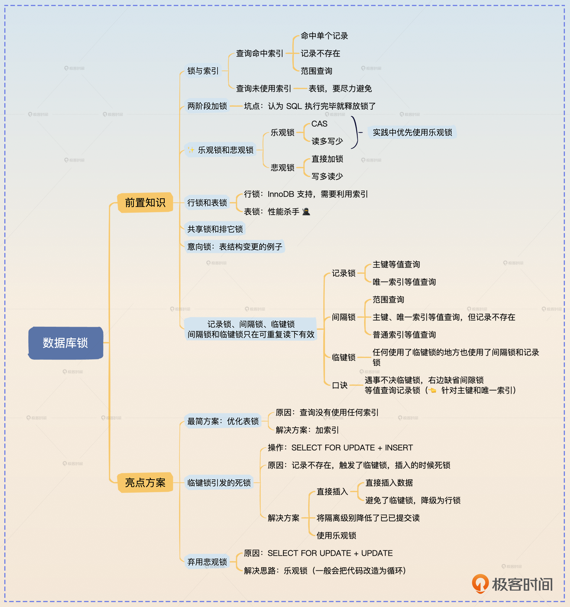

## 思考题

最后你来思考两个问题。

- 你在公司有没有优化过什么锁？可以分享一下你的案例吗？
- 你有没有使用过乐观锁？用于解决什么问题？相比直接使用悲观锁，你认为代码量有没有变化？

欢迎你把你的答案分享在评论区，也欢迎你把这节课的内容分享给需要的朋友，我们下节课再见！

## 题外话：面试锦囊

最后我们再来聊点儿题外话，就是面试时的一个小技巧——能示之不能，不能示之能。在前面很多讲里，我都在回答中都故意点到即止，或者故意留出破绽，就是“能示之不能”，引诱面试官追问。

那么反过来“不能示之能”就是纯粹地唬人。就是说实际上你并不是很了解某一些方面的东西，但是你假装你非常了解、胸有成竹。那么在这种情况下，如果面试官被你的假象迷惑住了，那么他就不会继续追问这方面的东西。

这跟我们的面试流程是有关的。很多人出去面候选者，讲究的是问到候选者无话可说。那么既然你表现得一副我还有很多话说，快来问我的样子，他们自然不会问你了。

不过“不能示之能”策略要慎用。一场面试可一不可二，可二千万别三。因为你装多了，面试官就会好奇你怎么什么都知道，或者激起了逆反心理，深挖下来你就挡不住了。

但是“能而示之不能”就可以随便用。尤其是一些公司有所谓的“压薪面”。就是本身你已经通过了基本的技术面试，但是公司不想给你高薪，就会故意面你一些很难的问题，打击你，这样好压价。那么如果你能够在压薪面里面将面试官引导到你熟悉的领域，立于不败之地，那么接下来谈薪酬就更有主动权。