# 14｜数据库事务：事务提交了，你的数据就一定不会丢吗？
你好，我是邓明。今天我们来学习数据库中非常重要的一部分——数据库事务。这节课的内容和前面 MVCC 的内容联系很紧密，你要结合在一起学习。

数据库事务在面试中占据了比较重的分量。如果你面的是非常初级的岗位，那么可能就是问问事务的 ACID 特性。不然的话，基本上都要深入 redo log 和 undo log 这种事务实现机制上去。所以这一节课我会带你深入分析 redo log 和 undo log。同时我也会告诉你，哪些知识是比较基础的，你一定要掌握；哪些知识是比较高级的，你尽量记住，面试时作为亮点来展示。

最后我会给出两个比较高级的方案，一个是侧重理论的写入语义大讨论，一个是侧重实践的调整 MySQL 参数。我们先从上一节课已经初步接触过的 undo log 开始说起。

## 前置知识

### undo log

上一节课，我说过版本链是存放在的 undo log 里面的。那么 undo log 到底是什么呢？

undo log 是指回滚日志，用一个比喻来说，就是后悔药，它记录着事务执行过程中被修改的数据。当事务回滚的时候，InnoDB 会根据 undo log 里的数据撤销事务的更改，把数据库恢复到原来的状态。

既然 undo log 是用来回滚的，那么不同的语句对应的 undo log 形态会不一样。

- 对于 INSERT 来说，对应的 undo log 应该是 DELETE。
- 对于 DELETE 来说，对应的 undo log 应该是 INSERT。
- 对于 UPDATE 来说，对应的 undo log 也应该是 UPDATE。比如说有一个数据的值原本是 3，要把它更新成5。那么对应的 undo log 就是把数据更新回 3。

但是实际上 undo log 的实现机制要更复杂一点，我这里简化一下模型帮助你记忆。对于 INSERT 来说，对应的 undo log 记录了该行的主键。那么后续只需要根据 undo log 里面的主键去原本的聚簇索引里面删掉记录，就可以实现回滚效果。

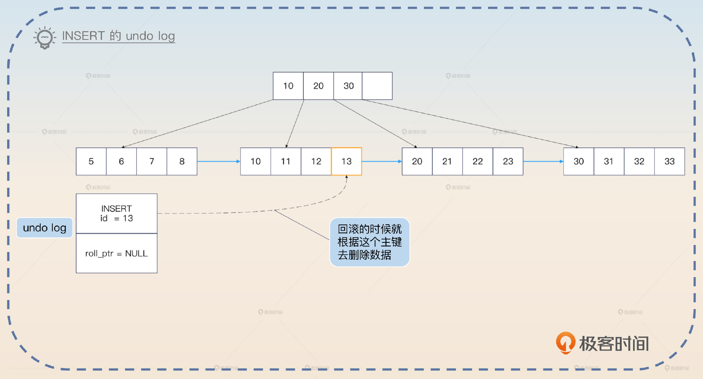

对于 DELETE 来说，对应的 undo log 记录了该行的主键。因为在事务执行 DELETE 的时候，实际上并没有真的把记录删除，只是把原记录的删除标记位设置成了 true。所以这里 undo log 记录了主键之后，在回滚的时候就可以根据 undo log 找到原本的记录，然后再把删除标记位设置成 false。

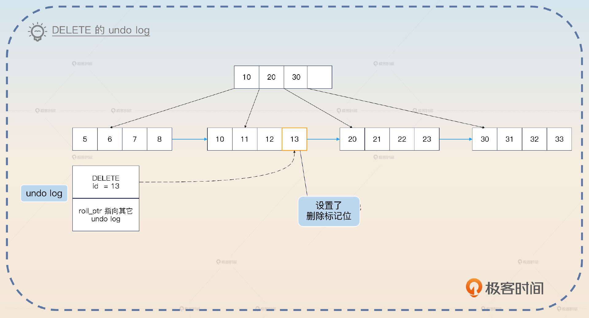

对于 UPDATE 来说，要更加复杂一些。分为两种情况，如果没有更新主键，那么 undo log 里面就记录原记录的主键和被修改的列的原值。

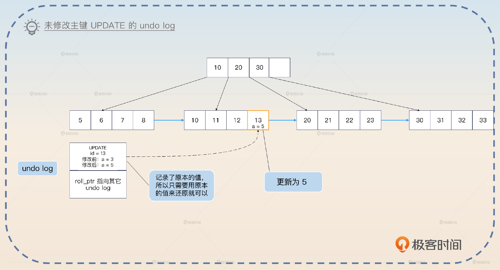

如果更新了主键，那么可以看作是删除了原本的行，然后插入了一个新行。因此 undo log 可以看作是一个 DELETE 原数据的 undo log 再加上插入一个新行的 undo log。

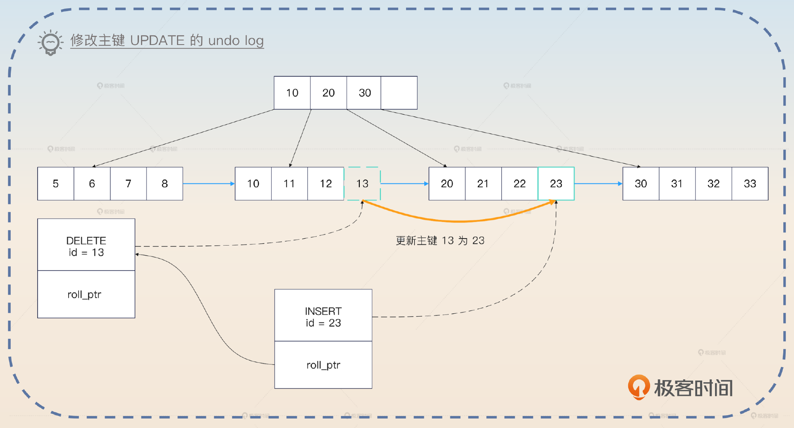

从上面你大概也能看出来，undo log 和 MVCC 中版本链的关系。

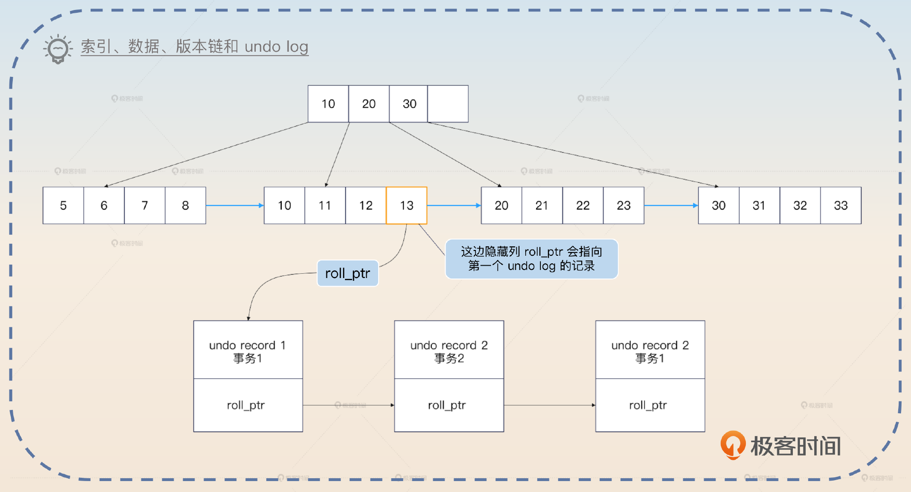

这部分知识有些难，如果你不是数据库岗位或者专家岗，了解这部分就可以了。接下来我们看一个和事务有关的另外一个日志 redo log。

### redo log

InnoDB 引擎在数据库发生更改的时候，把更改操作记录在 redo log 里，以便在数据库发生崩溃或出现其他问题的时候，能够通过 redo log 来重做。

你可能会觉得奇怪，InnoDB 引擎不是直接修改了数据吗？为什么需要 redo log？答案是 InnoDB 引擎读写都不是直接操作磁盘的，而是读写内存里的 buffer pool，后面再把buffer pool里面修改过的数据刷新到磁盘里面。这是两个步骤，所以就可能会出现 buffer pool中的数据修改了，但是还没来得及刷新到磁盘数据库就崩溃了的情况。

为了解决这个问题，InnoDB 引擎就引入了 redo log。相当于InnoDB 先把 buffer pool 里面的数据更新了，再写一份 redo log。等到事务结束之后，就把buffer pool的数据刷新到磁盘里面。万一事务提交了，但是 buffer pool 的数据没写回去，就可以用 redo log 来恢复。

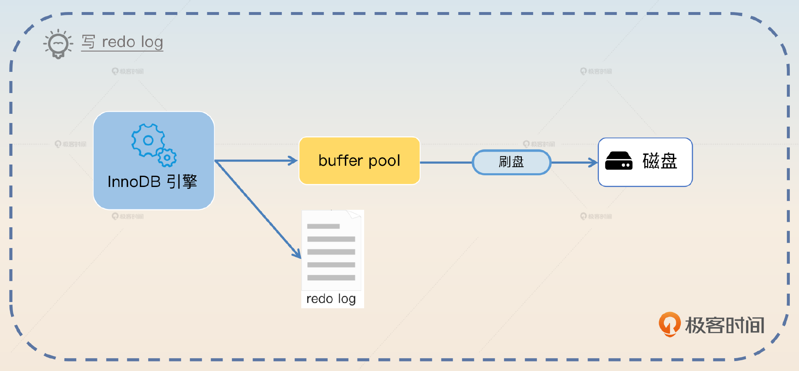

你可能会困惑，redo log 不需要写磁盘吗？如果 redo log 也要写磁盘，干嘛不直接修改数据呢？redo log 是需要写磁盘的，但是 redo log 是 **顺序写** 的，所以也是 WAL（write-ahead-log） 的一种。也就是说，不管你要修改什么数据，一会修改这条数据，一会修改另外一条数据，redo log 在磁盘上都是紧挨着的。

这是中间件设计里常用的技巧——顺序写取代随机写。 **顺序写的性能比随机写要好很多**，即便是在 SSD 上，顺序写也能比随机写速度快上一个数量级。但是还要考虑一点：redo log 是直接一步到位写到磁盘的吗？

并不是的，redo log 本身也是先写进 redo log buffer，后面再刷新到操作系统的 page cache，或者一步到位刷新到磁盘。

InnoDB 引擎本身提供了参数 innodb\_flush\_log\_at\_trx\_commit 来控制写到磁盘的时机，里面有三个不同值。

- 0：每秒刷新到磁盘，是从 redo log buffer 到磁盘。
- 1：每次提交的时候刷新到磁盘上，也就是最安全的选项，InnoDB 的 **默认值**。
- 2：每次提交的时候刷新到 page cache 里，依赖于操作系统后续刷新到磁盘。

这时候你就应该意识到这样一个问题，除非把innodb\_flush\_log\_at\_trx\_commit设置成 1，否则其他两个都有丢失的风险。

- 0：你提交之后，InnoDB 还没把 redo log buffer 中的数据刷新到磁盘，就宕机了。
- 2：你提交之后，InnoDB 把 redo log 刷新到了 page cache 里面，紧接着宕机了。

在这两个场景下， **你的业务都认为事务提交成功了，但是数据库实际上丢失了这个事务**。但是并不是说 InnoDB 引擎会严格遵循参数说明的那样来刷新磁盘，还有两种例外情况。

1. 如果 redo log buffer 快要满了，也会触发把redo log刷新到磁盘里这个动作。一般来说，默认放一半了就会刷新。
2. 如果某个事务提交的时候触发了刷新到磁盘的动作，那么当下所有事务的 redo log 也会一并刷新。毕竟大家的 redo log 都是放在 redo log buffer里，有人需要刷新了，就顺手一起刷新了。类似于你去买奶茶，顺手帮你同事带一杯。

现在你已经了解了 undo log 和 redo log的用法和机制，那么我们来总结一下 InnoDB 是如何综合利用它们来实现事务的。

### 事务执行过程

这里我用一个 UPDATE 语句执行的例子来向你介绍事务执行过程。假如说原本 a = 3，现在要执行 UPDATE tab SET a = 5 WHERE id = 1。

1. 事务开始，在执行 UPDATE 语句之前会先查找到目标行，加上锁，然后写入到 buffer pool 里面。

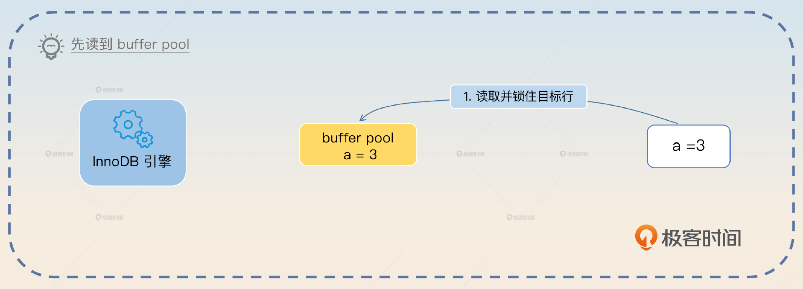

1. 写 undo log。

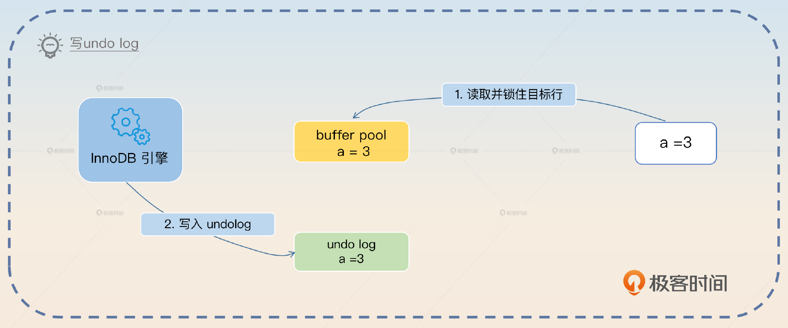

1. InnoDB 引擎在内存上更新值，实际上就是把 buffer pool 的值更新为目标值 5。

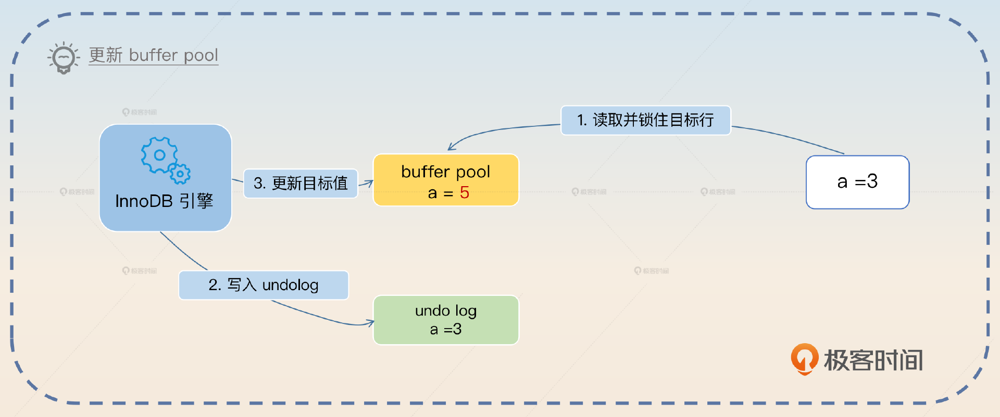

1. 写 redo log。

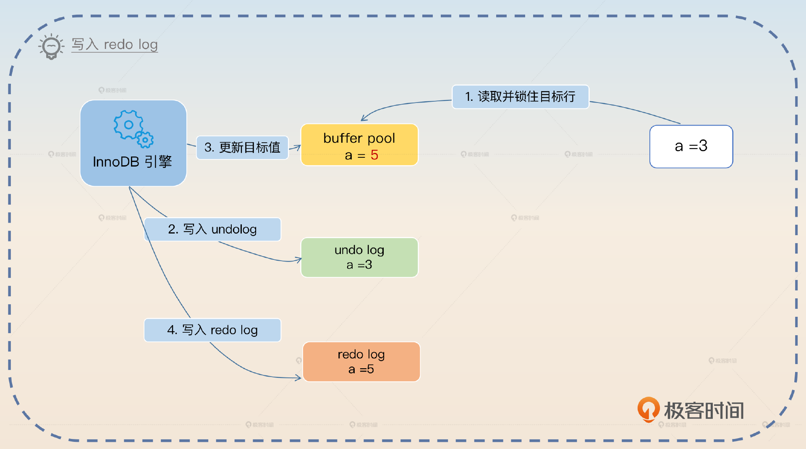

1. 提交事务，根据 innodb\_flush\_log\_at\_trx\_commit 决定是否刷新 redo log。

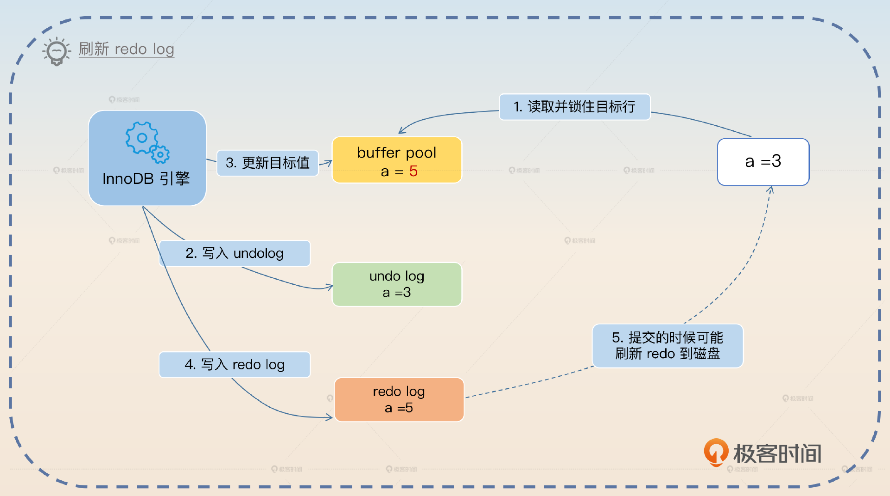

1. 刷新 buffer pool 到磁盘。

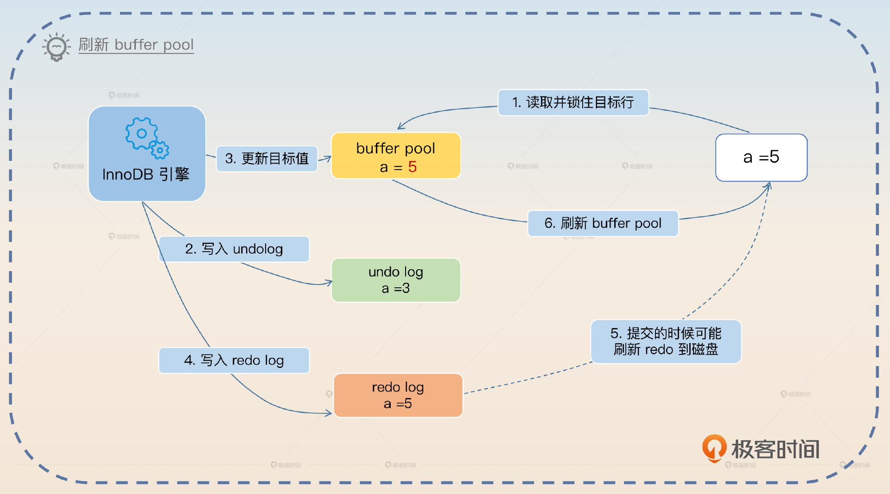

上面这个是最正常的流程。那么它还有两个比较重要的子流程。

1. 如果在 redo log 已经刷新到磁盘，然后数据库宕机了，buffer pool 丢失了修改，那么在 MySQL 重启之后就会回放这个 redo log，从而纠正数据库里的数据。
2. 如果都没有提交，中途回滚，就可以利用 undo log 去修复 buffer pool 和磁盘上的数据。因为有时，buffer pool 脏页会在事务提交前刷新磁盘，所以 undo log 也可以用来修复磁盘数据。

实际上，事务执行过程有很多细节，也要比这里描述得复杂很多。如果你感兴趣，可以再继续深挖下去。不过如果是为了在面试中展示，上面的这些内容也够用了。

### binlog

binlog 是一个看起来和 redo log、undo log 很像的东西，但是它们之间的差异还是挺大的。binlog 是用于存储 MySQL 中二进制日志（Binary Log）的操作日志文件，它是 MySQL Server 级别的日志，也就是说所有引擎都有。它记录了MySQL 中数据库的增删改操作，因此 binlog 主要有两个用途，一是在数据库出现故障时恢复数据。二是用于主从同步，即便是 Canal 这一类的中间件本质上也是把自己伪装成一个从节点。

在事务执行过程中，写入 binlog 的时机有点巧妙。它和 redo log 的提交过程结合在一起称为MySQL的两阶段提交。

- 第一阶段：redo log Prepare（准备）
- 第二阶段：redo log Commit（提交）

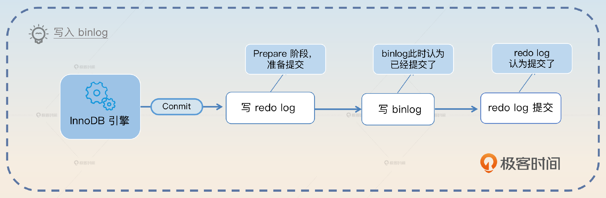

如果 redo log Prepare 执行完毕后，binlog 已经写成功了，那么即便 redo log 提交失败，MySQL 也会认为事务已经提交了。如果 binlog 没写成功，那么 MySQL 就认为提交失败了。比较简单的记忆方式就是看 **binlog 写成功了没有**。binlog 本身有一些完整性校验的规则，所以在 MySQL 看来，写 binlog 要么成功，要么失败，不存在中间状态。

我用正统的两阶段提交图来说明一下，在这个图里我把写入 binlog拆成了 Prepare 和 Commit 两个阶段。

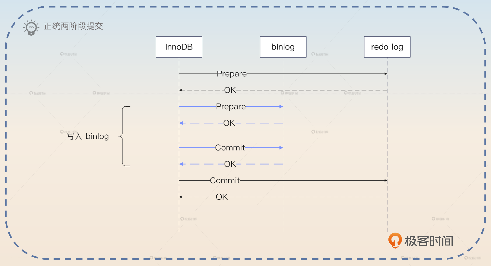

从图里面，你就可以看出来，之所以以 binlog 为判断标准，是因为在两阶段提交里面，两个参与方 binlog 和 redo log中，binlog 已经提交成功了，那么 redo log 自然可以认为也提交成功了。但是我要强调，这只是为了方便你理解，实际上 binlog 没有显式的 Prepare 和 Commit 两个阶段。

binlog 也有刷新磁盘的问题，不过你可以通过 **sync\_binlog** 参数来控制它。

- 0：由操作系统决定，写入 page cache 就认为成功了。0也是默认值，这个时候数据库的性能最好。
- N：每 N 次提交就刷新到磁盘，N 越小性能越差。如果 N = 1，那么就是每次事务提交都把 binlog 刷新到磁盘。

你可以对比一下sync\_binlog和 redo log 的 innodb\_flush\_log\_at\_trx\_commit 参数，加深印象。最后我再补充一点非常基础的事务的 ACID 特性。

### ACID 特性

事务的 ACID 特性是指原子性（Atomicity）、一致性 （Consistency）、隔离性（Isolation）还有持久性（Durability）。

- 原子性：事务是一个不可分割的整体，它在执行过程中不能被中断或推迟，它的所有操作都必须一次性执行，要么都成功，要么都失败。
- 一致性：事务执行的结果必须满足数据约束条件，不会出现矛盾的结果。注意这里的一致性和我们讨论的分布式环境下的一致性语义有所差别，后者强调的是不同数据源之间数据一致。
- 隔离性：事务在执行的时候可以隔离其他事务的干扰，也就是不同事务之间不会相互影响。
- 持久性：事务执行的结果必须保证在数据库里永久保存，即使系统出现故障或者数据库被删除，事务的结果也不会丢失。

这个知识点就比较基础，是你一定要记住的。

## 面试准备

你需要弄清楚自己公司内部的一些配置。

- 有没有修改过 sync\_binlog、innodb\_flush\_log\_at\_trx\_commit 的值？如果修改过，为什么修改？
- 你使用过的中间件有没有类似 redo log、binlog 的刷盘机制？

因为事务的机制比较复杂，涉及 redo log 和 undo log 的各种配合，所以你要提前思考一下事务执行过程的各种异常情况，就是当中途某个操作执行成功了，万一数据库宕机，数据库恢复过来之后会怎么处理这个事务。

我这里给你一个极简版口令，非常好记。

- 在 redo log 刷新到磁盘之前，都是回滚。
- 如果 redo log 刷新到了磁盘，那么就是重放 redo log。

进一步结合 binlog，就是如果 binlog 都已经提交成功了，那么就重放，确保事务一定成功了，否则回滚。而回滚就是一句话：用 undo log 来恢复数据。

上面这些极简描述，是不管怎样你都要记住的。但是如果你有时间的话最好记住前置知识里面提到的所有细节。

此外，你要对 undo log、redo log 的必要性有深刻理解。因为面试官可能会问出一些反直觉的问题。

- 没有 undo log 会怎样？没有 undo log 就没有后悔药，没有办法回滚。
- 没有 redo log 会怎样？没有 redo log 的话，写到 buffer pool，宕机了就会丢失数据。
- 为什么非得引入 redo log，干嘛不直接修改数据？直接修改数据就是随机写，性能极差。

在面试过程中，如果面试官聊起了操作系统中的写入操作，谈到了 page cache 等内容，那么你就可以谈 redo log、undo log 和 binlog 的写入语义，还可以直接把话题引到后面的写入语义亮点上。如果聊到了其他中间件的刷盘问题，那么你就可以用 redo log 和 binlog 作为例子来说明。如果他提到了两阶段提交协议，那么你可以把话题引导到 redo log 和 binlog 的两阶段提交协议上。

## 基本思路

事务的面试可以说是方向多、细节多。比较常见的是问你 ACID 中四个基本特性。这里你其实可以抓住机会来展示一个亮点，关键词是 **隔离级别**。

> ACID 中的隔离性是比较有意思的，它和数据库的隔离级别概念密切相关。我个人认为隔离级别中未提交读和已提交读看起来不太符合这里隔离性的定义。按理来说，可重复读也不满足。但是MySQL InnoDB 引擎的可重复读解决了幻读问题，所以我认为 MySQL 的可重复读和串行化才算是满足了这里隔离性的要求。

这里大概率会把话题引到隔离级别上，这一部分内容我们 [上一节课](https://time.geekbang.org/column/article/675235) 已经学过了，这里不再重复。

有些时候面试官就会直接问你 undo log、redo log，或者直接问你 InnoDB 的事务实现机制。

那么你就可以先介绍 undo log，然后可以进一步补充，聊一聊 undo log 在 INSERT、DELETE 和 UPDATE 下是如何运作的，这算是一个小亮点。其次介绍 redo log，这里你可以进一步介绍 redo log 的刷盘问题，也算是一个小亮点。大体上来说你能够解释清楚 undo log 和 redo log 就可以了。如果面试官此时还没有打断你的意思，你就继续介绍事务执行过程，可以用我给出的那个 UPDATE 例子来说明。

就事务执行而言，到这一步你基本上已经把核心知识都交代清楚了。剩下的就是面试官会根据你的回答中的一些进行深挖。一般的面试不太可能超出前置知识的范畴，你做好心理准备就可以。至于 binlog，你完全可以等面试官进一步问。如果你能记住 binlog 和 redo log 的两阶段提交协议，那么也算是回答中的一个小亮点。

## 亮点方案

其实如果你能在面试的时候把前置知识都用上，那么你至少能够得到一个 MySQL 基础扎实的评价。不过你还是可以进一步展示更加高级的亮点。这里我给出了两个，第一个是写入语义，第二个调整刷盘时机。

### 写入语义

在前面的分析中你已经知道了，当我们说写入 redo log 成功的时候，实际上有不同的含义。比如说可能只是写到了 redo log buffer，也可能是写到了 page cache，还可能是一步到位写到了磁盘上。

综合来说，中间件的写入语义可能是以下3种。

- 中间件写到自身的日志中或者缓冲区，就认为写入成功了。
- 中间件发起了系统调用，写到了操作系统的 page cache 里面，就认为写入成功了。
- 中间件强制发起刷盘，数据被持久化到了磁盘上，才认为写入成功了。

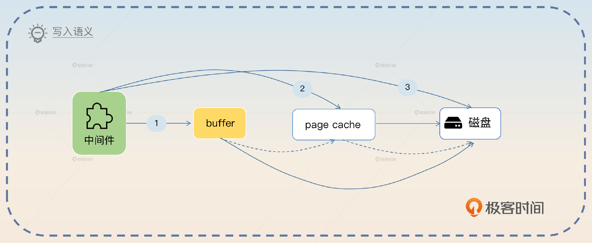

除了一步到位直接写到磁盘，其他两种都要考虑一个问题，就是最终什么时候把数据刷到磁盘呢？思路也有两个，一个是定时，比如说每秒刷到磁盘。另一个是定量，这个就很灵活了，比如说在事务这里基本都是按照提交次数。而在消息队列里面，就可以按照消息条数。

但是这里并没有考虑到另外一个问题，即在分布式环境下，写入一份数据，往往是指要写入主节点，也要写入从节点。

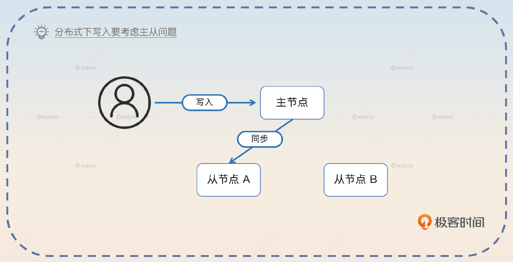

所以在分布式环境下的写入语义更加含糊。

- 主节点写入成功，就认为写入成功了。
- 主节点写入成功，至少有一个从节点写入成功了，就认为写入成功了。
- 主节点写入成功，大多数从节点写入成功了，就认为写入成功了。
- 主节点写入成功，特定数量的从节点写入成功了，就认为写入成功了。一般来说，这个“特定数量”是可配置的。
- 主节点写入成功，全部从节点也写入成功了，才认为写入成功了。

那么不管是主节点还是从节点的“写入成功”，都要考虑前面说到的刷盘问题。所以你就可以在谈到刷盘的时候进一步引申到这里。

> redo log 和 binlog 的刷盘问题，在中间件里面经常遇到。一般来说，中间件的写入语义可能是中间件写入到自身的日志中或者缓冲区、中间件发起了系统调用，写入操作系统的page cache、中间件强制发起刷盘，数据被持久化到了磁盘上这3种。如果不是直接写到磁盘，那么中间件就会考虑定时或者定量刷新数据到磁盘。
>
> 在分布式环境下，写入语义会更加复杂，因为要考虑是否写从节点，以及写多少个从节点的问题。比如说在 Kafka 里面 acks 机制，就是控制写入的时候要不要同步写入到从分区里面，或者 Redis 里面控制 AOF 刷盘时机。

我在最后举了 Kafka 和 Redis 的例子，这里你可以考虑换成你自己了解的其他例子。

### 调整刷盘时机

这类似于你在上一节课刷亮点的技巧，也就是要结合公司的实际情况，考虑调整 redo log 和 binlog 的刷盘时机。那么基本方向有两个。第一个是对数据不丢失、一致性要求高的业务，你可以考虑调整 **sync\_binlog 的值为 1**。

> 在我的系统里面，有一个业务对数据不丢失，一致性要求非常高。因此我们尝试调整 sync\_binlog 为 1。但是代价就是数据库的性能比较差，因为每次提交都需要刷新 binlog 到磁盘上。当然这时候 innodb\_flush\_log\_at\_trx\_commit 也要使用默认值 1。

另外一个是性能优先，能够容忍一定数据丢失的。那么你可以考虑将 **innodb\_flush\_log\_at\_trx\_commit 调整为 0 或者 2**，同时还可以把 **sync\_binlog调整为比较大的值**，比如说调到 100。

> 我们有一个对性能非常敏感，但是对数据丢失容忍度比较高的业务，那么我就尝试将 innodb\_flush\_log\_at\_trx\_commit 设置为 2，让操作系统来决定什么时候刷新 redo log。同时还把 sync\_binlog 的值调整为 100，进一步提高数据库的性能。

或者你综合两者。

> 之前我们有一个数据库，给两类业务使用。一类业务对数据不丢失，一致性要求极高，另外一类对性能敏感，但是可以容忍一定程度的数据丢失。后来我将这两类业务的表分开，放在两个数据库上。

然后再分别阐述对应的调整策略就好了。当然，这个方案和数据库的性能有关，也可以做成你 MySQL 性能调优方案中的一环。

## 面试思路总结

这一节课的思路要难一些，下面列举的这些知识点是你一定要记住的。

- undo log、redo log 的原理、作用。
- 事务执行过程。
- binlog，尽量结合 redo log 一起理解两阶段提交协议。
- ACID 特性，绝对不能忘的基本功。

此外我还给出了两个你在面试中可以展示的亮点。一个是 **写入语义**，我们要综合考虑单机写到哪里、分布式写不写从节点、写多少从节点的问题。另一个是 **调整刷盘时机**，看重数据的就调小 sync\_binlog，看重性能的就调大 sync\_binlog 以及调整 innodb\_flush\_log\_at\_trx\_commit。

我在写入语义这个亮点给你演示了在面试中刷亮点的另外一种思路： **充分地横向对比**。简单来说就是我们计算机行业里面其实很多设计理念、解决方法都是充满了套路的。你要做的就是找出这个套路，然后在面试中说出来，并且举不同中间件作为例子佐证。

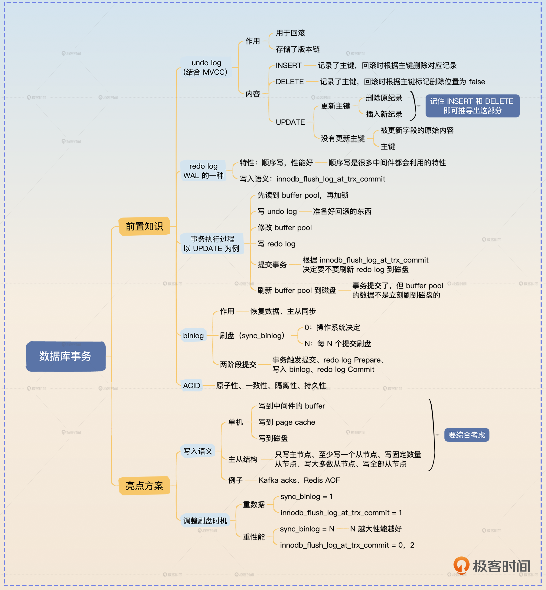

## 思考题

最后你来思考两个问题。

- 你用过的中间件是怎么处理刷盘的？如果有主从结构，如何控制写入到从节点？
- 在聊到隔离性和隔离级别的时候我说到一个个人观点，即未提交读和已提交读，不能看作完全实现了隔离性，你怎么看待这两者？

欢迎你把你的想法分享到评论区，我们一起探讨，也欢迎你把这节课分享给需要的朋友，我们下节课再见！