# 15｜数据迁移：如何在不停机的情况下保证迁移数据的一致性？
你好，我是大明。今天我们来聊聊数据迁移的问题。

我之前就注意到很多人的简历里面都会提到数据迁移方面的内容。比如：

- 重构老系统：使用新的表结构来存储数据；
- 单库拆分分库分表、分库分表扩容；
- 大表修改表结构定义。

但是在面试的时候，他们就是说不清楚数据迁移究竟应该怎么做，又或者说自己是停机迁移数据的。

这就是小看了数据迁移这个面试点。数据迁移其实是一个很能够综合体现你设计复杂方案解决棘手问题的点，它能进一步凸显你在数据库方面的积累，所以千万不能忽视。今天我就给你展示一个非常全面的不停机数据迁移的方案。

## 数据备份工具

这里我先来介绍一下 MySQL 上常用的两款数据备份工具：mysqldump和XtraBackup。

- mysqldump：一个用于备份和恢复 MySQL 数据库的命令行工具。它允许用户导出 MySQL 数据库的结构、数据以及表之间的关系，以便在数据库发生问题时进行恢复。它是一个逻辑备份工具，导出的内容是一条条 SQL。
- XtraBackup：它使用了 InnoDB 存储引擎的数据备份技术，支持增量备份和恢复，并且支持多主机备份和恢复。它是一个物理备份工具，相当于直接复制 InnoDB 的底层存储文件。

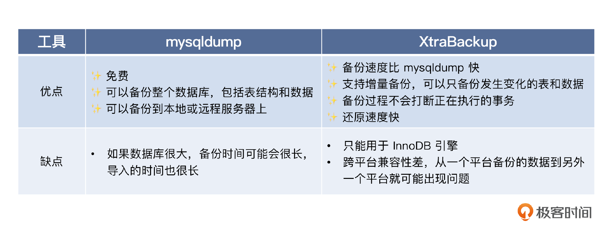

如果你使用的不是 MySQL，可以自己收集一下你使用的数据库的工具。要注意分析这些工具的优缺点，尤其是导入导出速度以及可行的优化手段。

## innodb\_autoinc\_lock\_mode

innodb\_autoinc\_lock\_mode 是 InnoDB 引擎里面控制自增主键生成策略的参数，它有三个取值。

- 0：使用表自增锁，但是锁在 INSERT 语句结束之后就释放了。
- 1：使用表自增锁，如果是普通的 INSERT INTO VALUE 或者 INSERT INTO VALUES 语句，申请了主键就释放锁，而不是整个 INSERT 语句执行完毕才释放。如果是 INSERT SELECT 等语句，因为无法确定究竟要插入多少行，所以都是整个 INSERT 语句执行完毕才释放。
- 2：使用表自增锁，所有的语句都是申请了主键就立刻释放。

这里我额外提一点，就是在执行 INSERT INTO VALUES 的时候，不管插入多少行，都只申请一次主键，一次申请够，这些主键 **必然是连续的**。所以你可以从返回的最后一个 ID 推测出全部 ID。

## 面试准备

在面试之前，你需要了解清楚几个信息。

- innodb\_autoinc\_lock\_mode 的值，这会影响主键生成策略，而你在数据迁移的时候是需要考虑处理主键问题的。
- 公司 binlog 的模式，在后面增量校验和修复数据里面使用的是行模式的 binlog。
- 公司是否有统一的数据库规范，比如说必须要更新时间戳，不能硬删除，只能软删除。
- 你使用的 ORM 框架怎么实现双写？
- 公司是否做过数据迁移？如果做过，具体的方案是什么？当然，如果你做过数据迁移，那就最好不过了。

正常来说，如果你真的解决过复杂的数据迁移，那么它完全可以作为一个独立的项目写到简历里面。又或者你在讲到某个项目的时候，可以说自己设计过一个非常复杂的数据迁移方案。我用重构系统作为例子，给你展示一下这个话术。

> 这个系统是我们公司的一个核心系统，但是又有非常悠久的历史。在我刚接手的时候，它已经处于无法维护的边缘了。但是不管是重构这个系统，还是重新写一个类似的系统，已有的数据都是不能丢的。所以我的核心任务就是重新设计表结构，并且完成数据迁移。为此我设计了一个高效、稳定的数据迁移方案。

如果你实际落地了单库拆分分库分表，或者你们公司单库拆分了分库分表，你也可以这样说。

> 我进公司的时候，刚好遇上单库拆分分库分表。我主要负责的事情就是设计一个数据迁移方案，把数据从单库迁移到分库分表上。

我建议你在实践中推演一下这个方案。有条件的话，自己准备两个数据库尝试一下会更好。

## 解决方案

下面我们来看一看数据迁移方案的基本步骤。

1. 创建目标表。
2. 用源表的数据初始化目标表。
3. 执行一次校验，并且修复数据，此时用源表数据修复目标表数据。
4. 业务代码开启双写，此时读源表，并且先写源表，数据以源表为准。
5. 开启增量校验和数据修复，保持一段时间。
6. 切换双写顺序，此时读目标表，并且先写目标表，数据以目标表为准。
7. 继续保持增量校验和数据修复。
8. 切换为目标表单写，读写都只操作目标表。

如果不考虑数据校验，那么整个数据迁移过程是这样的。

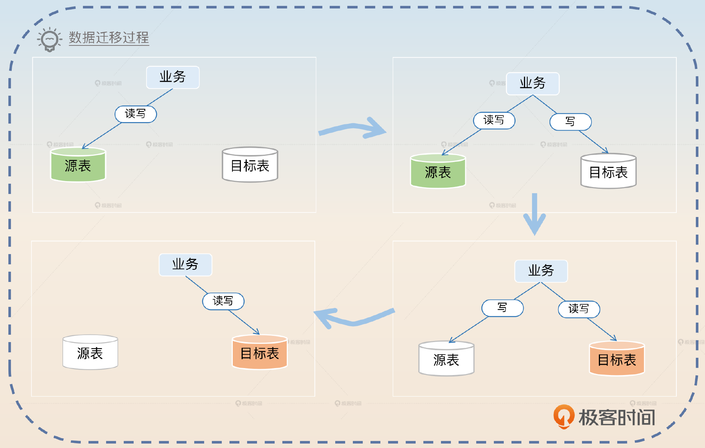

所以比较简单的方式就是记住图里的四步，图右边的两步都要考虑校验和修复数据的问题。接下来我带你分析一下方案里的关键步骤。

### 初始化目标表数据

在创建了一个目标表之后，第一步是先尝试初始化目标数据，问题是 **你怎么拿到源表数据？** 那么基本思路有两个：一是使用源表的历史备份，基本上数据库都会有备份机制，那么你自然可以利用这些备份来初始化目标表的数据。二是源表导出数据，导出数据的时候，你可以使用我介绍的那些工具。大部分情况下，使用 mysqldump 是不会出问题的，无非就是导出导入慢一些，而这也恰好是你刷亮点的地方。

那么我们就以 mysqldump 为例来聊一下，这里的关键词就是 **加快导入和导出速度**。

> 我选择了从源表导出数据，使用的是 mysqldump 工具。mysqldump 是一个开源的逻辑备份工具，优点是使用简单，能够直接导出整个数据库。缺点则是导出和导入的速度都比较慢，尤其是在数据量非常大的情况下。所以我针对 mysqldump 做了一些优化，来提高导出和导入的性能。加快导出速度能做的事情并不多，主要就是开启 extended-insert 选项，将多行合并为一个 INSERT 语句。
>
> 加快导入速度就可以做比较多的事情。
>
> 1. 关闭唯一性检查和外键检查，源表已经保证了这两项，所以目标表并不需要检查。
> 2. 关闭 binlog，毕竟导入数据用不着 binlog。
> 3. 调整 redo log 的刷盘时机，把 innodb\_flush\_log\_at\_trx\_commit 设置为 0。

注意在第2、3点里面，可以把话题引向上一节课的 binlog 和 redolog 内容。反过来，你也可以利用 binlog 和 redolog 把话题引导到这一节课的内容，灵活应对就可以。

### 第一次校验与修复

在初始化数据之后，你可以先尝试立刻校验和修复一下数据，因为如果你前面用的是备份数据，那么备份数据已经落后生产数据了。比如说你用的是昨天的备份，那么今天的修改目标表就没有。还有如果你是导出的数据，那么导出数据到你导入数据这段时间，数据发生了变化，目标表依旧是没有的。

如果你们公司有明确的数据库规范的话，比如说所有的表都需要有 update\_time 这个字段，那么你在校验和修复的时候就可以采用增量的方案。因为只有 update\_time 晚于你导出数据的那个时间点，才说明这一行的数据已经发生了变更。在修复的时候就 **直接用源表的数据覆盖掉目标表的数据**。

### 业务开启双写，以源表为准

首先你要解释清楚你是怎么做到双写的。支持双写大体上有两个方向：侵入式和非侵入式两种。 **侵入式方案就是直接修改业务代码**。要求业务代码在写了源表之后再写目标表。但是侵入式方案是不太可行的，或者说代价很高。因为这意味着所有的业务都要检查一遍，然后修改。既然修改了，那自然还要测试。所以，一句话总结就是工作量大还容易出错。

**非侵入式一般和你使用的数据库中间件有关**，比如说 ORM 框架。这一类框架一般会提供两种方式来帮你解决类似的问题。

- AOP（Aspect Oriented Program 面向切面编程）方案：不同框架有不同叫法，比如说可能叫做 interceptor、middleware、hook、handler、filter。这个方案的关键就是捕捉到发起的增删改调用，篡改为双写模式。

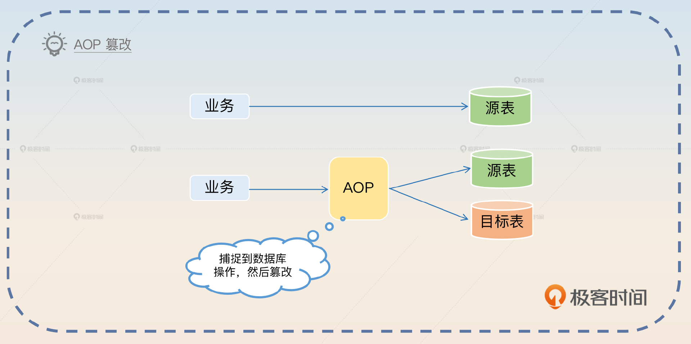

- 数据库操作抽象：可能叫做 Session、Connection、Connection Pool、Executor 等，就是将对源表的操作修改为双写模式。

不管你采用哪个方案，你都要确保一个东西，就是双写可以在运行期随时切换状态，单写源表、先写源表、先写目标表、单写目标表都可以。

大多数时候都是利用一个标记位，然后你可以通过配置中心或者接口直接修改它的值。

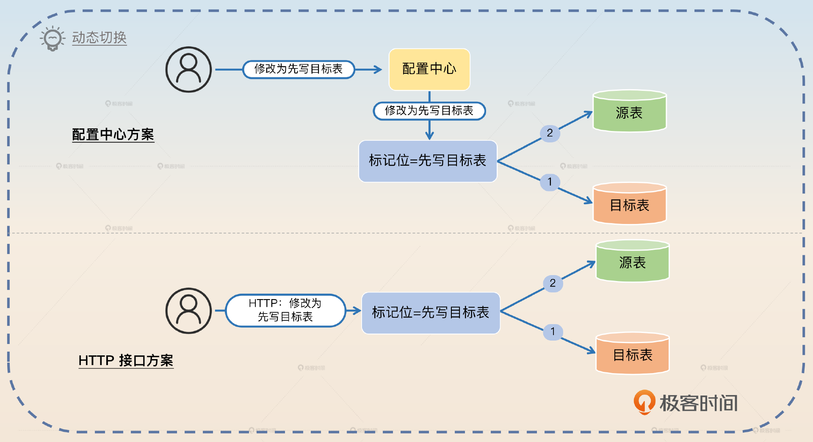

我以 Go 语言的 GORM 为例，给你展示基本的回答。

> 开启双写在 GORM 上面还是比较容易做到的。最开始我觉得可以考虑使用 GORM 的 Hook 机制，用 DELETE 和 SAVE 两个 Hook 就可以了。但是这要求我必须给每一个模型或表都定义类似的 Hook，还是比较麻烦的。后来我仔细翻了 GORM 的文档，确认可以考虑使用 GORM 的 ConnPool 接口。所以我用装饰器模式封装了两个数据源，每次执行语句的时候，都根据标记位来执行双写逻辑。

我这里给你看一个伪代码，让你有一个直观的认知。

```go
func (m *DouleWritePool) QueryContext(ctx context.Context, query string, args ...interface{}) (*sql.Rows, error) {
    if m.mode == '源表优先' {
      err = m.source.QueryContext(ctx, query, args...)
      if err == nil {
         m.target.QueryContext(ctx, query, args...)
      }
    } else if {
      //...
    }
}

```

很多时候，你在简历里面写上自己精通某个框架，但是都缺乏说服力，那么这个就可以作为一个证明。在双写的时候，你可以往两个方向进一步刷亮点：数据一致性问题和主键问题。

#### 数据一致性问题

正常面试官都可能会问到，如果在双写过程中，写入源表成功了，但是写入目标表失败了，该怎么办？那么最基础的回答就是 **不管。**

> 写入源表成功，但是写入目标表失败，这个是可以不管的。因为我后面有数据校验和修复机制，还有增量校验和修复机制，都可以发现这个问题。

然后你可以提出一个曾经思考过但是最终没有实施的方案，这能够证明你在数据一致性上有过很深入的思考，关键词是 **难以确定被影响的行**。

> 在设计方案的时候，我考虑过在写入目标表失败的时候，发一个消息到消息队列，然后尝试修复数据。但是这个其实很难做到，因为我不知道该修复哪些数据。比如说一个 UPDATE 语句在目标表上执行失败，我没办法根据 UPDATE 语句推断出源表上哪些行被影响到了。

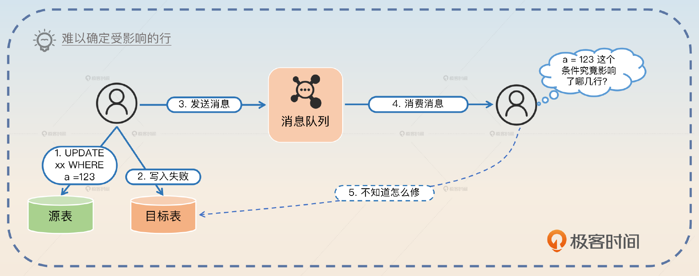

#### 主键问题

如果在源表中使用的是自增主键，那么在双写的时候写入目标表要不要写入主键？答案是要的。也就是说，你需要在写入源表的时候拿到自增主键，然后写入目标表的时候设置好主键。因为你其实并不能确保目标表自增的主键，和你源表自增的主键是同一个值。比如说在并发场景下，两次插入。

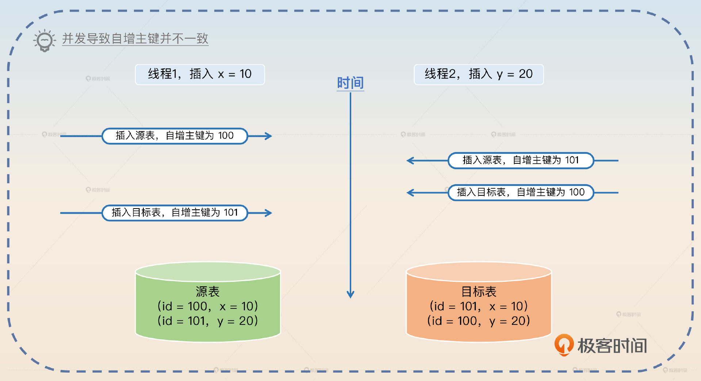

因此你可以介绍你是如何处理这个问题的。

> 在双写的时候比较难以处理的问题是自增主键问题。为了保持源表和目标表的数据完全一致，需要在源表插入的时候拿到自增主键的值，然后用这个值作为目标表插入的主键。

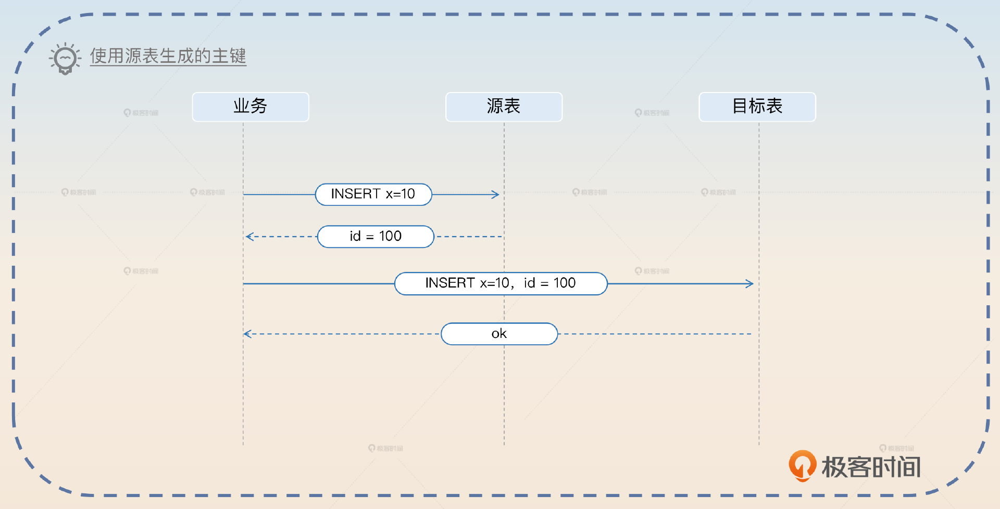

此外你还可以进一步展示一个更加高级的亮点，也就是我在前置知识里面说到的 **innodb\_autoinc\_lock\_mode** 取值会影响自增主键的连续性，抓住关键词 **自增主键的连续性**。

> 在处理批量插入的时候要更加小心一些。正常来说，批量插入如果用的是 VALUES 语法，那么生成的主键是连续的，就可以从返回的最后一个主键推测出前面其他行的主键。即便 innodb\_autoinc\_lock\_mode 取值是 2 也能保证这一点。但是如果用的是多个 INSERT INTO VALUE 语句，或者 INSERT SELECT语句，这些语句生成的主键就可能不连续。在双写之前，就要先改造这一类的业务。

### 增量校验和数据修复

增量校验基本上就是一边保持双写，一边校验最新修改的数据，如果不一致，就要进行修复。这里我们也有两个方案。第一个方案是利用更新时间戳，比如说 update\_time 这种列；第二个方案是利用 binlog。相比之下 binlog 更加高级一点，在面试的时候你应该优先考虑用这个方案。

#### 利用更新时间戳

利用更新时间戳的思路很简单，就是定时查询每一张表，然后根据更新时间戳来判断某一行数据有没有发生变化。我们用伪代码来描述一下。

```sql
for {
  // 执行查询
  // SELECT * FROM xx WHERE update_time >= last_time
  rows := findUpdatedRows()
  for row in rows {
    // 找到目标行，要用主键来找，用唯一索引也可以，看你支持到什么程度
    tgtRow = findTgt(row.id)
    if row != tgtRow {
      // 修复数据
      fix()
    }
  }
  // 用这一批数据里面最大的更新时间戳作为下一次的起始时间戳
  last_time = maxUpdateTime(row)
  // 睡眠一下
  sleep(1s)
}

```

所以你可以介绍基本的策略，关键词是 **更新时间戳。**

> 我们采用的方案是利用更新时间戳找出最近更新过的记录，然后再去目标表里面找到对应的数据，如果两者不相等，就用源表的数据去修复目标表的数据。这个方案有两个条件：所有的表都是有更新时间戳的，并且删除是软删除的。

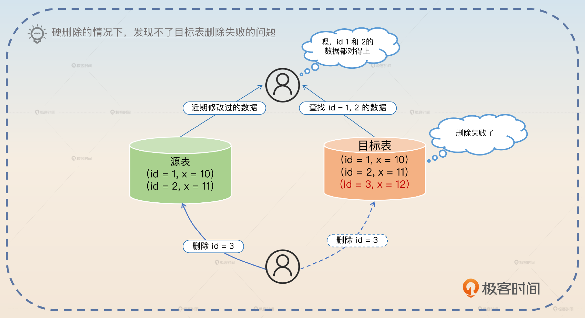

我们在这里提到的第二个条件就是准备展示的第一个亮点。你可以等面试官追问为什么必须是软删除，也可以自己接着回答。

> 如果不是软删除的，那么源表删掉数据之后，如果目标表没删除，在我们的匹配逻辑里面是找不到的。在这种场景下，还有一个补救措施，就是反向全量校验。也就是说从目标表里面再次查询全量数据，再去源表里找对应的数据。如果源表里面没有找到，就说明源表已经删了数据，那么目标表就可以删除数据了。

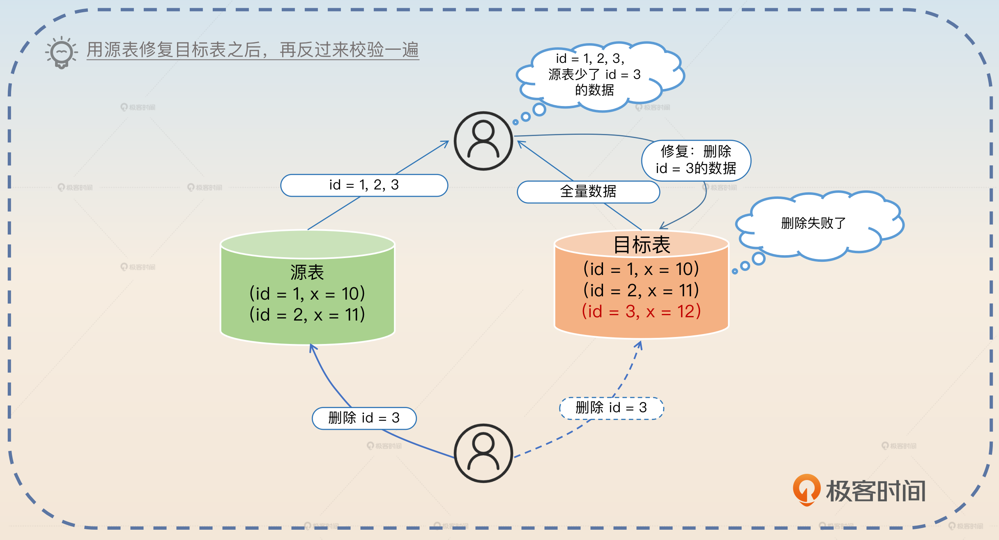

接下来我们可以进一步展示第二个亮点，这个亮点就是 **主从同步延迟** 引发的问题。假设你在校验和修复的时候，读的都是从库，那么你会遇到两种异常情况。一种是目标表主从延迟，另一种是源表主从延迟。

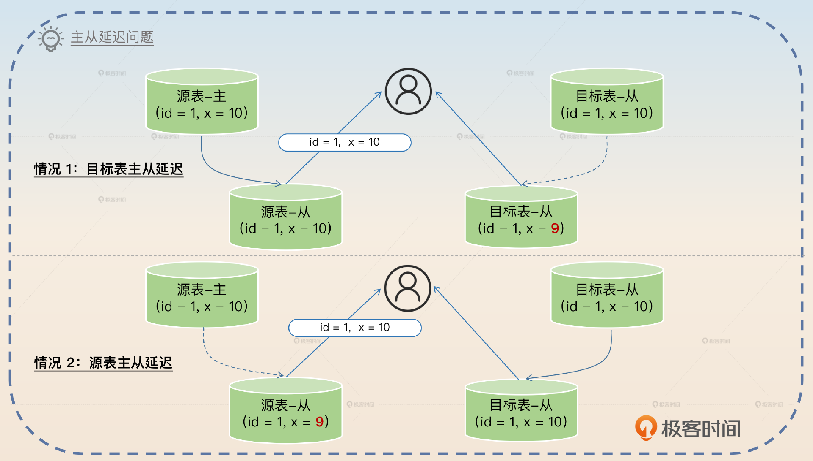

那么怎么解决呢？简单粗暴的方法就是全部读主库，校验和修复都以主库数据为准。 **缺点就是对主库的压力会比较大**。

我这里给你一个更加高级的方案： **双重校验**。

> 校验和修复的时候都要小心主从同步的问题，如果校验和修复都使用从库的话，那么就会出现校验出错，或者修复出错的情况。按照道理来说，强制走主库就可以解决问题，但是这样对主库的压力是比较大的。
>
> 所以我采用的是双重校验方案。第一次校验的时候读从库，如果发现数据不一致，再读主库，用主库的数据再校验一次。修复的时候就只能以主库数据为准。这种方案的基本前提是，主从延迟和数据不一致的情况是小概率的，所以最终会走到主库也是小概率的。

在这个回答里面你没有提到任何异常情况的具体场景，如果面试官问到了，你就回答上面图里面的两种情况。这个亮点能够凸显你在主从延迟方面的积累，也会把话题引到主从模式和主从同步上，所以你要做好准备。

#### 利用 binlog

binlog是一个更加高级的方案，它还有一些变种，所以理解和记忆的难度也更高一些。注意，我这里说的 binlog 是指 **基于行的 binlog 模式**。我先从最简单的形态说起。

最简单的形态就是将 binlog 当做一个触发器，我们回答的关键词就是 **binlog触发。**

> 在校验和修复的数据时候，我采用的是监听 binlog 的方案。binlog 只用于触发校验和修复这个动作，当我收到 binlog 之后，我会用 binlog 中的主键，去查询源表和目标表，再比较两者的数据。如果不一致，就用源表的数据去修复目标表。

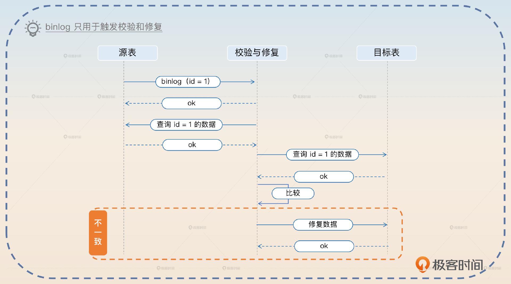

如果更进一步，你会觉得 binlog 里面本来就有数据，那么干嘛不直接用 binlog 里面的数据呢？所以就有了第二个形态： **binlog 的数据被看作源表数据**。

> 拿到 binlog 之后，我用主键去目标表查询数据，然后把 binlog 里面的内容和目标表的数据进行比较。如果数据不一致，再用 binlog 的主键去源表里面查询到数据，直接覆盖目标表的数据。

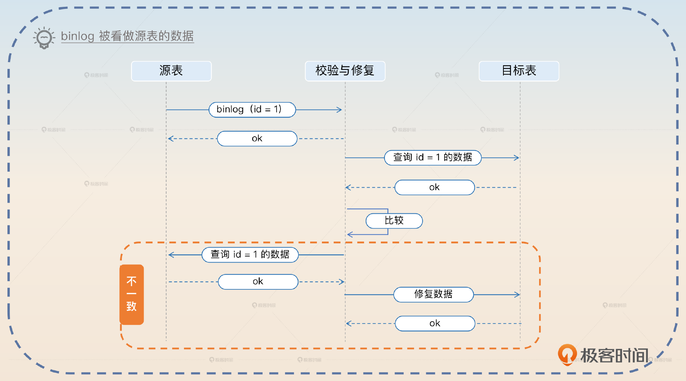

这里有一点不同，就是你发现不一样之后，需要查询源表，再用查询到的数据去覆盖目标表的数据，而不是直接用 binlog 的数据去覆盖目标表的数据。因为你要防止 binlog 是很古老的数据，而目标表是更加新的数据这种情况。

紧接着，你会发现目标表也有 binlog，所以干嘛不直接比较源表的 binlog 和目标表的 binlog？如果 binlog 不一样，那不就是说明目标表那边出了问题吗？

这种方案理论上是可行的，但是它有两个非常棘手的问题。

1. 一次双写，你可能立刻就收到了源表的 binlog，但是你过了好久才收到目标表的 binlog。反过来，先收到目标表的 binlog，隔了很久才收到源表的 binlog也一样。所以你需要缓存住一端的 binlog，再等待另外一端的 binlog。

2. 顺序问题，如果有两次双写操作的是同一行，那么你可能先收到源表第一次的 binlog，再收到目标表第二次双写的 binlog，你怎么解决这个问题呢？你只能考虑利用消息队列之类的东西给 binlog 排个序，确保 binlog 收到的顺序和产生的顺序一致。


它虽然能够进一步减轻数据库查询的压力，但是实在过于复杂，得不偿失。所以不管是实践，还是面试，我都建议你不要使用这个方案。

### 切换双写顺序

这一步本身就是一个亮点。因为很多人都是在双写的时候直接切换到目标表单写。但是这样直接切换的风险太大了，万一出了问题都没法回滚。

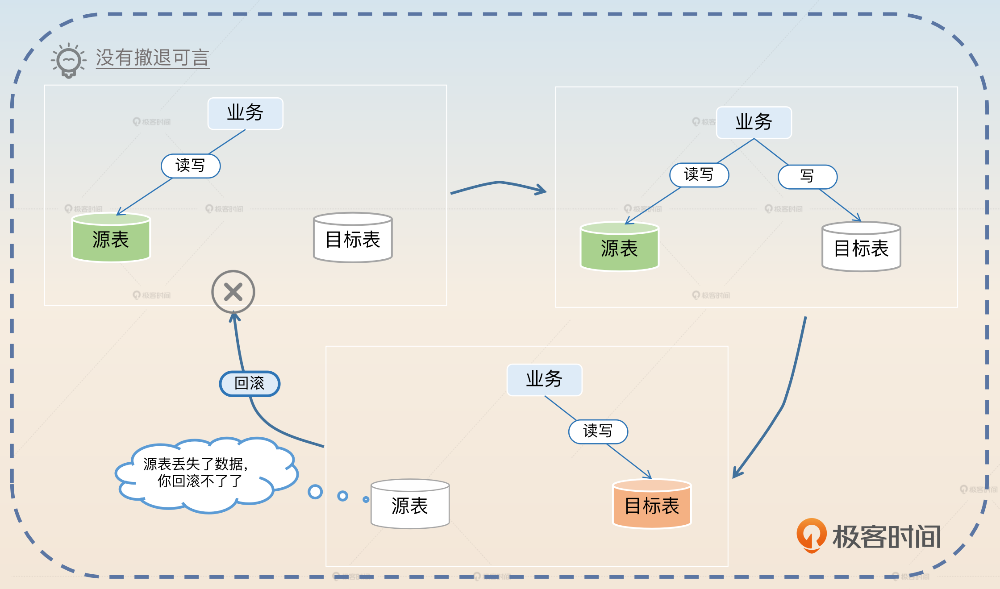

所以中间要引入一个双写的时候先写目标表，且业务读目标表的步骤。这样万一切换到写目标表出了问题还可以回滚。也就是说，你有后悔药可以吃。

所以你可以考虑在介绍这一步的时候补充说明一下。

> 引入这一步，是为了能够在切换到以目标表为准之前，有一个过渡阶段。也就是说，通过先写目标表，再写源表这种方式，万一发现数据迁移出现了问题，还可以回滚为先写源表，再写目标表，确保业务没有问题。

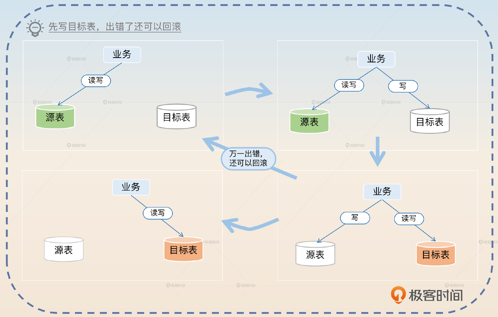

### 保持增量校验和修复

在切换了双写顺序之后，保持增量校验和修复是顺理成章的，方案和步骤 5 一样。不过步骤 5 的校验和修复都是以源表为准，那么在这一步，就是以目标表为准。

我整理了一些能够帮助你进一步理解整个方案的要点。

- 不管什么先后顺序问题、什么并发问题，在修复的时候你永远用主表的最新数据去修复，绝对不会出问题。
- 如果源表或者目标表本身也是分库分表的，那么无非就是查询、修复数据的时候使用对应的分库分表规则而已。
- 整个方案在第八步之前，都是可以回滚的。但是一旦切换到第八步，就不可能回滚了。

## 面试思路总结

这节课我给你介绍了数据备份工具和影响到主键生成策略的 **innodb\_autoinc\_lock\_mode参数**，还给出了 **数据迁移的完整方案**，你可以参考我给出的思维导图自己整理一下。

在讲这节课内容的时候，我想起了之前我在做简历辅导的时候，遇到过好几个同学他们的简历里面都涉及了数据迁移，然后我问他们数据迁移怎么做的，他们的答案都是停机迁移。但是你想，如果你是面试官，听到答案是停机迁移，你会觉得候选人实力不错吗？

不会的，所以实际上即便你真的是停机迁移，你也要回答不停机迁移的方案。至少你要在回答了停机迁移之后，提起你做过不停机迁移的方案，只是没有采用而已。在类似的场景下，虽然你的公司可能用的是低端解决方案，但你面试的时候一定要记得强调你了解高端方案或者曾经实施过高端方案，因为高端的东西才是拉开差距的地方。

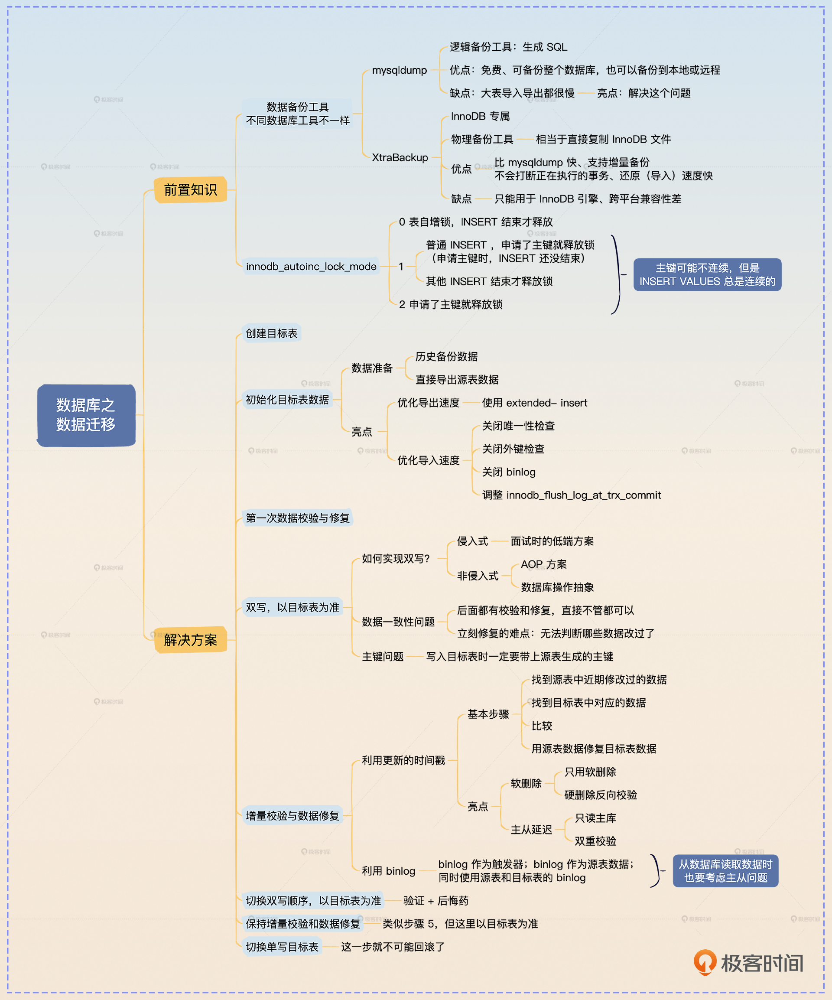

## 思考题

最后请你思考几个问题。

- 在方案第二步，我提到要先初始化一下目标表，那么如果直接把目标表做成源表的一个从库会出现什么问题呢？
- 我在开启双写那里说过一个不可行的消息队列修复数据的方案，不可行的原因是难以确定受影响的行。那么我能不能在消息里面放源表执行的 SQL，然后在消费消息的时候，在目标表上执行相同的 SQL 呢？

你可以好好思考一下，欢迎你把思考后的结果分享到评论区，也欢迎你把这节课的内容分享给需要的朋友，邀他一起学习，我们下节课再见！