# 16｜分库分表主键生成：如何设计一个主键生成算法？
你好，我是大明。今天我们来聊一聊分库分表——主键生成。

分库分表在面试里是一个非常热门，而且偏难的一个话题。这节课我就带你来攻克这个难题，带你了解UUID、自增主键和雪花算法的特点，并且教你在面试的时候刷出亮点。在这些基础上，我会进一步给出一个微创新的主键生成方案，可以作为你面试时候的主要突破口。

不过为了让你的知识系统更加完整，我前面还是会给你讲解一下分库分表相关的知识，这样就算你的基础比较薄弱，也能看懂后面的方案。

## 前置知识

所谓的分库分表 **严格来说是分数据源、分库和分表**。例如某个公司订单表的分库分表策略就是用了8个主从集群，每个主从集群4个库，每个库有32张表，合在一起可以说成是$8 \\times 4\\times 32$。

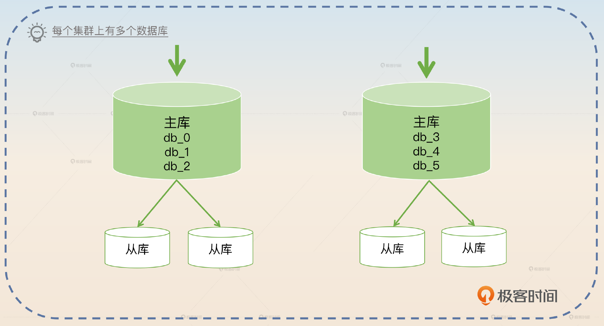

不过根据数据规模和读写压力，也可以共享一个主从集群，然后只分库或者只分表。如果面试面到了分库分表的内容，那么主键生成基本上就是一个绕不开的话题。显然，在没有分库分表的时候，我们都可以使用自增主键。

比如说我们在 MySQL 里面的建表语句，指定了AUTO\_INCREMENT。

```sql
CREATE TABLE order (
   id BIGINT PRIMARY KEY AUTO_INCREMENT,
   buyer_id BIGINT NOT NULL
)

```

那么在分库分表的场景下，这种自增主键就无法运作了，因为存在冲突的可能。举个最简单的例子，假如说我们分库分表只分表，而且按照 buyer\_id 除以 2 的余数来分成两张表，分别是 order\_tab\_0 和 order\_tab\_1。

如果这两张表都依赖于自增生成主键，那么两张表会生成相同的 ID。比如说两张表插入第一行数据的时候，ID 都是 1。而问题在于订单这一类的业务，我们需要一个全局唯一的 ID。

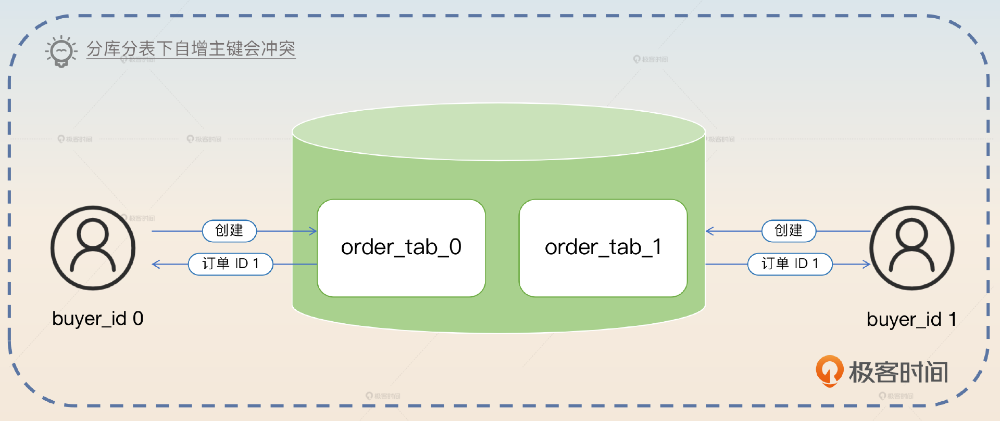

主键生成一般还伴随着两个要点。

- 我们希望全局唯一的 ID 依旧能够保持自增，因为自增与否会显著影响插入的性能。
- 因为只有数据量大的才会考虑分库分表，而数据量大一般意味着并发高，所以还要考虑怎么支持高并发。

接下来我就会在这两个要点下教你怎么在面试的时候刷出亮点来。

## 面试准备

首先我们需要把话题引到主键生成上来。如果你接触过使用分库分表的项目，那么在简历和项目介绍的时候一定要提及分库分表关键词，后面就等面试官主动问你主键是如何生成的。如果在面试过程中被问到了数据库自增主键相关的问题，那么你要主动提起自增主键不适用于分库分表场景，然后面试官自然就会追问你分库分表场景下主键的生成问题。

那在面试官问到这些问题的时候我们怎样才能抓住这个机会，展现自己的实力呢？

这就需要我们提前做一些准备工作了。

1. 深入理解市面上常见的主键生成策略。
2. 准备一个有亮点的、微创新的主键生成方案。
3. 记住一些可行的优化方案。

下面我们就一步一步来，先来看看市面上一些常见的主键生成策略。

## 常见思路

如果面试官问，在分库分表里面，怎么解决主键问题，或者分库分表可以怎么生成主键，又或者问你如何设计一个发号器，基本上都是希望你回答主键生成的常见思路，也就是UUID、数据库自增和雪花算法。接下来我们一个个分析。

### UUID

UUID 是最简单粗暴的方案，也是面试的时候你必须要回答出来的一种策略。

如果你想和其他面试的人拉开差距，那么即便是最简单的 UUID 方案也可以下一番功夫，首先你需要详细地解释 UUID 的两个弊端。

- **过长**：这个弊端其实在面试里面讨论得比较少，毕竟会采用 UUID 的地方就不会在意它的长度了。
- **UUID 不是递增的**：这个弊端是你面试时要重点描述的，并且要尝试刷出亮点来。

#### 亮点1：页分裂

UUID 不是递增的这个弊端，要想讲清楚，你就要先描述 **为什么我们会希望在数据库里面使用自增主键**。那么你可以引用数据库为什么使用自增主键的知识点来回答这个问题，关键词就是 **页分裂。**

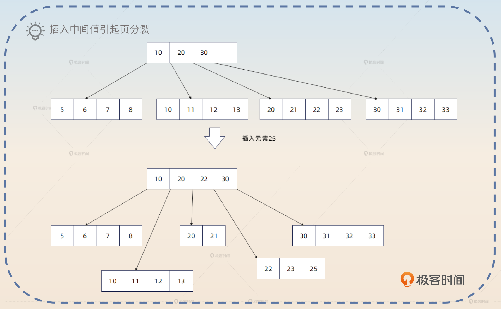

如图所示，你在尝试往 23 之后插入一个 25 的时候，这个叶子节点已经放不下了，逼不得已就只能分裂成（20，21）和（22，23，25）两个节点。如果你再仔细观察一下，就会发现，原本的（10，20，30）多了一个元素之后变成了（10，20，22，30）。你想到了什么？

**即页分裂这个东西是可能会引起连锁反应的**，从叶子节点沿着树结构一路分裂到根节点。

所以你可以这样回答。

> UUID 最大的缺陷是它产生的 ID 不是递增的。一般来说，我们倾向于在数据库中使用自增主键，因为这样可以迫使数据库的树朝着一个方向增长，而不会造成中间叶节点分裂，这样插入性能最好。而整体上 UUID 生成的 ID 可以看作是随机，那么就会导致数据往页中间插入，引起更加频繁地页分裂，在糟糕的情况下，这种分裂可能引起连锁反应，整棵树的树形结构都会受到影响。所以我们普遍倾向于采用递增的主键。

如果你这样回答，那么算是 **基本达标了**。

#### 亮点2：顺序读

此外，我们还可以从一个比较新奇的角度，解释为什么要使用自增主键，关键词就是 **顺序读。**

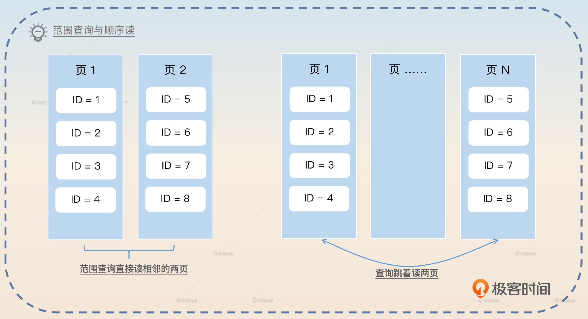

所以你可以这样回答。

> 自增主键还有一个好处，就是数据会有更大的概率按照主键的大小排序，两条主键相近的记录，在磁盘上位置也是相近的。那么可以预计，在范围查询的时候，我们能够更加充分地利用到磁盘的顺序读特性。

#### 亮点3：InnoDB 的数据组织

如果你希望在面试官面前树立你在数据库方面积累比较多的形象，那么你就要 **进一步解释数据库的页分裂究竟是怎么一回事**，这时候你可以用 MySQL InnoDB 引擎来举例子。

> MySQL 的 InnoDB 引擎，每一个页上按照主键的大小放着数据。假如说我现在有一个页放着主键1、2、3、5、6、7这六行数据，并且这一页已经放满了。现在我要插入一个 ID 为 4 的行，那么 InnoDB 引擎就会发现，这一页已经放不下 4 这行数据了，于是逼不得已，就要将原本的页分成两页，比如说 1、2、3 放到一页，5、6、7 放到另外一页，然后可以把 4 放到第一页。
>
> 这种页分裂会造成一个问题，就是虽然从逻辑上来说 1、2、3 这一页和 5、6、7 这一页是邻近的两个页，但是在真实存储的磁盘上，它们可能离得很远。

这个回答基本上就是前面图片的一个口语化表述。


到这一步，你的回答就已经算是可以了。面试官如果想要进一步探讨，那么可能会继续追问 InnoDB 引擎上的页这种数据结构有什么字段，各自有什么用处。如果你现在是临时抱佛脚准备面试，那么就没必要去背这些八股文。但是如果你只是平常在学习技术知识，想要夯实基础，那么我建议你深入去看看这部分内容。

### 数据库自增

除了 UUID 这种方案以外，还有另外一种常见的方案也叫做自增。不过这种自增有点特殊，它是设置了步长的自增。

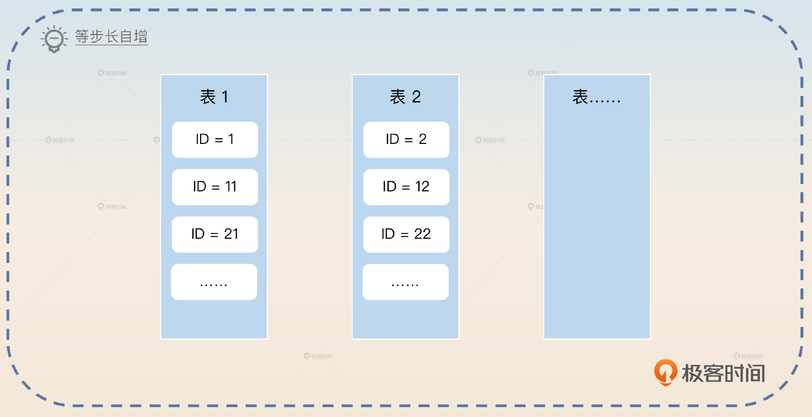

我们可以用一个例子来说明这种方案。

> 经过分库分表之后我有十个表，那么我可以让每一个表按照步长来生成自增 ID。比如说第一个表就是生成 1、11、21、31 这种 ID，第二个表就是生成 2、12、22、32 这种 ID。

紧接着我们还可以简单评价一下这种方案，关键词是 **表内部自增。**

> 这种方案非常简单，而且本身我们在应用层面并不需要做任何事情，只是需要在创建表的时候指定好步长就可以了。ID 虽然并不一定是全局递增的，但是在一个表内部，它肯定是递增的。这个方案的性能基本取决于数据库性能，应用层面上也不需要关注。

### 雪花算法

除了UUID和数据库自增之外，你还可以从雪花类算法上找找亮点。

要注意的是，以目前的内卷情况，你即便答出了雪花算法，可能还是很普通。不过别担心，我这就教你怎么让自己的回答变得不普通。

雪花算法的原理倒不难，它的关键点在于 **分段。**

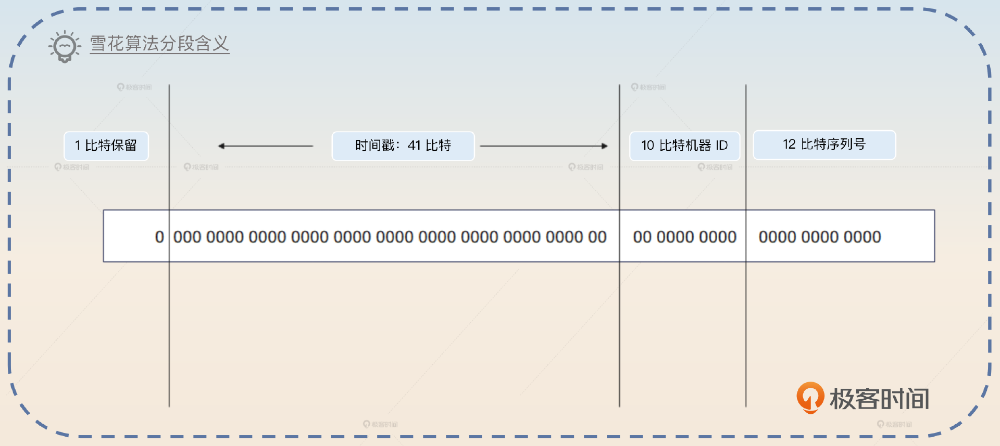

那么雪花算法保证 ID 唯一性的理由也很充分了。

- 时间戳是递增的，不同时刻产生的 ID 肯定是不同的。
- 机器 ID 是不同的，同一时刻不同机器产生的 ID 肯定也是不同的。
- 同一时刻同一机器上，可以轻易控制序列号。

在面试中，你要先回答这几个理由，然后解释。

> 雪花算法采用 64 位来表示一个 ID，其中 1 比特保留，41 比特表示时间戳，10 比特作为机器 ID，12 比特作为序列号。

基本解释清楚之后，我们刷亮点有很多个方向，你可以根据自己掌握相关知识的程度来选择。

#### 亮点1：调整分段

第一个方向是深入讨论每个字段，关键点就是 **根据需求自定义各个字段含义、长度。**

大多数情况下，如果自己设计一个类似的算法，那么每个字段的含义、长度都是可以灵活控制的。比如说时间戳 41 比特可以改得更短或者更长，比如说 39 比特也能表示十几年，其实也够用了。

> 机器 ID 虽然明面上是机器 ID，但是实际上并不是指物理机器，准确说是算法实例。例如，一台机器部署两个进程，每个进程的 ID 是不同的；又或者进一步切割，机器 ID 前半部分表示机器，后半部分可以表示这个机器上用于产生 ID 的进程、线程或者协程。甚至机器 ID 也并不一定非得表示机器，也可以引入一些特定的业务含义。而序列号也是可以考虑加长或者缩短的。

说完这些，你最好再加上一句总结，升华一下主题。

> 雪花算法可以算是一种思想，借助时间戳和分段，我们可以自由切割 ID 的不同比特位，赋予其不同的含义，灵活设计自己的 ID 算法。


#### 亮点2：序列号耗尽

但是这里还有一个问题，就是不管你怎么设计雪花算法，你的序列号长度都有可能不够。比如说前面标准的是 12 比特，那么有没有可能并发非常高，以至于 12 比特在某一个特定的时刻机器上的比特全都用完了呢？

显然，理论上是存在这种可能的，所以我们的亮点就要从如何解决这个问题入手。这个问题解决起来倒也很简单。

- 如果 12 比特不够，你就给更多比特，这部分比特可以从时间戳里面拿出来
- 如果还不够，那么就让业务方等待一下，到下一个时刻，自然又可以生成新的 ID 了，也就是时间戳变了，这也是一种变相的限流。

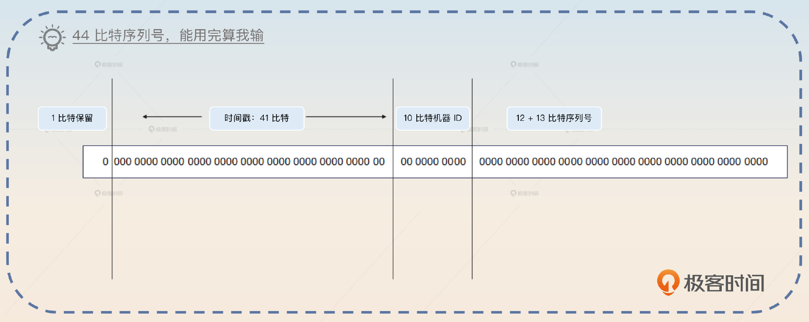

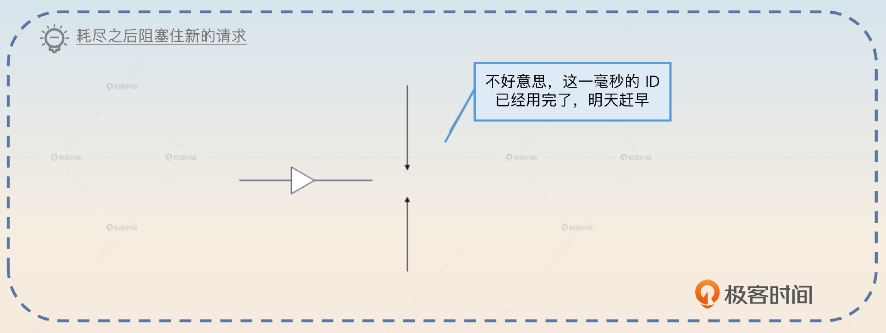

所以你可以这样回答。

> 一般来说可以考虑加长序列号的长度，比如说缩减时间戳，然后挪给序列号 ID。当然也可以更加简单粗暴地将 64 位的 ID 改成 96 位的 ID，那么序列号 ID 就可以有三四十位，即便是国际大厂也不可能用完了。不过，彻底的兜底方案还是要有的。我们可以考虑引入类似限流的做法，在当前时刻的 ID 已经耗尽之后，可以让业务方等一下。我们的时间戳一般都是毫秒数，那么业务方最多就会等一毫秒。

这里面试官可能会继续杠，问你这里让业务方等一下会有什么问题？或者说如果面试官不主动杠，你也可以自己说明一下。

> 业务方等待算是一个比较危险的方案，因为这可能导致大量业务方阻塞住，导致线程耗尽或者协程耗尽之类的问题。不过如果是偶发性的序列号不够，那么问题不大，因为阻塞的业务方很快就能拿到 ID。
>
> 那么如果序列号耗尽不是一个偶发性的问题，是长期的问题，那么还是要考虑从业务角度切割，不同业务使用不同的 ID 生成，就不要共享了。又或者，逼不得已还是用 96 或者128 位的，一了百了。

#### 亮点3：数据堆积

你设想这么一个场景：你的分库分表是按照 ID 除以 32 的余数来进行的，那么如果你的业务非常低频，以至于每一个时刻都只生成了尾号为 1 的 ID，那么是不是所有的数据都分到了一张表里面呢？

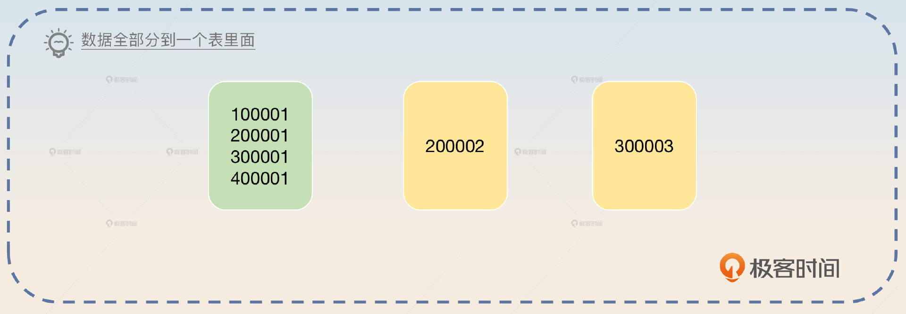

没错，不过解决方案也很简单。

1. 某一个时刻使用随机数作为起点，而不是每次从 0 开始计数。
2. 使用上一个序列号作为起点。比如说上一个序列号只分到了 3，那么下一个时刻的序列号就从 4 开始。

随机数算是正统方案，第二个方案看起来稍微有点儿奇怪。

你就可以这样来回答。

> 在低频场景下，很容易出现序列号几乎没有增长，从而导致数据在经过分库分表之后只落到某一张表里面的情况。为了解决这种问题，可以考虑这么做，序列号部分不再是从 0 开始增长，而是从一个随机数开始增长。还有一个策略就是序列号从上一时刻的序列号开始增长，但是如果上一时刻序列号已经很大了，那么就可以退化为从 0 开始增长。这样的话要比随机数更可控一点，并且性能也要更好一点。

接下来，你有一个“亮剑”的机会，补充一句话。

> 一般来说，这个问题只在利用 ID 进行哈希的分库分表里面有解决的意义。在利用 ID 进行范围分库分表的情况下，很显然某一段时间内产生的 ID 都会落到同一张表里面。不过这也是我们的使用范围分库分表预期的行为，不需要解决。

做完前面这些工作，我们的基本操作就完成了。

## 亮点方案： **主键内嵌分库分表键**

看到这里你是不是在想，前面的回答都还不够有亮点吗？都回答出来雪花算法了还不够吗？答案是有亮点但是还不够拉开差距。既然寻求刺激，那就要贯彻到底。

我这里直接给你一个方案—— **主键内嵌分库分表键。**

> 大多数时候，我们会面临一个问题，就是分库分表的键和主键并不是同一个。比如说在 C 端的订单分库分表，我们可以采用买家 ID 来进行分库分表。但是一些业务场景，比如说查看订单详情，可能是根据主键又或者是根据订单 SN 来查找的。
>
> 那么我们可以考虑借鉴雪花算法的设计，将主键生成策略和分库分表键结合在一起，也就是说在主键内部嵌入分库分表键。例如，我们可以这样设计订单 ID 的生成策略，在这里我们假设分库分表用的是买家 ID 的后四位。第一段依旧是采用时间戳，但是第二段我们就换成了这个买家后四位，第三段我们采用随机数。
>
> 普遍情况下，我们都是用买家 ID 来查询对应的订单信息。在别的场景下，比如说我们只有一个订单 ID，这种时候我们可以取出订单 ID 里嵌入进去的买家 ID 后四位，来判断数据存储在哪个库、哪个表。类似的设计还有答题记录按照答题者 ID 来分库分表，但是答题记录 ID 本身可以嵌入这个答题者 ID 中用于分库分表的部分。

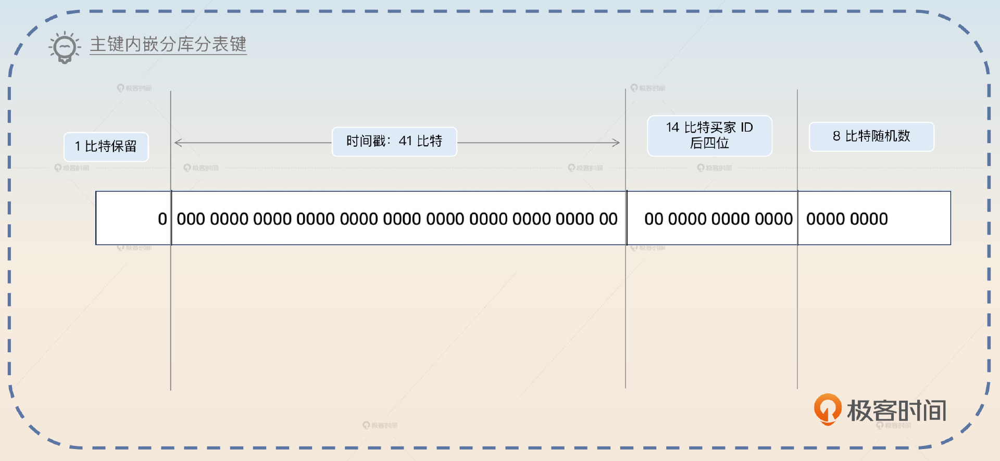

最后你要记得升华一下这种设计思想。

> 这一类解决方案，核心就是不拘泥于雪花算法每一段的含义。比如说第二段可以使用具备业务含义的 ID，第三段可以自增，也可以随机。只要我们最终能够保证 ID 生成是全局递增的，并且是独一无二的就可以。

为什么要这么升华呢？因为在这一段话里面，我们很明显地埋下了两颗“雷”，一个是全局递增，一个是独一无二。也就是说这个亮点方案保证不了这两点，而如果面试官的水平足够，那么他肯定会追问你全局递增和独一无二两个点。

### 全局递增

假如说面试官进一步追问：你这个方案能够保证主键递增吗？

> 这个保证不了，但是它能够做到大体上是递增的。你可以设想，同一时刻如果有两个用户来创建订单，其中用户 ID为 2345 的先创建，用户 ID 为 1234 的后创建，那么很显然用户 ID 1234 会产生一个比用户 ID 2345 更小的订单 ID；又或者同一时刻一个买家创建了两个订单，但是第三段是随机数，第一次 100，第二次 99，那么显然第一次产生的 ID 会更大。
>
> 但是这并不妨碍我们认为，随着时间推移，后一时刻产生的 ID 肯定要比前一时刻产生的 ID 要大。这样一来，虽然性能比不上完全严格递增的主键好，但是比完全随机的主键好。

### 独一无二

如果面试官进一步追问你这个方案能不能保证 ID 唯一，那么你应该回答不能，但这并不是一个多大的问题。

你可以想到，不能保证独一无二是因为在第三段里面使用了随机数。既然是随机数，那么就可能随机到同样的数字。但是，产生冲突 ID 的可能性是很低的。它要求在同一时刻同一个用户创建了两个订单，然后订单 ID 的随机数部分随机到了同一个数字。

这时候你就可以揭示这个概率以及相应的容错措施。

> 产生一样 ID 的概率不是没有，而是极低。它要求同一个用户在同一时刻创建了两个订单，然后订单 ID 的随机数部分一模一样，这是一个很低的概率。

如果有杠精面试官非要问你这个概率有多低，你就可以从业务和数学两个角度上解释为什么概率低。

> 在下单场景下，正常的用户都是一个个订单慢慢下，在同一时刻同时创建两个订单，对于用户来说，是一件不可能的事情。而如果有攻击者下单，那就更加无所谓，反正是攻击者的订单，失败就失败了。而即便真的有用户因为共享账号之类的问题同一时刻下两个订单，那么随机到同一个数的概率也是十万分之一。

注意，这里的十万分之一，是假设你随机数产生的范围是在 0 到 十万之间。

最后你还是需要提出解决方案，关键词就是 **重新产生一个主键。**

> 解决方案其实也很简单，就是在插入数据的时候，如果返回了主键冲突错误，那么重新产生一个，再次尝试就可以了。

如果你还想要继续刷亮点，你还可以假装很不在意地说：

> 实际上，还有一种非常偶发性的因素也可能会引起 ID 冲突，也就是时钟回拨，不过相比正统雪花算法，时钟回拨问题在这个方案里面不太严重，毕竟还有一个随机数的部分。

这么一说就足以凸显你知识广博，考虑周全了。

## 优化思路

如果你能够把前面的亮点方案说清楚，还觉得意犹未尽，想继续在面试官面前炫技的话，那么你可以尝试聊聊一般的发号器的优化思路。注意这个优化思路你可以说你只是想过，但是并没有落地，省得说不清楚细节。

优化的点就是： **批量取、提前取、singleflight取、局部分发。**

注意，批量取和提前取对应的还有批量生成和提前生成，思路是一样的。万一面试官问到了如何设计一个高性能的发号器，你也可以回答这些点。

### 批量取

批量取是指业务方每次跟发号器打交道，不是只拿走一个 ID，而是拿走一批，比如说 100 个。拿到之后业务方自己内部慢慢消耗。消耗完了再去取下一批。

这种优化思路的优点就是极大地减轻发号器的并发压力。比如说一批是 100 个，那么并发数就降低为原本的 1%了。缺点就是可能破坏递增的趋势。比如说一个业务方 A 先取走了 100 个 ID，然后业务方 B 又取走 100 个，结果业务方 B 先用完了自己取的 ID，插到了数据库里面；然后业务方 A 才用完自己的 100 个。

### 提前取

提前取是指业务方提前取到 ID，这样就不需要真的等到需要 ID 的时候再临时取。提前取可以和批量取结合在一起，即提前取一批，然后内部慢慢使用。在快要用完的时候，再取一批。同时也要设计一个兜底措施，如果要是用完了，新的一批还没取过来，要让业务方停下来等待。

这个思路的优点是能够提高业务方的性能，缺点和前面一样是会破坏 ID 的递增性。

### singleflight 取

这个就类似于在缓存中应用 singleflight 模式。假如说业务方 A 有几十个线程或者协程需要 ID，那么没有必要让这些线程都去取 ID，而是派一个代表去取。这个代表取到之后再分发给需要的线程。这也能够降低发号器的并发负载。

这个思路还可以进一步优化，就是每次取的时候多取一点，那么后续还有别的线程需要，也不用自己去取了。

### 局部分发

假如说现在整个实例上有 1000 个 ID，这些 ID 是批量获取的。那么一个线程需要 ID 的时候，它就不再是只拿一个，而是拿 20 个，然后存在自己的 TLB（thread-local-buffer) 里面，以后这个线程需要 ID 的时候，就先从自己的 TLB 里面拿，避开了全局竞争，减轻了并发压力。

## 面试思路回顾

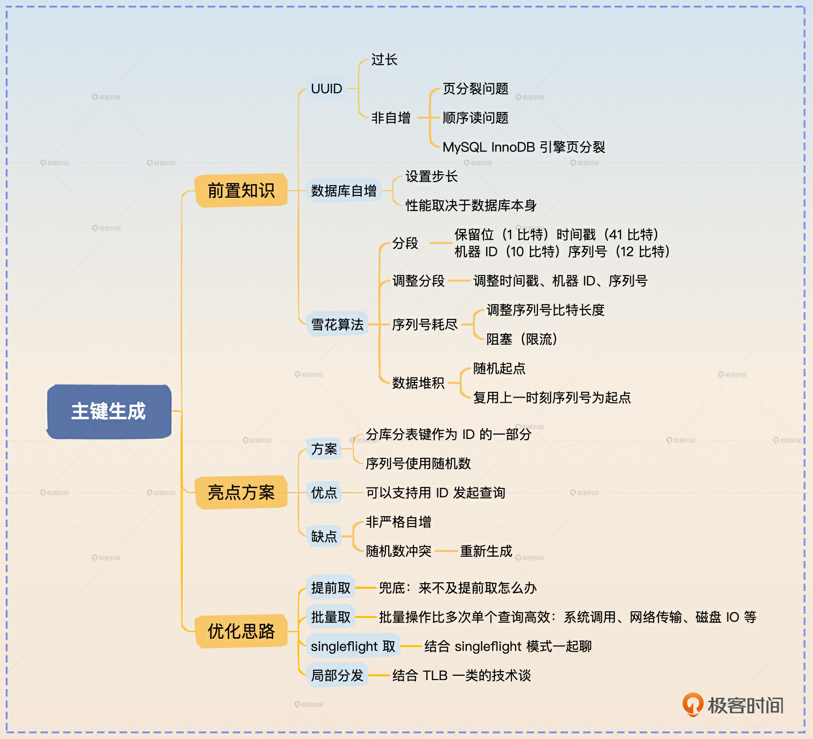

这节课我们主要解决的是分库分表主键生成的问题。我给出了UUID、数据库自增和雪花算法这三种常见思路，并在此基础上设计了一个主键内嵌分库分表键的亮点方案，还给出了几种优化的思路。我给出的这些回答依旧体现了我一直以来跟你说的，对于复杂的理论，你不要死记硬背，而是用一个简单的例子来解释这个理论，正如同我这里用的页分裂的例子。对于面试官来说，他很容易听懂，你也容易记住。

同时，也再次证明了我最开始跟你说的那个说法，对于一些喜欢一杆子打到底的面试官来说，引导他们是一件非常简单的事情。 **他们所自豪的一杆子打到底，实际上每一步都在你的预料之内**。

## 思考题

最后你来思考几个问题。

- 我在雪花算法里面讲到说，如果序列号耗尽，可以缩短时间戳，把比特位给序列号用，那么能不能缩减机器 ID 的比特位？
- 在singleflight 取那里，算是一个典型的化全局竞争为局部竞争的并发优化，那么你还见过类似的优化吗？

好好思考，也许会有意想不到的收获，欢迎你把你的答案分享在评论区，也欢迎你把这节课的内容分享给需要的朋友，我们下节课再见！