# 17｜分库分表分页查询：为什么你的分页查询又慢又耗费内存？
你好，我是大明。今天我们来聊一聊分库分表分页查询。

在实践中，分页是分库分表之后肯定要解决的问题，如果解决方案没选好，那么很容易出现性能问题。分页的解决方案很多，不过能够在面试中系统地将所有的方案都说出来的候选人可以说是少之又少。所以你只需要记住这节课的内容记住，就足以拉开和其他候选人的差距。

让我们从分库分表的一般做法开始学起。

## 分库分表的一般做法

分库分表我们一般会使用三种算法。

1. **哈希分库分表**：根据分库分表键算出一个哈希值，然后根据这个哈希值选择一个数据库。最常见的就是使用数字类型的字段作为分库分表键，然后取余。比如说在订单表里面，按照买家的 ID 除以 8 的余数进行分表。
2. **范围分库分表**：将某个数据按照范围大小进行分段。比如说根据 ID，\[0, 1000) 在一张表，\[1000, 2000) 在另外一张表上。最常见的应该是按照日期进行分库分表，比如说按照月分表，每个月一张表。
3. **中间表**：引入一个中间表来记录数据所在的目标表。一般是记录主键到目标表的映射关系。

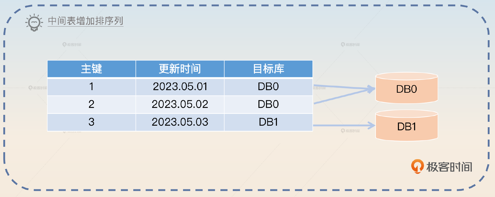

这三者并不是互斥的，也就是说你可以考虑使用哈希分库分表，同时引入一个中间表。也可以先进行范围分库分表，再引入一个中间表。

## 分库分表中间件的形态

分库分表中间件的形态有三种。

1. **SDK 形态：** SDK 形态就是我们最熟悉的，它通过依赖的形式引入到你的代码里面。比如说 ShardingSphere 的 Java 依赖。
2. **Proxy 形态：** 独立部署的分库分表中间件，它对于所有的业务方来说，就像一个普通的数据库，业务方的查询发送过去之后，它就会执行分库分表，发起实际查询，然后把查询结果返回给业务方。ShardingSphere 也支持这种形态。

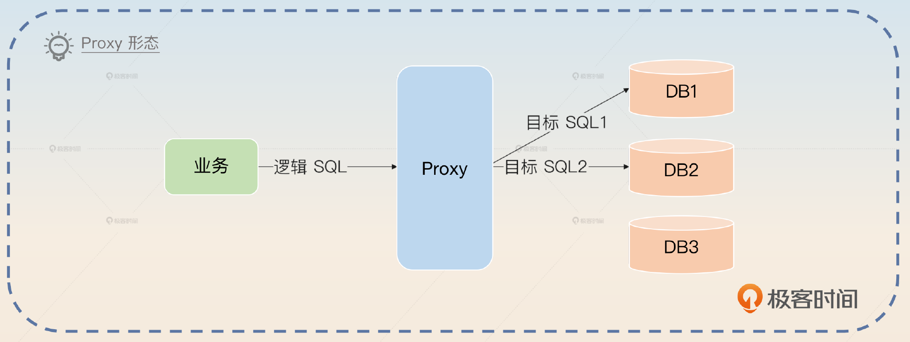

1. **Sidecar 形态**：简单来说就是一个提供了分库分表的 Sidecar。这是一个理论上的形态，现在并没有非常成熟的产品。

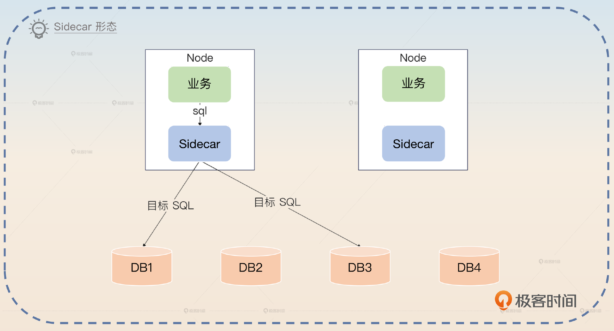

这三种形态里面，SDK 形态性能最好，但是和语言强耦合。比如说 Java 研发的 ShardingSphere jar 包是没办法给 Go 语言使用的。

Proxy 形态性能最差，因为所有的数据库查询都发给了它，很容易成为性能瓶颈。尤其是单机部署 Proxy 的话，还面临着单节点故障的问题。它的优点就是跟编程语言没有关系，所以部署一个 Proxy 之后可以给使用不同编程语言的业务使用。同时，Proxy 将自己伪装成一个普通的数据库之后，业务方可以轻易地从单库单表切换到分库分表，整个过程对于业务方来说就是换了一个数据源。

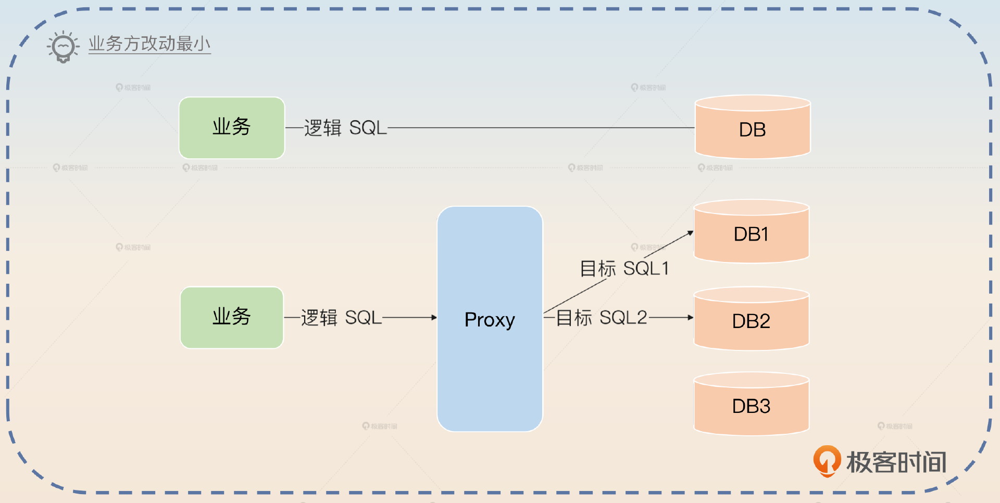

Sidecar 目前还没有成熟的产品，但是从架构上来说它的性能应该介于 SDK 和 Proxy 之间，并且也没有单体故障、集群管理等烦恼。

## 面试准备

在准备分库分表分页查询面试的时候，你还需要弄清楚几个问题。

- 你们公司是如何解决分库分表中的分页问题的？
- 有没有因为排序或者分页而引起的性能问题？如果有，最终是怎么解决的？

你还要去看看公司的监控数据，看看分页查询的响应时间。并且在业务高峰期或者频繁执行分页的时候，看看内存和 CPU 的使用率。这些数据你可以作为分页查询比较容易引起性能问题的证据。

从面试策略上来说，最好是把分页查询优化作为你性能优化的一个举措，你可以进一步和前面几节课里面讲到的查询优化、数据库参数优化相结合，这样你的方案会更加完善，对应地你的能力也会更加全面。

如果面试官问到了数据库性能优化和数据库分页查询，你都可以尝试把话题引导到分页查询上。

## 基本思路

在面试的时候，你可以尝试介绍一下你是如何优化数据库性能的，比如 SQL 本身优化，数据库优化等。然后罗列出你准备的 SQL 案例，说明你在 SQL 优化方面做过哪些事情，比如你说你优化过分库分表的查询，其中最典型的就是优化分页查询。

我们假设之前是全局查询，现在我们采用禁用跨页查询的方案来优化。

> 最开始我在公司监控慢查询的时候，发现有一个分页查询非常慢。这个分页查询是按照更新时间降序来排序的。后来我发现那个分页查询用的是全局查询法，因为这个接口原本是提供给 Web 端用的，而 Web 端要支持跨页查询，所以只能使用全局查询法。当查询的页数靠后的时候，响应时间就非常长。
>
> 后来我们公司搞出 App 之后，类似的场景直接复用了这个接口。但是事实上在 App 上是没有跨页需求的。所以我就直接写了一个新接口，这个接口要求分页的时候带上上一页的最后一条数据的更新时间。也就是我用这个更新时间构造了一个查询条件，只查询早于这个时间的数据。那么分页查询的时候 OFFSET 就永远被我控制在 0 了，查询的时间就非常稳定了。

最后你可以加一个总结。

> 分页查询在分库分表里面是一个很难处理的问题，要么查询可能有性能问题，比如说这里使用的全局查询法，要么就是要求业务折中，比如说我优化后禁用了跨页，以及要求数据平均分布的平均分页法，当然还有各方面都不错，但是实现比较复杂的二次查询法、中间表法。

当面试官追问你其中细节的时候，你就可以这样来引导。

### 全局查询

从理论上来说，我们的分页查询要在全局有序的情况下进行。但是在分库分表之后，要想做到“全局有序”就非常难了。假如说我们的数据库 order\_tab 是以 buyer\_id 除以2的余数（%2） 来进行分表的，如果你要执行一个语句。

```sql
SELECT * FROM order_tab ORDER BY id LIMIT 4 OFFSET 2

```

那么实际执行查询的时候，就要考虑各种数据的分布情况。

- 符合条件的数据全部在某个表里面。在这里就是两种情况，order\_tab\_0 上有全部数据，或者 order\_tab\_1 上有全部数据。

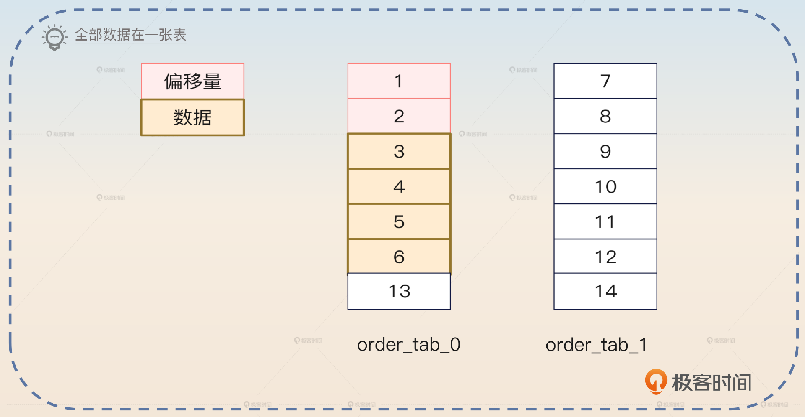

- 偏移量中前面两条全部在一张表，但是符合条件的数据在另外一张表。

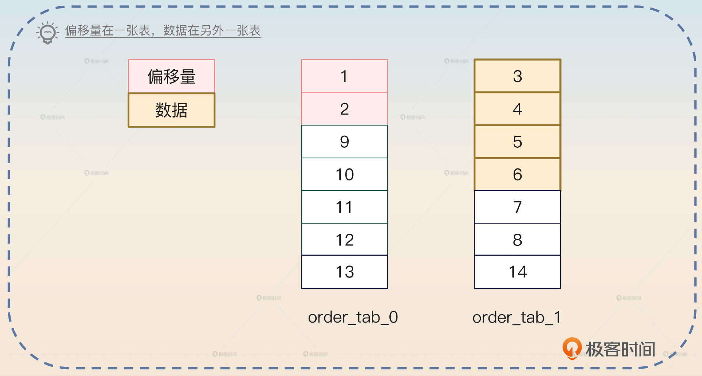

- 偏移量和数据在两张表都有。

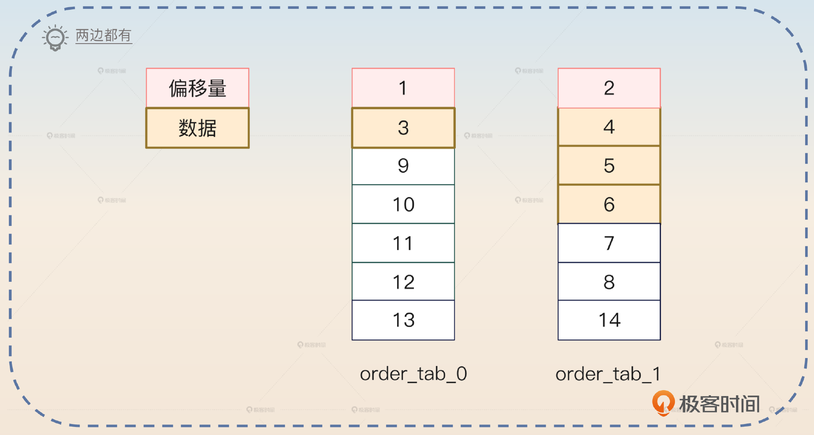

所以在分库分表里面，这样一个 SELECT 语句生成的目标语句是这样的：

```sql
SELECT * FROM order_tab ORDER BY id LIMIT 6 OFFSET 0
SELECT * FROM order_tab ORDER BY id LIMIT 6 OFFSET 0

```

注意看 LIMIT 部分，被修改成了 0、6。用更加通用的形式来描述，就是如果一个分页语句是 LIMIT x OFFSET y 的形式，那么最终生成的目标语句就是 LIMIT x + y OFFSET 0。

```sql
LIMIT x OFFSET y => LIMIT x+y OFFSET 0

```

当分库分表中间件拿到这两个语句的查询结果之后，就要 **在内存中进行排序**，再找出全局的 LIMIT 4 OFFSET 2。

那么你可以先回答这种全局排序的基本思路，抓住关键词 **LIMIT x+y OFFSET 0**。

> 分库分表中间件一般采用的都是全局排序法。假如说现在我们要查询的是 LIMIT x OFFSET y。那么分库分表中间件会把查询改写为 LIMIT x+y OFFSET 0，然后把查询请求发送给所有的目标表。在拿到所有的返回值之后，在内存中排序，并且根据排序结果找出全局符合条件的目标数据。

接下来你可以先从性能问题上刷一个亮点，抓住受影响的三个方面： **网络、内存、CPU**。

> 这个解决方案最大的问题是性能不太好。首先是网络传输瓶颈，比如说在 LIMIT 10 OFFSET 1000 这种场景下，如果没有分库分表，那么只需要传输 10 条数据。而在分库分表的情况下，如果命中了 N 个表，那么需要传输的就是$（1000 + 10）\\times N$ 条数据。而实际上最终我们只会用其中的 10 条数据，存在巨大的浪费。
>
> 其次是内存瓶颈。收到那么多数据之后，中间件需要维持在内存中排序。CPU 也会成为瓶颈，因为排序本身是一个 CPU 密集的操作。所以在 Proxy 形态的分库分表中间件里面，分页查询一多，就容易把中间件的内存耗尽，引发 OOM，又或者 CPU 100%。不过可以通过归并排序来缓解这些问题。

我在这里还留了一个归并排序的引导点，但是面试官如果不擅长分库分表的话，他可能注意不到这个地方，那么你也可以直接回答。关键点就是在拿到数据之后，使用 **归并排序** 的算法。

> 在分库分表里面，可以使用归并排序算法来给返回的结果排序。也就是说在改写为 LIMIT x+y OFFSET 0 之后，每一个目标表返回的结果都是有序的，自然可以使用归并排序。在归并排序的过程中，我们可以逐条从返回结果中读取，这意味着没必要将所有的结果一次性放到内存中再排序。在分页的场景下，取够了数据就可以直接返回，剩下的数据就可以丢弃了。

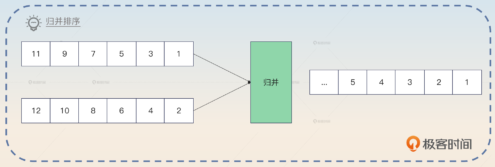

不过既然我们前面说了全局查询这个方案的性能很差，那么有没有其他方案呢？的确有，比如平均分页、禁用跨页查询、换用其他中间件等。不过任何方案都不是十全十美的，这些方案也存在一些难点，有的是需要业务折中，有的处理过程非常复杂。

我们先来看第一个需要业务折中的平均分页方案。

## 平均分页

如果你不了解分库分表，那么看到分页查询的第一个念头应该就是：我能不能在不同的表上平均分页查询数据，得到的结果合并在一起就是分页的结果。

例如，查询中的语句是这样的：

```sql
SELECT * FROM order_tab ORDER BY id LIMIT 4 OFFSET 2

```

因为本身只有两张表，那么我可以改写成这样：

```sql
SELECT * FROM order_tab_0 ORDER BY id LIMIT 2 OFFSET 1
SELECT * FROM order_tab_1 ORDER BY id LIMIT 2 OFFSET 1

```

也就是说，我在每一张表都查询从偏移量 1 开始的 2 条数据，那么合并在一起就可以认为是从全局的偏移量 2 开始的 4 条数据。

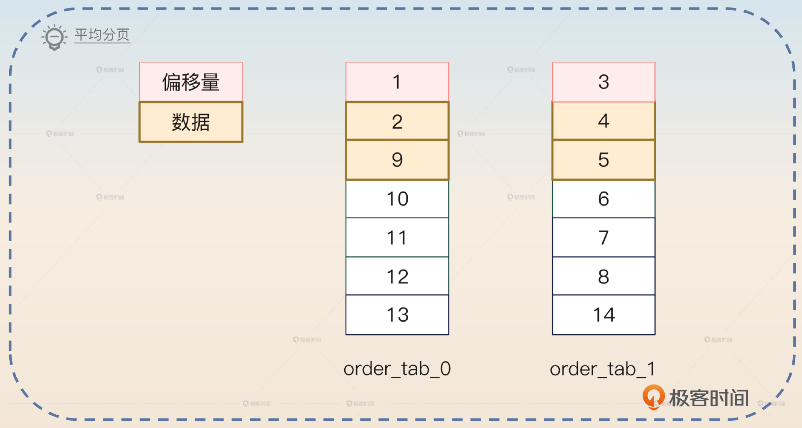

你可以看一下我给出的平均分页图，从图里我们能够看出来，按照道理全局的 LIMIT 4 OFFSET 2 拿到的应该是 3、4、5、6 四条数据。但是这里我们拿到的数据却是 2、4、5、9。这也就是这个方案的缺陷：它存在 **精度** 问题。也就是说，它返回的数据并不一定是全局最精确的数据。

那么这个方案是不是就不能用了呢？并不是的，在一些对顺序、精度要求不严格的场景下，还是可以用的。例如浏览页面，你只需要返回足够多的数据行，但是这些数据具体来自哪些表，用户并不关心。

你在回答的时候，抓住关键词： **平均分页**。

> 在一些可以接受分页结果不精确的场景下，可以考虑平均分页的做法。举个例子来说，如果查询的是 LIMIT 4 OFFSET 2，并且命中了两张目标表，那么就可以考虑在每个表上都查询 LIMIT 2 OFFSET 1。这些结果合并在一起就是 LIMIT 4 OFFSET 2 的一个近似答案。这种做法对于数据分布均匀的分库分表效果很好，偏差也不大。

这个方案还有一个进阶版本，就是根据数据分布来决定如何取数据。假如说你预计你查询的数据有 70% 在 order\_tab\_0，有 30% 在 order\_tab\_1，然后你假设逻辑上的查询是：

```sql
SELECT * FROM order_tab ORDER BY id LIMIT 10 OFFSET 100

```

那么你可以根据数据分布，从 order\_tab\_0 取 70% 的数据，然后在 order\_tab\_1 取 30% 数据，偏移量也是如此。

因此目标 SQL 就是：

```sql
SELECT * FROM order_tab_0 ORDER BY id LIMIT 7 OFFSET 70
SELECT * FROM order_tab_1 ORDER BY id LIMIT 3 OFFSET 30

```

这个进阶版本你可以在前面的基本回答之后进一步补充。

> 更加通用的做法是根据数据分布来决定分页在不同的表上各自取多少条数据。比如说一张表上面有 70% 的数据，但是另一张表上只有 30% 的数据，那么在 LIMIT 10 OFFSET 100 的场景下，可以在 70% 的表里取 LIMIT 7 OFFSET 70，在 30% 的表里取 LIMIT 3 OFFSET 30。所以，也可以把前面平均分配的方案看作是各取 50% 的特例。

那么面试官就可能进一步追问，你怎么知道一张表上有 70% 的数据，另外一张表上有 30%。这个倒是很简单，在开发的时候先用 SQL 在不同的表上执行一下，看看同样的 WHERE 条件下各自返回了多少数据，就可以推断出来了。

不过实际上，能够接受不精确的业务场景还是比较少的。所以我们还有一种业务折中的解决方案，它精确并且高效，也就是禁用跨页查询方案。

### 禁用跨页查询

禁用跨页查询，意思就是要求用户只能从第 0 页开始，逐页往后翻，不允许跨页。比如说从第 3 页跳到第 10 页，这种是不允许的。假如说业务上分页查询是 50 条数据一页。那么发起的查询依次是：

```sql
SELECT * FROM order_tab ORDER BY id LIMIT 50 OFFSET 0
SELECT * FROM order_tab ORDER BY id LIMIT 50 OFFSET 50
SELECT * FROM order_tab ORDER BY id LIMIT 50 OFFSET 100
...

```

所以你可以看到，这里不断增长的只有偏移量。那么有没有办法控制住这个偏移量呢？

答案就是根据 ORDER BY 的部分来增加一个查询条件。在上面的例子里，ORDER BY id 是按照 id 升序排序的，那么只需要在 WHERE 部分增加一个大于上次查询的最大 id 的条件就可以了。

```sql
SELECT * FROM order_tab WHERE `id` > max_id ORDER BY id LIMIT 50 OFFSET 0

```

max\_id 就是你上一批次的最大 id。

反过来，如果 ORDER BY 是降序的，比如 ORDER BY id DESC，那么对应的 SQL 就变成这样：

```sql
SELECT * FROM order_tab WHERE `id` < min_id ORDER BY id LIMIT 50 OFFSET 0

```

min\_id 就是上一批次里最小的 id。

即便 ORDER BY 里面使用了多个列，规则也是一样的。

总的来看，你的回答要分成两部分，第一部分介绍基本做法，关键词是 **拿到上一批次的极值**。

> 目前比较好的分页做法是禁用跨页查询，然后在每一次查询条件里面加上上一次查询的极值，也就是最大值或者最小值。比如说第一次查询的时候 ORDER BY ID LIMIT 10 OFFSET 0，那么下一页，就可以改成 WHERE id > max\_id ORDER BY ID LIMIT 10 OFFSET 0。在现在的手机 App 里这个策略是非常好用的，因为手机 App 都是下拉刷新，天然就不存在跨页的问题。

第一部分你提到了极值，那么面试官就可能问你什么时候用最大值，什么时候用最小值。你就可以这样说：

> 至于用最大值还是用最小值，这个取决于 **ORDER BY**。总的原则就是升序用最大值，降序用最小值。如果 ORDER BY 里面包含了多个列，那么针对每一个列是升序还是降序，来确定使用最大值还是使用最小值。

这种方案在实践中使用得非常广泛。不过我们还有一个更加简单粗暴的方案，既然分库分表难以处理分页的问题，那么干嘛不直接换用其他中间件呢？

### 换用其他中间件

这个思路可以说是非常直接了，既然分库分表导致了分页很困难，那么我就换一个不需要分库分表的中间件不就好了吗？也可以，换中间件也有两种思路。

第一种思路是用 NoSQL 之类的来存储数据。比如说使用 Elasticsearch、ClickHouse。另外一种思路是使用分布式关系型数据库。这其实就相当于你把分页的难题抛给了这些数据库，性能如何就取决于你最终选择了哪个分布式关系型数据库。

上面这些方案不管是从实际，还是从理论上，都有各自的特色。下面我们再往前一步，看看还有哪些比较好用且有亮点的方案。

## 亮点方案

这里我提供两个亮点方案。第一个是二次查询。实际上它应该是一个常见的方案，但是因为过于复杂所以能够记住并且把原理讲清楚，本身就是一件不容易的事情。第二个是引入中间表。这个方案从复杂度上来说是不如二次查询的，但是它比较罕见，也就是说面经里面会提到这个方案的比较少。

### 二次查询

二次查询的基本理念是先尝试 **获得某个数据的全局偏移量，然后再根据这个偏移量来计算剩下数据的偏移量**。这里我用一个例子来阐述它的基本原理，再抽象出一般步骤。

假设说我们的查询依旧是：

```sql
SELECT * FROM order_tab ORDER BY id LIMIT 4 OFFSET 4

```

数据分布如图所示：

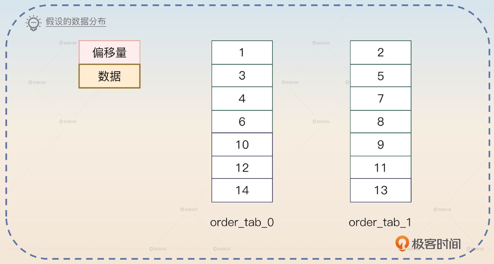

全局上的 LIMIT 4 OFFSET 4 是 5、6、7、8 四条数据。

#### 步骤一：首次查询

我们把SQL语句改写成这样：

```sql
SELECT * FROM order_tab_0 ORDER BY id LIMIT 4 OFFSET 2
SELECT * FROM order_tab_1 ORDER BY id LIMIT 4 OFFSET 2

```

注意，这里我们只是把 OFFSET 平均分配了，但是 LIMIT 没变。

那么我们第一次查询到的数据是怎样的呢？你可以看一下图片。

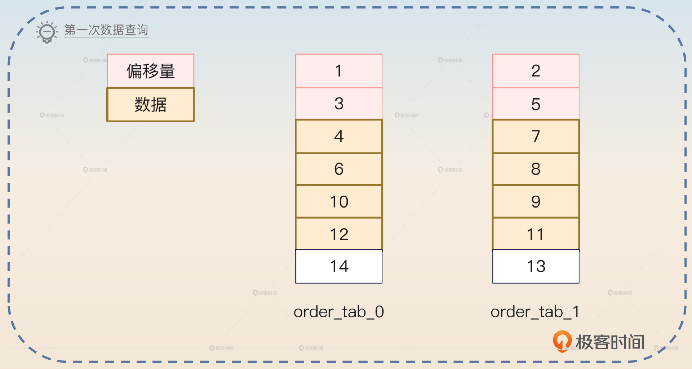

order\_tab\_0 拿到了 4、6、10、12，而 order\_tab\_1 拿到了 7、8、9、11。

#### 步骤二：确认最小值

很明显，上一步返回的查询数据里面，id 最小的是 4，来自 order\_tab\_0。

#### 步骤三：二次查询

这一次查询需要利用上一步找出来的最小值以及各自分库的最大值来构造 BETWEEN 查询。改写得到的 SQL 是：

```sql
SELECT * FROM order_tab_0 WHERE id BETWEEN 4 AND 12
SELECT * FROM order_tab_1 WHERE id BETWEEN 4 AND 11

```

结果：

- order\_tab\_0 返回 4、6、10、12。
- order\_tab\_1 返回 5、7、8、9、11，也就是多了 1 条数据，记住这一点。

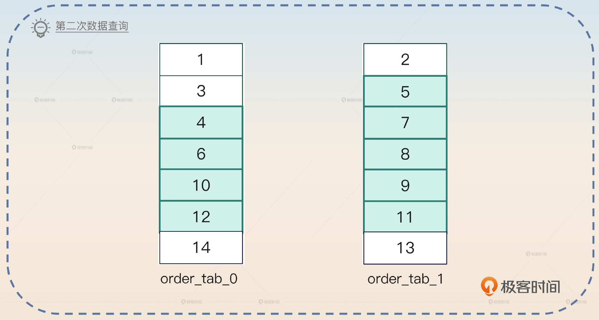

取过来的所有数据排序之后就是 4、5、6、7、8、9、10、11、12。

#### 步骤四：计算最小值的全局偏移量

这是最难理解的一步，你抓住核心： **根据 BETWEEN 中多出来的数据量来推断全局偏移量**。现在我们知道 4 在 order\_tab\_0 中的偏移量是 2，也就是说比 4 小的数据有 2 条。在 BETWEEN 查询里面，order\_tab\_1 返回的结果是 5、7、8、9、11，7 在第一次查询里面的偏移量是 2，所以 5 的偏移量是 1。也就是说，5 的前面只有一条比 4 小的数据。

那么 4 在 order\_tab 中的全局偏移量就是 3（2+1），换一句话来说，就是 4 前面有三条数据。

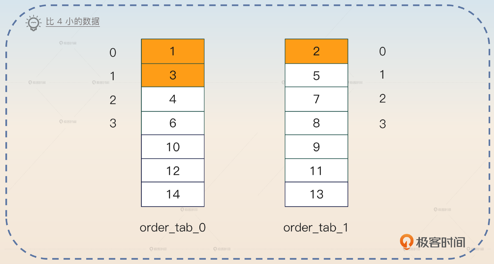

那么加上 4 本身，刚好构成了 OFFSET 4，因此就是从 5 开始取，往后取 4 条数据。

#### 小结

现在我抽象地说一下这个算法。假设你的分库分表总共有 N 个表，查询是 LIMIT X OFFSET Y，那么：

1. 首先发送查询语句 LIMIT X OFFSET Y/N 到所有的表。
2. 找到所有返回结果中的最小值（升序），记为 min。
3. 执行第二次查询，关键是 BETWEEN min AND max。其中 max 是在第一次查询的数据中每个表各自的最大值。
4. 根据 min、第一次查询和第二次查询的值来确定 min 的全局偏移量。总的来说，min 在某个表里面的偏移量这样计算：如果第二次查询比第一次查询多了 K 条数据，那么偏移量就是 Y除以N 减去 K。然后把所有表的偏移量加在一起，得到的就是 min 的全局偏移量。
5. 根据 min 的全局偏移量，在第二次查询的结果里面向后补足到 Y，得到第一条数据的位置，再取 X 条。

上面的这些步骤太难记忆了，这里我给你一个简化版本。

1. 首次查询，拿到最小值。
2. 二次查询，确认最小值的全局偏移量。
3. 在二次查询的结果里根据最小值取到符合偏移量的数据。

就像我说的，这个部分难以理解，所以你在面试回答的时候，可以尝试回答 **最简版本**。如果面试官继续发问，你就可以通过前面的例子来进一步解释。

### 引入中间表

引入中间表的意思是额外存储一份数据，只用来排序。这个方案里面就是在中间表里 **加上排序相关的列**。


> 排序是一个非常常见的需求，那么就可以考虑引入一个中间表来辅助排序。比如说在使用更新时间来排序的时候，在中间表里面加上更新时间。查询的时候先在中间表里面查到目标数据，然后再去目标表里面把全部数据都查询出来。

这个方案也是有缺点的，你可以进一步指出来。

> 这个方案有两个明显的缺陷，一个是 WHERE 也只能使用中间表上的列；另外一个是维护中间表也会引入数据一致性的问题。

对于第一个缺陷，面试官应该没什么好问的。但是第二个缺陷，也是一个鱼饵，不出意外面试官就会追问怎么解决这个数据一致性的问题。

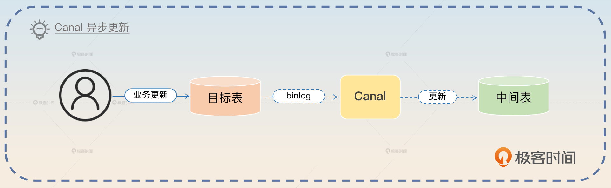

> 比较简单的做法就是业务保持双写，也就是写入目标表也写入中间表。不过这里我更加建议使用 Canal 之类的框架来监听 binlog，异步更新中间表。这样做的好处是业务完全没有感知，没有什么改造成本。更新的时候可以考虑引入重试机制，进一步降低失败的几率。

这个回答可能会把话题引向我们前面学过的 binlog，你做好准备就可以。

这里你还需要注意，面试官可能进一步问你，如果更新中间表经过重试之后也失败了，怎么办？这时候并没有更好的办法，无非就是引入告警，然后人工介入处理。

最后你可以再总结一下这个方案。

> 这个方案是一个依赖最终一致性的方案，在强调强一致性的场景下并不是很合适。

## 面试思路总结

这一节课内容也有点多，我们再来捋一捋。基础知识的部分你需要掌握分库分表的一般做法：哈希分库分表、范围分库分表和中间表分库分表。还有分库分表中间件的形态：SDK、Proxy 和 Sidecar。

我们还重点讨论了分页的解决思路，分别是：

1. 全局查询：注意它的性能问题，以及用归并排序缓解性能问题。
2. 平均分页：注意根据数据分布来分页的一般算法。
3. 禁用跨页查询：这在实践中非常常用，基本没什么缺点。
4. 换用其他中间件：需要你了解对应的中间件。

最后我还给出了两个亮点方案，一个是二次查询，这个方案很复杂，所以你需要多花一点精力，在面试前多模拟练习一下。另一个是引入中间表：这个方案并不复杂，只是因为罕见所以适合拿来面试。

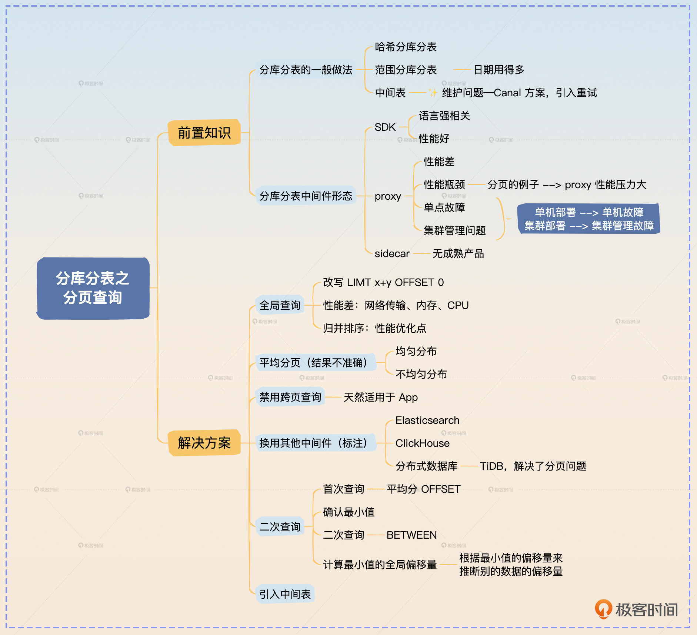

## 思考题

学而不思则罔，最后我给你留两道思考题。

- 如果查询里面有 GROUP BY，其实会影响到分页的执行。你可以说说假如GROUP BY刚好是根据分库分表键来进行的，分页可以怎么执行呢？不然的话又该怎么执行呢？
- 我在这里用的例子都是哈希分表的，那么在使用范围分库分表的情况下，分页查询执行又有一些不同，你能说一下范围查询的做法会有怎样的区别吗？我可以给你一些提示，要注意 ORDER BY 和分库分表键，还要注意 GROUP BY。

欢迎你把你思考后的答案分享到评论区，和我一起讨论，也欢迎你把这节课分享给需要的朋友，我们下节课再见！