# 18｜分布式事务：如何同时保证分库分表、ACID和高性能？
你好，我是大明。

我们在把单库拆分成为分库分表之后，一个巨大的挑战就是 **本地事务变成了分布式事务**。事实上，即便没有分库分表，在微服务架构之下我们也还是会面临分布式事务的问题。所以，在学习了微服务架构又学习了分库分表之后，是时候深入讨论一下分布式事务了。

分布式事务在面试中是一把双刃剑，用得好，那么会是一个非常强的加分项。但是如果你基础不够扎实，见闻不够广博，面分布式事务很容易翻车，所以熟练掌握分布式事务很重要。

希望你学完这节课的内容之后可以自信地在简历里写上精通分布式事务这一条，提高简历通过筛选的几率，同时也在面试过程中刷出亮点，给面试官留下深刻印象。

## 前置知识

关于分布式事务，首先你需要弄清楚一个东西，就是分布式事务既可以是纯粹多个数据库实例之间的分布式事务，也可以是跨越不同中间件的业务层面上的分布式事务。前者一般是分库分表中间件提供支持，后者一般是独立的第三方中间件提供支持，比如 Seata。你在面试的时候，要根据上下文确定面试官问你的分布式事务是哪一类，然后有针对性地回答。

要学习分布式事务，我们要先学习分布式事务中几个比较常用的协议。

### 两阶段提交

两阶段提交协议（Two Phase Commit）是分布式事务中的一种常用协议，算法思路可以概括为参与者将操作成败通知协调者，再由协调者根据所有参与者的反馈情况决定各参与者要提交操作还是中止操作。

它可以分为两个阶段：准备阶段和提交阶段。

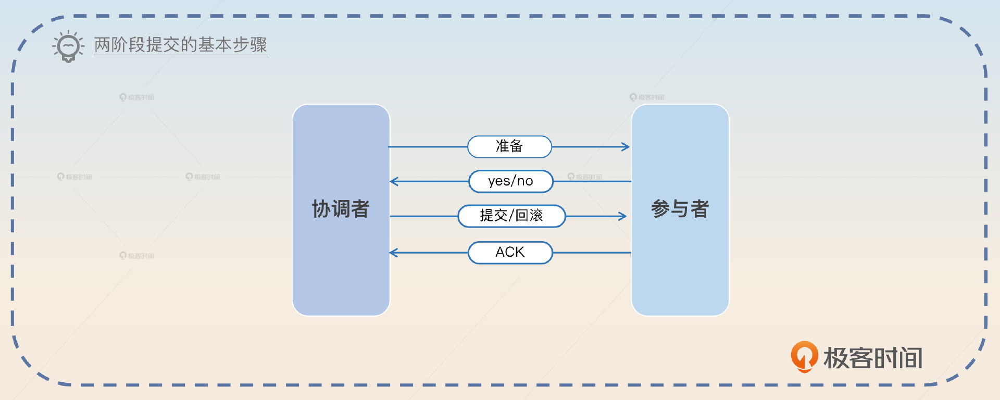

1. 准备阶段， **协调者让参与者执行事务，但是并不提交，协调者返回执行情况。** 这个阶段参与者会记录 Redo 和 Undo 信息，用于后续提交或者回滚。
2. 提交阶段，协调者根据准备阶段的情况，要求参与者提交或者回滚，参与者返回提交或者回滚的结果。准备阶段任何一个节点执行失败了，就都会回滚。全部执行成功就提交。

两阶段提交协议的缺点很多。最大缺点是 **在执行过程中节点都处于阻塞状态**。也就是节点之间在等待对方的响应消息时，什么也做不了。特别是如果某个节点在已经占有了某项资源的情况下，为了等待其他节点的响应消息而陷入阻塞状态时，当第三个节点尝试访问该节点占有的资源时，这个节点也会连带着陷入阻塞状态。

此外，协调者也是关键，如果协调者崩溃，整个分布式事务都无法执行。所以，如果协调者是单节点，那么就容易出现单节点故障。而且协调者采用保守策略，如果一个节点在第一阶段没有返回响应，那么协调者会执行回滚。所以这可能会引起不必要的回滚。

而这里有一个问题，很少有人会想到。如果在第二阶段，协调者发送 Commit 的时候，参与者没有收到，会怎样？那么协调者会不断重试，直到请求发送成功。

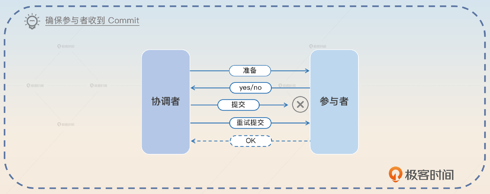

但是如果参与者已经收到了 Commit 请求，但是在提交之前就宕机了又该怎样呢？

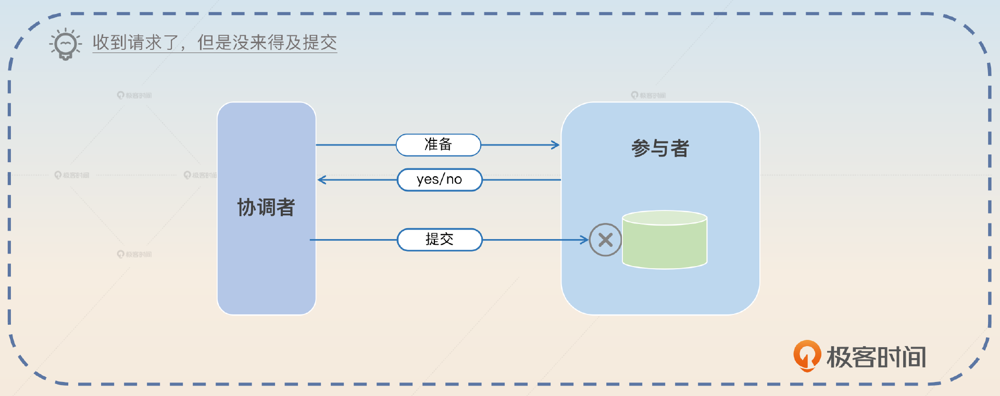

参与者在恢复过来之后会查看自己本地的日志，看有没有收到 Commit 指令，如果已经收到了，就会使用 Redo 信息来提交事务。

总的来说，两阶段提交协议是分布式事务中最常用的协议之一，它可以有效地保证 **分布式事务的一致性和可靠性。**

### 三阶段提交

三阶段提交协议是在两阶段提交协议的基础上进行的改进，三阶段提交协议引入了一个额外阶段来确保在执行事务之前有足够的资源，减少两阶段协议引起的事务失败的可能。

在两阶段协议里面，比较容易出现的一个情况就是参与者在准备阶段辛辛苦苦把 Redo、Undo 写好，结果另外一个参与者说自己这边执行不了事务，要回滚。那么这个参与者就白费功夫了。

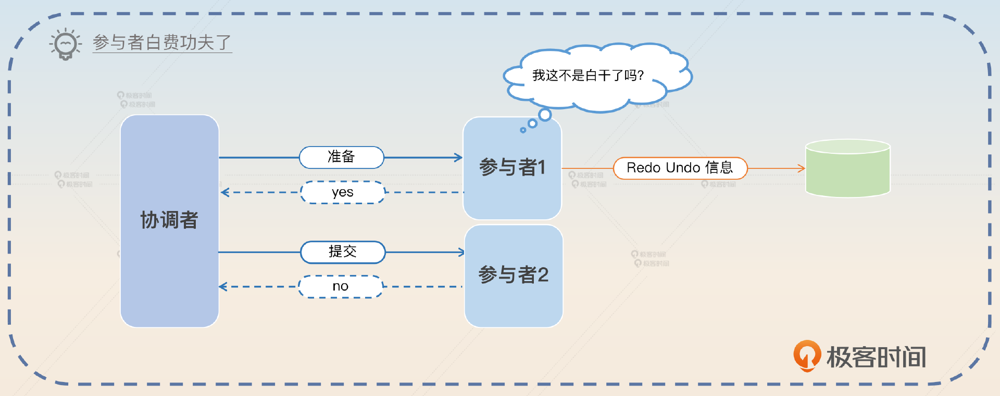

因此在两阶段提交的基础上，三阶段提交引入了一个新阶段，协调者会先问一下参与者能不能执行这个事务。所以整个三阶段提交协议的三个阶段是这样的：

1. 第一阶段（CanCommit）：协调者问一下各个参与者能不能执行事务。参与者这时候一般是检查一下自己有没有足够的资源。
2. 第二阶段（PreCommit）：类似于两阶段提交的第一个阶段，执行事务但是不提交。
3. 第三阶段（Commit）：直接提交或者回滚。

目前看来，三阶段提交协议并没有两阶段提交协议使用得那么广泛，原因有两个，一是两阶段提交协议已经足以解决大部分问题了，二是三阶段提交协议的收益和它的复杂度比起来，性价比有点低。

### XA 事务

XA 事务遵循了两阶段提交协议。我个人认为，两阶段协议是一种学术理论，而 XA 则是把两阶段提交协议具像化之后的一个标准。它定义了协调者和参与者之间的接口。用专业的术语来说，就是定义了事务管理器（Transaction Manager）和资源管理器（Resource Manager）之间的接口。

## 小结一下

这里我讲一个稍微有点争议的事情，也就是 XA 是否满足 ACID。我注意到网上有一部分人认为 XA，或者说两阶段提交协议，有数据一致性的问题，但是也有人认为 XA 是满足 ACID 的。

我在两阶段提交那里说到在提交阶段，协调者会不断重试直到把 Commit 请求发送给协调者；协调者如果在提交阶段中途崩溃，也要确定是否需要提交或者回滚。那么你就应该可以理解，在重试成功之前，或者在协调者恢复过来重新提交或者回滚之前，数据是 **不一致** 的。

所以我 **个人** 倾向 XA 不满足 ACID。但是相比其他的方案，它更加接近 ACID。

## 面试准备

关于分布式事务，你在公司需要弄清楚几个问题：

1. 如果公司使用了分库分表，那么是否允许跨库事务？
2. 如果允许跨库事务，那么是如何解决的？
3. 如果你使用了分库分表中间件，那么它支持哪些类型的事务？
4. 在微服务层面上，使用的是什么样的分布式事务方案？是 TCC、SAGA 还是 AT？
5. 当你在使用分布式事务的时候，中间步骤出错了你怎么办？

此外，你最好收集一些实际的案例，在面试的时候作为证据。

正常来说，在面试微服务架构的时候就有可能面到分布式事务。面试官可能会问这两个问题。

1. 在单体应用拆分成微服务架构之后，你怎么解决分布式事务？
2. 你们的服务是共享一个数据库吗？如果不是的话，你们怎么解决分布式事务问题？

当然，在分库分表里面也会有类似的问法。

- 在单库拆分之后，你怎么解决分布式事务问题？
- 当你开启一个事务的时候，分库分表中间件做了什么？
- 怎么在分库分表的事务里面保证 ACID？

有些时候面试官不会直接问分布式事务，而是问你数据一致性的问题，其实基本上也是问的分布式事务。他可能这样问：“如果你的 DELETE 语句，经过分库分表之后要删除多张表的数据，那你怎么保证数据一致性？”所以对于数据一致性的问题，你也要做好准备。

其实面试翻车的一个主要原因就是你不熟悉各种异常情况的处理方案，所以在接下来我给你介绍的各种方案里面，容错都是一个比较重要的部分，也是你用来刷亮点的部分。

## 基本思路

一句话总结，就是既想要 ACID，又想要分布式事务，以目前的条件来说基本不可能。所以所有解决分布式事务的方案，立足点都是最终一致性。因此不管从哪里提到了分布式事务，如果面试官问起来，你都可以先从理论上强调这一点，关键词是 **最终一致性**。

> 分布式事务或者说跨库事务基本上都只能依赖于最终一致性，ACID 是不太可能的。比如说常见的 TCC、AT、SAGA，又或者比较罕见的延迟事务，其实都是追求最终一致性。

这里提到了 TCC、AT 和 SAGA 这些比较具体的方案，你就可以根据后面的内容来进一步解释，或者等面试官询问。

注意，如果面试官认为 XA 是支持 ACID 的，那么他可能会问：“难道没有什么能够保证 ACID 吗？”通过这种问题你就可以知道面试官的倾向了，那么你就可以抛开个人立场，回答 XA 事务。

> 有，XA 事务可以看作支持 ACID。

如果面试官直接问 XA，那么你就可以按照自己的真实想法来回答。

### TCC 事务

TCC 是一个追求最终一致性，而不是严格一致性的事务解决方案，它不满足 ACID 要求。TCC 是 Try-Confirm-Cancel 的缩写，它勉强也算是两阶段提交协议的一种实现。

- Try：对应于两阶段提交协议的准备阶段，执行事务但是不提交。
- Confirm：对应于两阶段提交协议第二阶段的提交步骤。
- Cancel：对应于两阶段提交协议第二阶段的回滚步骤。

之所以给它一个新名字，完全是因为 TCC 强调的是业务自定义逻辑。也就是说 Try 是执行业务自定义逻辑，Confirm 也是执行业务自定义逻辑，Cancel 同样如此。

TCC 在微服务架构里面比较常用，Try 对应一个微服务调用，Confirm 对应一个微服务调用，Cancel 也对应一个微服务调用。不过一些分库分表中间件也支持 TCC 模式，但是比较罕见。

接下来你可以从两个角度深入讨论。

#### 亮点一：TCC 与本地事务

其实在微服务架构中Try-Confirm-Cacel 都对应一个微服务调用，你就可以猜测到，TCC 的任何一个步骤都可以是 **本地事务**，所以你可以这样说：

> 在 TCC 里面，Try 可以是一个完整的本地事务，Confirm 也可以是一个完整的本地事务，Cancel 同样可以是一个完整的本地事务。

然后你可以用这个例子补充说明。

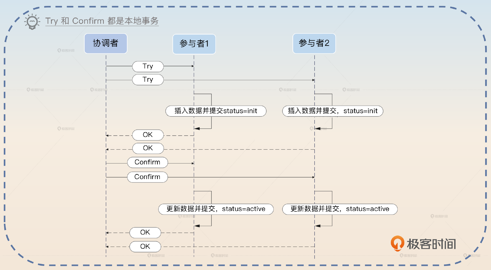

> 比如在我的某个业务里面，Try 本身就是插入数据，但是处于初始化状态，还不能使用。后续 Confirm 的时候就是把状态更新为可用，而 Cancel 则是更新为不可用，当然直接删除也是可以的。

不过 TCC 怎样都是会出错的，比如说在 Confirm 阶段出错或者出现超时，所以你是搞不清楚究竟有没有提交的。这里你可以补一句，引出下面的亮点。

> TCC 用起来还是比较简单的，但是要想做好容错还是很不容易的。

#### 亮点二：容错

实际上，正如我之前好几次提到的，容错很多时候就是重试，重试失败之后人工介入或者引入自动故障处理机制，后续尝试修复数据。

面试的时候我们需要一步步分析，首先要 **分析出错的场景**。

> 正常来说，TCC 里面 T 阶段出错是没有关系的。比如说前面的那个例子里，数据处于初始化状态的时候，其实后续业务是用不了的，也就不会有问题。但是如果在 Confirm 的时候出错了，问题就比较严重了。比如说一部分业务已经将数据更新为可用了，另外一部分业务更新数据为可用失败，那么就会出现不一致的情况。

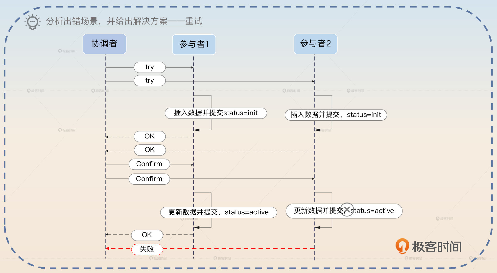

紧接着讲解决方案，关键词是 **重试。**

> 基本上这里就是只能考虑不断重试，确保在 Confirm 阶段都能提交成功。毫无疑问，不管怎么重试，最终都是要失败的，所以要做好监控和告警的机制。

这里我们提到了重试最终都可能失败，所以紧接着你就要进一步补充重试失败了之后怎么办。我给你两个方案，第一个方案是 **异步比较数据并修复。**

> 我在后面搞了一个离线比对数据并修复的方案，就是用来查找这种相关联的数据的，一部分数据还处于初始化状态，但是一部分数据已经处于可用状态，然后修复那部分初始化的数据。

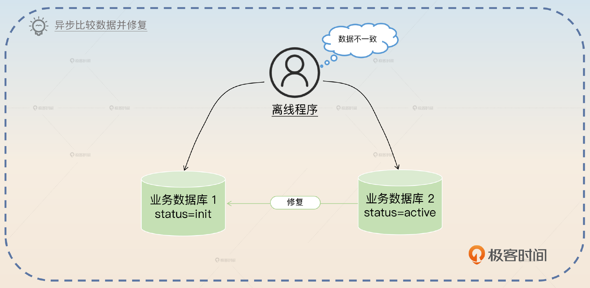

另外一个方案则是在读取数据的时候，如果发现数据不一致，那么就 **丢弃这个数据，同时触发修复逻辑。**

> 在一些业务场景下，读请求是能够发现这种数据不一致的。那么它就会立刻丢弃这个数据，并且触发修复程序。

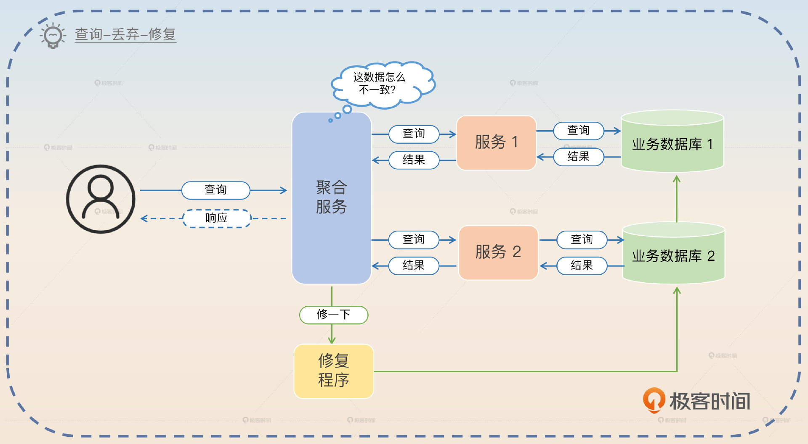

到这里 TCC 你已经讨论得比较深入了。接下来你可以考虑尝试把话题引到 SAGA。

> TCC 整体来说是追求最终一致性的，和它类似的是 SAGA 事务，也是一个追求最终一致性的事务解决方案，也不满足 ACID 的要求。

### SAGA 事务

SAGA 的核心思想一句话就可以说明白，就是把业务分成一个个步骤，当某一个步骤失败的时候，就 **反向补偿** 前面的步骤。

很多人在介绍 SAGA 的时候会用回滚这个词来取代反向补偿，但是我认为这会让你误解 SAGA，所以我这里就用反向补偿这个词。

我举一个例子，某个步骤是插入数据，如果是回滚的话，那么是指插入的时候没有提交，然后在业务失败的时候回滚。如果是反向补偿的话，那么是指插入的时候已经提交了，然后在业务失败的时候执行删除。

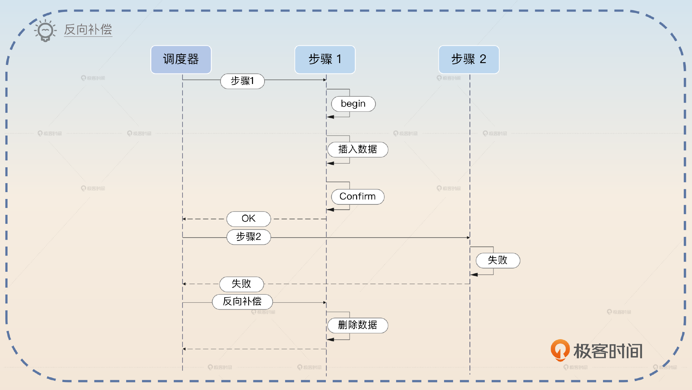

在聊到 SAGA 的时候，你可以简单介绍一下 SAGA 的基本理念，关键词是 **反向补偿**。

> SAGA 的核心思想是反向补偿事务中已经成功的步骤。比如说某个业务，需要在数据库1 和数据库 2 中都插入一条数据，那么在数据库 1 插入之后，数据库 2 插入失败，那么就要删除原本数据库 1 的数据。但是要注意，在最开始数据库 1 插入的时候，事务是已经被提交了的。

大部分人没有使用过 SAGA。我这里给出我曾经使用过一个实现比较复杂但是理论很简单的 SAGA 调度机制，你可以用来刷亮点，关键词是 **并发调度**。

> 早期我设计过一个比较复杂的 SAGA 机制，它支持并发调度。也就是说如果整个分布式事务中有可以并发执行的步骤，那么就并发执行，在后续出错的时候，这些并发执行的步骤也可以并发反向补偿。

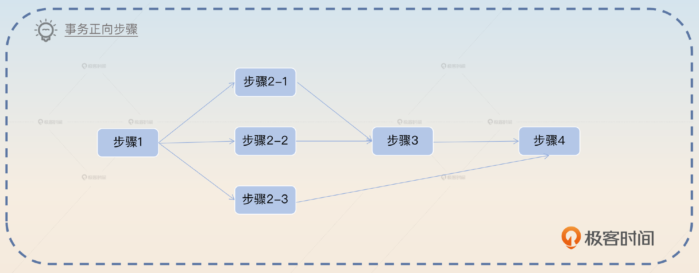

SAGA 本身也是需要考虑容错的，难点就是在反向补偿的时候失败了怎么办？比如说在前面的例子里，你准备删除数据的时候失败了。那么还是没有特别好的办法，无非就是不断重试，这一部分你可以参考 TCC 中讨论的容错内容。

在讲完容错之后，紧接着你可以尝试把话题引导到 AT。

> 我个人认为最近比较流行的 AT 模式可以看作是 SAGA 的一种特殊形态，或者说简化形态。

### AT 事务

AT 是指如果你操作很多个数据库，那么分布式事务中间件会帮你生成这些数据库操作的反向操作。

这就有点类似于 undo log。比如说你数据库操作是一个 INSERT，那么对应的反向补偿操作就是 DELETE 了。你在回答的时候就可以结合 undo log 一起回答，顺便把话题引导到 undo log 上。

> AT 模式的核心是分布式事务中间件会帮你生成数据库的反向操作，比如说 INSERT 对应的就是 DELETE，UPDATE 对应的就是 UPDATE，DELETE 对应的就是 INSERT。这个机制有点类似于 undo log。

同样地，AT 事务也有容错的问题，它的容错和 SAGA 一样，都是在反向补偿的时候出错了该怎么办。这里我就不赘述了，你可以参考前面的内容。

在回答了这些内容之后，你还可以进一步强调可以考虑禁用跨库事务。

> 如果是单纯使用分库分表，不涉及多个服务的分布式事务，可以考虑直接禁用跨库事务，一了百了。

### 禁用跨库事务

在实践中，解决分库分表中的分布式事务问题，最简单的方式就是直接禁用跨库事务。正常来说，在分库分表之后，你的业务就应该操作特定的某个数据库中的某个表。最多就是操作某个数据库上的某几张表，跨库本身就是一个不好的实践。

所以可以从公司规范上直接禁用了跨库事务。

> 我们公司是直接禁止跨库事务。所以在分库分表之后我们要做的就是改造业务代码，确保不会出现跨库事务。

但是这样又有点太牵强了，那么你接下来就可以补充说明如果真的要使用跨库事务，你可以怎么解决，也就是把话题引导到延迟事务这个方案方案上。

## 亮点方案：延迟事务

这算是分库分表中间件经常采用的方案。从理论上来说这个方案其实并不比 SAGA 复杂，但是 TCC、SAGA 和 AT 属于烂大街的答案，你拉不开差距，而延迟事务可以。

在分库分表中间件眼里，当你执行 Begin 的时候，它是无法预测你接下来会在哪些数据库上面开启事务的。

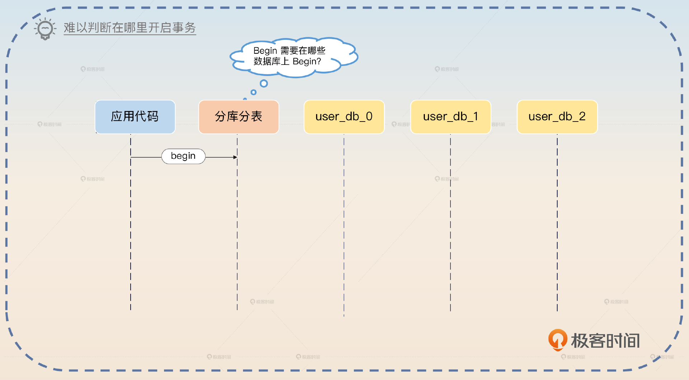

比如说，在同一个场景下，某个请求过来，你处理的时候在分库分表中间件上调用了 Begin 方法，这个请求最终在 user\_db\_0 和 user\_db\_1 上开启了事务；但是另外一个请求过来，因为参数不同，它可能最终在 user\_db\_2 上开启了事务。

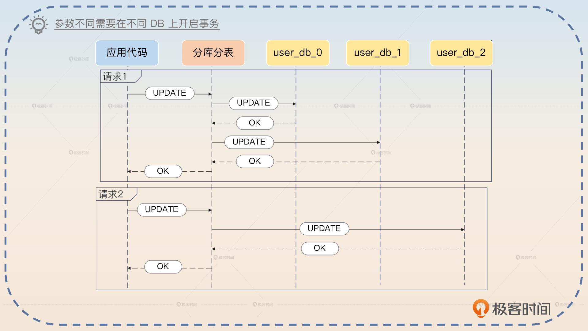

所以中间件只有两个选择，要么在 Begin 的时候就在全部数据库上开启事务，要么就是延迟到执行具体 SQL 的时候，知道要在哪些数据库上执行，再去开启事务。

而在 Begin 的时候就直接开启事务过于粗暴，毕竟后面有些 DB 根本不会有任何查询。

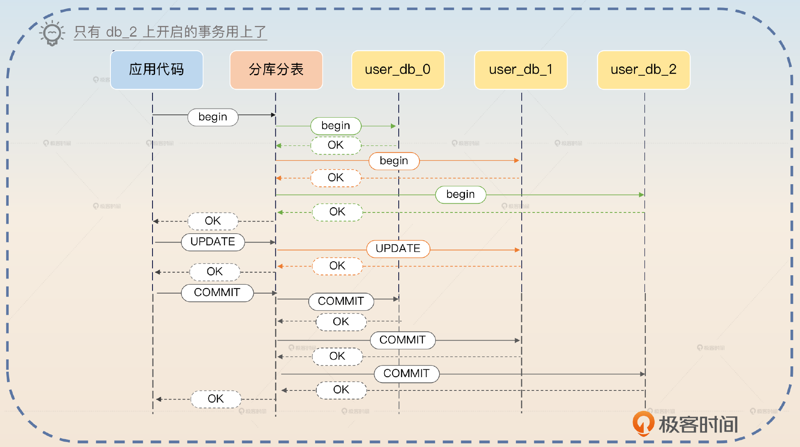

因此，延迟事务应用更加广泛，它可以避免在用不上的数据库上开启事务的问题。

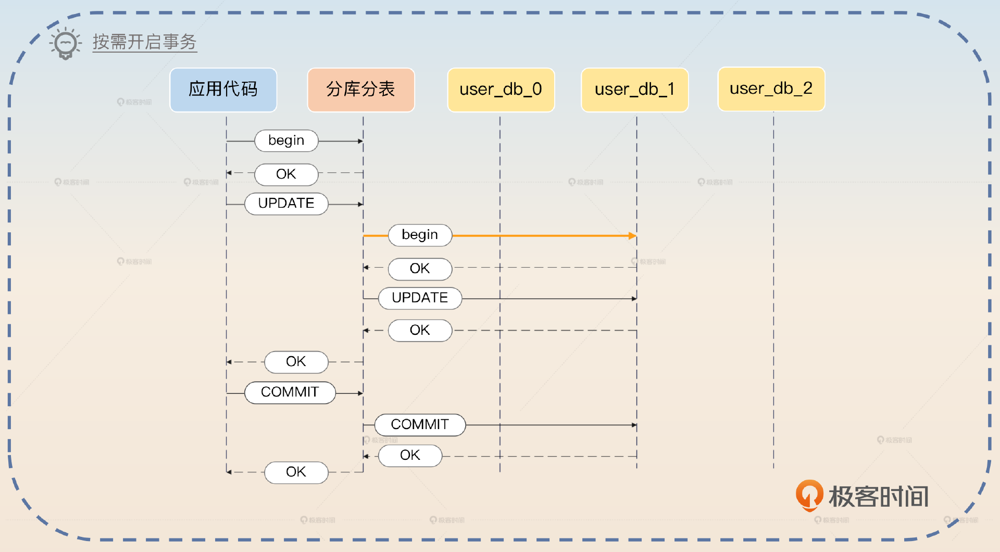

这时候，你就可以对比 **全开事务** 和 **延迟事务** 这两种思路。

> 默认情况下，我们使用的是延迟事务。在正常的情况下，当我们执行 Begin 的时候，其实并不知道后续事务里面的查询会命中哪些数据库和数据表，那么只有两个选择，要么 Begin 的时候在所有的分库上都开启事务。但是这会浪费一些资源，毕竟事务不太可能操作所有的库，因此才有了延迟事务。也就是在 Begin 的时候，分库分表中间件并没有真的开启事务，而是直到执行 SQL 的时候，才在目标数据库上开启事务。
>
> 举例来说，如果 SQL 命中了数据库 db\_0，这个时候 db\_0 还没有开始事务，那么就会直接开启事务，然后执行 SQL；如果又来了一个 SQL，再次命中了 db\_0，此时 db\_0 上已经开启了事务，因此直接使用已有的事务。在提交或者回滚的时候，就提交或者回滚所有开启的事务。不过提交或者回滚的时候，部分失败的问题比较难以解决。

这里你故意提到了部分失败的问题，是为了引导面试官进一步问。所谓部分失败是指在 COMMIT 的时候，某些数据库 COMMIT 成功了，但是另外一些数据库 COMMIT 失败了怎么办？当然，回滚也有类似的问题。

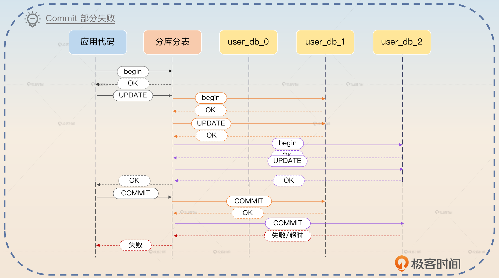

其实这里没有完美的解决方案，只能 **考虑重试，** 类似于在讨论 TCC、SAGA 和 AT 的时候那样。

> 部分失败并没有更好的解决办法。我们这里就是在 Commit 的时候，如果发现某个数据库失败了，那么会立刻发起重试。如果连续重试失败，就会触发告警，人工介入处理。

这里我再给出一个处理重试失败的高级方案。你可以用我们在高可用微服务架构里面提到的 **自动故障处理机制**。

> 在重试失败的时候，最开始我们公司就是告警，然后人手工介入处理。后来我改进了这个机制，引入了自动故障处理机制。也就是说如果一个事务里面部分数据库提交或者回滚失败，触发告警，然后自动故障处理机制就会根据告警的上下文来修复数据。
>
> 修复数据本身分成两种，一种是用已经提交的数据库的数据来修复没有提交成功的数据库的数据；另外一种则是用没有提交成功的数据库的数据来还原已经提交的数据库的数据。具体采用哪种，根据业务来决定。
>
> 在我引入这个机制之后，很多业务都接入了自己的自动修复逻辑，整体上数据出错之后的持续时间和出错本身的比率都大幅度下降了，系统可用性提升到了三个九。

实际上，这种自动修复的逻辑是跟业务强相关的，所以你可以提供一些简单的通用处理机制，但是如果比较复杂的话，就需要业务方来控制如何修复了。

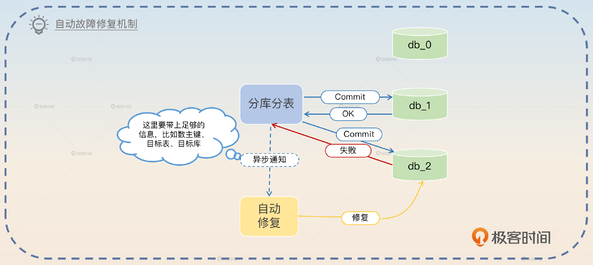

## 面试思路总结

这一节课你需要掌握 **两阶段提交协议、三阶段提交协议和 XA 协议的基本步骤这几个重要的知识点**。到分布式事务的具体解决方案上，如果是跨服务的分布式事务，那么可以考虑 **TCC、SAGA 和 AT**。你在回答的时候尤其要注意讨论容错部分。

容错基本上就是重试，重试失败之后就有三种方案，分别是：

- 监控\+告警 \+ 人手工介入处理；
- 读请求 \+ 数据修复；
- 监控 \+ 告警 \+ 故障自动处理。

如果是单纯的分库分表跨库事务，那么可以考虑延迟事务，同时它也是我给你提供的亮点方案。

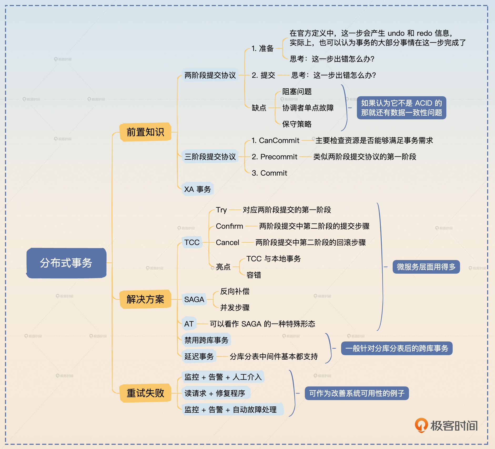

此外，这一节课我又演示了一个面试小技巧，就是顺着面试官的立场回答。在我们的技术领域，并不是所有答案都有对错之分，有一些是立场之分、偏好之分。如果你摸不清面试官的偏向，你就按照自己的本心回答。如果你的回答面试官不满意，也就是你的偏向和他的偏向不一致，他一路杠到底，你就直接认怂。

不太建议你和面试官杠到底，毕竟你出去面试，遇到一个什么样的面试官是未知数，而人往往喜欢和自己相似的人。你也不用觉得丢人，毕竟 **面试求职生存下来是王道，挣钱嘛，不寒碜**。

## 思考题

最后你来思考2个问题。

- 在 XA 事务里面，我提到了一个有点争议的点，即 XA 究竟算不算满足了 ACID，你是怎么看这个问题的？欢迎你分享自己的观点。
- 在分布式事务里面，我提到了三种容错措施，你还有没有使用过别的容错方案？可以分享一下。

欢迎你把自己的经验和想法分享到评论区，和我一起讨论，也欢迎你把这节课的内容分享给其他朋友，邀他们一起学习，我们下节课继续！