# 19｜分库分表无分库分表键查询：你按照买家分库分表，那我卖家怎么查？
你好，我是大明，今天我和你来聊一聊分库分表下的一种特殊的查询——无分库分表键查询。

在很多业务里面，分库分表键都是根据主要查询筛选出来的。那么就会有这样一个问题，那些不怎么重要的查询怎么解决呢？

比如说大多数电商的订单都是按照买家 ID 来进行分库分表的，那么商家该怎么查询订单呢？又或者买家找客服，客服要找到对应的订单，又该怎么找？在面试分库分表的过程中，这也算是一个常见的问题。

如果你对分库分表不是很熟悉，可能根本想不到这里面会有什么难点。那么今天我就带你看看怎么解决这个问题，以及如何将多个解决方案整合在一起打造一个复杂的亮点方案。

## 分库分表键选择

分库分表键是指你选择进行分库分表的业务字段，有些时候会有多个字段。那怎么选择合适的字段呢？

一句话： **根据查询来选择**。例如在订单里面，最常见的是按照买家进行分库分表。理由很简单，买家查询自己的订单是最主要的场景。既然买家查得多，买家的服务体验也更加重要，所以选择买家 ID 进行分库分表收益最大。

你也可以看到这个完全是业务驱动的。最常用的分库分表键有主键、外键、索引列。如果是范围分库分表，那么日期类型的列也很常用。

有些人喜欢把分库分表键的选择说得仿佛非常艰难，实践中根本不是这样的，因为事实上你根本没有多少个候选项。再结合业务，很快你就能选出合适的分库分表键。

## 重试方案

设计一个重试方案要考虑3个方面的内容。

- 重试次数：一般来说设置无限重试是没有多大意义的。如果一个东西重试很多次都没有成功，说明大概率永远没办法重试成功了。
- 重试间隔：无非是等间隔重试或者指数退避重试。指数退避重试是指重试间隔的时间是在增长的，一般是按照两倍增长。当然面试的时候你可以设计一些更加灵活的重试间隔策略，比如说最开始按照两倍增长，再按照 50% 增长，最后保持最大重试间隔不断重试。
- 是否允许跨进程重试：如果我本身在 A 进程里面触发了重试，但是在重试了一次之后，我是否可以在 B 进程上重试第二次？在分布式环境下，这往往意味着是否可以在不同的机器上重试。

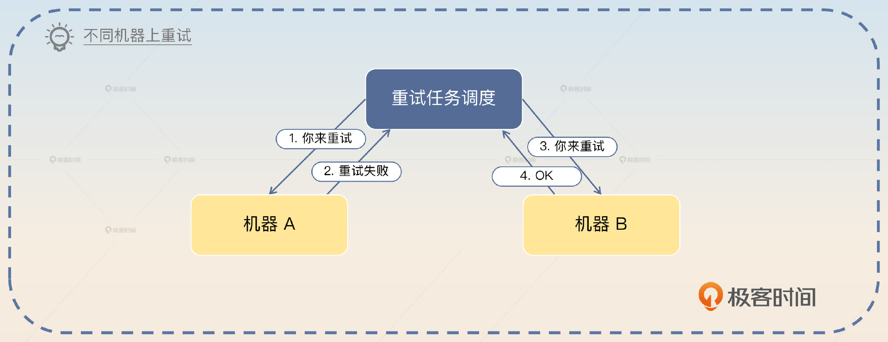

从理论上来说，重试就是为了避开前一次失败的原因。比如说数据库因为偶发的网络抖动失败了，那么重试就是希望能够避开这次偶发性的网络抖动，再次查询成功。

有些时候面试官可能会问为什么要设计指数退避的重试策略，道理也在于此。通过不断延长重试间隔时间，有更大的概率避开引发失败的因素。

## 面试准备

在面试前，你需要在公司内搞清楚以下情况。

- 分库分表的主键生成策略，主要看看他们有没有使用在 [主键生成](https://time.geekbang.org/column/article/676793) 那一节课提到的内嵌分库分表键的方案。
- 如果使用了后续提到的引入中间表、二次分库分表和使用其他中间件支持查询中的任何一个方案，你就要搞清楚数据同步是怎么做的，怎么保证数据一致性。换句话说，如果数据不一致，那么多久会发现，以及最终要多久才能达成一致。

当你在简历里面提到了分库分表的时候，可以主动提起你是如何解决这个问题的。又或者在你谈分库分表方案设计的时候，主动提起你的方案是如何解决这个问题的。

如果面试官问到了下面这些问题，那么你就可以把话题引导到这个主题下面。

- 面试官问到了主键生成策略，那么你可以说主键生成会影响分库分表的中间表设计。
- 面试官问到了从其他维度怎么查询数据的问题。例如在订单这里问到了客服怎么查、运营怎么查等。
- 面试官问到了数据同步和数据一致性，你可以用这里面谈到的场景来展示你是如何解决这些问题的。
- 面试官问到了如何选择合适的分库分表键，那么你就可以强调非分库分表键的查询更加复杂，需要额外的支持。

## 基本思路

正常情况下，面试官都是直接问类似的问题，比如说在你介绍了你的分库分表方案，提到了订单表是按照买家 ID 来进行分库分表的之后，他就会顺势问你如果卖家要查询 ID 应该怎么办。

那么你可以按照这个模板来介绍不同的方案。

> 这一类没有按照分库分表键来筛选数据的查询，是需要一些额外的手段来支持的。目前来说主流的就是引入中间表、二次分库分表或者使用其他中间件。当然，广播作为一个兜底的解决方案，逼不得已的时候也可以使用。并且，如果自己的主键生成策略比较特殊的话，也能部分支持这一类查询。

显然这个回答里面，你已经提到了足够的关键词，那么面试官很大可能就会按照这个关键词一个一个地问。

### 主键生成策略

在主键生成那部分我们介绍过一种策略，就是在主键里面带上分库分表的列，如果你能够拿到主键，就应该知道去哪个数据库上的哪个数据表里面查找。

比如说在订单 ID 里面带上了买家 ID，那么在根据订单 ID 来查询数据的时候，就可以通过解析订单 ID 来判断订单的数据在哪个库哪个表上面。

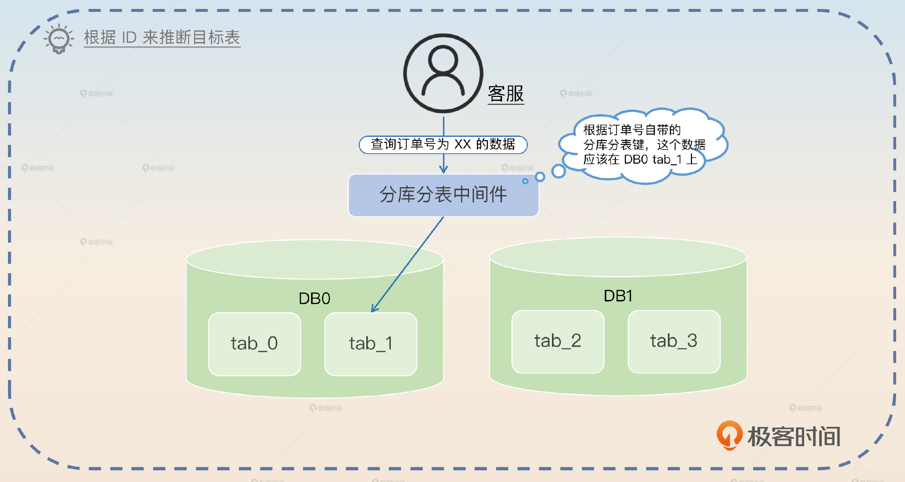

这是一种非常优雅的解决方案，因为它完全不需要任何第三方工具的帮助，也不需要额外存储数据。

但是 ID 这个方案只能解决一部分问题，而且大多数时候主键都不是采用这种策略来生成的，那么就只能考虑其他方案了，比如说引入中间表。

### 引入中间表

引入中间表这个思路你在上一节课的分页查询里面已经见过了。那么在这里，你依旧可以继续引入中间表。在前面的例子里面，你想要支持按照卖家来搜索，那么完全可以引入一个中间表，这个中间表记录了 ID、卖家 ID、买家 ID 三个数据。

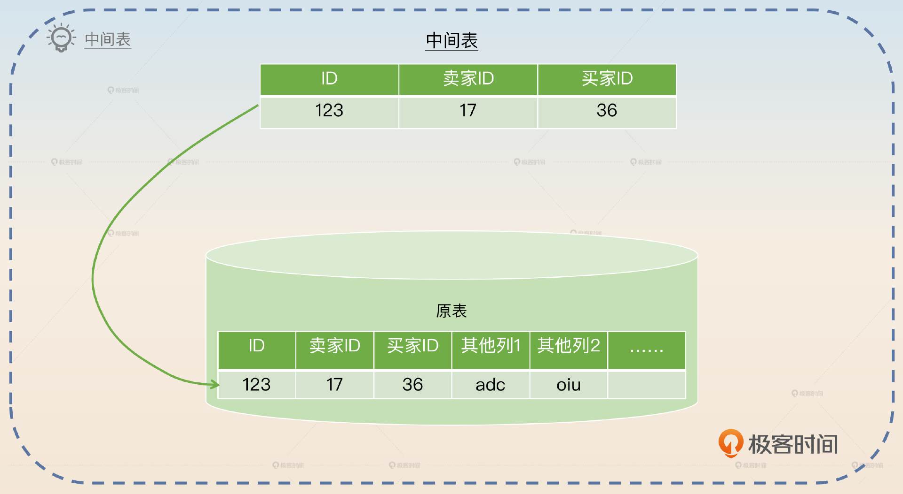

当然你可以考虑将买家 ID 换成目标库和目标表，这样就不用再根据买家 ID 来定位目标库和目标表了。

所以查询的基本步骤也很清晰。

- 先在中间表中根据卖家 ID 找到想要的订单 ID 和买家 ID。
- 再根据买家 ID 和订单号找到具体的订单数据。

你抓住关键词 **中间表**，来介绍你的方案。

> 我们用了一个比较简单的方案，就是引入了中间表来解决卖家查询的问题。这个中间表主要就是根据卖家找到对应的订单，并且根据订单表中的买家 ID 来确定目标库、目标表，再去对应的数据表里把所有的数据都查询出来。

在介绍了这个基本方案之后，你可以从两个角度刷一下亮点。第一个角度是结合第一个主键生成策略，优化中间表的设计。

> 如果在设计订单主键的时候，将买家 ID 编码放到了订单 ID 里面，那么你在这里可以考虑删掉买家 ID 列。

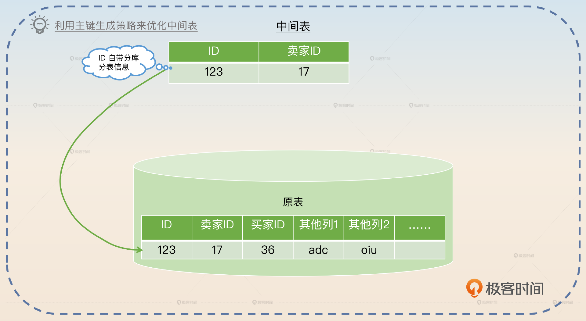

如果你们在前面已经聊到了主键内嵌分库分表键的方案，那么你在这里展示亮点就非常合适。或者你也可以反过来在主键生成面试的时候提到它会间接影响中间表的设计。

第二个角度是讨论中间表的缺陷，它最大的缺陷是 **性能瓶颈**。

> 这个方案的一个重大缺陷是中间表就是性能瓶颈。如果中间表的数据只插入，不存在更新的话，主要就是读瓶颈，那么多加几个从库就可以了。但是如果中间表里面有一些列是需要频繁被更新的，那么中间表本身就扛不住写压力。但是本身中间表是不能分库分表的，因为分库分表之后你又面临同样的问题：你怎么知道该查询哪张中间表。

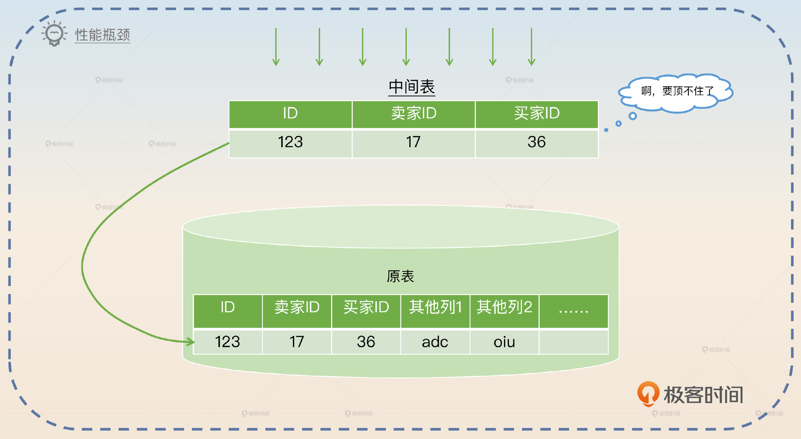

中间表最让人害怕的是写瓶颈，所以你可以考虑提供一个解决方案。

> 一般来说，在设计中间表的时候应该包含尽可能少的列，而且这些列的值应该尽可能不变，会频繁更新的列就不要放了。类似于订单 ID 这种 ID 类的基本不会变，那就可以随便放，而状态这种经常变更就还是不要放了。

中间表还有两个明显的缺陷，一个是难以适应灵活多变的查询场景。

> 中间表的一个缺陷就是表结构很固定，如果将来需要支持新的查询场景，那么就必须修改中间表的表结构，大多数情况下会是增加新的列。但是另外一方面，中间表本身往往又是一个大表，大表修改表结构是一个非常危险的事情。当然也可以考虑增加新的中间表，但都是治标不治本。中间表越多越难维护，数据一致性越难保证。

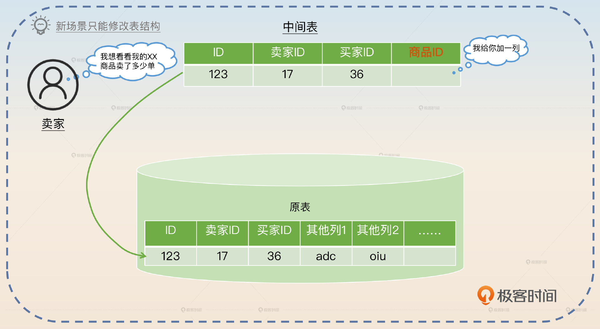

在这个回答里面，你又提到了大表修改表结构这个点，我们在前面讲过这个内容，你需要做好被问的准备。另外一个缺陷就是上一段回答里面最后提到的数据一致性问题，那么你可以参考总结部分。

如果你进一步思考，中间表要想解决写瓶颈问题，是不是也可以分库分表？这种思路实际上是下一个方案，二次分库分表。

### 二次分库分表

二次分库分表指复制出来一份数据，然后尝试再进行分库分表。所以你的系统里面就会有两份数据，分别按照不同的分库分表规则存储。

不同的人会有不同的叫法，比如说也有人把它叫做冗余分库分表、冗余 sharding，但是指的都是这个方案。比如说，卖家也需要查询订单，那么就可以再一次按照卖家 ID 来进行分库分表。

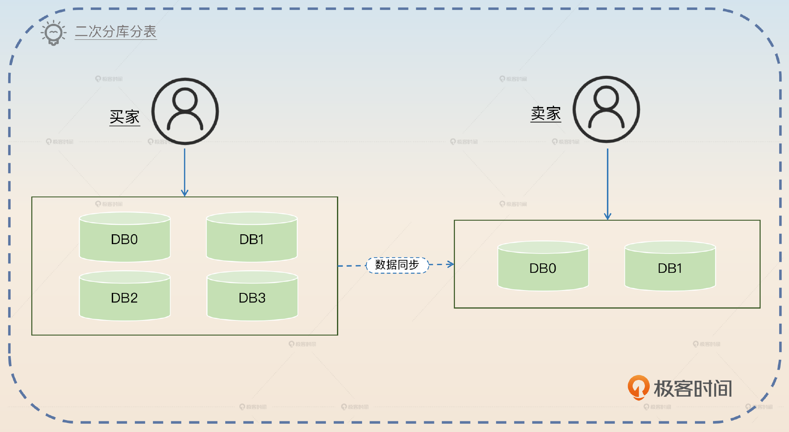

> 原本订单表是按照买家的 ID 来进行的，但是这种情况下，卖家查询订单就很困难。比如说卖家查询自己当日成交的订单量，就难以支持。而且本身卖家查询订单也不能算是一个低频行为，所以我尝试把数据复制了一份出去，然后按照卖家 ID 进行分库分表。这种方案的主要缺陷就是数据一致性问题，以及数据复制一份需要很多存储空间。

在这里你提到的两个缺点，自然是为了进一步展示亮点的。这里我重点讲第二个缺点，第一个缺陷数据一致性你可以参考后面的小结部分。

数据复制一份的问题要解决起来也很简单：其实你没必要全部复制一遍，你只需要复制关键表以及关键表的关键字段就可以了。部分表你是不需要复制的，比如说订单详情表你完全不需要复制，你可以在拿到订单 ID 之后再次查询订单详情表。

即便复制表，也不是所有的字段都需要复制，一些 BLOB、TEXT 字段占存储，还不会出现在查询条件里面，根本不需要复制。真需要这些字段的时候，依旧可以拿着主键和分库分表键来二次查询。

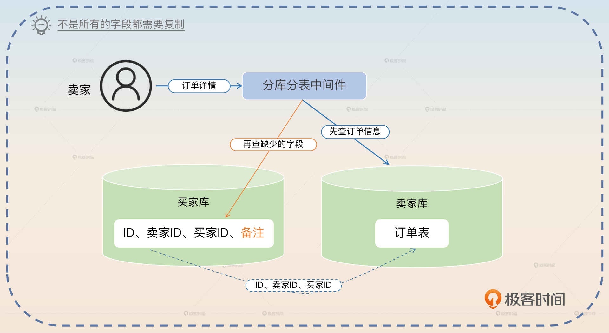

于是查询也分成了两个步骤。但不同的是，尽量做到大部分查询只需要查询卖家库，只有少部分查询需要回归到买家库。

所以你要抓住 **减轻存储压力** 这个关键词。

> 实际上，为了减轻数据复制带来的存储压力，我们可以考虑只复制一部分表，或者某个表的一部分字段。比如在同步的时候，就不需要同步订单详情表，而是拿到订单基本信息之后再去原本的买家库里面查询订单详情。

在这里你可以进一步讨论两次查询引入的问题，以及可行的优化方案。

> 在这种机制之下，如果有一个查询 QPS 比较高，但是它又经常需要回原表查询，那么可以考虑两个优化方案。首先要考虑的是在查询的 SELECT 部分去除一些用不上的列，避免回原表。如果这个措施不行，那么就考虑将查询所需的列全部复制过去，避免回原表。这种优化就类似平时用覆盖索引来优化查询的思路。

### 使用其他中间件支持查询

前面三种策略，始终存在一些缺陷，就是它们都难以适应变幻莫测的业务。比如，在引入中间表里我已经提到了，中间表里面就必须包含你的查询条件，不然你也查不出来。如果业务变化了，需要新的查询，那么你也需要修改表结构。因此，为了支持复杂多样的查询，可以尝试使用别的中间件，比如说 Elasticsearch。

在这里引入 Elasticsearch 也可以采用引入中间件方案中的一个优化措施，即只同步部分跟搜索相关的字段。

> 为了减轻 Elasticsearch 的压力，我们选择了只同步部分字段。一些非常庞大的字段，比如说 TEXT 或者 BLOB 本身我们是不会同步过去的。

如果你选了同步部分数据到 Elasticsearch，那么你最终就会面临一个问题：总有一些业务的查询，你完全没办法支持。那这个时候你就只剩下最后一个手段了：广播。

## 广播

所谓的广播就是，如果你不能断定数据可能出现在哪一张表上，那么就直接在全部表上都查询一遍。

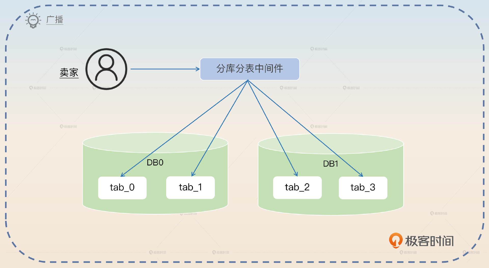

在订单这个例子里面，当卖家想要知道自己究竟卖了多少单的时候，就可以在所有的表上都问一遍，汇总之后就是卖家的所有订单。

你基本上一眼就可以看出来这种做法的缺陷： **对数据库的压力实在太大**。这个方案现实中真的很少用，只有在上面这些方案都用不了的时候，你才可以考虑使用，关键词 **兜底**。

> 我们还有一些兜底措施，也就是如果一个查询确实没办法使用前面那些方案的时候，那就可以考虑使用广播。也就是说直接把所有的请求发送到所有的候选节点里面，然后收集到的数据就是查询的结果。不过这种方式的缺陷就是对数据库压力很大，很多数据库上的表根本不可能有数据，但是都会收到请求，白白浪费资源。尤其是如果这些查询还会触发锁，那么性能就会更差。

最后你特意强调了锁，也是为了把话题引到锁那边。

## 引入中间表和二次分库分表

实际上，你也可以认为这两种方案之间的差距并不大，或者说二次分库分表是中间表的升级加强版。

- 中间表是性能瓶颈，害怕维护写频繁的字段。二次分库分表没有这种担忧。
- 中间表本身的字段会很少，往往需要回归原表再次查询数据。
- 二次分库分表成本要更高，因为它需要复制更多的字段。

一般来说，优先考虑使用中间表，其次考虑只复制部分数据的二次分库分表方案，逼得不得已再考虑全量复制数据的二次分库分表方案。

## 数据同步问题

在引入中间表、二次分库分表和使用其他中间件三个解决方案里面，都面临一个同样的问题：你怎么进行数据同步？

- 在中间表里面是你怎么把数据从业务表同步到中间表。
- 在二次分库分表里面是你怎么把数据同步到二次分库分表。
- 在使用其他中间件里面是你怎么把数据同步到你选择的中间件。

数据同步之前我们介绍过一些方案，一般来说有两种思路。

1. 双写，就是在写入源数据表的时候，同时写到另外一个地方。这个可以通过改造 ORM 或者分库分表中间件来达成。但是如果你的分库分表中间件是 Proxy 形态或者 Sidecar 形态的，那么改起来的难度就比较大。

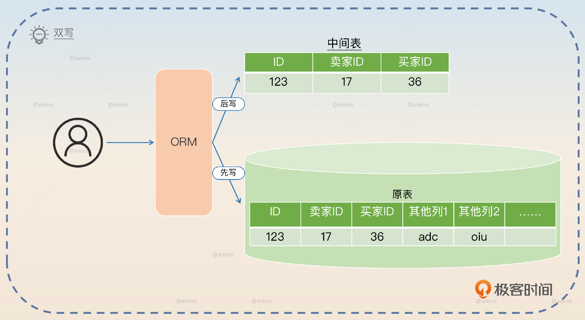

1. 利用 Canal 之类的框架监听 binlog，然后异步地把数据库同步到其他地方。

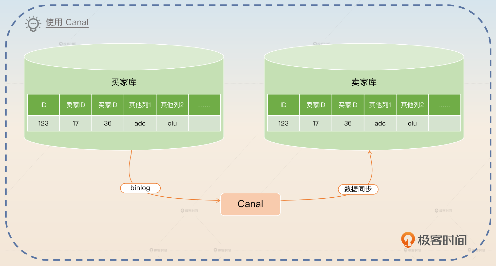

不管是双写，还是监控 binlog，都绕不开失败这个话题。那失败的时候怎么办呢？无非就是各种重试，在重试都失败之后，就人手工介入处理。

在实践中，双写方案用得不多。高端一点的做法就是在重试失败之后，加上一个异步修复程序进一步尝试修复。如果修复程序本身也失败了，那确确实实就只能人手工介入了。这些内容之前我反复提到过，你需要记住。

## 亮点方案

这是一个结合了在基本思路中提到的四种措施的综合方案。这个方案就凸显你考虑到了不同的情况，做出了一个比较复杂的架构设计。

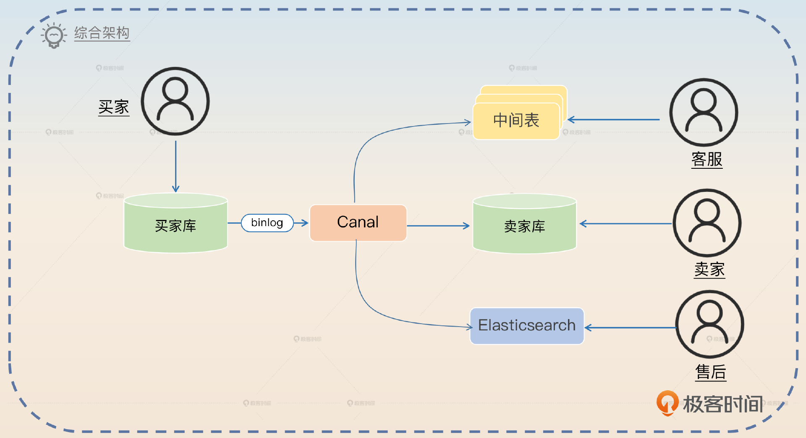

你可以综合介绍这个方案。

> 在分库分表之后，为了充分满足不同情况下的查询需求，我们公司综合使用了三种方案：引入中间表、二次分库分表和 Elasticsearch。对于卖家查询来说，我们直接复制了一份数据，按照卖家 ID 分库分表。对于一些复杂的查询来说，就是利用 Elasticsearch。还有一些查询是通过建立中间表来满足，比如说商品 ID 和订单 ID 的映射关系。

因为你在回答里面提到了不同的做法，那么面试官就会进一步问这些方案的细节，你回答我在基本思路里面讲到的就可以了，要注意将每一个方案里面的亮点展示出来。

如果面试官问到了数据同步和数据一致性的问题，那么你就介绍你的同步方案。

> 我们的数据同步方案是使用监听 binlog 的方案。买家库插入数据之后，就会同步一份到卖家库和 Elasticsearch 上。这个过程是有可能失败的，那么在失败之后会有重试机制，如果重试都失败了，那么就只能人手工介入处理了。

如果面试官足够敏锐的话，他就会发现这个架构里面的另外一个问题：卖家库的数据需要反向同步到买家库吗？

第一个回答是如果你允许卖家修改卖家库的数据，那就需要。架构这个时候就变成了图里展示的这样。

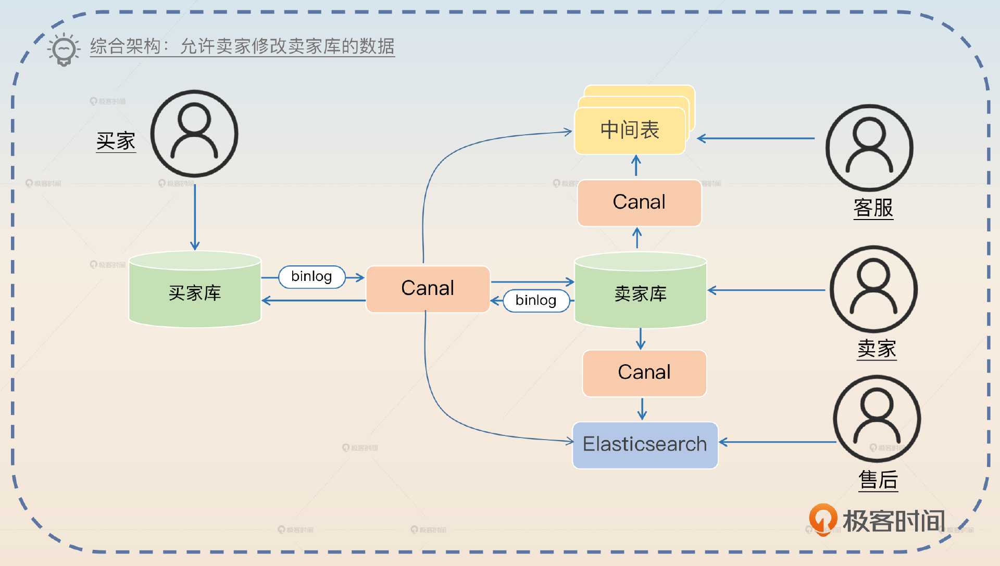

> 我们是允许卖家直接修改数据的，所以实际上我们卖家库的修改也会同步到其他数据源。因为卖家和买家都可能同时修改各自的库。这里我举一个订单状态修改的例子。
>
> 如果买家发起取消订单，然后卖家那边要把状态修改成已发货。那么可能出现买家先修改，然后被卖家覆盖的情况，结果就是两边都是已发货；也有可能出现卖家先修改，然后被买家覆盖的情况，那么结果就是两边都是已取消。
>
> 所以类似的场景最好是采用分布式锁和双写方案。比如买家修改状态的时候，要先拿到分布式锁，然后同时修改买家库和卖家库。当然，要是覆盖数据也没关系，那么就还是可以继续采用 Canal 的同步方案。
>
> 所以综合来看，允许卖家直接修改卖家库是比较危险的事情，数据一致性问题更加严重。

最后一句话提到了数据一致性问题更加严重，这也是为了引出第二个回答，就是除了买家库，其他库都是只读的。

> 也可以考虑只允许从买家库进去修改数据，也就是说，不允许直接修改卖家库的数据。举个例子，如果卖家想要修改某个订单的数据，那么他需要在卖家库查到订单的信息，但是在修改的时候要拿着订单信息去买家库修改。

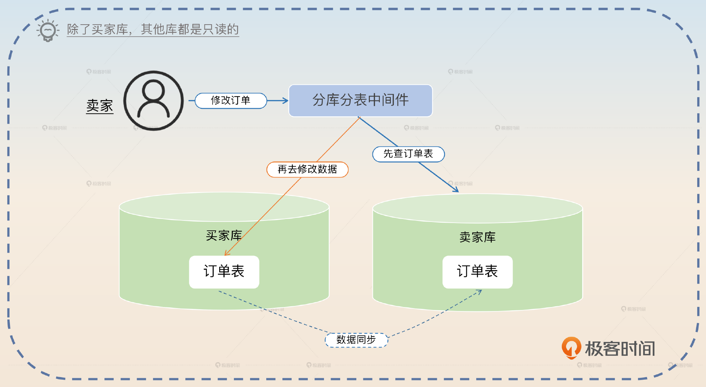

最后总结这种做法的好处。

> 这种做法最大的优点就是简单，没有那么多数据同步和数据一致性方面的问题。缺点就是性能比较差，而且写压力始终都在买家库上。

## 面试思路总结

最后我们来总结一下无分库分表键查询的面试要点。

1. 分库分表键的选择要注意根据候选项和业务需求来筛选，这在实践中比较容易。
2. 在设计一个重试方案时我们要考虑重试次数、重试间隔以及是否允许跨进程重试这三方面内容。
3. 此外我们还讨论了引入中间表、二次分库分表、使用其他中间件三个基础方案。并且讨论了主键生成策略对查询的影响，以及对中间表、二次分库分表两个方案的影响。
4. 广播则是兜底方案，也就是说如果你什么都不做，那么解决非分库分表键查询就可以依赖广播，但是它的性能问题也是非常突出的。

最后我综合了所有方案给出了一个比较复杂的架构设计。正常来说，如果面试初中级研发岗位，你应该只是负责整个架构中的某一环节。那么你能说清楚整个架构就是一个比较不错的加分项。如果你已经在大厂了，那么你可以用你所在公司的架构来替换。但是身居大厂，你出去面试的时候，对你的要求也会更高，所以你要对架构有更加深入地理解。

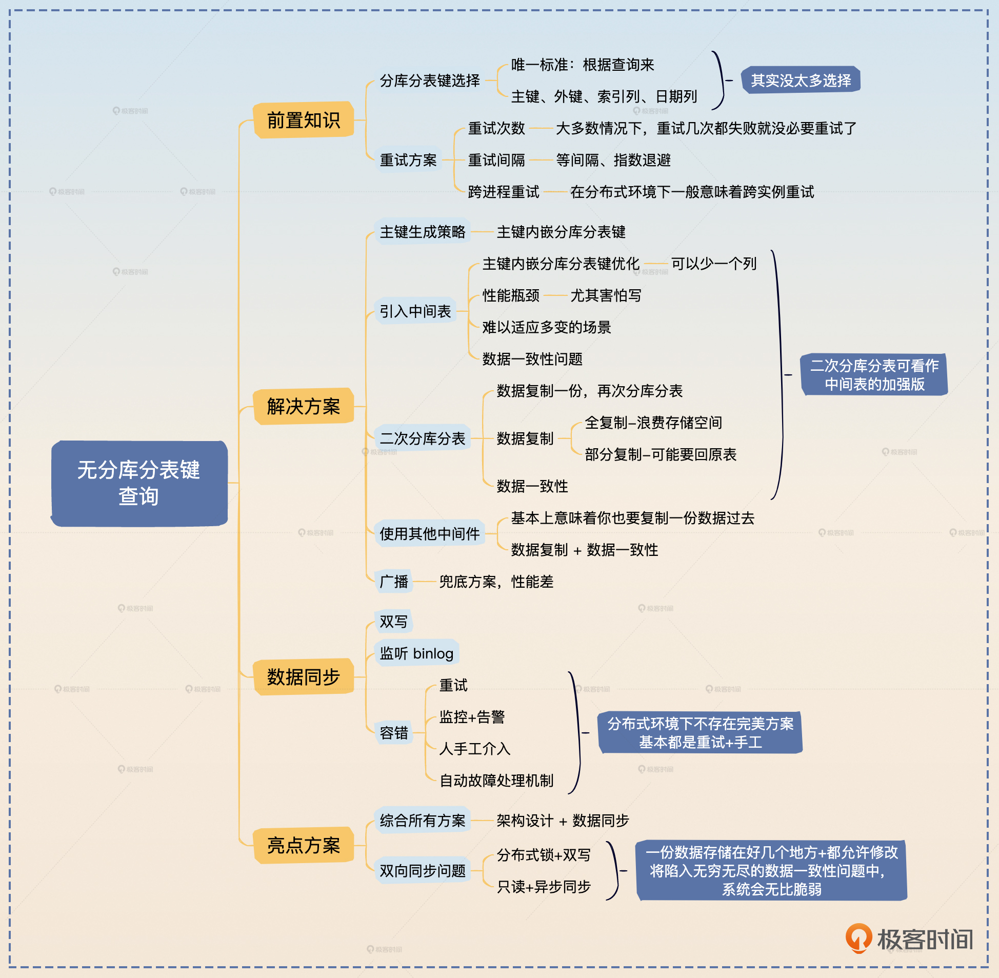

## 思考题

最后，请你来思考几个问题。

- 要想做到允许跨进程重试，一般都要借助第三方中间件来完成。比如说消息队列、分布式任务调度等。那么你是如何实现跨进程重试的？
- 在讲到允许卖家修改卖家库再同步回买家库的时候，我说到两种覆盖的场景，那么有没有可能出现买家库是已发货，但是卖家库反而是已取消的情况？

欢迎你把思考后的答案分享到评论区，也欢迎你把这节课的内容分享给需要的朋友，我们下节课再见！