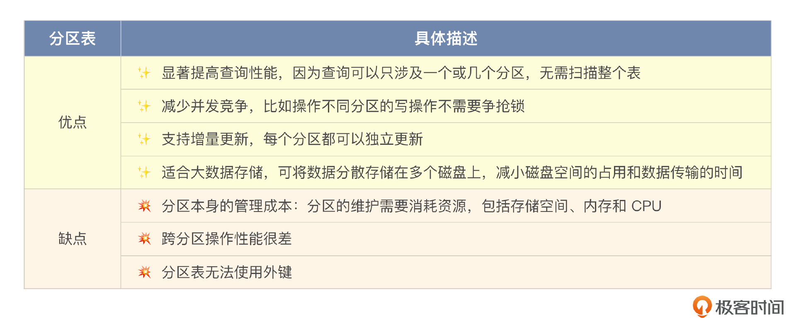
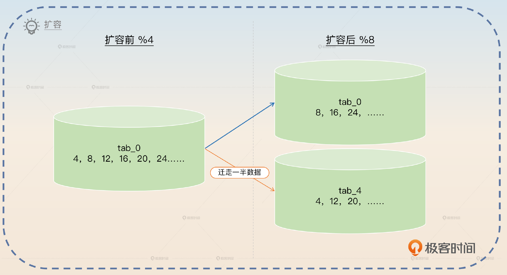
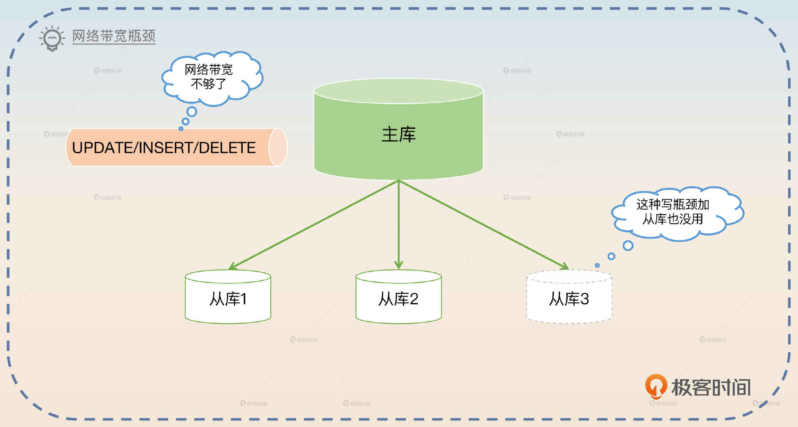
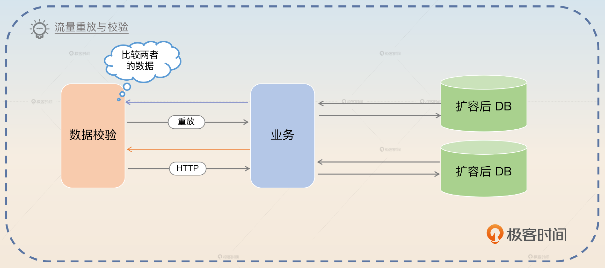
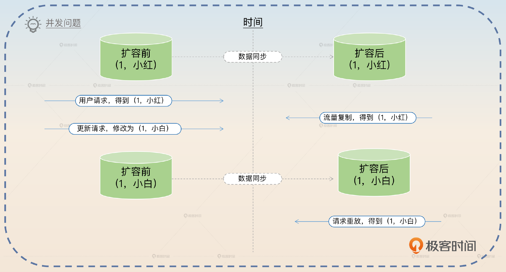
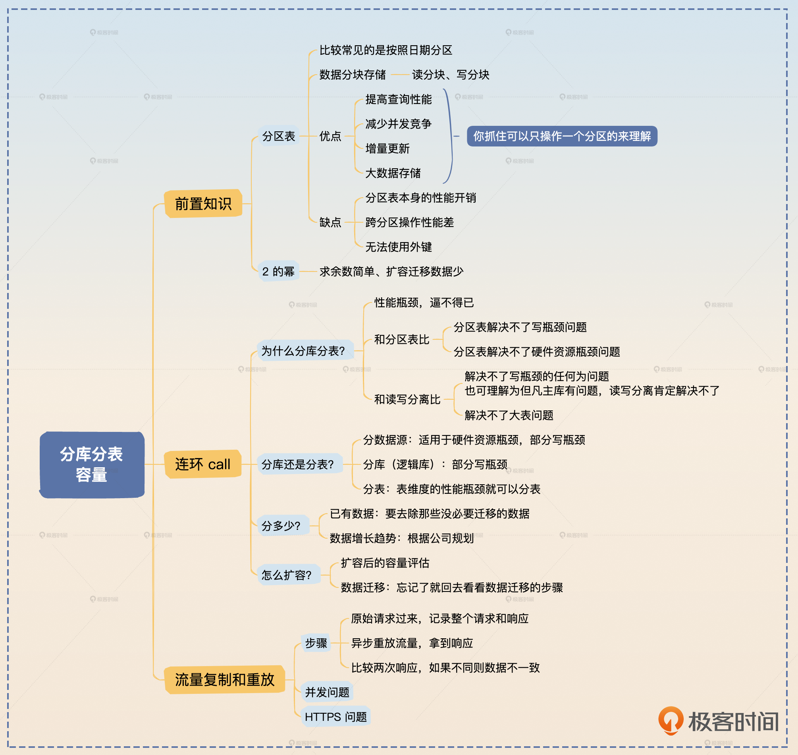

# 20｜分库分表容量预估：分库分表的时候怎么计算需要多少个库多少个表？
你好，我是大明。今天我们来聊一下如何分库分表中确定容量的问题。

在分库分表的面试中，基本上面试官都会问你，你究竟分了几个库分了几个表。这是因为面试官比较关注数据库的数据量问题，如果容量预估不准确，那么后续就需要扩容，而扩容是一个非常麻烦和棘手的事情。

大部分人在准备面试的时候很少深入思考这个容量是怎么来的，因此面试官问到的时候就是一脸懵。那么今天我就带你深入讨论一下怎么计算分库分表的容量，并教你利用扩容展示自身的能力，尤其是后面会提到的 **利用流量复制和重放来做数据校验**，是一个非常高级的技巧，足以证明你在系统设计上有丰富的经验了。

我们先从分区表说起。

## 分区表

大部分数据库都支持分区表。这里我以 MySQL 为例给你介绍一下分区表的主要特性。

在 MySQL 里，分区表是表的底层组织方式。简单来说，分区表就是把一张表分成几块，每一块存储在磁盘的一个地方，一块也叫做一个分区。比如典型的按月分区，是指每个月产生的数据在一个独立的区域。数据库可以单独处理某一块，也可以多块一起处理。

分区表的优缺点还是非常分明的。

虽然分区表的缺点很明显，但在一些场合，分区表还是非常好用的，尤其是一些跟时间有明显关系的业务场景，按照时间来进行分区要比直接使用分库分表更加简单高效。

## 2 的幂与数据迁移

如果你平时看过一些大厂发布的分库分表实战，你就可能注意到，大厂在容量规划的时候都是按照 2 的幂来规划的，比如说$4 \\times 2 \\times 8$ ，或者$8 \\times 4 \\times 32$。而且在扩容的时候，也是按照 2 的幂来进行的。也就是说，基本上扩容都是选择容量翻倍。这其实是因为 2 的特性，在使用哈希取余来进行分库分表的时候，可以使用位运算来计算余数，非常高效。

在扩容的时候，如果扩容为原来的 2 倍，那么 **只需要迁移一半的数据**。假设原本的表是按照除以 4 的余数（%4）来分库分表的，分别是 tab\_0、tab\_1、tab\_2、tab\_3。现在扩容成原来的 2 倍，按照 8 的余数（%8）来分库分表。那么原本 tab\_0 上的数据就需要移走一半。

## 面试准备

想要面好分库分表容量预估这个部分，只了解前面这些知识点还是不够的，你还需要在公司内部弄清楚一些数据。

- 你们公司分库分表的实际情况，也就是说你们分了几个集群、几个库、几个表。
- 你们公司核心业务或者你维护的业务数据库或数据表的数据量、TPS 和 QPS。
- 你们公司是否使用过分区表，分区表是按照什么分区的，每个分区数据量大概是多少。

这些数据你在面试的时候，都要趁机讲出来。现在的人出去面试，很少有人能够把自己业务的各项数据说清楚，如果你能够说清楚，本身就是一件有竞争力的事情。

跟容量有关的问题可以称之为夺命连环 call，面试官会一路问下去。

1. 为什么要分库分表？分区表可不可以？增加从库行不行？
2. 什么时候需要分库分表？
3. 分库分表的时候，是分库还是分表？还是既分库又分表？
4. 分多少库？分多少表？你是怎么计算出来的？
5. 万一容量预估得不准，估少了怎么办？

面试过程中，有些时候问法可能不一样，但是本质都是一回事，比如面试官会这样问。

- 如果数据库已经到了写瓶颈怎么办？要么优化写操作，要么分库。
- 如果数据库已经到了读瓶颈怎么办？要么优化读操作，要么加从库，要么分库或分表。

## 基本思路

接下来我们就顺着面试官的提问思路一个个解答。

面试官问这一类问题的起点差不多都是“你为什么分库分表？”，比如你的项目经历里有跟数据库有关，看起来可以用分区表的内容，那么他就会问“为什么你要分库分表？分区表能不能解决问题？”

### 为什么分库分表？

排除刷 KPI 这种想法，分库分表只有一个原因，就是逼不得已了。在面试的时候分库分表是一个很高端的话题，但是在实践中，我一直以来的建议是不到逼不得已不要分库分表。

那什么情况是逼不得已需要使用分库分表呢？就是数据库遇到了 **性能瓶颈**。

> 一句话总结分库分表，那就是数据库本身出现了性能问题，而且这些性能问题已经没办法通过 SQL 优化、索引优化之类的手段来解决了。

然后我们进一步将分库分表和分区表、读写分离进行对比，刷一个亮点。我们 **从硬件资源、并发、数据量** 三个引起性能瓶颈的角度去分析。

> 通常在分库分表之前应该优先考虑分区表和读写分离，因为这两种方案和分库分表比起来都更简单、好维护。
>
> 如果是数据库本身硬件资源不足，那么不管是分区表还是读写分离都难以解决问题。比如说数据库网络带宽不够了，这种情况下分区表肯定解决不了；而如果是写操作引发的网络带宽不够，那么读写分离增加从库也解决不了。

> 如果是并发引起的问题，那么分区表和读写分离也不太能解决。比如说表锁，读写分离是没办法解决的，你就算增加 100 个从库，表锁都还是在主库上。分区表虽然因为有分区，可以减少并发竞争，但是如果某一个特定分区上已经遇到写瓶颈了，那么分区表也没用。

> 如果是单纯因为数据量过大而引起的性能瓶颈，读写分离也不太能够解决。举个例子来说，如果一个表有几千亿条数据，那么显然无论怎么加从库，单一一个查询都会很慢。如果数据量极大，以至于连索引都无法放入内存，此时查询性能极差。

如果上面的分析对你来说太难记，那么你可以记住这个简洁版。

- 对于写瓶颈来说，分区表可以缓解问题，而读写分离几乎没有效果，比如频繁地增删改操作。
- 对于硬件瓶颈来说，读写分离、分区表基本上也解决不了，比如写操作引发的网络带宽问题。

最后总结一下，就是你的业务已经触及了 **主库写性能瓶颈**，走投无路了。

> 我们这个业务数据库逼不得已要分库分表的原因就是主库现在已经不堪重负，可以认为 TPS 已经触及到硬件天花板了。虽然理论上我们还是可以购买更强的服务器来部署数据库实例，但是实在太贵了，而且业务增长也还是会触及新机器的性能瓶颈，那么索性分库分表一步到位。我们还准备了其他主从集群，将分库之后的数据库分散在不同的主从集群上，或者说分了数据源。

这里你还可以进一步指出，分库分表和读写分离、分区表都不是互斥的，可以结合在一起使用。

> 当然，并不是说分库分表之后就不能使用读写分离。实际上分库分表的数据库集群一般也是主从集群。不过分库分表和分区表混合使用的情况比较少，但理论上也是可行的。

最后你可以拔高一下，直戳问题的本质，关键词就是性能瓶颈。

> 目前业界有很多公司会出一些最佳实践之类的手册，告诉你数据量超过多少多少就要分库，比如说行数超过多少行，或者数据量超过多少 G 就要分表。
>
> 但是这些最佳实践其实是一种偷懒的说法，是我们在日常实践中总结出来的很多表在这么一个量级下就会出现性能瓶颈。所以归根结底要不要分库分表，只需要看有没有性能瓶颈。
>
> 而且但凡性能瓶颈可以用分区表或者读写分离解决，就不要着急使用分库分表。当然，如果用得起 Oracle 数据库，那就根本不需要分库分表了。

到这一步你就已经彻底解答了为什么要分库分表的问题。我相信到现在，你对什么时候分库、什么时候分表应该心中有数了。

### 分库还是分表？

这里我先给出一个适合在面试中回答的三条原则。

1. 如果是数据库本身的硬件资源引起的性能瓶颈，那么就要分数据源。一句话来说，就是你得有更多的主从集群。
2. 如果是逻辑数据库引起的性能瓶颈，那么你就只需要在逻辑数据库这个层面进一步分库就可以了。
3. 如果是单表数据量过大、锁竞争等跟表维度相关的资源引发的性能问题，那么分表就可以了。

确认了要分库、分表或者同时分库分表之后，现在我们就要考虑分几个的问题了。

### 容量估算

分库分表容量确定需要依据两点：你现在有多少数据、你将来有多少数据。所以如果讨论到了容量估算的问题，你就要直接指出核心： **现有数据和增长趋势。** 紧接着你就要从这两个点出发解释具体怎么算。

#### 存量数据

存量数据是最好处理的。基本上你只需要简单计算一下就可以得到。

不过并不是所有存量数据都需要进行分库分表，部分不重要的、用不上的、历史悠久的数据，不如直接归档，或者放到大数据平台上。所以你真正需要计算的是那些还需要线上继续查询的数据的量。

#### 增长趋势

这个就是计算难点，你需要考虑两点，一个是现有数据增长率，另一个是数据增长率的变化趋势。用数学术语来说，就是 **数据量的一阶导数和二阶导数**。

那我们怎么知道数据的增长率，以及未来数据的增长率呢？其实这就要 **看公司的规划了**。

> 数据的增长趋势只需要根据公司的战略规划来就可以。比如说今年公司的目标是业务翻倍，那么就可以认为今年数据的增长率是 100%。就算公司没有发布这一类的规划，但是产品经理肯定是背着 KPI的，问一下他们也就知道了。不过正常来说，一家公司都是有三五年规划的，照着规划来预估容量就可以了。

因为扩容非常复杂繁琐，所以这里你可以补充容量预估的原则——宁滥勿缺。

> 大体上，预估要料敌从宽，也就是按照业务可能的增长上限来评估。因为万一容量预估少了，还需要再扩容，这就比较麻烦了。

紧接着，还有一个可能出现的问题，就是究竟预估多长时间的数据？三五年还是十年？这个问题每个实际操刀分库分表的人答案估计都不一样。

我个人认为只需要预估未来三年就可以。但是有些公司很有钱同时害怕扩容，所以一开始可能就留足了余量，所以可以满足数十年的需要。

> 正常来说，预估容量需要考虑未来三年的数据增长情况，只需要确保三年内不会触发扩容就可以。但是三年也不是一个硬性标准，比如说有些公司比较害怕扩容，那么可能直接预估了五年、十年的容量。

但是，这种估计就是一厢情愿，不管你再怎么精打细算最终都有可能估少了。那么逼不得已就还是要扩容。

## 扩容亮点

如果我们是从头开始学扩容，那么会非常复杂。但是好在前面你已经学过了数据迁移，所以扩容对你来说已经是一个比较容易掌握的东西了。

扩容本质上就是两件事：扩容后的容量评估和数据迁移。

### 扩容后的容量

首先容量评估这个步骤要比初次分库分表简单得多，基本上都是按照 2 的倍数来进行扩容。

> 就容量评估来说，因为已经分库分表了，所以只需要按照已有容量的 2 倍来扩容就可以了。比如说现在是分了 4 个库，每个库 8 张表，那么就可以考虑扩容为 8 个库，每个库 8 张表；也可以考虑扩容成为 4 个库，每个库 16 张表。当然，直接扩容到 8 个库，每个库 16 张表也是可以的。

这里面我留了一个引导点，就是什么时候扩容库，什么时候扩容表？这个问题可以参考前面 **分库还是分表** 这部分知识来回答，它们本质上是同一个问题。

有一个问题虽然面试官不太可能会问到，但是你还是要有一个心理准备，就是有没有可能缩容？比如最开始的时候，你对业务非常乐观，认为需要 8 \* 16 共 128 张表。但是后面可能大环境不好，又或者业务扩张不利，导致 128 张表的数据量都不多。自然就会产生这么一种想法，能不能缩容？

理论上是能缩容的，但是现在我还没听说哪家公司在分库分表之后又缩容的。所以如果面试官问到能否缩容，那么你就可以这么回答：

> 理论上是可以的，而且和扩容差不多，都是要解决容量问题和数据迁移问题。

### 数据迁移

数据迁移的过程和前面基本一样，唯一不一样的地方就是不管操作源表还是操作目标表，都是需要按照分库分表的规则来进行。所以你基本上可以套用之前的数据迁移方案。但是这里我再额外补充一个更加高级的数据校验方案。

这个校验方案就是 **流量复制与重放**，就算你所在的公司没有类似的实践，你也可以跟面试官聊，因为除了少部分大厂做得还可以，其他公司基本上都没做过，或者做得很差。

方案的原理很简单，就是在保持以源表为准的双写阶段，录制线上的 HTTP 请求，然后再异步重放。拿到原本 HTTP 请求的响应和重放的响应，做一个比较。

面试谈到数据校验的时候，你可以介绍一下这个方案，不过不建议你说自己用过这个方案，因为里面细节比较多，很容易翻车。这里我用一种设计了这个方案，但是因为复杂度过高所以没有实施的话术来介绍，关键词是 **流量录制和重放。**

> 在数据校验上，最开始的时候我设计过一个利用流量录制和重放来做数据校验的方案，真正从业务逻辑上校验数据的准确性、完整性和一致性。整体思路是在 HTTP 入口处引入一个流量复制组件。当有读请求过来的时候，就会把请求整体录制下来，然后异步地重放请求，再把重放请求的响应和原始响应进行对比，判断数据迁移有没有出错。

流量复制和重放一般来说就是使用 tcpcopy 或者 goreplay。有时间你可以去了解一下这两个中间件，学会如何使用就足够了。

这个数据校验方案有很多可以深挖的地方，所以你可以继续引导。

> 这个方案还是有比较多的问题，比如说 HTTPS 的问题、并发的问题。

#### 去除 HTTPS

第一个问题是要解决流量复制过程中 HTTPS 协议的问题。那么基本都是在去除了 HTTPS 协议之后才开始录制流量的。简单来说就是放在了网关后面，网关会把 HTTPS 协议转成 HTTP 协议，这样你就可以录制流量了。

> 我这个方案是准备在 Nginx 后面接入流量复制。用户和 Nginx 之间是 HTTPS 通信，但是 Nginx 和后面的服务器之间是 HTTP 通信，所以就可以避开 HTTPS 的问题。

#### 并发问题

这算是一个比较大的亮点，因为擅长分析并发场景这一点就很有竞争力，你设想这样一个场景。

- 用户请求 id = 1 的数据，拿到了响应 name =“小红”。
- 复制请求，得到数据 id=1，name=“小红”。
- 紧接着，又来了一个请求，把 id = 1 的数据 name 更新成了 “小白”。
- 数据同步成功，扩容后的目标表也更新成 id=1，name=“小白”。
- 重放请求，最终重放得到的响应是 id=1，name=“小白”。
- 误报数据不一致。

这种就是假阳性问题。你可以看到本身数据是一致的，但是因为并发问题，导致校验误报了。如果你还记得前面数据迁移是怎么修复数据的，那么你应该知道，这并没有什么影响。因为修复数据的时候，我们永远都是用源表最新的数据去覆盖目标表最新的数据。这种假阳性就是白做了修复的工作而已。

你可以进一步打消面试官的疑虑。

> 虽然这里有可能出现假阳性的问题，不过不足为惧，因为本身数据是一致的，而且假阳性很少出现，因为我们的业务就是一个读多写少的场景。并且流量也不打算 100% 复制，只是小比例复制流量就可以了。

这个流量复制与重放算是一个非常高级也非常难做好的东西，所以面试的时候大概率面试官是没有接触过类似的技术的，你可以放心说。面试官没做过就问不出细节，不太可能把你问倒。

## 面试思路总结

最后让我来总结一下这节课的重点。我们这节课先学习了 2 的幂在分库分表中的应用和对数据迁移的影响。

后面我详细地解释了这几个问题：

1. 为什么分库分表？这要和分区表、读写分离对比，一句话总结就是有一些性能瓶颈只能用分库分表解决。
2. 分库还是分表？这就要看性能瓶颈能用分库解决还是能用分表解决。跟硬件资源相关的分数据源，跟逻辑数据库相关的分库，跟数据表相关的就分表。
3. 容量怎么估算？这要综合考虑已有数据和数据增长趋势，然后根据公司的规划来确定容量。
4. 扩容怎么扩？重新评估容量 \+ 数据迁移。数据迁移里面我介绍了一种新的面试思路，使用流量复制和重放来校验数据。

这一节课最后的流量录制与重放，在面试的时候是包装成了一个没有实施的方案，这也算是一个面试技巧。通过介绍一个高端但是没有实施的方案，进一步加深面试官对你的印象。

## 思考题

最后，请你来思考几个问题。

- 在扩容的时候，我说 2 的幂翻倍扩容的话，只需要迁走一半的数据。如果改成用 3 的幂，原本你的数据是按照除以 3 的余数分库分表，现在变成除以 9 的余数分库分表，那么要迁走多少数据？
- 网络上有一种说法是超过 2000 万行数据就要分表了，你知道这个 2000 万是怎么来的吗？

欢迎你把你的想法分享到评论区，我们一起讨论，也欢迎你把这节课分享给需要的朋友，我们下节课再见！