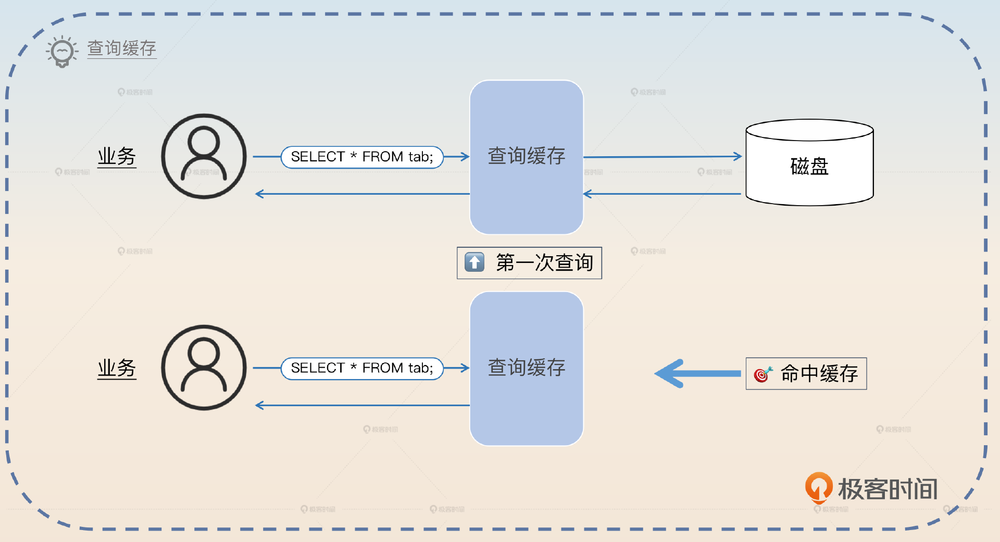
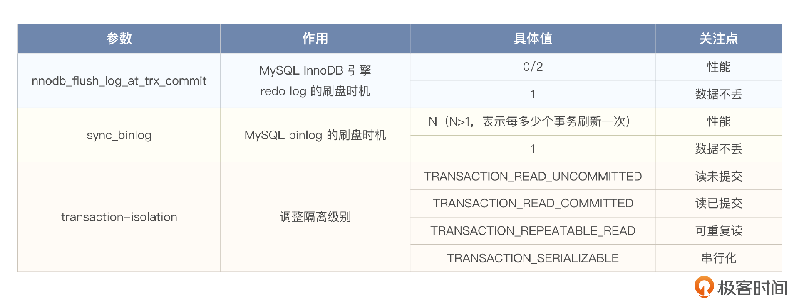
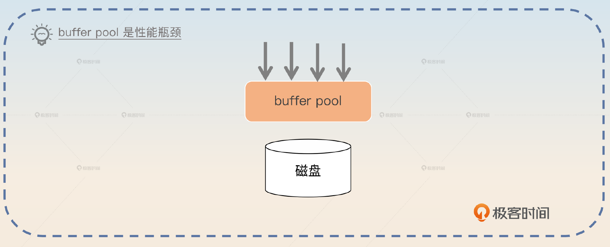
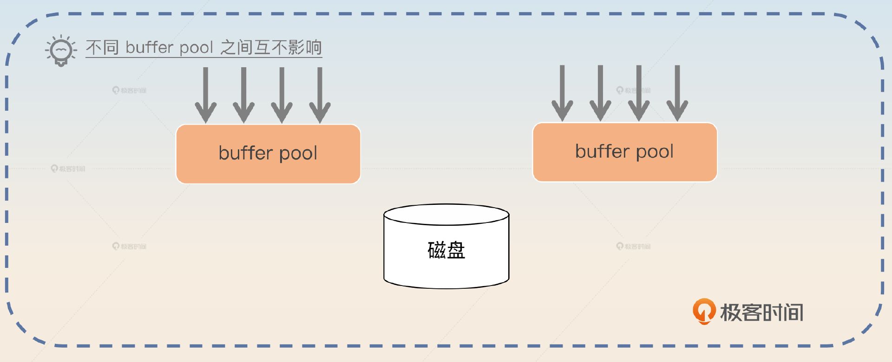
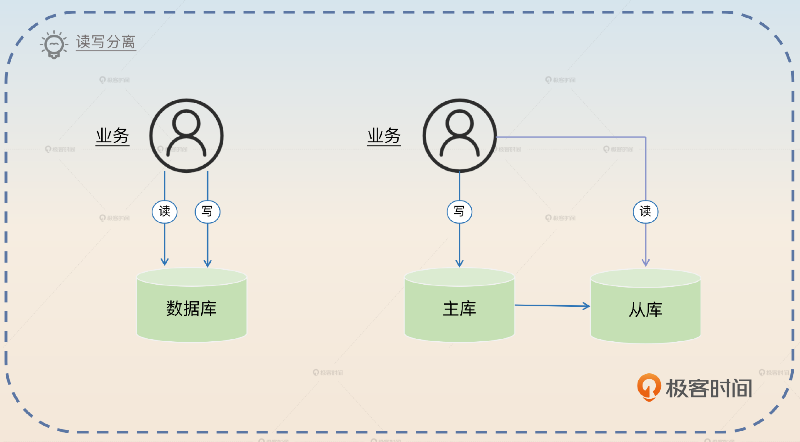
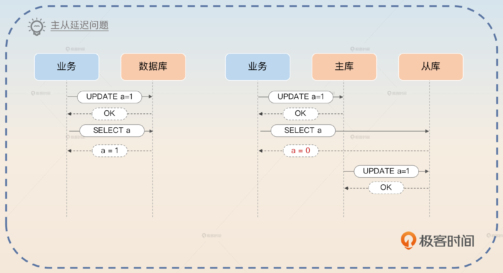
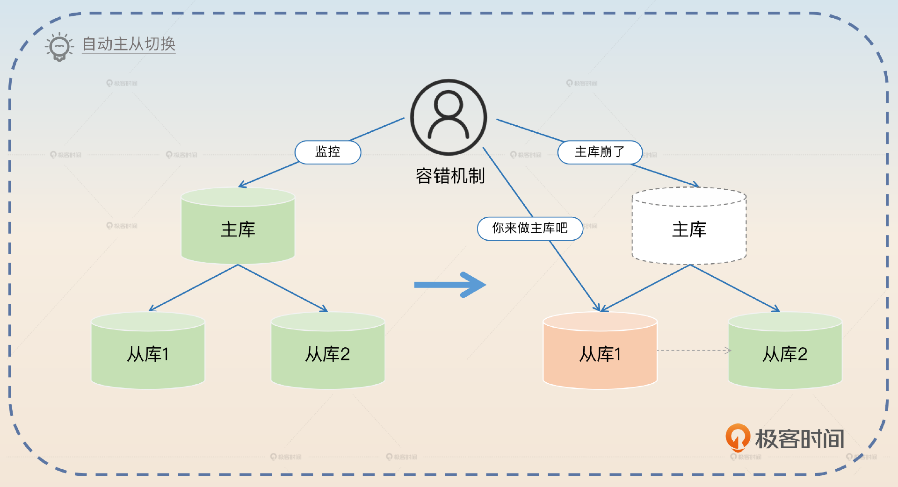
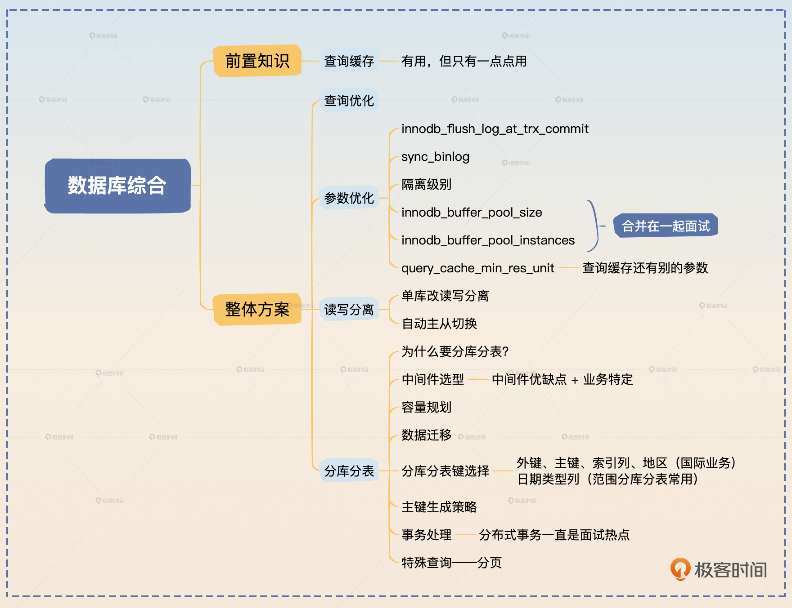

# 21｜数据库综合应用：怎么保证数据库的高可用、高性能？
你好，我是大明。

我很早就注意到，很多人在平时工作中就是设计一下表结构和索引。好一点的可能还会有一些查询优化的经验，也有少数人做了很多跟数据库有关的事情，但是没办法把它们系统组织起来，给面试官留下深刻印象。

现在我们有了前面几节课的基础之后，就可以把这些知识串联起来，做成一整个提高数据库性能和可用性的方案。在这之前，为了方便你理解后面的方案，我们先来学习一下查询缓存相关的知识。

## 查询缓存

在 MySQL 里面，允许用户开启查询缓存。你可以理解这个缓存就是用 SQL 作为键，而对应的查询结果集就是值。如果下次过来的还是同一个查询，那么就直接返回缓存起来的查询结果集。

但是 **查询缓存不一定带来查询性能提升**。如果你的查询每一次对应的 SQL 都不一样，那么查询缓存反而会降低查询性能。

在实践中查询缓存的效果的确不怎么好。按照设计者的想法，查询缓存的最佳使用场景是一些特别复杂的查询，它们会扫描很多行，但是只有一小部分行满足条件。所以 MySQL 在 8.0 的时候移除了这个功能。

## 面试准备

为了面好数据库这部分内容，你还需要在公司内部搞清楚一些数据和信息。

- 我后面提到的各种参数是否有改进的空间，记住公司里每一个使用了非默认值的参数。
- 如果你所在公司有 DBA，那么可以请教一下 DBA，有没有针对公司的业务做过什么优化，包括数据库自身的优化，也包括数据库所在的操作系统的优化。如果你和他们的私人关系够好，那么可以请教一下他们之前遇到过的各种数据库问题，然后把这些问题整理成案例，在面试中使用。
- 如果你所在公司的文档比较齐全，那么可以了解一下数据库架构的演进。

同时，你要为后面的查询优化、参数调优、读写分离和分库分表准备一些案例。 **查询优化部分** 你要多准备案例，案例要覆盖不同的优化方向，比如说有优化索引的案例，也有优化锁的案例。在整个数据库面试环节有机会用就抓住机会用上。

**参数调优部分** 在实践中是根据业务特征来选择优化方向，但是在面试的时候你可以根据你准备的回答来找业务特征，论证自身优化的合理性 **。读写分离部分** 就是看看你所在的公司有没有使用读写分离。如果有读写分离，那么主从切换是手动还是自动。如果是自动的，那么弄清楚怎么自动切换。

还有分库分表，如果有机会亲身参与分库分表那自然是最好的。要是没有的话，就看看你所在公司是如何从单库演进到分库分表的。如果公司本身也没有分库分表，那么你就可以看看别的大厂发布出来的案例，从各个大厂的技术公众号里就能找到。

面试官问到哪些问题，你可以用这节课的内容来回答呢？

1. 你是如何提升系统可用性或者性能的？
2. MVCC 相关的问题，你可以说你调整过 redo log 的刷盘时机，然后进一步引申到你对数据库调优的其他方案。
3. 读写分离或者分库分表相关问题，也和这节课的内容强相关。

最佳的面试策略，是把提高数据库可用性、性能作为你提高整个系统的可用性、性能的一环。

## 整体方案

为了更好地引导这个话题，你要在三个地方主动提起你在数据库上的深厚积累。

首先是在简历上。比如说在个人优势里面这样写：

> 我擅长数据库，包括查询优化、MySQL 和 InnoDB 引擎优化，熟练掌握 MySQL 高可用和高性能方案。

然后在自我介绍的时候，要注意强调一下自己在数据库这方面的竞争优势。

> 我在数据库方面有比较多的积累，比如说我长期负责公司的查询优化，提高 MySQL 的可用性和性能。也在公司推动过读写分离和分库分表，实践经验丰富。

在具体的项目里面，要注意提起自己在数据库上做的事情。比如说当你在介绍某个项目的时候可以这样说：

> 这个项目是我们公司的核心业务，我主要负责性能优化和提高系统可用性。在数据库上，我通过查询优化、参数优化和读写分离，提高了 20% 的查询性能。同时参与了一个核心业务数据库的分库分表，主要负责的是数据迁移和主键生成部分。

面试官自然就会对你的工作感兴趣，那么你就可以用这一章的内容来应对面试官的提问。

查询优化在 [第 17 讲](https://time.geekbang.org/column/article/677491) 就已经讲过了，这里就不赘述了。这里我们主要看参数调优、读写分离和分库分表这三方面。

### 参数调优

我之前讲过几个可以调优的参数，我们这里复习一下。

这里innodb\_flush\_log\_at\_trx\_commit 这个参数非常重要，你一定要记住，此外我再介绍一个能够提升数据库性能，并且适合在面试中使用的参数innodb\_buffer\_pool\_size。

#### innodb\_buffer\_pool\_size

简单说就是 innodb 缓冲池的大小，用于缓存表和索引，也包括插入数据缓冲，增加这个值可以减少磁盘 IO。

在实践中应该尽可能调大这个参数。如果数据库所在的机器内存比较大，那么可以调整到整个内存的 70% 或者 75%。但是也要小心这个参数过大，物理内存不足，容易触发操作系统 swap。

你可以把这个东西包装一下，变成你解决的一个 Bug。

> 最开始我会想到调整 innodb\_buffer\_pool\_size 是因为我发现数据库上的 swap 非常高。经过排查我发现是因为 innodb\_buffer\_pool\_size 设置得偏大了。在内存不足的时候，操作系统就会触发 swap。
>
> 解决思路自然是调小一点，但是这样做要小心对业务的影响。实际上 innodb\_buffer\_pool\_size 是逐步调整的，最后调整到原本数值的 70%，swap 就大幅减少了，而且查询性能也没什么变化。

这里你还可以进一步说明另外一个相关的参数 innodb\_buffer\_pool\_instances。从图里你可以看到，要是整个 MySQL InnoDB 引擎内部只有一个缓冲池，所有查询都访问它，那么 **并发竞争会十分厉害**。

在这种情况下，可以考虑启动多个缓冲池实例，具体多少个就由 innodb\_buffer\_pool\_instances 这个参数指定。显然这个数字越大，并发竞争就越小。

可惜 MySQL 有一些额外的限制，它要求在 innodb\_buffer\_pool\_instances 大于 1 的情况下，innodb\_buffer\_pool\_size 不能小于 1G。一般我建议在 8G 以内设置成 2 就可以，如果大于 8G 那么可以设置成 4。

你可以把 innodb\_buffer\_pool\_size 和 innodb\_buffer\_pool\_instances 放到一起说。

> 在解决了 innodb\_buffer\_pool\_size 的 Bug 之后，我负责的系统数据库的相关设置，又发现了一个问题。我们有一个核心数据库，innodb\_buffer\_pool\_size 超过了 8G，但是 innodb\_buffer\_pool\_instances 居然还保持着 1，这显然是不合理的。所以这个我就把它调整成了 4，减少数据库 buffer pool 的并发竞争。

#### query\_cache\_min\_res\_unit

前面我们提到了查询缓存相关的知识，你可以从两个相反的角度来使用查询缓存案例。第一个角度是你认为查询缓存效果不好，所以你关掉了。

> 我们公司有一个数据库，用的是比较古老的 MySQL 版本。在这个版本上开启了查询缓存。但是实际上效果不太好，因为这里存储的数据其实经常变动，所以缓存命中率一直很低。我索性就关掉了这个查询缓存，后来查询性能也基本没有什么损失。

第二个角度是你赞同使用查询缓存。这里可以用两个案例来说明，第一个案例是你开启了查询缓存。

> 我们在业务里面有一个关键查询，这个查询比较复杂，执行的时候会非常慢。但是我注意到这个查询对应的数据是很少变动的，于是我尝试开启了查询缓存。果然开启缓存之后，这个查询大部分情况下都命中了缓存，性能得到了很大的提升。

第二个案例是你调整了查询缓存的相关参数，最为常见的是调整 query\_cache\_min\_res\_unit。这个参数的默认值是 4KB。大部分情况下，4KB 都太大了，所以会有很多内存浪费。比如说结果集可能就一行，总共不到 1KB，它都给你分配了 4KB。

所以你可以这么说：

> 我们有一个数据库是开启了查询缓存的，但是 query\_cache\_min\_res\_unit 一直使用的是默认值 4KB。后来我仔细评估了一下相关业务的查询结果集大小，4KB 显然太大了，浪费了很多内存。所以我后面把它调整成了 1KB，还是能够满足大多数查询的需求。这样就能缓存更多查询的结果集，查询性能得到了提升。

在这个角度之下，你要小心面试官问你为什么 MySQL 8.0 移除了这个功能。答案也很简单，因为缓存功能适合那种耗时并且重复执行的查询，而实际上这一类的查询并不多。另外一个理由是，数据库本身就容易成为性能瓶颈，那么完全可以让应用自己去做缓存，减轻数据库的负担。

### 读写分离

如果你在小公司工作的话，这部分内容会比较适合你，因为正常中大型公司基本上都已经完成了读写分离。你可以这样介绍你的读写分离方案。

> 最开始我进公司的时候，就发现他们居然连读写分离都还没做，包括我们的核心数据库都没有，而且当我去看观测数据的时候就感觉核心数据库已经快要触及性能瓶颈了。于是我就在公司里面引入了从库。虽然只是准备了一个从库，但是大部分读请求落到从库上，主库的压力就小多了。引入读写分离机制，一方面可以提高了数据库的可用性，另一方面也提高了查询的性能。

有些时候面试官可能会追问你具体是怎么做的，这里我给出简要步骤。

1. 准备一个从库。
2. 改造业务，允许业务动态切换读主库还是读从库。
3. 切换到读从库，看看是否有问题，如果有问题就立刻回滚。

回答的时候你就可以介绍这个简单方案，同时提出一个 **主从延迟问题**。

> 单库引入读写分离，并不是特别复杂。不过这个过程中要小心主从延迟问题。比如说原本有一个业务是在更新之后立刻读数据，那么就会读到更新后的值。但是如果修改成读从库，就可能还是会读到更新前的值，导致业务出错。在改造业务的过程中要小心这种场景。

你可以利用主从自动切换进一步刷亮点。主从自动切换是指当主库出现问题的时候，能够自动把某个从库提升成主库。

当然如果你们公司本身已经有了读写分离，那么你也可以直接使用这个亮点。

> 在实施了读写分离之后，最开始我们都是手动切换主库或者从库。但是万一主库在半夜出现了故障，那就不一定能够及时发现并且切换了。所以我们用 KeepAlived 做了一个简单的自动主从切换机制，然后在测试环境做过几次演练。

或者你说：

> 我了解到云服务本身就提供了这种自动切换功能，所以接入了一下。

你应该还记得，我在讲微服务高可用的时候就说过，如果没有自动故障处理机制，是很难达到非常高的可用性的。这个亮点你可以看作是这种理念在数据库这边的应用。

### 分库分表

这算是一张王牌，就我个人经验来说，如果你在公司里面主导过一次单库拆分分库分表，那么出去面试，数据库这一关就不会有任何问题。

你在介绍自己的分库分表方案时，要包含以下几个方面：

1. 为什么要分库分表？
2. 分库分表中间件选型，你只需要回答你们公司使用的分库分表中间件的优缺点就可以了。如果你对分库分表中间件没有任何了解，那么无脑使用 ShardingSphere 也行。
3. 容量规划，也是上节课的内容。
4. 数据迁移，是前面 [第 15 讲](https://time.geekbang.org/column/article/676586) 的内容。
5. 分库分表键选择，前面 [第 19 讲](https://time.geekbang.org/column/article/678315) 学过。
6. 主键生成策略，并且要能解释清楚这种决策的理由。
7. 分库分表之后的事务问题，前面 [第 14 讲](https://time.geekbang.org/column/article/675812) 我们也讨论过，包括在服务层面上解决事务，例如 TCC、SAGA，又或者依赖于分库分表中间件提供的策略，比如说延迟事务。
8. 分库分表中一些特殊查询的处理，最主要的就是分页查询，你在前面 [第 17 讲](https://time.geekbang.org/column/article/677491) 也学过了。

   面试开始的时候你就可以聊聊你实际参与过里面的某个步骤。

> 我进我们公司的时候，刚好遇上了数据库性能瓶颈，所以我实际参与了我们公司的核心数据库的分库分表，我主要负责的是分库分表中的数据迁移和主键生成部分。

你根据自己实际情况和前面学习的成果来选择。这里说数据迁移和主键生成，是因为单纯从技术上来说它们俩更有竞争优势。不过要注意一点，你要做到对自己负责的部分了如指掌。

## 面试思路总结

在前置知识里面我介绍了查询缓存。其实查询缓存已经差不多过时了，如果不是因为面试会问的话，可能我们也不太会地去讲这个部分，这里你有一个基本的了解就可以了。

我们整个高性能高可用的方案主要落在了四个方面：查询优化、参数优化、读写分离还有分库分表。如果你在大厂工作，那么我相信你们公司可能还有一些更加复杂的高可用方案，比如说异地多活。如果你有机会能接触到的话，可以深入了解一下。

这里的面试内容都是针对 MySQL，不过就算你使用的是其他数据库，也还是可以用类似的思路去自己整理的。只要把这里面提到的各种参数，替换成对应的数据库的参数就好了。

## 思考题

最后，请你来思考2个问题。

- 在查询缓存里面还有一个参数 query\_cache\_limit，现在我要你准备两段话来面试，一段话是调大 query\_cache\_limit，一段话是调小 query\_cache\_limit，你会怎么说？
- 参数调优里面我额外补充了两个参数，但是还有别的参数。你有什么更加适合面试的参数调优案例吗？

欢迎你分享出来，我们共建一个案例库，争取有1+1>2的效果。如果你觉得这节课的内容对你有帮助，你也可以分享给其他朋友，邀他一起学习，数据库和MySQL章节结束啦！后面我为你准备了这一章的模拟面试题，你可以检验一下自己的学习成果，我们下一章见！