# 22｜消息队列：消息队列可以用来解决什么问题？
你好，我是大明。

从今天开始我们要学习一个新的主题——消息队列。一直以来，消息队列都是业界用于构建高并发、高可用系统的利器。即便是简单的业务开发，也可以通过消息队列的解耦、异步特性来提高性能和可用性。

消息队列和数据库、缓存并列为面试中最热门的三个中间件。消息队列本身的知识也很多，理论和实践结合紧密，也是面试中的难题。所以在消息队列这个主题下，我会带你学习最热门的面试点，确保你可以在面试中保持竞争优势。今天我们就先来学习第一个面试主题：消息队列的使用场景。

## 前置知识

消息队列最鲜明的特性是 **异步、削峰、解耦**。也有人说这是消息队列的使用场景、用途，并且额外加了几个，比如日志处理和消息通讯。但是实际上，日志处理和消息通讯可以看作是消息队列的具体落地案例。比如日志处理同时利用了消息队列异步、解耦和削峰的特性。

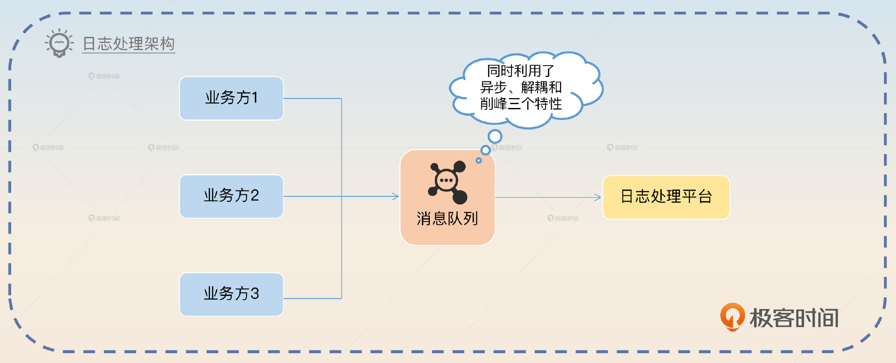

消息通讯是指即时通讯之类的工具，比如说你使用的微信、QQ都是通讯工具。通讯工具主要利用的是异步和解耦特性，不过要是你觉得你的通讯工具会有高并发的收发消息场景，也可以看作是削峰。

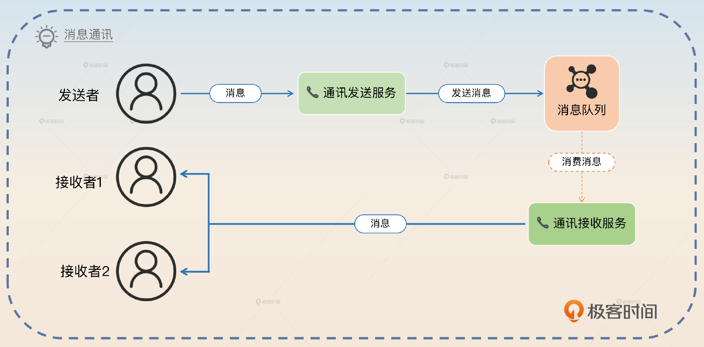

基本上一切消息队列的应用场景，都是围绕异步、解耦和削峰三个特性来设计的。反过来也可以说，如果你有一些需要异步、解耦和削峰的需求，那么消息队列就是最合适的工具。

此外消息队列还可以用来实现事件驱动架构，这个也是你后面要学习的亮点方案。

## 面试准备

在准备消息队列面试的时候，你需要搞清楚下面几点。

- 你们公司有没有使用消息队列？主要用于解决什么场景的问题？
- 如果使用了消息队列，那么在具体的场景下不使用消息队列是否可行？和使用消息队列的方案比起来，有什么优缺点？
- 你们公司用的是什么消息队列，它有什么优缺点？

在前置知识里面我提到了消息队列的三种特性：异步、解耦和削峰。你可以在公司内部，或者自己的过往工作经验里面各找一个案例。虽然我提到过，一个案例可能同时体现了异步、解耦和削峰三个特性，但是你还是需要多准备几个案例，准备得更充分一些。

面试官如果问到了下面这些问题，你都可以直接用这节课的内容回答，或者引导到这里。

- 你有没有用过消息队列？用来解决什么问题？
- 你是否听过延时队列？怎么实现延时队列？
- 如何设计一个秒杀架构？在回答的时候可以强调一下消息队列的作用。
- 什么是事件驱动架构？

我建议你有机会的话，在遇到一些非常复杂棘手的业务时可以考虑使用事件驱动来解决。我个人认为越复杂的业务系统，应用事件驱动就越有价值。

## 基本思路

首先在简历上你就应该写上自己擅长消息队列或者说自己能够用消息队列解决问题。后续面试官在提问的时候就会考虑面消息队列这方面的内容。面试官可能会先问你用消息队列解决过什么问题，那么你回答你准备的案例就可以。

在介绍了案例之后，面试官大概率会问一个问题，就是在具体的场景下，你为什么非得使用消息队列？

在前置知识里面我已经解释了两个场景：日志处理和消息通讯。我这里再补充几个。这些场景都是那种引导性非常强的场景，也就是说，你可以在这些场景下把话题引导到别的主题下。

### 秒杀场景

秒杀也是面试中的一个大热点。一般秒杀的架构设计中都会使用消息队列，同时利用消息队列三个特性。

你可以看一下一个比较简单的秒杀架构图是怎样的。

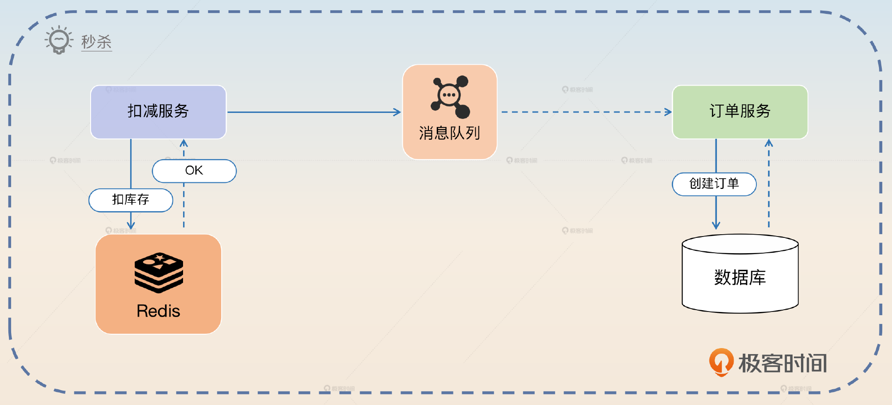

在消息队列之前，要对用户请求做一些校验，比如说这个用户是否已经参加过秒杀了。其次要扣库存，扣库存成功才算是抢到了。紧接着就是把这个请求丢到消息队列里，后续异步创建订单，并且完成支付。

那么这种设计的精髓就是利用消息队列把整个秒杀过程分成轻重两个部分。

- 在进入消息队列之前的操作都是轻量级的，一般也就是内存计算或者访问一些 Redis，所以你可以认为瓶颈基本上取决于 Redis 的性能。
- 而进入消息队列之后就是非常重量级的操作了，比如说要进一步验证交易的合法性，操作数据库等。

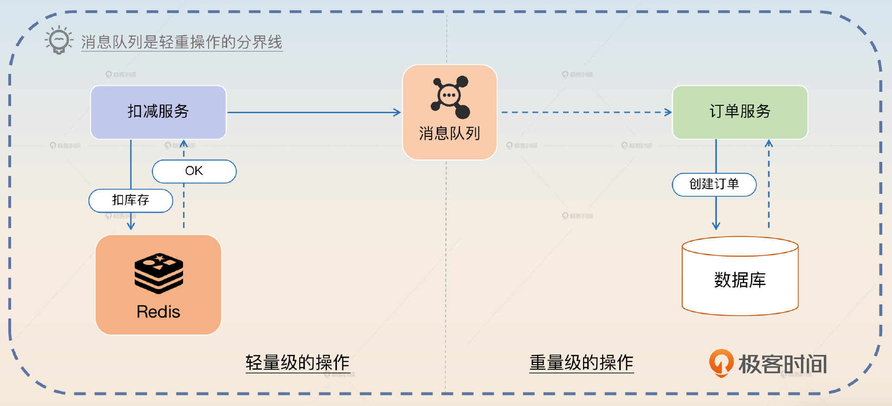

所以你可以这样介绍秒杀方案，关键词是 **轻重之分**。

> 消息队列还经常被用在秒杀场景里面。最基本的架构是秒杀请求进来之后，会有一个轻量级的服务。这个服务就是做一些限流、请求校验和库存扣减的事情。这些事情差不多都是内存操作，最多操作 Redis。当库存扣减成功之后，就会把秒杀请求丢到一个消息队列。
>
> 然后订单服务会从消息队列里面将请求拿出来，真正创建订单，并且提示用户支付。这一部分就是重量级的操作，无法支撑大规模并发。所以，在这个场景里面可以把消息队列看作是一个轻重操作的分界线。

这个场景介绍完，面试官就可能会进一步问你和秒杀有关的内容，比如说扣减了库存之后，万一用户没有支付怎么办，于是你就可以用下面这个案例了。

### 订单超时取消

在电商里面，如果用户下单之后一直没有支付，那么这个订单就会被取消，从而释放库存。

订单超时取消在行业内有很多种做法，这里我只介绍使用消息队列的解决方案。要想利用消息队列实现订单超时取消功能，需要使用 **延时消息**。所谓的延时消息，就是发送者在发送之后，要过一段时间，消费者才能消费的消息。

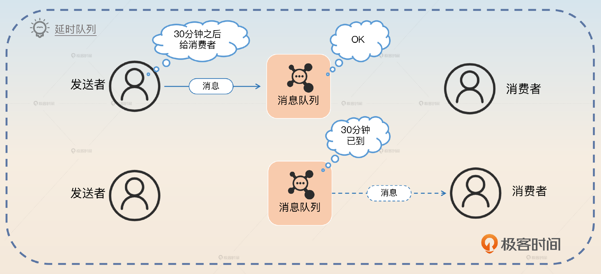

你可以这样介绍你的方案。

> 消息队列也可以用于订单超时取消这种场景。在这种场景下，我们可以准备一个延时队列，比如说超时时间是 30 分钟，那么延时也是 30 分钟。
>
> 但是消费的时候要小心并发问题，就是在 30 分钟这一个时刻，一边用户支付，一边消费者也消费超时消息，就会有并发问题。解决思路有很多，可以使用分布式锁、乐观锁，也可以使用 SELECT FOR UPDATE 锁住订单，防止并发操作。

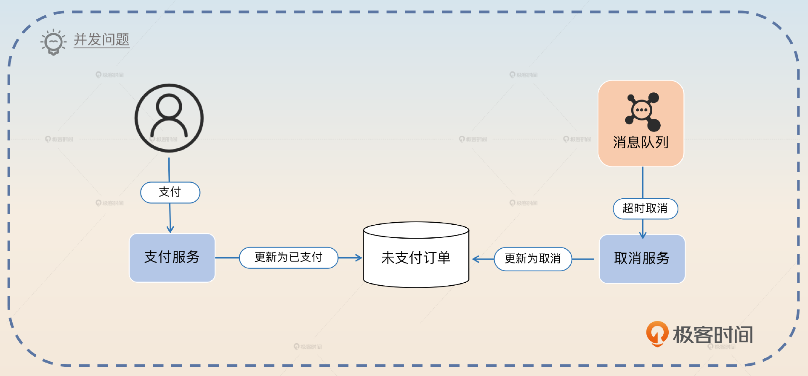

这里我提到了并发问题，在解决并发问题的思路中我也提到了之前数据库部分我们学过的 SELECT FOR UPDATE 和乐观锁，记得复习一下。

这里我再额外解释一下乐观锁方案的关键步骤。乐观锁方案就是在你把订单更新为超时状态的时候，需要 **确保原始状态还是未支付**。

```sql
UPDATE `order` SET `status`="超时未支付"
WHERE `id`=123 AND `status`="未支付"

```

类似地，在支付那边也需要确保只有在 status 是未支付的时候才能发起支付。

这个场景主要是把话题引导到延时消息，延时消息我们后面会详细分析。目前主流的消息队列中 RocketMQ 是支持延时消息的，它有插件支持。但是 Kafka 不支持，不过后续我也会教你怎么用 Kafka 支持延时消息。所以当面试官问你“为什么不用 Kafka”这种问题，你可以把 Kafka 不支持延时消息作为理由之一。

## 亮点方案

这节课我给你准备了一个理论上的亮点和一个高级并且复杂的方案。第一个亮点是回答为什么一定要使用消息队列。前面我给你讲过消息队列广泛应用于各种场景，那么你有没有深入思考过，为什么你非得使用消息队列呢？

换一句话来说，不用消息队列会怎样？用了又有什么好处呢？

### 为什么一定要使用消息队列？

这个问题本身也是反直觉的。也就是说因为业界一直说消息队列很好很好，那么如果你没有思考过这个问题，面试官突如其来问一下，你就不知道怎么回答了。

我们先从创建订单的典型场景看起。在订单创建之后，要通知很多下游，正常做法都是发送一个订单创建的消息，然后关心订单创建的业务方各自去订阅这个消息就可以了。

这里面试官就会问，为什么订单服务不直接调用各个业务方呢？

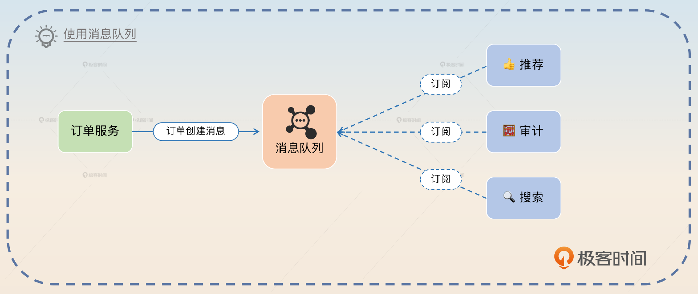

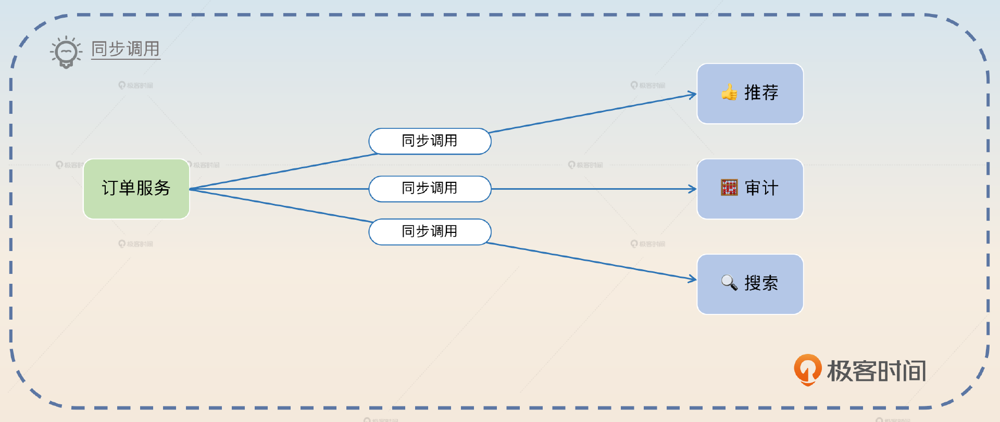

类似的场景还有，在消息通讯里面为什么服务端不直接把消息转发给各个接收者呢？

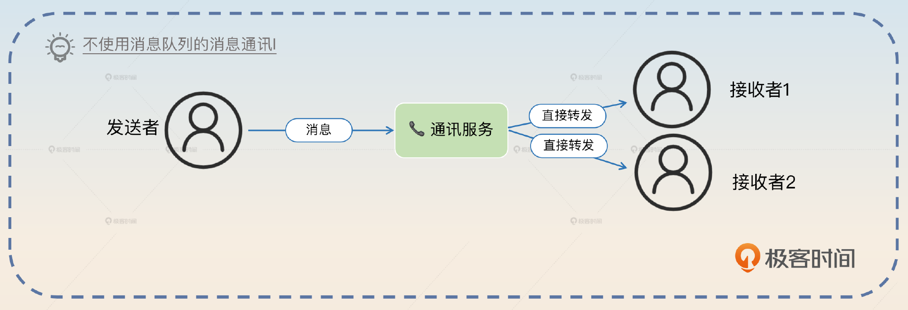

这一类的问题，本质上都是在问： **在这个业务场景下，不异步、不解耦或者不削峰会有什么问题**？

那么不用消息队列究竟有什么问题呢？答案是性能差、扩展性差、可用性差。

这里有一个不太好的回答，就是耦合严重。这个回答只能说你答了，但是回答得不到位。毕竟你没有解耦自然就是耦合严重，所以面试官希望你深入解释的是耦合严重会带来什么后果。你其实可以这么说：

> 同步调用方案相比引入消息队列有三个缺陷，分别是性能差、可扩展性差和可用性差。

#### 性能差

性能差是因为你需要停下来等全部调用完成才可以返回响应。

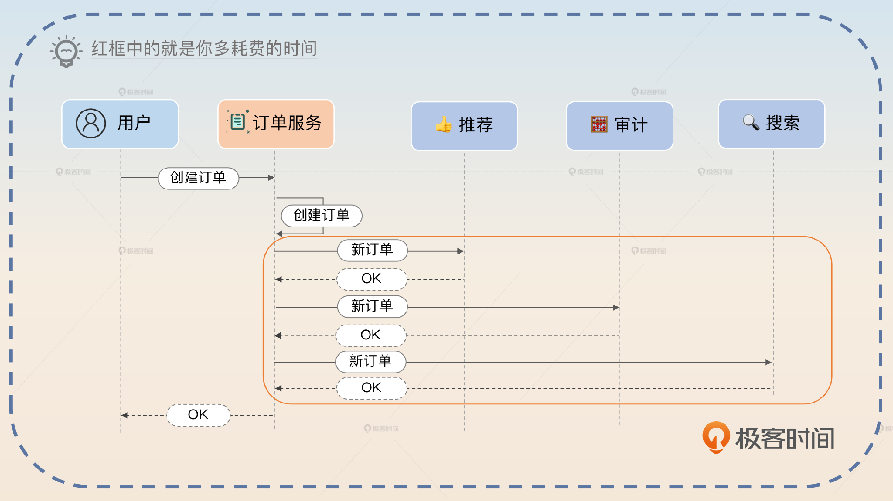

> 业务方必须停下来等待结果，如果我这里需要通知三个下游，那么就需要发起三次调用，并且等它们各自的结果返回之后才能继续往下执行，或者返回响应，这样性能太差了。

紧接着面试官就可能和你抬扛：“如果我并发调用呢？性能也很好啊！”他隐含的意思就是你可以开启多个线程或者协程，并发调用所有的下游。

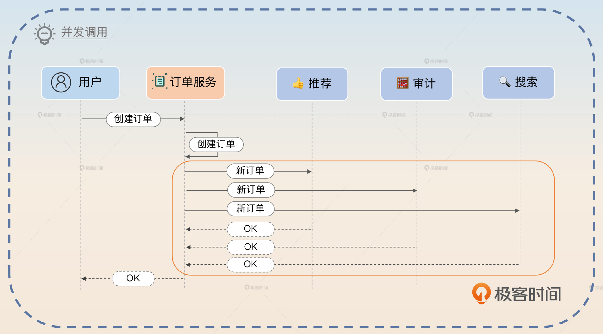

但是，即便是 **并发调用性能也比使用消息队列差**。

> 并发调用相比于使用消息队列，性能也更差。在并发调用的情况下，性能取决于最坏的那个同步调用什么时候返回结果。而正常我们丢一个消息到消息中间件上是很快的。

紧接着你可以补充一点，引出扩展性和可用性的话题。

> 并且，即便并发调用的性能损耗是可以接受的，但是扩展性和可用性还是解决不了。

#### 扩展性

扩展性归根结底就是一句话：如果一个新的下游要接入进来有多难？在使用消息队列的时候，新的下游要接入，只需要自己去订阅消息就可以，完全不需要通知任何人。在公司里，可能就是你丢给下游一个文档，下游自己看看文档，知道订阅哪个 topic，消息生产速率有多高，差不多就能自己独立完成接入了。

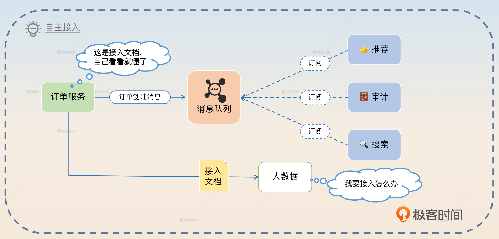

但是如果是同步调用，事情就麻烦很多。你需要下游提供 RPC 服务地址（定位信息），根据下游的 API 设计构造请求、处理响应，再一起联调、测试、上线，遇到了 Bug 还得推诿扯皮一番。

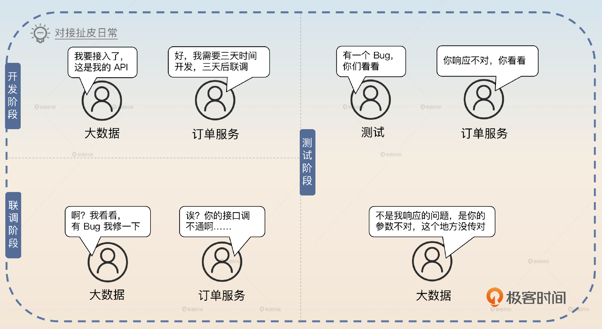

所以这里你可以这样回答。

> 在使用消息队列的情况下，消息发送者完全不关心谁会去消费这些消息。同样地，如果有一个新的业务方要订阅这个消息，它可以自主完成。而同步调用的时候，上游必须知道下游的接口，然后要知道如何构造请求、如何解析响应，还要联调、测试、上线，整个过程都得和下游密切合作，因此效率特别低，可扩展性很差。

但是这里你可以刷一个亮点，就是在类似的场景下，如果因为一些业务情况确实不能使用消息队列，那么可以考虑提供一个一致性的抽象来减轻这种接入的负担。

> 如果在某些场景下确实不能用消息队列，那么这个扩展性问题可以通过一些技术手段来缓解。比如说上游提供一整套的对接规范，包括 API 定义、请求和响应中每个字段的含义。这样下游就对着这个 API 定义来提供实现，上游就不需要适配每一个下游了。

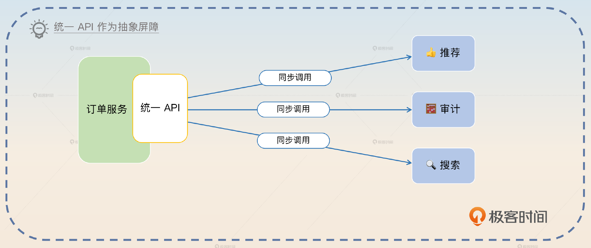

然后你进一步总结。

> 这是对接众多下游的基本设计，可以充分保障高可扩展性和高研发效率。

#### 可用性

在使用消息队列的方案中，你只需要确保自己把消息发送到了消息队列上，就认为操作已经成功了。

但是，在同步调用方案中，你必须要确保调用所有的下游都成功了才算是成功了。所以你还需要额外考虑部分成功部分失败的问题。

比如说在订单的例子里面，如果同步调用到推荐成功，但是到审计和搜索失败了，那么该怎么办？

所以这样来看，相比使用消息队列的方案，同步调用的方案更加容易出错，并且容错也更难。

### 事件驱动

事件驱动（Event-Driven）可以说是一种软件开发模式，也可以看作是一种架构。它的核心思想是通过把系统看作一系列事件的处理过程，来实现对系统的优化和重构。

你可以直观地理解成，整个系统不同组件之间的通信是通过事件来完成的。也就是组件 1 发送一个事件到消息队列上，然后组件 2 消费这个消息。组件 2 消费完成后再发出一个消息到消息队列。每一个事件就是一个消息。

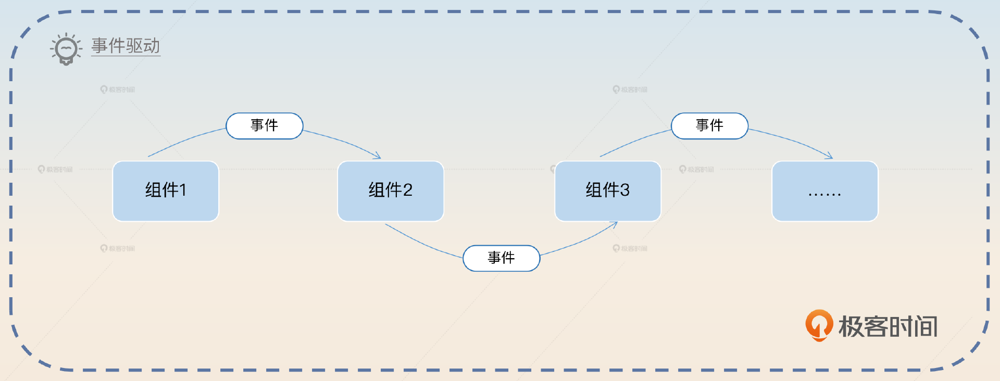

这些消息可能有不同的 Topic，也可能发送到不同的消息队列集群。但是毫无疑问它们要通过密切合作来解决一个业务问题。

它的优点十分明显。

- 低耦合性：各个组件只依赖消息队列，组件之间通过消息的定义间接地耦合在一起。换句话来说，组件只需要知道消息的定义，并不需要知道发送消息的组件是哪个。
- 可扩展性：事件驱动的应用程序具有很强的扩展性，可以通过添加新的事件处理程序、组件等来实现系统的扩展和升级。
- 高可用：可以充分利用消息队列的可靠性、可重复消费等特性，来保证消息发送、消费高可用，从而保证整个系统的高可用。

事件驱动适合用来解决一些 **复杂、步骤繁多、流程冗长** 的业务问题。在下面的亮点方案里面，我用的就是事件驱动结合 SAGA 分布式事务的方案。这个方案足够高级、冷僻、奇异。它原本用在一个大规模的分布式系统里面，是一个高性能和高可用的分布式事务解决方案。

你可以看一下事件驱动和 SAGA 结合之后的形态。

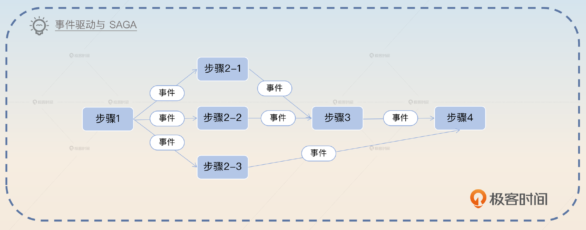

也就是说，当某一个步骤完成之后，就会发出一个或者多个事件，驱动事务中的后续步骤。包括回滚也是这样，比如说发出一个代表某一个步骤执行失败的事件，对应的消费者就会去执行反向补偿步骤。

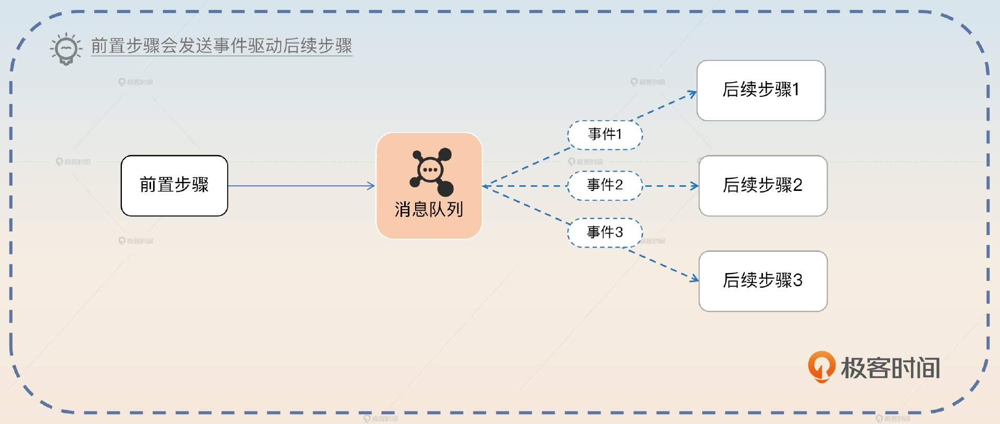

使用事件驱动的优点是低耦合、高扩展性、异步、高可用。不过在实时性上要比同步调用差一点。我用一个最简单的例子给你解释清楚它的运作。比如说你有一个分布式事务，就是要求先更新 DB，再更新缓存。那么在缓存更新失败的场景下，过程看起来就像图里展示的这样。

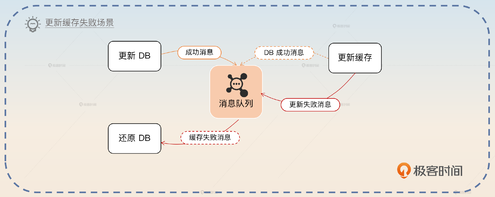

其中还原 DB 是指你需要用原始数据更新回去，而不是数据库回滚操作，我之前在 SAGA 分布式事务里面就讲过的。当然，这个例子只是帮助你理解，正常来说这么简单的分布式事务是用不着 SAGA 的。

你可以考虑这样介绍这个方案。

> 之前我们公司用事件驱动实现了 SAGA 的分布式事务解决方案。基于事件驱动的 SAGA 模式就是在每一个步骤结束之后发送事件，不同的步骤会发送一个或者多个事件。然后消费者消费了消息之后，就开始执行下一个步骤。比如说在更新DB再更新缓存的场景里就可以这样用。这种形态和一般的事务比起来，优势是低耦合、高扩展、高可用。

在这个方案里面，面试官可能追问的方向有两个，一个是分布式事务，这个你 [第 18 讲](https://time.geekbang.org/column/article/678287) 已经学过了。另外一个方向是课程后面会讨论的问题，就是怎么做到消息的可靠发送和可靠消费。

## 面试思路总结

今天这节课的内容还是比较简单的，主要介绍了消息队列的三个用途： **解耦、异步、削峰**，还有几个使用消息队列的场景，包括 **日志处理、消息通讯、秒杀场景和订单超时取消**。我希望你能够从这些场景里面领悟到消息队列适合解决什么样的问题。

最后在面试的亮点部分，我给出了一个 **基于事件驱动的 SAGA 分布式事务方案**。事件驱动是一个解决复杂业务问题的神器，你有机会的话尽可能实践一下，之后有很大可能会用到。

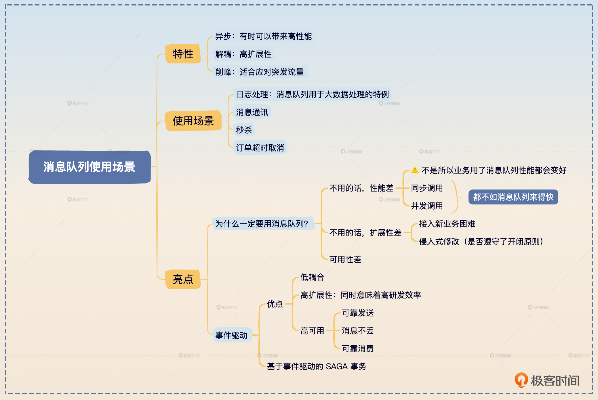

## 思考题

最后请你来思考2个问题。

- 除了我这里列举的消息队列使用场景，你还见过哪些很有特点的使用消息队列的场景？
- 面试中还有一个比较经典的问题，就是你为什么用 Kafka、RabbitMQ 或 RocketMQ，又或者说你为什么使用某一个中间件，这种问题该怎么回答呢？

欢迎你把自己的经验和面试心得分享到评论区，也欢迎你把这节课分享给需要的朋友，邀他一起学习，我们下节课再见！