# 23｜延迟消息：怎么在 Kafka 上支持延迟消息？
你好，我是大明。今天我们来讨论一个在消息队列面试中非常热的话题——延迟消息。

延迟消息在 Kafka 面试里面是非常热门的，其他消息队列多少也会问，但是不如 Kafka 问得频繁。因为 Kafka 不支持延迟消息是大家都知道的。但是偏偏 Kafka 又用得多，很多业务场景也要求使用延迟消息，因此面试的时候延迟消息就成了一个重要的考察点。

和之前的面试点不同，能把延迟消息的方案讲得清楚透彻的人就不多，更不要说刷亮点了。那么今天我就带你深入延迟消息，并且给出一个非常高级的方案。这个方案会涉及到分库分表，所以能帮助你把这些知识融会贯通。

## 延迟队列和延迟消息

延迟队列是一种特殊的队列。它里面的每个元素都有一个过期时间，当元素还没到过期时间的时候，如果你试图从队列里面获取一个元素，你会被阻塞。当有元素过期的时候，你就会拿到这个过期的元素。你可以这样想，你拿到的永远是最先过期的那个元素。

很多语言本身就提供了延迟队列的实现，比如说在 Java 里面的 DelayQueue。

这节课我们讨论的就是一种特殊形态的延迟队列，或者说是基于消息队列的延迟队列，也叫做延迟消息。具体来说，延迟消息是指消息不是立刻被消费的，而是在经过一段时间之后，才会被消费。在到时间之前，这个消息一直都被存储在消息队列的服务器上。上一节课，我就举了订单超时取消的例子，它就用到了延迟消息。

## 支持延迟消息的其他消息队列

目前，大部分云厂商版本的消息队列都支持了延迟消息，不过我们这里讨论的是原生支持的消息队列。如果你本身使用了今天我们介绍的这些中间件，那么你可以直接使用这些内容来面试。如果你使用的是 Kafka，那么你在面试的时候要注意结合着这些消息队列，对比着面试。

RabbitMQ 有插件支持延迟消息功能，而 RocketMQ 和 Kafka 则只能自己研发。

### RabbitMQ

RabbitMQ 有一个延迟消息的插件 rabbitmq\_delayed\_message\_exchange，只需要启用这个插件就可以使用延迟消息。这个插件的基本原理也比较简单，就是实现了一个 exchange。这个 exchange 控制住了消息什么时候会被真的投递到队列里。

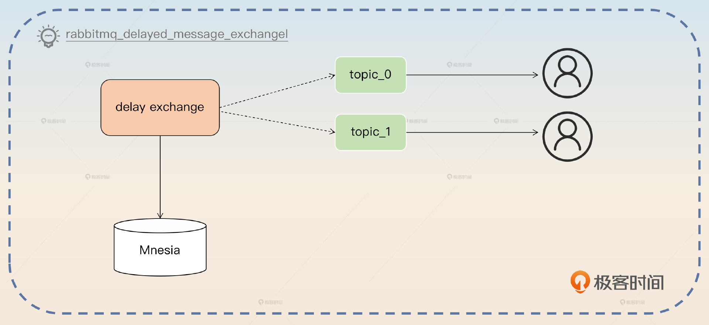

如上图所示，消息会先暂时存储在 exchange 里面。它使用的是 Mnesia 来存储，如果你不知道 Mnesia 是什么，就直观地把它看作一个基于文件的数据库。

当延迟的时间满足条件之后，这些存储的数据就会被投递到真正的消息队列里面。紧接着消费者就可以消费到这个消息了。你可以从这里得到一个启发，就是如果要实现一个延迟队列，是可以借助数据库的。

那么这个插件本身也是有很多限制的，在它的官网主页里面就有说明，其中有两个最突出的限制。

- 消息在真的被投递到目标消息队列之前，是存放在接收到了这个消息的服务端本地的 Mnesia 里面。也就是说，如果这个时候还没有刷新磁盘，那么消息就会丢失；如果这个节点不可用了，那么消息也同样会丢失。
- 不支持高并发、大数据量。显然，现实中很多场景都是要在高并发大数据量场景下使用延迟消息的，比如说前面说的订单超时取消。因此这个缺点也限制了这个插件被广泛使用。

除了这个插件，开发者也可以自己手动实现延迟消息。这就要利用到 RabbitMQ 的 ttl 功能和所谓的死信队列了。

死信队列是一种逻辑上的概念，也就是说它本身只是一个普通的队列。而死信的意思是指过期的无法被消费的消息，这些消息会被投送到这个死信队列。

简单来说，就是开发者准备一个队列 delay\_queue，为这个 delay\_queue 设置过期时间，这个 delay\_queue 不需要消费者。然后把你真实的业务 biz\_queue 绑定到这个 delay\_queue，作为它的死信队列。

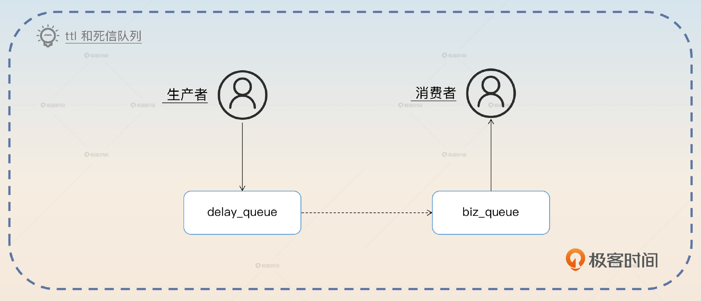

生产者发送消息到 delay\_queue，因为没有消费者，所以消息会过期。过期之后的消息被转发到死信队列，也就是 biz\_queue 里面。这时候消费者就能拿到消息了。

这种方案并没有插件的那两个缺点。但是 ttl 的设置是在队列级别上，也就是你一个 delay\_queue 的延时是固定的，不能做到随机。比如说我这一条消息延后三分钟，另外一条消息延后五分钟，这是不可能的。因此，你可能需要创建很多不同 ttl 的 delay\_queue 才能满足业务需要。

## 面试准备

在准备延迟消息面试的时候，你需要先弄清楚公司内部的一些情况。

- 你所在公司有没有使用延迟消息的场景？
- 你所在公司的消息中间件支不支持延迟消息？
- 延迟消息的 QPS 有多高，消息量有多大？延迟时间有多长？

然后，在面试中聊到下面这些话题的时候，你可以尝试把话题引导到这里。

- 如果你介绍你的业务的时候，提到了需要延迟消息的场景，就像我举的订单超时取消的例子，那么你就可以深入讨论延迟消息是怎么实现的。
- 如果你聊到了 Kafka，在介绍它的优缺点的时候，你说一说它的缺点，就是不支持延迟队列，那么面试官就会问你如果要 Kafka 支持延迟队列应该怎么做。
- 如果你聊到了你们公司使用的消息队列，但并不是 Kafka，那么你同样可以尝试引导到这里，比如说强调当初你们 MQ 技术选型的时候，考虑到 Kafka 不支持延迟消息，所以最终没有选择 Kafka。

## 基础思路

这里我给出了很多比较简单的方案，你可以从这些方案里选择一个作为公司的方案，其他方案你就作为自己了解但是没有实践过的方案。

### 利用定时任务调度

利用定时任务来实现延迟消息是最好、最简单的办法。对于一个延迟消息来说，一个延迟到 30 分钟后才可以被消费的消息，也可以认为是 30 分钟后才可以发送。也就是说，你可以设定一个定时任务，这个任务会在 30 分钟后把消息发送到消息服务器上。

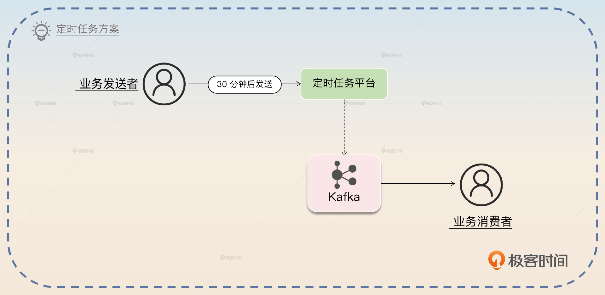

所以你可以这么介绍这个方案。

> 最简单的做法就是利用定时任务，最好是解决了持久化的分布式任务平台。那么业务发送者就相当于注册一个任务，这个任务就是在 30 分钟之后发送一条消息到 Kafka 上。之后业务消费者就能够消费了。

同时你还可以阐述一下这个方案的缺点。

> 这个方案的最大缺点是支撑不住高并发。这是因为绝大多数定时任务中间件都没办法支撑住高并发、大数据的定时任务调度，所以只有应用规模小，延迟消息也不多的话，才可以考虑使用这个方案。如果想要支持高并发、大数据的延迟方案，还是要考虑利用消息队列。

最后一句话是为了让你把话题重新拉回消息队列这里，并且阐述下面这个方案。

### 分区设置不同延迟时间

这种方案应该算是很简单，而且也很好用的方案。你可以看一下它的基本架构图。

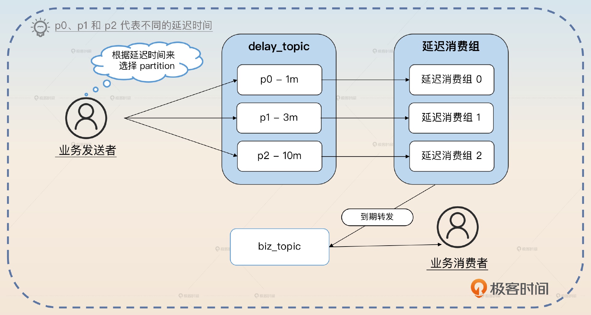

这里关键的角色是 delay\_topic 和延迟消费组。

- delay\_topic 里面的分区被用来接收不同延迟时间的消息。比如说在上图中分成了 p0、p1、p2 三个分区，分别用于接收延迟时间为 1min、3min和 10min 的消息。
- 延迟消费组会创建出和分区数量一样的消费者，每一个消费者消费一个分区。消费者每次读取一个消息，等延迟足够长的时间之后，就会转发给 biz\_topic。

因此对于业务发送者来说，他们需要根据自己的延迟时间来选择正确的分区。而业务消费者则是对整个过程是无感的，也就是说他们并不知道中间有延迟消费者在做转发的事情。

所以你可以简单介绍这个方案。

> 我们公司用的方案是比较简单的，也就是创建了一个 delay\_topic，这个topic 有 N 个分区，每个分区设定了不同的延迟时间。然后我们创建了一个消费组去消费这个 delay\_topic，每个分区有一个独立的消费者。每个消费者在读取到一条消息之后，就会根据消息里面的延迟时间来等待一段时间。等待完之后，再把消息发送到业务方真正的 topic 上。

注意，这个 N 很灵活，我给你两个选择。

- 5个分区：延迟时间分别是 1min、3min、5min、10min、30min。
- 10个分区：延迟时间分别是 1min、3min，5min、10min、15min、30min、60min、90min、120min、180min。

总体来说 N 就是一个根据业务来设计的东西。

接下来就是你刷亮点的地方了，第一个就是 rebalance 问题。

#### rebalance 问题

在这个方案中，因为消费者睡眠了，睡眠期间不会消费消息，所以 Kafka 就会判定这个消费者已经崩溃了，就会触发 rebalance。发生 rebalance 之后，等消费者再恢复过来，就不知道又会被分配到哪个分区，那么之前的睡眠就可以认为是白睡了。

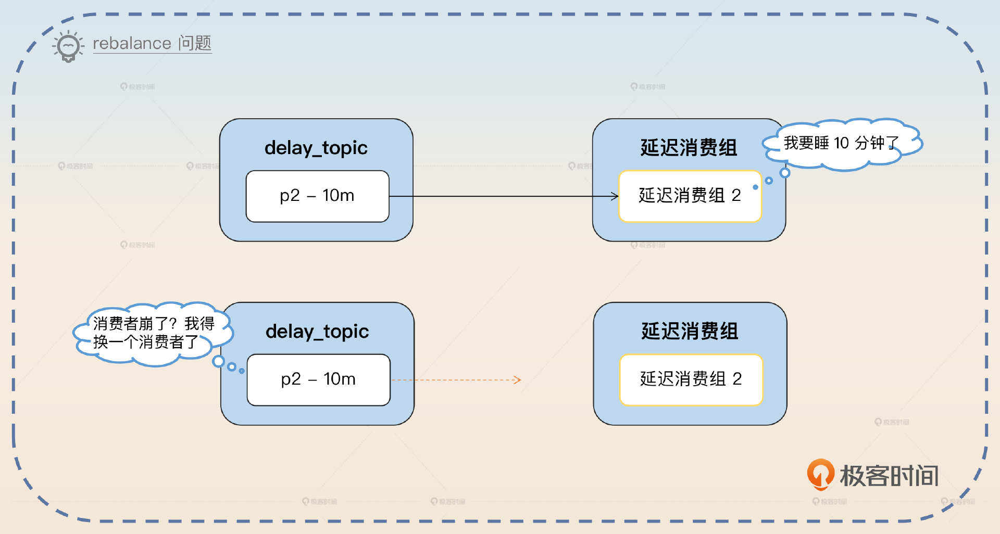

为了避免这个问题，就需要确保在睡眠期间不会触发 rebalance。因此需要利用 Kafka 的暂停（Pause）功能，在睡眠结束之后，再恢复（Resume）。注意，Kafka 的暂停功能相当于拉取 0 条数据，并不是说不拉数据，也就是说还是会发起 Poll 调用。

所以整体逻辑就是这样的：

1. 拉取一条消息，假如说 offset = N，查看剩余的延迟时间 t。
2. 暂停消费，睡眠一段时间 t。
3. 睡眠结束之后，恢复消费，继续从 offset = N 开始消费。

如果面试官没有做过类似的事情的话，可能想不到这里还有坑，所以我建议你主动补充说明，关键词是 **rebalance**。

> 这个方案里面，要注意一个 rebalance 的问题。因为每次我们拉取到消息之后，都要根据消息的剩余延迟时间，睡眠一段时间。在这段时间之内，Kafka 会认为消费者已经崩溃了，从而触发 rebalance。等睡眠结束之后，重新消费，就不一定还是消费原本的那个分区了。
>
> 所以为了避免这个问题，在睡眠之前，要暂停消费，恢复之后重新消费。重新消费的时候，要注意把 offset 重置为之前拉取那个消息的 offset。

这个时候，你还可以进一步刷亮点，就是暂停的时候还是会发出 Poll 调用，只不过不会真的把数据从服务端拉到消费者那里。

> Kafka 的暂停消费，并不是不再发起 Poll 请求，而是 Poll 了但是不会真的拉消息。这样可以让 Kafka 始终认为消费者还活着。

这个 rebalance 问题还是不太容易想到，但是一致性问题，面试官就很容易想到了。

#### 一致性问题

前面说的最后几个步骤是从服务端拉取到消息，然后转发到 biz\_topic 里面。那么你应该意识到这里面涉及到了一个关键问题，是先提交消息，还是先转发？

如果是先提交，那么就会出现消息提交了，但是还来不及转发 biz\_topic 就宕机的情况，这显然不能容忍。

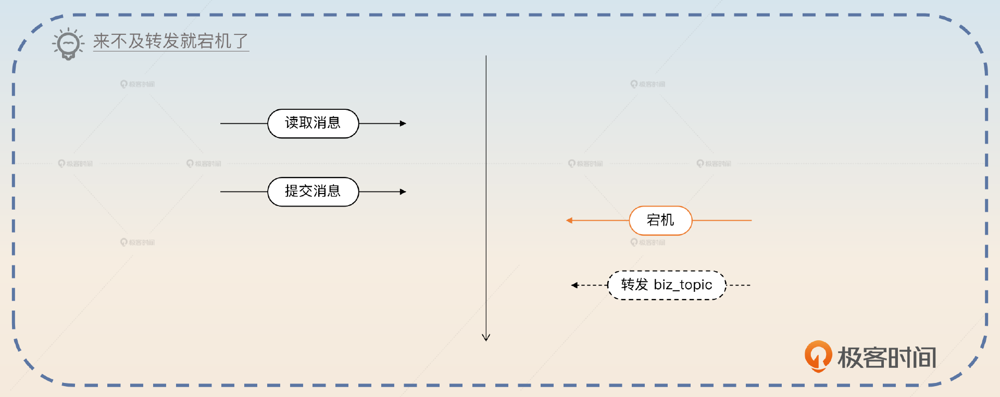

但是如果先转发 biz\_topic，然后提交。那如果提交之前宕机了，后面恢复过来，又会转发一次。好在多发一次并不是什么问题，因为你可以要求业务消费者确保自己的逻辑是幂等的。

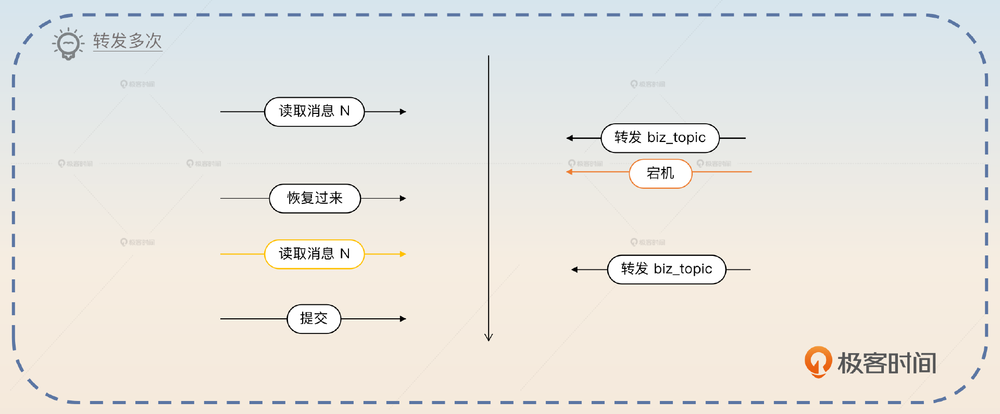

其实，即便是非延迟消息，还是需要消费者保证自己的逻辑是幂等的。因为本身发送者就存在重复发送的可能，不然没办法确保消息一定投递到 消息服务器上。

面试官很可能会问这个一致性的问题，那么你就可以抓住关键词 **后提交** 来回答。

> 一致性的问题解决起来需要业务方的配合。我们这个的逻辑是到了延迟时间，就先转发 biz\_topic，然后再提交。也就是说，如果在转发 biz\_topic 之后，提交失败了，下一次就还可以重试，那么 biz\_topic 就可能收到两条同样的消息。在这种场景下，就只能要求消费者做到幂等。当然，即便不用延迟消息，消费者最好也要做到幂等的。因为发送方为了确保发送成功，本身就可能重试。

这个回答可能把话题引申到如何做幂等，后面会有一个高级方案，这里我就不多说了。

#### 优缺点分析

在回答完前面的两个亮点之后，你要分析一下这个方案的优缺点。

> 这个方案最大的优点就是足够简单，对业务方的影响很小，业务方只需要根据自己的延迟时间选择正确的分区就可以了。

不过这个方案也有两个突出的缺点，就是 **延迟时间必须预先设定好、分区间负载不均匀**。

> 这个方案的缺点其实还挺严重的。 **第一个是延迟时间必须预先设定好**，比如只能允许延迟 1min、3min 或者 10min 的消息，不支持随机延迟时间。在一些业务场景下，需要根据具体业务数据来计算延迟时间，那么这个就不适用了。 **第二个是分区之间负载不均匀**。比如很多业务可能只需要延迟 3min，那么 1min 和 10min 分区的数据就很少。这会进一步导致一个问题， **就是负载高的分区会出现消息积压的问题**。
>
> 在这里，很多解决消息积压的手段都无法使用，所以只能考虑多设置几个延迟时间相近的分区，比如说在 3min 附近设置 2min30s，3min30s 这种分区来分摊压力。

这里你会把话题引导到消息积压如何解决的问题上，这个我们在后面第25讲会讲到。同时你又可以把话题引导到亮点方案里，就是如何实现随机延迟时间。

## 基于 MySQL 的亮点方案

如果在实践中，我会劝你放弃支持随机延迟时间。因为绝大多数情况下，业务是用不着非得随机延迟时间的，他们完全可以通过调整业务来适配固定的几个延迟时间。不过在面试中，你还是需要利用一下支持随机延迟时间来进一步加深面试官对你的印象。

你可以看一下基于 MySQL 方案的基本架构图。

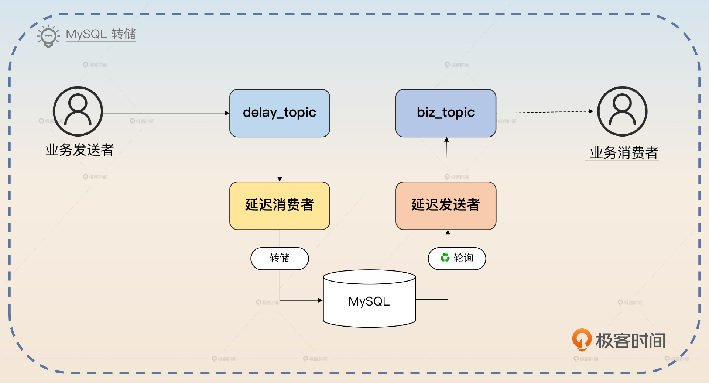

这个方案里面的关键点是创建一个 delay\_topic，业务发送者把消息发送到这个 topic 里面，消息里面带上了需要延迟的时间。里面有一个延迟消费者，它会消费 delay\_topic 里面的消息，转储到数据库中。还有一个延迟发送者，它会轮询数据库里的消息，把已经可以转发出去的消息转发到真正的 biz\_topic 上。发送完之后，延迟发送者把数据库的状态更新成已发送。最后业务消费者消费 biz\_topic。

这个方案在落地的时候，要想支撑住高并发，还是一个比较麻烦的事情，所以 **怎么支撑住高并发就是我们的关注点。**

在前面的基本架构里面，最明显的性能瓶颈就是 MySQL，因为这个场景是一个写密集的场景。所以要想撑住高并发就要想办法提高 MySQL 的性能。当然最佳的策略还是换一个存储结构，比如说换 TiDB 或者 Elasticsearch。不过你要是回答换一种存储结构，那就没办法刷出亮点了。使用 MySQL 的话，你就可以从分区表、表交替、分库分表、批量操作几个方案里面选择。

### 分区表

最简单的优化方案，就是在 MySQL 上应用分区。因为延迟消息是一个时效性很强的数据，也就是说，你完全可以按照发送时间，也就是延迟之后具体的发送时间点来分区。在并发不是很高的时候，你可以按照周来分区。在并发很高的时候，你可以按照天来分区。历史分区可以及时清理掉，因为用不上了。

你这么回答：

> 要想提高 MySQL 的性能，一个比较简单的做法是使用分区表，比如说根据并发量选择按月分、按周分、按天分。历史分区就可以直接清理掉。

与分区表类似的解决方案，还有表交替方案。

### 表交替

表交替要复杂一点，但是也很好用。表交替的意思是你准备两个表，然后交替写、交替查询。比如说你今天用 tab\_0，明天用 tab\_1。当你用 tab\_1 的时候你就可以直接清空（TRUNCATE）tab\_0 的数据，反过来也是这样。这种按天交替的方案对延迟时间是有限制的，延迟时间不能超过一天。

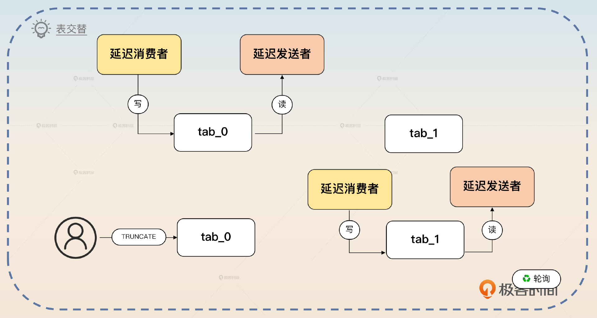

> 还可以考虑使用表交替方案，也就是说准备两个表 tab\_0、tab\_1。那么最开始的时候可以读写 tab\_0，然后换成读写 tab\_1。每次交替的时候，都可以把之前使用的数据 TRUNCATE 掉。TRUNCATE 本身很快，所以没什么性能问题。

### 分库分表

前面两个方案实际上就能撑住比较高的并发了，但是要想进一步提高并发能力，就只能考虑分库分表了，毕竟单一的库再怎么分区或者交替都存在写瓶颈。

> 如果并发确实非常高，那么就只能考虑采用分库分表的方案了。这里分库分表也很简单，只需要按照 biz\_topic 的名字来分库分表就可以了。而且每一张表可以叠加前面的分区表和交替表的方案，进一步提高性能。

不过这个方案也有一定的隐患，第一个问题就是不同 topic 的并发度不一样，比如说 biz\_topic\_1 的并发只有 100，而 biz\_topic\_2 的并发有 10000，那么按照 biz\_topic 来分，就会出现不同库不同表的压力差异很大的问题。

在这种情况下，你可以回答关键词 **轮询插入**。

> 如果不考虑消息有序性的问题，那么也可以考虑轮询。比如说分库分表是 4 \* 8 = 32 张表，那么就可以要求每一个延迟消费者，轮流往这些表里插入数据。因为延迟消息有一个很显著的特点，就是查找的时候只会按照发送时间来找，所以随机插入都没问题。

这个你可能难以理解，我给你举个例子，比如说我有一个消息发送给 biz\_topic\_1，要求是一分钟后发出去。那么不管这个消息被存在哪个表，延迟发送者都可以找出来，然后转发到 biz\_topic\_1。

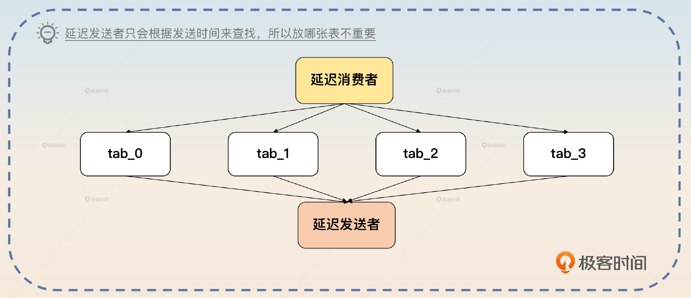

当然你的回答也引到了另一个亮点，就是消息有序性。

> 要想做到延迟消息有序性，有一个比较简单的方案。在分库分表的时候，确保同一个 biz\_topic 的消息都落到同一张表里面。并且最开始发送到 delay\_topic 上也是按照 biz\_topic 的名字来选择分区的，那么就可以保证延迟消息转发到 biz\_topic 上跟它们被发送到 delay\_topic 上是一样的。

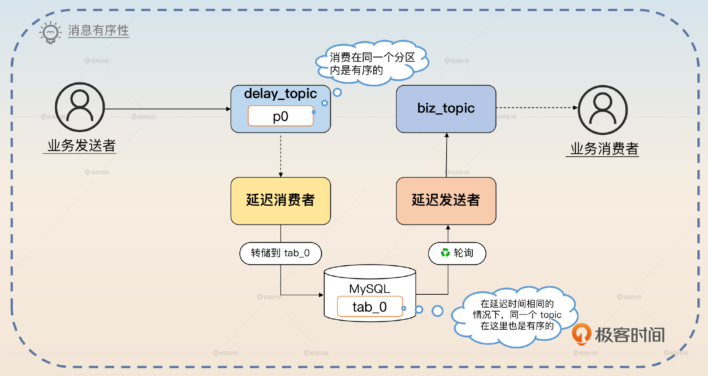

到这里，你还剩下一个可以同时在延迟消费者和延迟发送者上使用的策略：批量操作。

### 批量操作

这个也非常简单，而且性能会有大幅提升。简单来说，就是批量插入、批量更新。

> 我们还可以利用批量操作来减轻 MySQL 的压力。对于延迟消费者来说，它可以消费了一批数据之后再批量插入到数据库里面，然后再提交这一批消息。对于延迟发送者来说，当发送了一批数据之后，再批量把这些消息更新为已发送。

那么你可能注意到，这个批量操作会使数据一致性问题更加严重。

但是这个方案类似于分区设置不同延时时间方案，只需要消费者做到幂等就可以了。本质上，这里的一致性问题要么是因为延迟消费者重复消费，要么就是因为延迟发送者重复发送。但不管是哪个原因，消费者幂等都可以解决问题。

## 面试思路总结

最后我们来总结一下这节课的内容，消息队列有两个基本的延迟消息解决方案： **利用定时任务调度和分区设置不同延迟时间**。在为分区设置不同的延迟时间时，你要注意rebalance和一致性的问题。

最后我给出了一个基于MySQL的亮点方案。你要记住里面的四个关键点： **分区表、表交替、分库分表、批量操作**。这里我强调一下分库分表，因为本身它也是一个高级话题，所以你把延迟消息和分库分表结合在一起去面试，优势显著。

当然，如果你本身不是使用 Kafka 的，这些方案也是有参考价值的。比如说你用 RabbitMQ，但是 RabbitMQ 已有的插件缺陷太多，你完全可以使用我后面描述的 MySQL 方案做一个类似的插件出来。

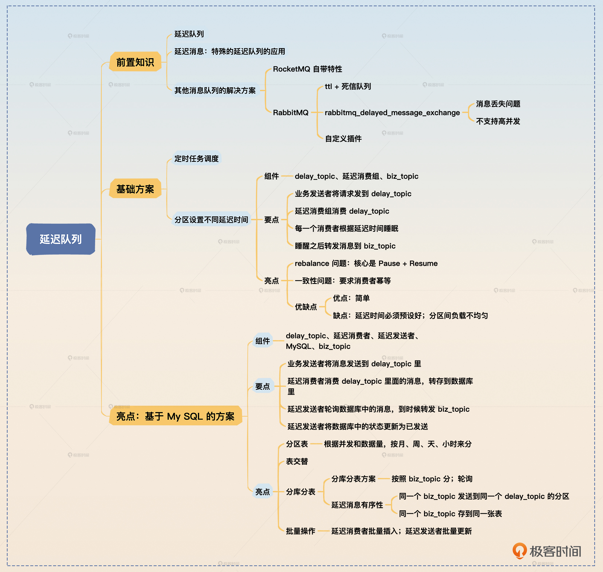

## 思考题

- 在基础思路里面，我讲了一个不同分区设置不同延迟时间的方案，你觉得这个地方可以考虑换成不同 topic 设置不同延迟时间的方案吗？如果可以的话，topic 的分区该怎么设置？延迟消费者又该怎么办？
- 我在最后亮点方案的分库分表里面还提到了解决消息有序性的一种方案，你能试着改造其他解决方案来满足消息有序的要求吗？

欢迎你把自己的想法分享到评论区，也欢迎你把这节课的内容分享给需要的朋友，邀他一起学习，我们下节课再见！