# 25｜消息积压：业务突然增长，导致消息消费不过来怎么办？
你好，我是大明。今天我们来学习消息队列中消息积压问题的解决办法。

我们说的消息积压是指消息生产速率大于消费速率，所以消息会在broker上存放着。消息积压可能会导致消息要等很久才会被消费，这对于一些业务来说损害很大。特别是一些对消息消费时效性有要求的业务，几乎不能容忍任何程度的消息积压。

消息积压在实践中是一个很容易遇到的问题，尤其是如果你所在的公司处在快速扩张期。因为在实践中很常见，所以在面试中消息积压也是一个热点题目。而大部分人面试的时候，只会说增加分区，又或者说异步消费，但是很难深入讨论。

其实消息积压的解决方案有很多，一会儿我就带你一个一个看。

## 消费者和分区的关系

在 Kafka 里面，一个分区只能有一个消费者，但是一个消费者可以同时消费多个分区。也就是说，如果你有 N 个分区，那么最多只有 N 个消费者，这个时候再增加消费者已经不能提高消费速率了。如果不足 N 个消费者，那么就会有一些消费者同时从多个分区里面拉取数据。

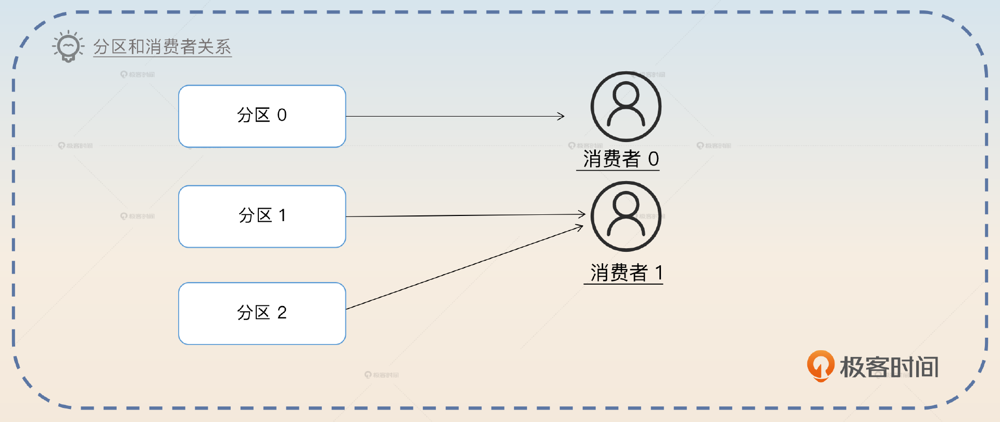

这种设计导致我们不能无限制地增加消费者来解决消息积压问题。反过来说，但凡没这种限制，也就没有消息积压这回事了。

## 确定分区数量

消息积压也可以看作是分区数量不足引发的问题，毕竟如果分区数量多，就意味着消费者多，消费者足够就肯定不会产生消息积压的问题。所以为了避免消息积压，就要求你在使用消息队列的时候想清楚你需要几个分区。

最正确的做法就是，直接用 Kafka 的性能测试脚本，控制消息的平均大小、吞吐量、分区数量和消费者线程数，执行压测，得出结论。不过实践中还是很少用的，因为在测试环境测了也不一定准，而且你也不敢去生产环境测试。当然，如果你们公司的消息队列团队非常专业，你直接告诉他你预期中的生产者速率、消息大小和消费者速率就可以了，他们会帮你创建好分区数量合适的 topic。

除此以外，确定分区数量目前并没有什么权威说法或者统一标准，我这里给出一个我个人的标准，你可以作为参考。

首先，预估生产者的发送速率，这里我们假设 QPS 是 1000。然后估算单独一个分区能撑住多大的写流量，假如说这里 QPS 是 100，那么你至少需要 10 个分区。

其次，预估消费者的消费速率，这个时候不要考虑异步消费之类的改进措施，假设消费速率是 50，那么你就需要至少 20 个分区。

通过这两条标准得出的这两个值里取比较大的那个，也就是用 20 个分区，或者你再多加一两个分区作为余量。当然这是一种简单粗暴、方便你理解的算法，但是核心是分区数量要 **确保生产者不会阻塞，同时确保消费者来得及消费消息**。

那么单一一个分区能撑住多少写流量该怎么确定呢？你可以通过前面的压测来确定，也可以通过观测消息集群的性能来确定，当然最简单的办法就是问消息队列运维团队。

## 面试准备

在面试前，你需要在公司内部收集一些信息。

- 你们公司消息队列的监控有哪些？可以利用哪些监控指标来确定消息是否积压？
- 在发现消息积压的时候，能不能利用监控的消费速率和生产速率，来推断多久以后积压的消息会被处理完毕？
- 你们公司消息积压的真实案例，包括故障原因、发现和定位过程、最终解决方案。
- 你负责的业务使用的 topic 还有对应的分区数量。
- 如果有可能，你去问问你们消息队列团队的人是怎么计算分区数量的。

你可以考虑将消息积压纳入你的高性能面试方案中，也就是说解决消息积压问题也是你优化系统性能的一环。你可以在简历中、项目介绍中提及自己解决过消息积压的问题，那么面试官就可能会问你相关的问题。

此外，还有一些和消息积压有关的问题。

- 你的业务 topic 里面用了几个分区？你是怎么确定分区数量的？如果分区数量不够会发生什么？
- 什么情况下会发生消息积压？怎么解决消息积压的问题？
- 在异步消费的时候，如果你拉取了一批消息，还没来得及提交就宕机了会发生什么？

## 解决方案

我这里给出了几个可行的解决方案，每一个方案都有各自的亮点，你在面试的时候根据自己的实际情况挑选其中的两三个来回答就可以了。

解决消息积压的问题，我们首先要区分清楚是临时性积压还是永久性积压。

所谓的临时性积压是指消费能力是够的，但是因为突如其来的流量，导致消费者一时半会跟不上速度而引起的积压。而永久性积压是指你的消费者处理能力就是跟不上，所以积压的消息只会越来越多。

临时性积压基本上都不需要处理，因为随着时间流逝，消费者会慢慢把所有消息都消费完。但是有一种情况例外，那就是你等不及了。而等不及则有多种可能，比如说你的业务要求消费延迟不能超过一分钟，这时候你就要时刻关注消息积压的问题；又或者说你发现这一次突如其来的流量太多了，积攒的消息要好几天才能消费完，这种情况下你多半也无法接受。

所以你可以先点出这个问题。

> 消息积压首先要看是临时性积压还是永久性积压。临时性积压是指突如其来的流量，导致消费者一时半会跟不上。而永久性积压则是指消费者的消费速率本身就跟不上生产速率。
>
> 如果是临时性积压，并且评估最终消费者处理完积压消息的时间是自己能够接受的，那么就不需要解决。比如说偶发性的消息积压，需要半个小时才能处理完毕，而我完全等得起半小时，就不需要处理。
>
> 但要是接受不了，又或者是永久性积压。就要尝试解决了。最简单的办法就是增加消费者，增加到和分区数量一样。不过我想大部分人在遇到消息积压问题的时候，消费者数量都已经和分区数量一样了。

注意这里假设的都是你的消费者数量已经和分区数量一样了，也就是说，你即便再增加消费者也已经没办法提高消费速率了。

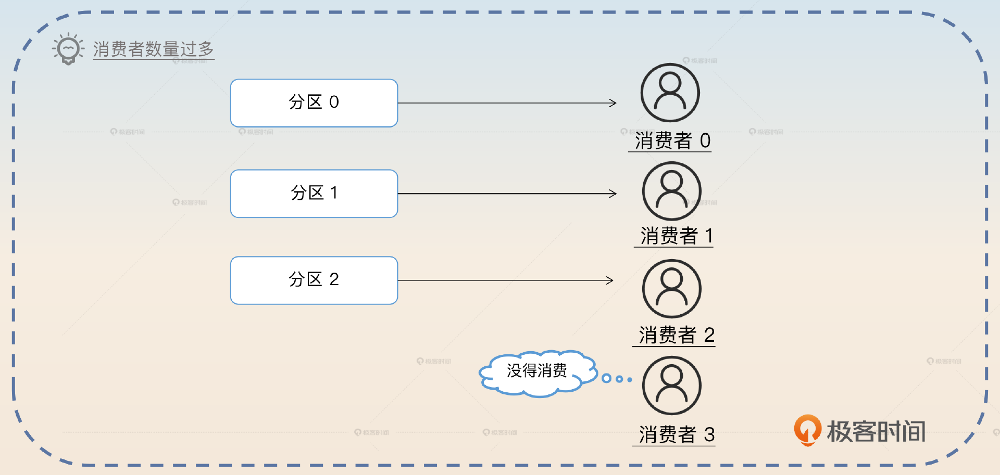

### 增加分区

最简单的做法就是增加分区，你可以稍微提一下。

> 另外一种做法就是增加分区，比如说直接增加好几个分区。

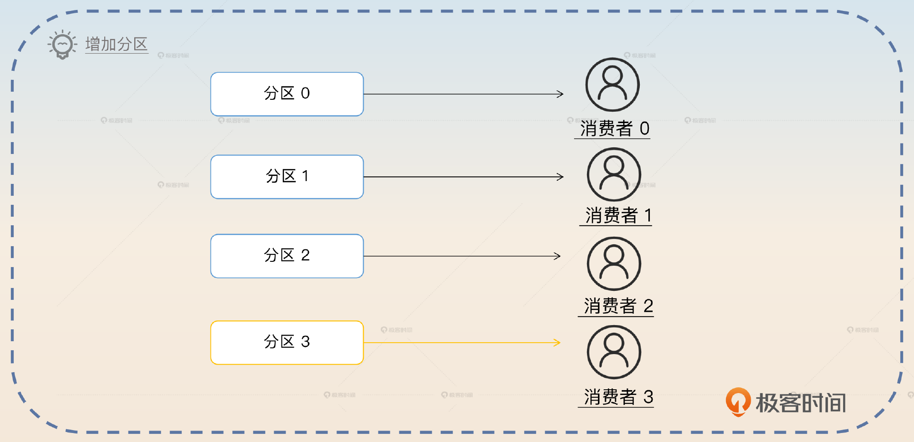

有些时候，公司或者说消息队列的运维是不准你加分区的，那你可以考虑下面这个方案：创建新的 topic。

#### 创建新 topic

采用这个方案意味着你需要准备一个新的 topic，这个 topic 会有更多的分区。前期消费老的 topic，同时也消费新的 topic。等老的 topic 上的数据都消费完毕之后，就可以完全切换到新的 topic了。

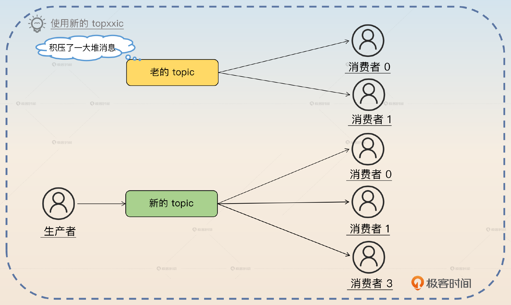

这种做法还有一个变种，就是当你创建了新 topic 之后，把老 topic 上已有的消息转发到这个新的 topic 里面。这样你只需要启动消费者消费新 topic 就可以了。

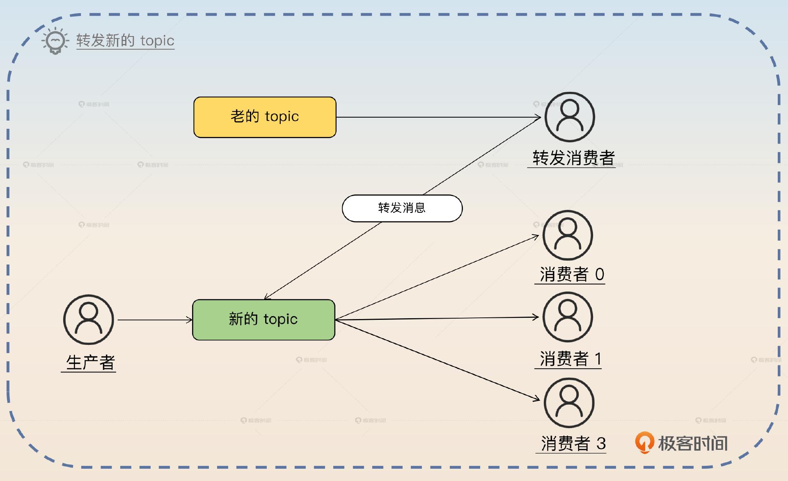

这个变种的优点就是代码比较容易维护，但是它也会降低消费积压数据的速度。不过你面试的时候还是可以稍微提一下这个方案。

> 如果公司不允许增加分区的话，那么可以考虑直接创建一个新的 topic。这时候有两种做法，一种是直接启动足够数量的消费者去消费新老 topic 上的消息，在老 topic 上的消息消费完毕之后就可以停掉老的 topic上的消费者了。另外一种做法是启动几个消费者，这些消费者会把老的 topic 上的消息转发到新的 topic 里面。同时启动消费者消费新的 topic。

> 相比之下，第一种做法会更加高效，但是需要多启动几个消费者。

这里，你可以顺势引出另外一个话题。

> 不过这里的难点都是要计算清楚究竟需要几个分区。比如说，原本八个分区不够，要增加新分区，那么增加几个？如果是创建新 topic，需要几个分区？它本质上是一个分区数量预估的问题。

你一提这一句，大概率面试官就会追问你怎么计算需要的新分区的数量。记住要先强调理论上的最佳做法肯定是通过压测来确定的。

### 新的分区数量

这里和一般的分区预估有点不太一样，因为消息积压场景下的瓶颈在于消费者，也就是说，你不需要考虑生产者速率，也不需要考虑broker的速率，你只需要考虑消费者。

所以最简单的做法就是，用平均生产者速率除以单一消费者的消费速率。在涉及数学计算的时候，你要记得使用一个简单例子来帮助面试官理解计算方式。

> 要确定新的分区数量的最简单的做法就是用平均生产者速率除以单一消费者的消费速率。
>
> 比如说所有的生产者合并在一起，QPS 是 3000。而一个消费者处理的 QPS 是 200，那么 $3000 \\div 200 = 15$。也就是说你需要 15 个分区。进一步考虑业务增长或者突发流量，可以使用 18 个或者 20 个。

这里面试官可能会进一步追问，为什么用平均生产者速率而不是峰值速率？这是因为本身消息队列就承担着削峰的功能，所以在业务巅峰可能会有少量的消息积压，但是这是正常现象，所以可以不考虑。当然，如果有钱有资源，那么就可以按照生产峰值速率来算。

### 优化消费者性能

在不能增加消费者数量也不能增加分区数量的时候，还可以考虑提高消费者的消费速率，也就是优化消费者性能。

优化的思路大体上有两种。

1. 把消费者部署在更好的实例上，这属于花钱买性能。
2. 优化消费者的消费逻辑，这跟业务密切相关，本质上是一个性能优化的问题。

我们能够回答的就是第二点，毕竟第一点是钞能力，不是你的能力。可惜的是，它毕竟是一个和业务密切相关的话题，所以我只能给你一个案例来参考。你也可以自己看看公司内部所有的消费者代码，找找看有没有可以优化的，作为你面试的真实案例。

> 还有一个思路是优化消费者的性能。早期我在公司的时候就优化过消费者的性能。我们的业务逻辑也不是特别复杂，但是因为考虑同一个业务的消息可能被不同的消费者消费，所以在消费消息的时候引入了一个分布式锁。
>
> 但是，实际上我们可以通过主动选择目标分区使相同的业务总是把消息发到同一个分区上，确保同一时间只有一个消费者处理一个业务的消息，这样就可以把分布式锁去掉。它带来的好处就是，当没有分布式锁的时候，也不会有消费者因为等待分布式锁而导致消费速率下降了。

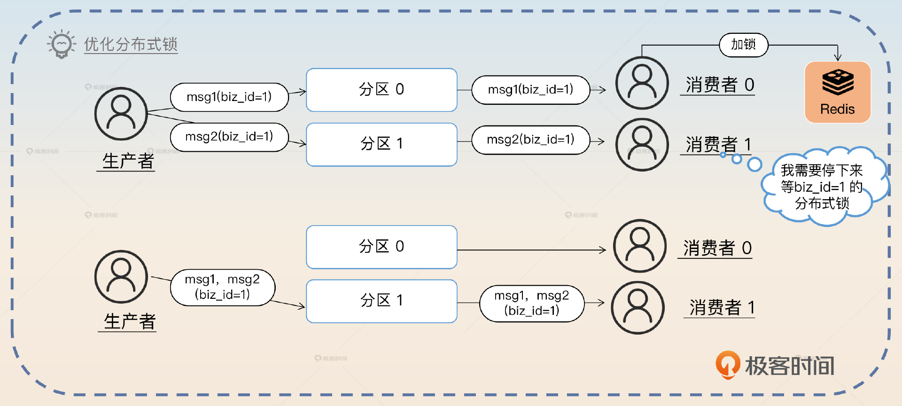

这个案例非常精巧，它充分结合了消息队列、分布式锁，还借鉴了解决有序消息的思路。所以这个案例不光这里可以用，在聊起性能优化和分布式锁的时候也可以用。

### 消费者降级

这一次你又接触到了降级。不过这个降级不是为了保护消费者，而是为了提高消费速率。使用这个方案的前提是你的业务能接受有损消费消息。这里你可以参考微服务降级部分的内容，比如说如果你的业务有快慢路径之分，那么可以考虑在消息积压的情况下只执行快路径。

这里我就不再重复降级有关的内容，直接给你一个案例更能说明问题，同样的，你也可以在公司内部找找有没有消费者的逻辑是可以用上这种降级策略的。

> 我也尝试过利用微服务中的降级思路来解决消息积压的问题。但是这个降级本身并不是为了保护系统，而是为了加快消费速率。在之前出现消息积压的场景里面，消费者的处理逻辑总体上可以认为就是调用几个接口，计算一个值，然后放到缓存里面，缓存过期时间就是 15 分钟。这些提前计算出来的结果就是给查询接口使用的，查询接口如果都自己算的话，性能会比较差。
>
> 在不触发降级的时候，也就是没有消息积压的时候，就正常算。但是在消息积压的时候，如果缓存里面有对应的数据，那就不算，否则就重新计算一下。这种降级逻辑是基于这样一个底层逻辑，就是如果这个数据本身过期时间是十五分钟，那么我即便不更新，用户拿到的无非就是十五分钟以内的一个不准确的数据。这在我们业务上是可以接受的。
>
> 而如果缓存不存在了，那么就确实需要重新计算一遍，避免查询接口自己实时计算。
>
> 在引入了这种降级策略之后，大概有 1/3 的消息处理逻辑是被降级的。

这个案例最大的优点就是，降级并不仅仅是局限在了微服务中，而是被你用在了消息消费上，它能够体现你对服务治理的深刻理解，还有灵活敏锐的思维。

### 聚合消息与批量操作

假如说你现在有一个业务，是要从数据库里筛选出一批数据，然后针对每一条数据进行处理。处理之后，会发送一条消息到消息队列，消费者再一条条取出来处理。

这里我们假设消息的关键字段就是带上业务 ID，例如 `msg1(biz_id = 1)`。但是，消费者这边也是有批量接口的。也就是说，如果发送消息的时候在一条消息里面直接带上批量数据，消费者这边也可以借助批量接口一次性处理完。

也就是说，发送者发送的数据是 `msg2(biz_ids=1,2,3,4)`，消费者可以一次性处理完毕。

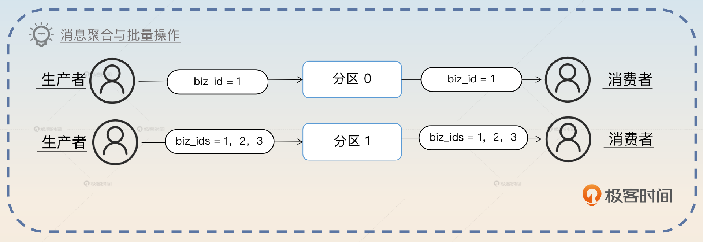

这种调整带来了两方面的好处。一方面自然是消费者借助批量接口处理，速度有数量级的提升；另外一个则是消息所需的存储空间大大降低，broker的负载也会降低不少。

这里我直接整理成对应的话术，供你参考，如果你有类似的场景，也可以使用自己的案例来替换。

> 还有一种思路是聚合消息和批量操作来优化性能。之前我有一个业务，生产者那边是按照用户输入的参数来查找符合条件的数据，然后一条条处理的。每条数据处理完毕之后就发送一条消息到消息队列里面。简单来说，就是消息里会带上业务 ID。同时消费者消费消息，根据业务 ID 进一步处理。
>
> 后来随着业务增长就出现了消息积压的问题，我负责解决这个问题。在经过排查之后，我发现其实消费者这边是可以批量处理的。所以我就先研发了批量接口，通过性能测试发现批量接口有了一个数量级性能的提升。然后我又开始改造生产者，让生产者不再是一条数据发一条消息，而是一批数据发一条消息。消费者这边也改造成了使用批量接口。
>
> 上线之后积压的消息很快就被处理完了，并且到现在都没再出现消息积压的问题。而且因为消费速率非常高，所以反而削减了两个消费者，节省了一点资源。
>
> 这个方案 最大的优点就是业务改造的成本不高。尤其是在消费者端，对于历史积压的消息，还是调用批量接口，只不过传入的业务 ID 只有一个而已。

接下来你要进一步总结出一般的规律，刷一个亮点。

> 这种方式一般适用于消费者可以改造成批量接口的场景，而且可以考虑不改造生产者，只改造消费者。把消费者改造成批量消费、批量提交偏移量。比如说消费者一次性拉取 100 条消息，构造批量处理请求。在处理成功之后，再提交偏移量。这种批量消费，再批量提交的做法也可以用于异步消费中。

显然，最后提到异步消费，就是为了引出下一个解决方案，也是我们的核心解决方案——异步消费。

### 异步消费

你可以先看一下最简单的异步消费架构图。

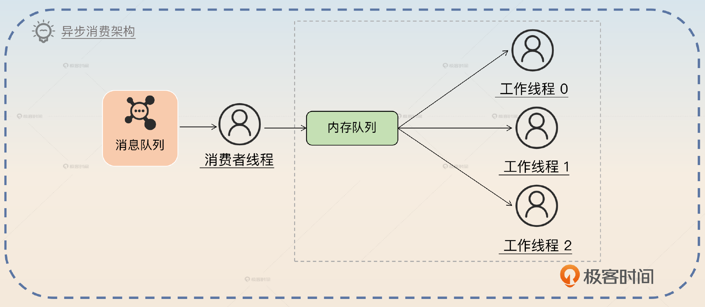

结合图片，你可以简单介绍一下这个方案。

> 也可以考虑用异步消费来解决消息积压的问题。所谓的异步消费就是指在消费者这边有一个消费者线程，负责从消息队列里面拉取消息。同时拉到的消息会立刻转发给一个线程池，线程池里面会有一些工作线程负责处理消息。这个方案对生产者毫无影响，但是消费者这边要小心消息丢失的问题。

在这个回答里面，因为聊到了线程池，那么面试官也可能问你线程池相关的问题。同时，你提到了消息丢失的问题，面试官有极大概率会追问你消息丢失该怎么处理。

#### 消息丢失

所谓的消息丢失是指你的消费者线程取出消息之后，要想继续消费下一条就得先提交当前这一条。这种情况下，就可能会出现一个问题：消费者线程提交了，但是工作者线程还没处理就宕机了。这个时候，因为你已经提交了，所以就算重启，你也是从下一条开始消费。

就算你不主动提消息丢失的问题，面试官也会主动问你怎么解决，那么你就可以抓住关键词 **批量提交** 来回答。

> 要解决消息丢失，那么就可以考虑使用批量提交的方法。也就是说，消费者线程一次拉取一批消息，比如说 10 条。然后，并不是说立刻提交这 10 条消息，而是直接开启十个线程，并行处理这 10 条消息。等到 10 条消息都处理完毕，再批量提交。

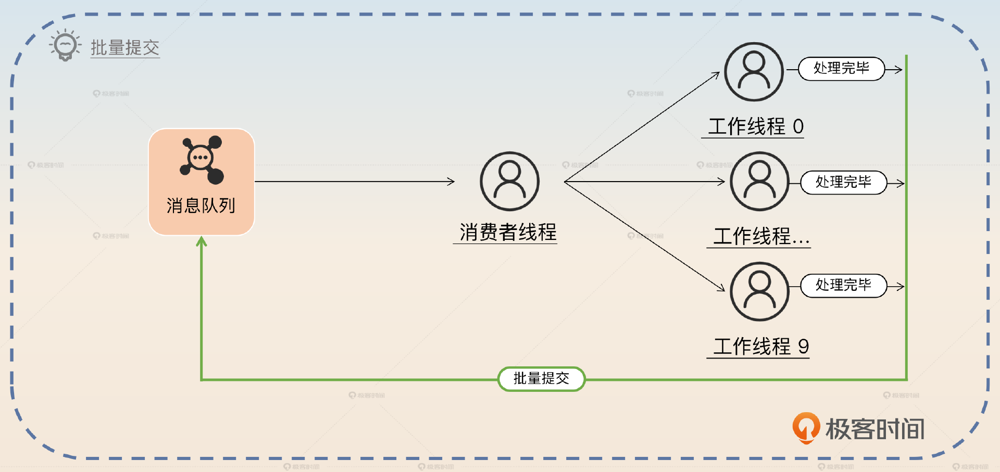

在批量提交这个方案里面，还是有破绽的，你可以进一步引导。

> 批量提交的效果是很好的，可以做到数量级性能提升。但是它的缺陷也很明显，就是重复消费和部分失败的问题。

#### 重复消费

批量提交很容易出现重复消费的问题。在消费者线程拉取了一批消息之后，如果过了一段时间还没提交就宕机了，那么会发生什么？

1. 可能所有的消息都还没被处理或者正在处理。
2. 部分消息被处理了，可能成功可能失败。
3. 全部消息都被处理了，可能成功可能失败，还来不及提交。

可以预见的是，因为没有提交，所以当消费者从宕机中恢复过来的时候，就会拉取同一批继续消费。怎么办？

很简单，保证处理消息的逻辑是幂等的就可以。也就是同一条消息，你反复处理多少次，最终结果都是一样的。所以抓住关键词 **幂等** 来回答。

> 对于重复消费来说，解决方案也很简单，就是让消费逻辑保证是幂等的。这样，即便宕机导致消息被消费了但是来不及提交，也可以保证在下一次恢复过来的时候，重复处理不会引起什么业务问题。

#### 部分失败

在批量提交里面，还有一个非常棘手的问题就是一批消息里面部分消息处理失败了怎么办？

实际上，如果考虑到要继续消费，你肯定可以得出一个结论：要继续提交，然后继续消费下一批。不过，在提交之前你可以做很多事情。最简单的做法就是，当某个工作线程失败的时候，直接重试。但是要注意，当工作线程重试的时候，其他工作线程也在等它，所以你要控制住重试的次数和重试的整体时间。

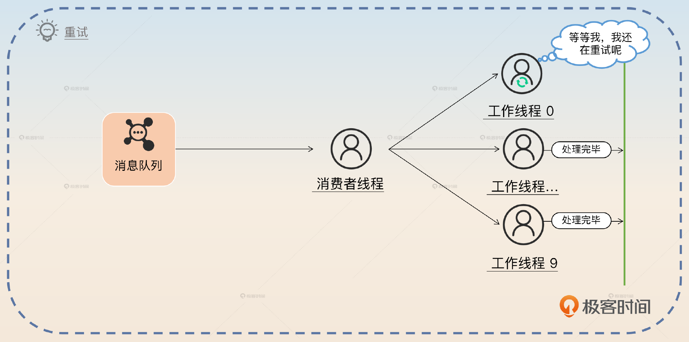

当然你也可以考虑异步重试。

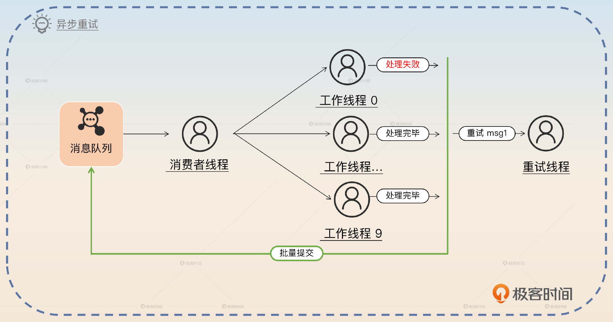

但是，你还有一个更加优雅的动作，就是失败之后，这个工作线程把这个消息再次丢回消息队列。这个丢回去的动作实际上是产生了一个全新的消息，只不过消息内容一模一样而已。

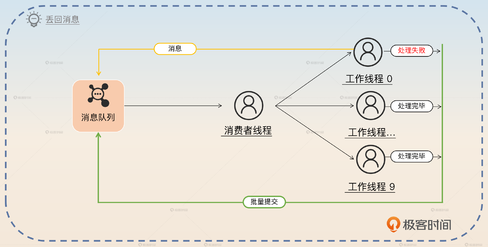

这里你要注意，你可能需要在消息里面记录一下你已经处理过几次了。比如说你限制只能重试三次，那么三次重试都失败了，你就不要再丢回去了。

你可以把这三个方案放在一起回答。

> 在部分失败的情况下，第一种做法是要求工作线程立刻重试，比如说重试三次，也可以用一个全新的异步线程来重试。当然，也可以考虑把消费失败的消息丢回消息队列里，后面再轮到它的时候又会被处理，这就相当于重试了。这些方案的核心都是确保部分失败不会影响继续向前消费。

到这里，整个异步消费方案就非常完整了，而且讨论得也足够深入了。

## 面试思路总结

今天这节课我们讨论了消息积压的问题。为了让你更好地理解消息积压，我在前置知识里面先介绍了消费者和分区的关系，还有怎么确定分区数量。确定分区数量在面试中比较常见，你要记牢。

为了解决消息积压问题，我还准备了五个案例，分别是 **增加分区、优化消费者性能、消费者降级、聚合消息与批量操作、异步消费**。你可以根据自己的经历来选择方案用于面试，但是我也建议你在面试的时候尽量用上异步消费，并且深入讨论里面的 **消息丢失、重复消费和部分失败** 三个问题。

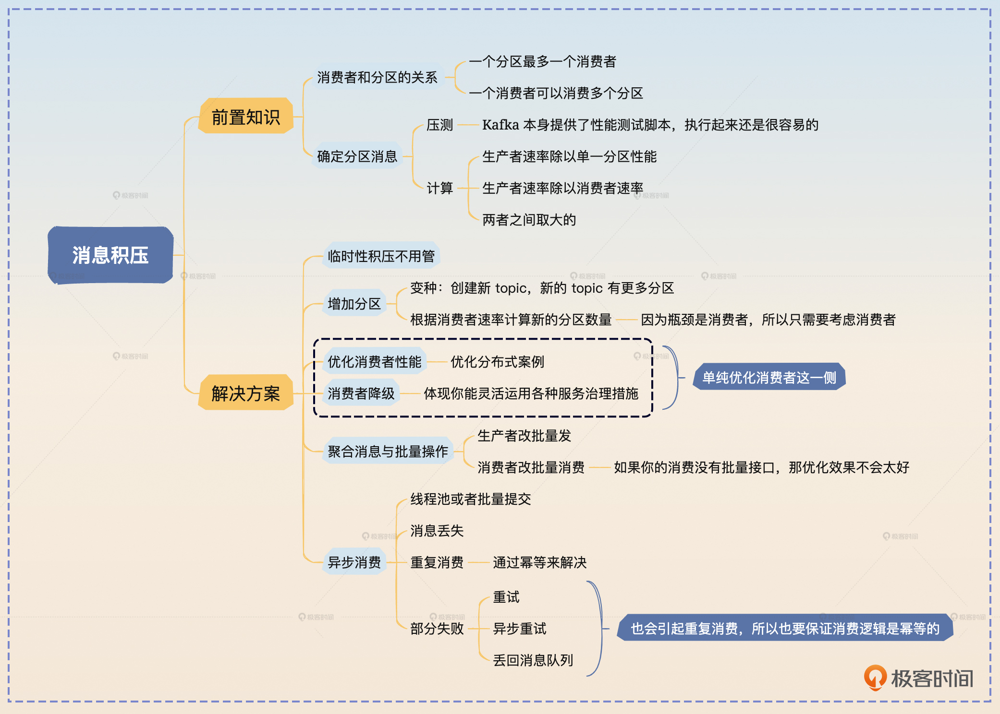

## 思考题

最后也请你来思考两个问题。

- 有些人认为，优化生产者性能也能解决消息积压，你觉得能还是不能？为什么？
- 在出现消息积压的时候，能不能在生产者发送的时候加个限流？毕竟，限制住了发送消息的速率，自然就解决了消息积压。

欢迎你把你的答案分享在评论区，也欢迎你把这节课的内容分享给需要的朋友，我们下节课再见！