# 26｜消息不丢失：生产者收到写入成功响应后消息一定不会丢失吗？
你好，我是大明。今天我们来学习消息队列中的新主题——消息丢失。

和消息丢失相对应的概念叫做可靠消息，这两者基本上指的就是同一件事。在实践中，一旦遇到消息丢失的问题，是很难定位的。从理论上来说，要想理解消息丢失，就需要对生产者到消费者整个环节都有深刻地理解。

今天我就带你看看从生产者发出，到消费者完成消费，每一个环节都需要考虑什么才可以确保自己的消息不会丢失。到最后，我会再给你一个在 Kafka 的基础上支持消息回查的方案，帮助你在面试的时候赢得竞争优势。让我们先从基础知识开始。

## Kafka 主从同步与 ISR

在 Kafka 中，消息被存储在分区中。为了避免分区所在的消息服务器宕机，分区本身也是一个主从结构。换一句话来说，不同的分区之间是一个对等的结构，而每一个分区其实是由一个主分区和若干个从分区组成的。

不管是主分区还是从分区，都放在 broker 上。但是在放某个 topic 分区的时候，尽量做到一个 broker 上只放一个主分区，但是可以放别的主分区的从分区。

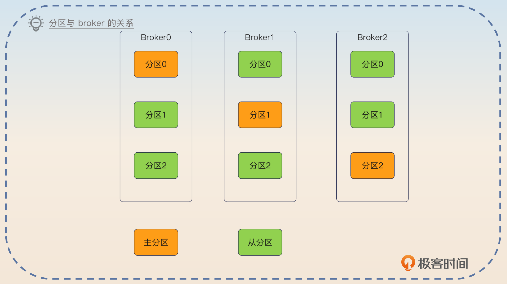

这种思路也很容易理解，它有点像是隔离，也就是通过将主分区分布在不同的 broker 上，避免 broker 本身崩溃影响多个主分区。

### 写入语义

结合我们在 MySQL 部分对写入语义的讨论，你就可以想到，当我们说写入消息的时候，既可以是写入主分区，也可以是写入了主分区之后再写入一部分从分区。

这方面 Kafka 做得比较灵活，它让生产者来决定写入语义。这个控制参数叫做 acks，它的取值有三个。

- 0：就是所谓的 “fire and forget”，意思就是发送之后就不管了，也就是说 broker 是否收到，收到之后是否持久化，是否进行了主从同步，全都不管。


- 1：当主分区写入成功的时候，就认为已经发送成功了。


- all：不仅写入了主分区，还同步给了所有 ISR 成员。

  

这时候，你就接触到了 Kafka 中另外一个核心概念 ISR。

### ISR

ISR（In-Sync Replicas）是指和主分区保持了主从同步的所有从分区。比如说，一个主分区本身有 3 个从分区，但是因为网络之类的问题，导致其中一个从分区和主分区失去了联系，没办法同步数据，那么对于这个主分区来说，它的 ISR 就是剩下的 2 个分区。

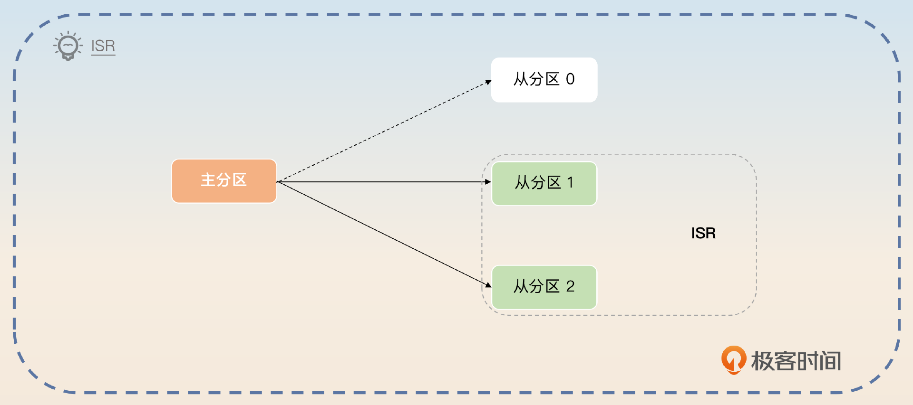

Kafka 对 ISR 里面的分区数量有没有限制呢？比如说，我有一个主分区，有 11 个从分区，那我的 ISR 可以只有一个从分区吗？

是可以的，我们能够通过min.insync.replicas这个参数来配置。比如说当你设置 min.insync.replicas = 2 的时候，就意味着 ISR 里面至少要有两个从分区。如果分区数量不足，那么生产者在配置 acks = all 的时候，发送消息会失败。与它对应的一个概念是 OSR，也就是不在 ISR 里面的分区集合。

## 消息丢失的各种场景

为了让你理解后面我们提到的各种措施，现在我要先带你分析一下消息从生产者发送到消费者完成消费这个过程中，究竟哪些环节可能导致消息丢失。

### 生产者发送

了解了 acks 参数之后，我们首先能够想到一个消息丢失的场景就是生产者把 acks 设置成 0，然后发送消息。这个时候虽然生产者能够拿到消息客户端返回的成功响应，但是事实上 broker 可能根本没收到，或者收到了但是处理新消息的时候遇到 Bug 了。

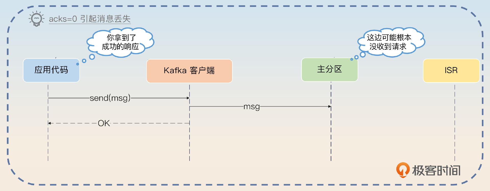

如果你启用了批量发送功能，而且批次比较大的话，那么还可能发生的情况就是，Kafka 客户端连请求都没有发送出去，服务就整个崩溃了，这种情况也会引起消息丢失。

那么是不是主分区真的写入了就万无一失了呢？也不是，因为你还要考虑主从同步的问题。

### 主从同步

我们注意到在 acks=1 的时候，只要求写入主分区就可以。所以假设在写入主分区之后，主分区所在 broker 立刻就崩溃了。这个时候发起新的主分区选举，不管是哪个从分区被选上，它都缺了这条消息。

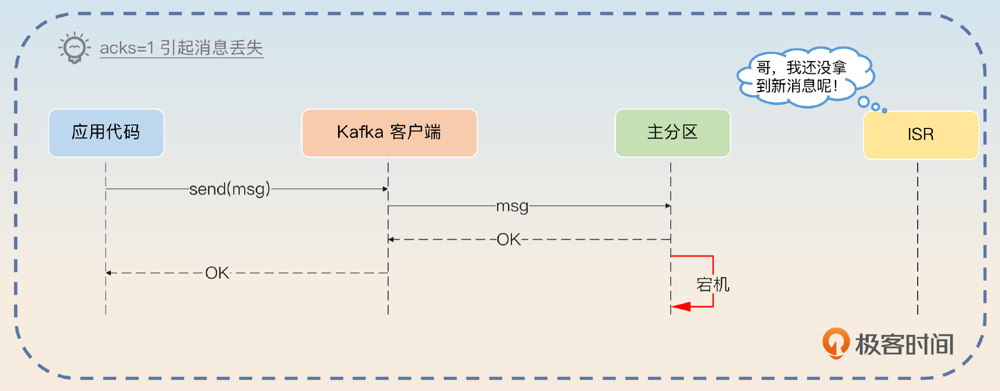

这么看起来，只要使用 acks=all 就肯定不会有问题了，对不对？实际上也不是，因为 Kafka 里面还有一种 unclean 选举。在允许 unclean 选举的情况下，如果 ISR 里面没有任何分区，那么 Kafka 就会选择第一个从分区来作为主分区。

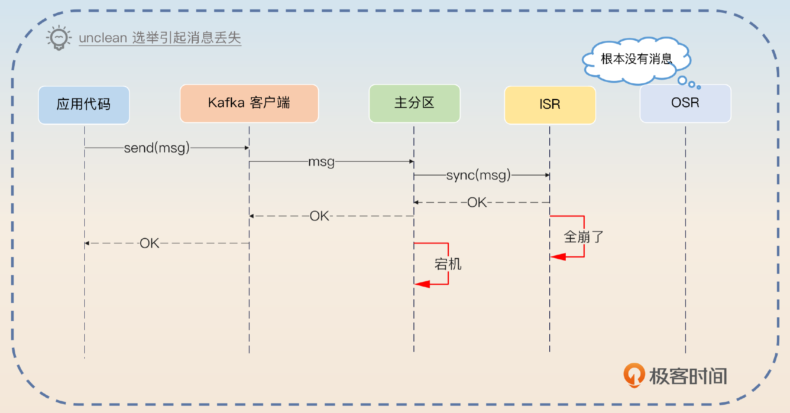

这种 unclean 选举机制本身主要是为了解决你希望尽可能保证 Kafka 依旧可用，并且等待从分区重新进入 ISR 的问题。类似地，unclean 选出来的新的主分区也可能少了部分数据。那么如果我设置 acks=all 并且禁用 unclean 选举，是不是就万无一失了？

实际上也不是，因为你还有一个问题没有考虑到，就是刷盘。

### 刷盘

之前我们在数据库部分讨论过写入语义，提到了 redo log 和 binlog 的刷盘问题。在 Kafka 这里还是会有这个问题。

当 acks=1 的时候，主分区返回写入成功的消息，但是这个时候消息可能还在操作系统的 page cache 里面。

而当 acks=all 的时候，主分区返回写入成功的消息，不管是主分区还是 ISR 中的从分区，这条消息都可能还在 page cache 里面。

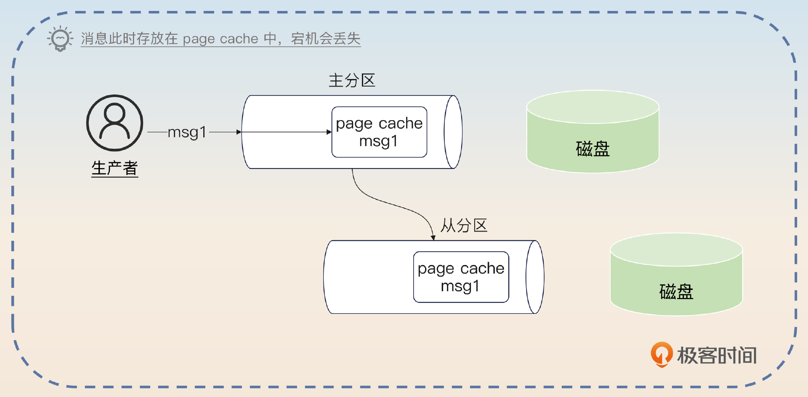

而在 Kafka 中，控制刷盘的参数有三个。

- log.flush.interval.messages：控制消息到多少条就要强制刷新磁盘。Kafka 会在写入 page cache 的时候顺便检测一下。
- log.flush.interval.ms：间隔多少毫秒就刷新数据到磁盘上。
- log.flush.scheduler.interval.ms：间隔多少毫秒，就检测数据是否需要刷新到磁盘上。

后面两个是要配合在一起的。举个例子，假如说 log.flush.internval.ms 设置为 500，而 log.flush.schduler.interval.ms 设置为 200。也就是说，Kafka 每隔 200 毫秒检查一下，如果上次刷新到现在已经过了 500 毫秒，那么就刷新一次磁盘。

而 log.flush.interval.messages 和 log.flush.interval.ms 都设置了的话，那么就是它们俩之间任何一个条件满足了，都会刷新磁盘。

这里我教你一个简单的记忆方法：Kafka 要么是 **定量刷**，要么是 **定时刷**。

不过，Kafka 的维护者之前是不建议调整这些参数的，而是强调依赖于副本（从分区）来保证数据不丢失。

### 消费者提交

消费者提交是指消费者提交了偏移量，但是最终却没有消费的情况。比如说线程池形态的异步消费，消费者线程拿到消息就直接提交，然后再转交给工作线程。在转交之前，或者工作线程正在处理的时候，消费者都有可能宕机。于是一个消息本来并没有被消费，但是却被提交了，这也叫做消息丢失。

## 面试准备

在面试前，你要在公司内部收集一些和消息丢失相关的素材。

- 你或者你的同事有没有因为消息丢失而出现线上故障？如果出现过，那么是因为什么原因引起的故障？后来又是怎么解决的？或者说你用什么措施来防止再次出现这种问题？
- 核心业务的 topic 的分区数量是多少，每一个主分区有多少个从分区？
- 你的业务发送消息的时候是不是异步发送？acks 的设置是多少？
- 你使用的 Kafka 里面那三个刷盘参数的值分别是多少？如果和默认值不一样，为什么修改？
- 你有没有遇到一些场景是必须要发送消息成功的？在这些场景下是如何保证业务方一定把消息发送出来的？

你在平时学习类似 Kafka 这种框架的时候，要注意一下它们的写入语义。这个之前我在 MySQL 部分已经提过了。你多看几个框架，你就会发现在写入语义上，不同框架之间的区别很小。

应该说，大部分框架的设计理念都是接近的，你在平时学习的时候注意总结。这些总结出来的内容能体现你对问题思考的深度和广度，你就可以用在面试中。

如果面试官问到了下面这些问题，你就可以考虑把话题引导到消息丢失这个话题上。

- 面试官问到了延迟消息，那么你可以在介绍了如何在 Kafka 上支持延迟消息之后，提及你采用类似的手段支持了消息回查。
- 面试官问到了有关刷盘的问题，比如说 MySQL 里的 redo log，那么你可以提起在 Kafka 里面也有类似的参数。
- 面试官问到了分区表、分库分表等问题，你可以说你用这些技术解决过延迟消息和消息回查的问题。
- 面试官问到了有关主从模式的问题，那么你可以介绍一下在主从模式下的写入语义。

面试官也可能直接问你和消息丢失有关的问题。比如说：

- 你的业务有没有遇到过消息丢失的问题？最后是怎么解决的？
- 你的业务发送消息的时候，acks 是怎么设置的？你为什么设置成这个值？
- 在使用异步消费的时候，怎么做避免消息已提交，但是最终却没有消费的情况？
- 什么是 ISR？什么样的场景可能会导致一个分区被挪出 ISR？

## 基本思路

这一次的面试方案强调的是成体系。这种面试思路你以前已经见过了，它能够全方面体现你对某一个主题的理解。首先你需要从整体上介绍一下你的方案。

> 在我的核心业务里面，关键点是消息是不能丢失的。也就是说，发送者在完成业务之后，一定要把消息发送出去，而消费者也一定要消费这个消息。所以，我在发送方、消息队列本身以及消费者三个方面，都做了很多事情来保证消息绝对不丢失。

### 发送方一定发了消息

这实际上和本地事务有点关系。你可以把类似场景都抽象成执行业务操作和发送消息这两个步骤。

站在业务的角度，我们需要确保这两个步骤要么都不执行，要么都执行。这本身是一个分布式事务的问题，大体上有两种方案：本地消息表和消息回查。这里我们先看本地消息表方案，消息回查方案会作为亮点方案在后面系统分析。

本地消息表这个方案整体来说并不复杂，在实践中被广泛使用。你可以先讲述这个方案的基本思路。

> 在发送方，我采用的是本地消息表解决方案。简单来说，就是在业务操作的过程中，在本地消息表里面记录一条待发消息，做成一个本地数据库事务。然后尝试立刻发送消息，如果发送成功，那么就把本地消息表里对应的数据删除，或者把状态标记成已发送。
>
> 如果这个时候失败了，就可以立刻尝试重试。同时，还要有一个异步的补发机制，扫描本地消息表，找出已经过了一段时间，比如说三分钟，但是还没有发送成功的待发消息，然后补发。

最后提到的异步补发机制，你可以简单理解成有一个线程定时扫描数据库，找到需要发送但是又没有发送的消息发送出去。更直观的来说，就是这个线程会执行一个类似这样的 SQL。

```plain
SELECT * FROM msg_tab WHERE create_time < now() - 3min AND status = '未发送'
#找出三分钟前还没发送出去的消息，然后补发。

```

整个过程如下图。

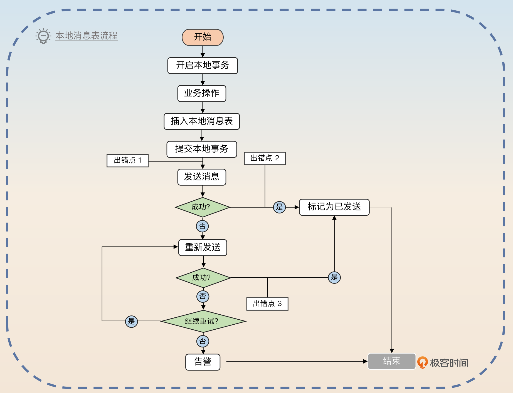

我在图里标注了三个易出错点，面试官大概率会追问这三个点，也就是你要刷亮点的地方。

> 1. 如果已经提交事务了，那么即便服务器立刻宕机了也没关系。因为我们的异步补发机制会找出这条消息，进行补发。
>
> 2. 如果消息发送成功了，但是还没把数据库里的消息状态更新成已发送，也没关系，异步补发机制还是会找出这条消息，再发一次。也就是说，在这种情况下会发送两次。
>
> 3. 如果在重试的过程中，重发成功了但是还没把消息状态更新成已发送，和第 2 点一样，也是依赖于异步补发机制。

我们注意到，这三点都依赖于异步补发机制。但是，就像我前面多次提到的，你重试也要控制住重试间隔和重试次数。所以在你的本地消息表里，还可以用额外的字段来控制重试间隔和重试次数。

> 我在本地消息表里面额外增加了一个新的列，用来控制重试的间隔和重试的次数。如果最终补发都失败了就会告警。这个时候就需要人手工介入了。

那么这时候本地消息表至少有两个关键列：一个是消息体列，里面存储了消息的数据；另一个是重试机制列，里面可以只存储重试次数，也可以存储重试间隔、已重试次数、最大重试次数。剩余的列，你就根据自己的需要随便加，不关键。

最后你注意总结升华一下，体现出你对分布式事务的深刻理解。

> 这种解决方案其实就是把一个分布式事务转变成本地事务 \+ 补偿机制。在这里案例里面，我们的分布式事务是要求执行业务操作并且发消息，那么就转化成一个本地事务，这个本地事务包含了业务操作，以及下一步做什么。然后，补偿机制会查看本地事务提交的数据，找出需要执行但是又没有执行成功的下一步，执行。这里的下一步，就是发送消息。

在实践中，很多分布式事务都可以转化成本地事务 \+ 补偿机制，你可以看看自己公司有没有类似的场景。这部分面试可能会把话题转向分布式事务，需要把这两部分知识串联起来记忆。

### 消息队列不丢失

发送者一定发了消息就意味着它拿到了消息队列的响应，那么根据前面的基础知识，要想让消息队列一定不会丢失消息，那么 acks 就需要设置成 all。而且，也不能允许 Kafka 使用 unclean 选举。

进一步考虑刷盘的问题，那么就需要调整 log.flush.interval.messages、log.flush.interval.ms 和 log.flush.scheduler.interval.ms 的值。

这一点，你可以结合自己公司的实际取值来回答。

> 在关键业务上，我一般都是把 acks 设置成 all 并且禁用 unclean 选举，来确保消息发送到了消息队列上，而且不会丢失。同时 log.flush.interval.messages、log.flush.interval.ms 和 log.flush.scheduler.interval.ms 三个参数会影响刷盘，这三个值我们公司设置的是 10000、2000、3000。
>
> 理论上来说，这种配置确实还是有一点消息丢失的可能，但是概率已经非常低了。只有一种可能，就是消息队列完成主从同步之后，主分区和 ISR 的从分区都没来得及刷盘就崩溃了，才会丢失消息。这个时候真丢失了消息，就只能人手工补发了。

你也可以从优化的角度来描述。

> 早期我们就遇到过一个消息丢失的案例。我们有一个业务在发送消息的时候把 acks 设置成了 0，后来有一天消息队列真的崩了，等再恢复过来的时候，已经找不到消息了。而这个业务其实是一个很核心的业务，所以我们把 acks 的设置改成了 all。之后消息队列再崩溃，也确实没再出现过丢失的问题。

当消息队列确保消息不会丢失之后，你需要做的就是确保消费者肯定消费了。

### 消费者肯定消费

消费者肯定消费这个几乎不需要你额外做什么，除非你使用了异步消费机制，这部分你可以参考消息积压那一节课提到的异步消费方案。

这里你只需要简单介绍一下。

> 要确保消费者肯定消费消息，大多数时候都不需要额外做什么，但是如果业务上有使用异步消费机制就要小心一些。比如说我的 A 业务里面就采用了异步消费来提高消费速率，我利用批量消费、批量提交来保证异步消费的同时，也不会出现未消费的问题。

这里就可以把话题引导到异步消费上，你也就可以顺便提起消息积压的问题，这样整个面试节奏就在你的掌控之中了。

## 亮点方案：在 Kafka 上支持消息回查机制

所谓的消息回查机制是指消息队列允许你在发送消息的时候，先发一个准备请求，里面带着你的消息。这个时候消息队列并不会把消息转交给消费者，而是当业务完成之后，你需要再发一个确认请求，这时候消息中间件才会把消息转交给消费者。

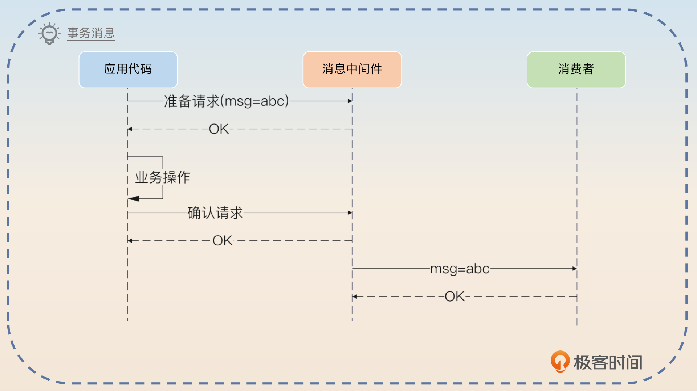

显然，这就是之前我们讨论的两阶段提交的一个简单应用，所以这个也被叫做事务消息。

你仔细看一下事务消息这张图，你就会发现一个问题：如果我的业务成功了，但是我的确认请求没发怎么办？所以这时候就有了消息回查，也就是消息在没收到确认请求的时候，会反过来问一下你，这个消息要不要交给消费者。

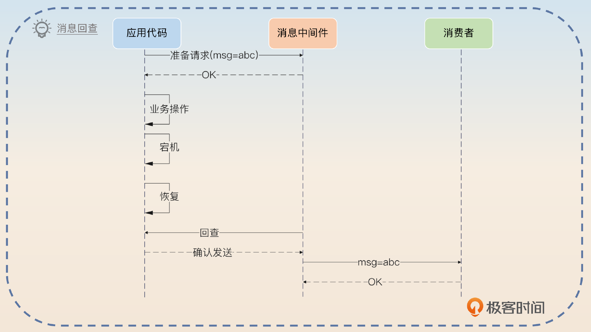

消息回查机制依赖于消息队列的支持。RocketMQ 是支持的，但是不幸的是 Kafka 和 RabbitMQ 都不支持。所以这里就有一个问题了，就是怎么在 Kafka 的基础上支持消息回查。

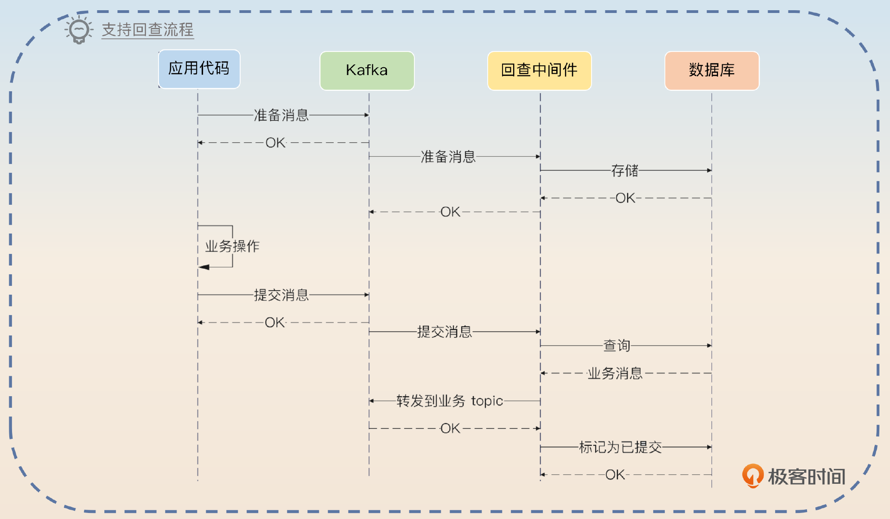

你可以结合图片简要回答整个流程。

> 我们公司用的是 Kafka，它并不支持消息回查机制，所以我在公司里面设计过一个系统来支持回查功能。
>
> 它的基本步骤是这样的：
>
> 1. 应用代码把准备消息发送到 topic=look\_back\_msg 上。里面包含业务 topic、消息体、业务类型、业务 ID、准备状态、回查接口。
> 2. 回查中间件消费这个 look\_back\_msg，把消息内容存储到数据库里。
> 3. 应用代码执行完业务操作之后，再发送一个消息到 look\_back\_msg 上，带上业务类型、业务 ID 和提交状态这些信息。如果应用代码执行业务出错了，那么就使用回滚状态。
> 4. 回查中间件查询消息内容，转发到业务 topic 上。

整个过程到处都是亮点，我们一个一个看。

### 亮点一：回查实现

你应该注意到了，如果在业务操作完成之后，没有发提交消息，这时候就需要回查中间件来回查。一般来说，回查中间件会异步地扫描长时间未提交的消息，然后回查业务方。

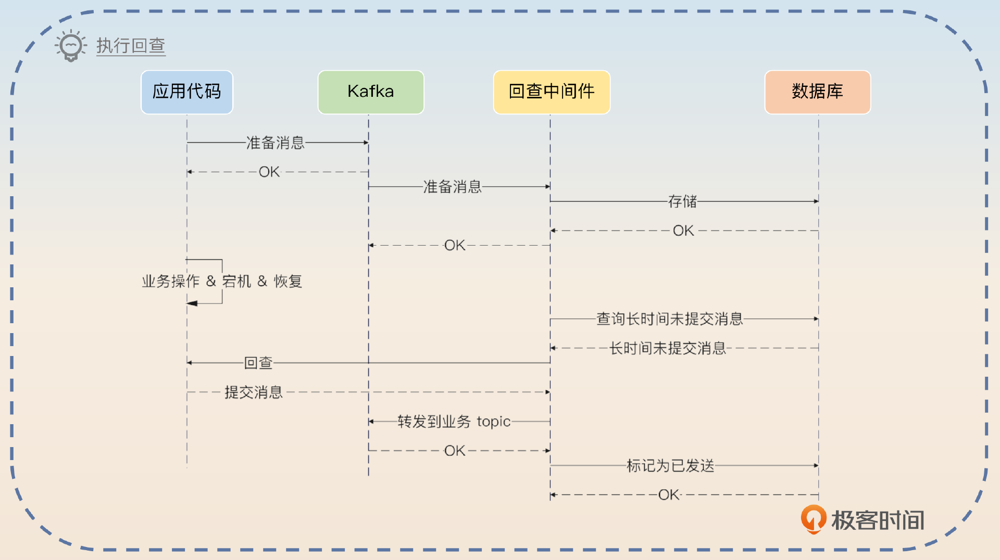

这里的关键点就是 **回查中间件得知道怎么回查你的应用代码**。正常来说，你这里应该要设计成可扩展的，也就是说可以回查 HTTP 接口，也可以回查 RPC 接口。

所以你接着补充。

> 如果业务方最终没有发送提交消息，那么回查中间件会找出这些长时间没提交的消息，执行回查。回查中间件执行回查的关键点是利用准备消息中带着的回查接口配置来发起调用。我设计了一个通用的机制，支持 HTTP 调用或者 RPC 调用。
>
> 对于 HTTP 调用来说，业务方需要提供回查 URL。而对于 RPC 调用来说，业务方需要实现我提供的回查接口，然后提供对应的服务名。我在回查的时候会带上业务类型和业务 ID，业务方需要告诉我这个消息能不能提交，也就是要不要发给业务 topic。

上面的回答你肯定摸不着头脑，尤其是这个回查接口究竟是怎么一回事。我给你举个例子，你就明白了。如果是回查一个订单业务的 HTTP 接口，那么业务方需要告诉我回查 URL，那么回查中间件发出的请求就类似于下面这样。

```plain
method: POST
URL: https://abc.com:8080/order/lookback
Body: {
  "biz_type": "order",
  "biz_id": "oid-123"
}

```

业务方返回的响应：

```plain
Body: {
  "biz_type": "order",
  "biz_id": "oid-123",
  "status": "提交" //如果业务没成功，那么可以是回滚
}

```

而如果是 RPC 接口，回查中间件就可以定义一个接口，要求所有的业务方都实现这个接口。

```plain
type MsgLookBack interface{
    LookBack(bizType string, bizID int) Status
}

```

然后业务方需要提供服务名字，比如说 abc.com.order.msg\_look\_back，回查中间件会利用 RPC 的泛化调用功能，发起调用。如果你不理解泛化调用，那么你可以说你暂时只支持了 HTTP 回查接口，但是将来可以轻易扩展到 RPC 调用上。

这是一个非常能够体现你设计能力的一个点，你要是答好了，就足以证明你具备设计复杂系统来解决业务问题的能力。

### 亮点二：数据存储

这部分和你在延迟队列里看到的差不多。在延迟队列中，我介绍过你可以考虑使用分区表、交替表或者分库分表来存储延迟消息。这里你同样可以用分区表、交替表和分库分表来存储回查消息。

具体细节我就不重复了，你可以参考延迟队列的内容。你在回答的时候注意引导就可以，我用分区表作为例子给你演示一下。

> 为了保证我这个回查机制的高性能和高可靠，我使用了分区表。我按照时间进行分区，并且历史分区是可以快速归档的，毕竟这个回查机制使用的数据库只是临时存储一下消息数据而已。当然，后续随着业务扩展，我觉得这个地方是可以考虑使用分库分表的，比如说按照业务 topic 来分库分表。

### 亮点三：有序消息

你有没有想过这样一种可能：我的中间件回查机制，有没有可能先收到某个业务的提交消息？

答案是有可能的。但是回查机制要求的是一定要先收到准备消息，再收到提交消息。所以你可以尝试讲清楚这个点。

> 这个方案是要求准备消息和提交消息是有序的，也就是说，同一个业务的准备消息一定要先于提交消息。解决方案也很简单，在发送的时候要求业务方按照业务 ID 计算一个哈希值，然后除以分区数量的余数，就是目标分区。

显然，你也可以在这里趁机把话题引导到有序消息上。

## 面试思路总结

最后我们来总结一下这节课的主要内容。为了理解消息丢失这个问题，我给你介绍了 Kafka 主从同步与 ISR 的基本概念，然后系统地分析了各个环节消息丢失的场景。在面试的时候，你要沿着生产者、消息队列、消费者这条线来说明每一个环节怎么做到消息不丢失。

- 在生产者这一边要保证消息一定被发出来，可以考虑本地消息表和消息回查机制。
- 在消息队列上要注意设置 acks 参数，同时也要注意三个刷盘参数：log.flush.interval.messages、log.flush.interval.ms 和 log.flush.scheduler.interval.ms。
- 在消费者这边，只需要小心异步消费的问题就可以了。

而 Kafka 本身并不支持消息回查机制，所以你可以考虑利用 MySQL 来支持。核心就是借鉴两阶段提交协议，要求业务方先发准备消息，再发提交消息。如果没有发送提交消息，你就可以回查业务方。对应的三个关键点就是回查怎么实现、数据怎么存储、准备消息和提交消息怎么保持有序？

这里我再强调一点，我几次提到重试的时候你就应该能够想到，这必然会导致重复消费，也因此要求消费者必须是幂等的。

同时，结合延迟消息，我给了你两个增强 Kafka 功能的方案。你如果有时间，可以尝试自己把它们两者融合在一起，做成一个开源框架。

一方面，这两个方案都要求支持高并发、高性能、大数据，对你来说很能锻炼自己设计和实现一个系统的能力。另外一方面，如果你真的能够按照开源标准做出来，那么你只要不是面什么高级架构师之类的岗位，就都能赢得竞争优势。

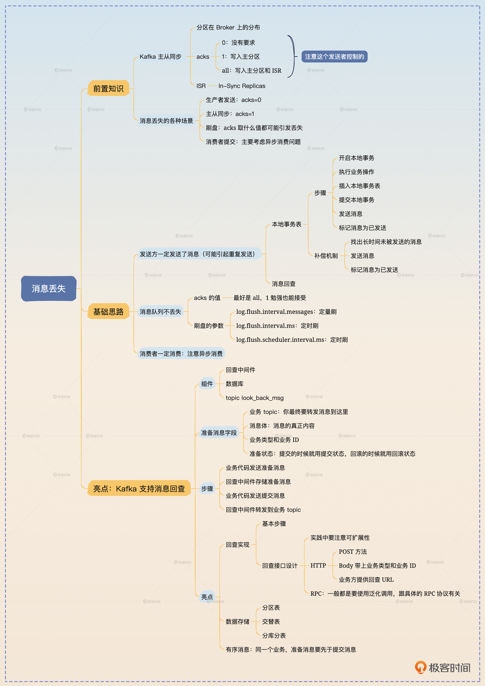

## 思考题

最后请你来思考两个问题。

- 在支持 Kafka 回查机制中，要是回查中间件把消息转发到业务 topic 了，但是标记成已发送失败，会发生什么？
- 在支持 Kafka 回查机制中，你可以考虑把关系型数据库换成 Redis，这样换的话有什么优缺点？

欢迎你把你的答案分享在评论区，也欢迎你把这节课的内容分享给需要的朋友，我们下节课再见！