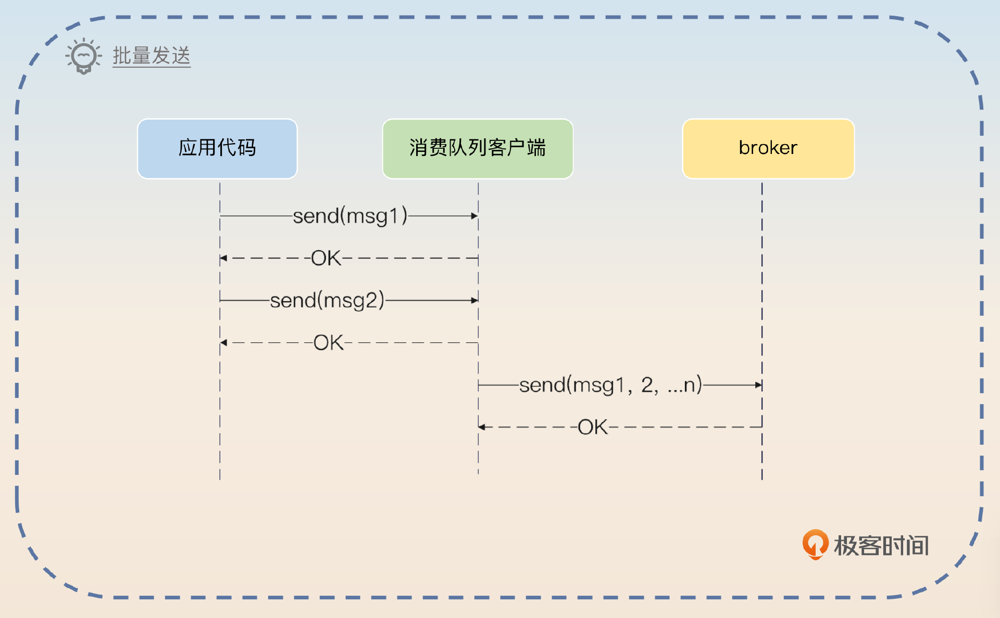
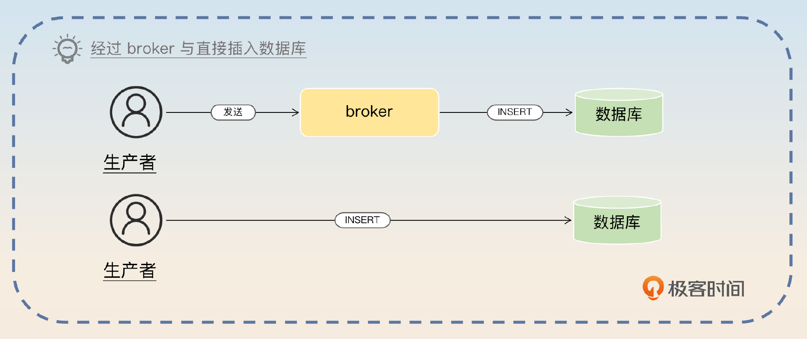
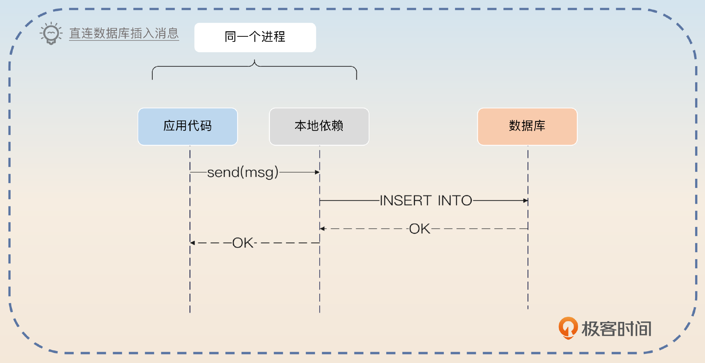
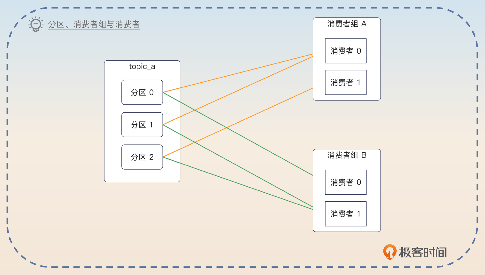
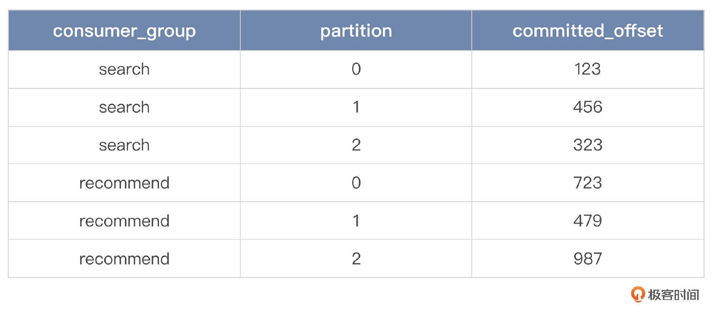
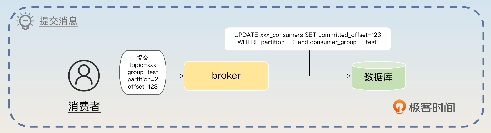
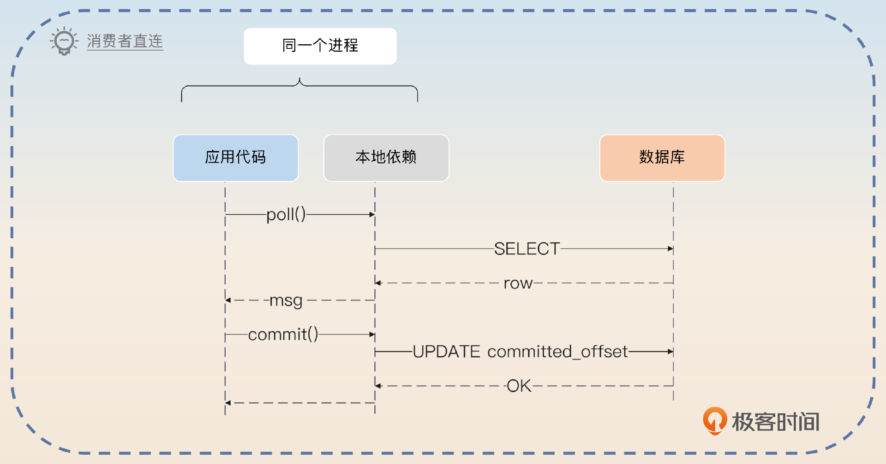
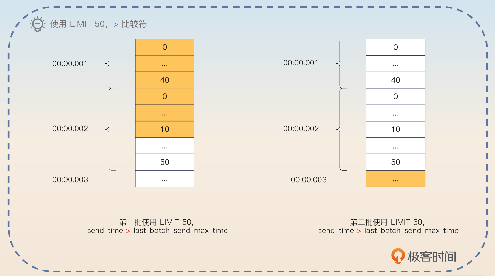
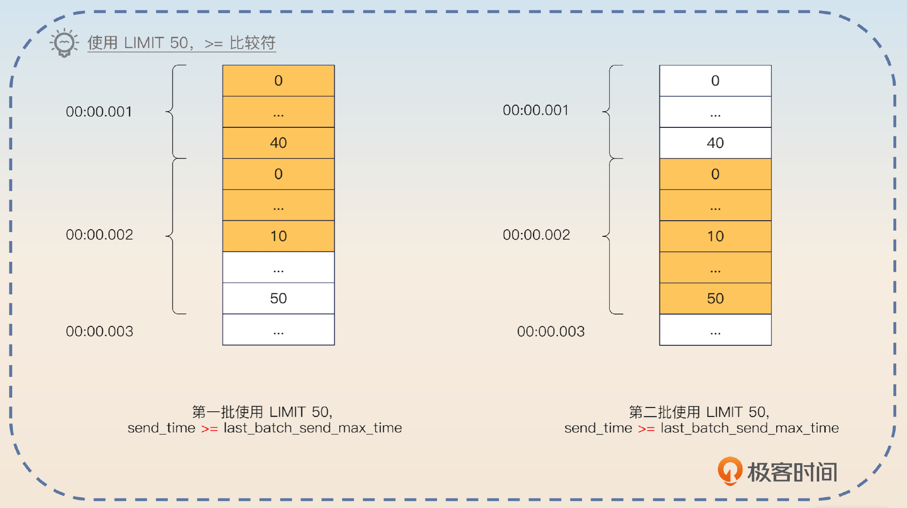
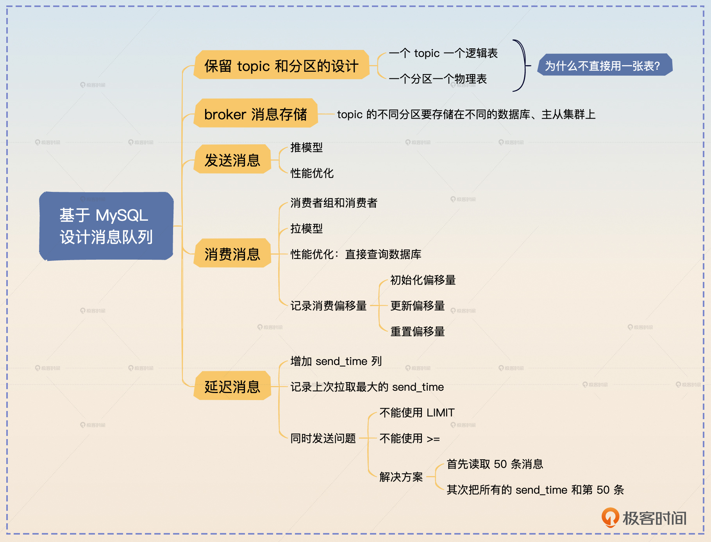

# 28｜架构设计：如果让你设计一个消息队列，你会怎么设计它的架构？
你好，我是大明。今天我们学习消息队列的架构设计，也就是如果让你设计一个消息队列，你会怎么做。

这个话题在面试中属于很难的一类，它要求你不仅要对 Kafka 本身有很深刻的理解，也要对分布式系统设计与实现有很深刻的理解。而且你还要在面试短短几分钟内说清楚，就更难了。如果没有准备凭着感觉回答的话，大概率只能讲出生产者、消费者这些比较浅显的东西，不成体系。

所以今天我就从理论和落地实践上给你讲清楚，如果你要设计一个消息队列，你要解决哪些问题。很多跟消息队列有关的知识你已经在前面学过了，所以我们直接从面试准备开始。

## 面试准备

如果你所在的公司并没有使用任何消息队列之类的中间件，那么你就需要搞清楚你们公司是如何做到解耦、异步和削峰的。当然，如果你所在公司有一些历史比较悠久的系统，尤其是在 Kafka 等消息队列兴盛起来之前就已经存在的系统，也可以去找找它们是如何解决类似问题的。

此外你还可以进一步去了解下面这些实现。

1. 基于内存的消息队列，一般用于进程内的事件驱动，又或者用于替代真实的消息队列参与测试。
2. 基于 TCP 的消息队列。这种消息队列是指生产者直接和消费者连在一起，没有 broker。生产者会直接把消息发给消费者。
3. 基于本地文件的消息队列，也就是生产者直接把消息写入到本地文件，消费者直接从本地文件中读取。

它们也不一定都叫做消息队列，但是基本的形态都是发布-订阅模式。

我在面试思路里面讲述的内容也不是只能用于回答如何设计一个消息队列，下面这些问题你也可以用里面的内容来回答。

- Kafka 为什么要引入 topic？
- Kafka 为什么要引入分区？只有 topic 行不行？
- Kafka 为什么要强调把 topic 的分区分散在不同的 broker 上？
- Kafka 为什么要引入消费者组概念？只有消费者行不行？

## 面试思路

面试官问到这个问题本身只是希望你能站在设计者的角度，阐述 Kafka 等消息队列为什么设计成当前的形态。那么你就要围绕生产者、消费者、broker 和 topic 这 4 个方面来阐述消息队列设计的关键点。

> 目前主流的消息队列已经很强大了，所以可以考虑参考它们的设计。现在的消息队列都有几个概念：生产者、消费者、Broker 和 topic。这里我以 MySQL 为例，讲述怎么在 MySQL 的基础上封装一个消息队列。

那么接下来你就可以一个一个介绍你准备怎么设计。因为单纯讲设计是一个很干巴巴的事情，这里我就用之前接触过的基于数据库封装消息队列的案例来辅助说明。

### topic 设计

前面你已经知道，一个 topic 会有若干个分区，而这些分区是分散在不同的 broker 上的。那你的设计肯定是不能脱离这些已有的成熟方案。

> 首先我也会保留 topic和分区的设计。现代的消息队列基本上都有类似的结构，只是名字可能不一样，有些叫分区 Partition，有些叫队列 Queue。

然后你要站在设计者的角度补充为什么要这么设计，也就是侧面阐述 Kafka 设计的精髓。

> topic 是必不可少，因为它代表的是不同的业务。然后面临的选择就是要不要在 topic 内部进一步划分分区。假如说不划分分区的话，有一个很大的缺点，就是并发竞争，比如说所有的生产者都要竞争同一把锁才能写入到 topic，消费者要读取数据也必须竞争同一把锁才能读取数据，这样性能很差。所以 topic 内部肯定要进一步细分，因此需要引入分区的设计。


然后讨论在 MySQL 上怎么把 topic 和表关联起来，关键词就是 **一个 topic 一个逻辑表**。

> 结合 MySQL 的特性，最基础的设计就是一个 topic 是一个逻辑表，而对应的分区就是对这个逻辑表执行分库分表之后得到的物理表。举个例子，假如说有一个叫做 create\_order 的 topic，那么就代表我有一个逻辑上叫做 create\_order 的表。如果这个 topic 有 3 个分区，那么就代表我有 create\_order\_0、create\_order\_1 和 create\_order\_2 三张物理表。这种情况下，每一张表都可以用自增主键，这个自增主键就对应于 Kafka 中的偏移量。

上面这个回答还提到了分库分表，那么面试官可能将话题引导到分库分表上。

这里你可能会困惑，包括面试官也可能会问，为什么要这么设计？为什么不能所有的 topic 都用一张逻辑表，里面有一个 topic 的列呢？这个时候你就要抓住 **性能和隔离** 两个点来解释。

> 之所以不采用所有 topic 都共用一张逻辑表，有两方面的原因。首先是一张表，难以应付大数据与高并发的场景，即便分库分表，也要分出来几千张表，实在犯不着；其次 topic 天然就是业务隔离的，因此让不同 topic 用不同的表，那么相互之间就没有影响了。

接着你可以引出 broker 的话题。

> 而且使用不同的表，能更好地安排不同的数据库实例来存储。

### broker与消息存储

当你确定了 topic 和分区两个概念之后，接着就是怎么存储这些 topic 和分区。Kafka 在存储分区的时候，是尽量做到分散开来，所以你的设计也要遵循这一点。

> 为了进一步保证可用性，同一个 topic 的不同分区最好分散在不同的 broker 上存储。这样即便某一个 broker 崩溃了，这个 topic 也最多只有一个分区受到了影响。

如果要利用数据库来做到这一点，那么就是把表分散在不同的数据库上，换句话来说就是，一个 topic 的不同分区， **不仅要分表，还要分库**。这里的分库，更加准确地说，是分数据源。也就是说，不同分区最好是存放在不同的主从集群上。

> 要想提高可用性，最好的策略就是把分区分散在不同的主从集群上。比如说有四个分区，那么可以四个分区分别在四个不同的主从集群上。优点是尽量分散了流量，并且不同的主从集群之间互不影响。

然后你进一步指出，主从集群本身就达成类似 Kafka 的副本效果，只不过你没有 ISR 的概念。

> 主从集群就意味着每一个分区在从库都有对应的一份数据。举个例子来说，如果是一主两从，那么就意味着每一个分区都有一个主分区和两个从分区。使用 MySQL 的主从机制也意味着我们不需要管理主从选举的问题，这样能够很大程度上减轻落地的难度。

### 发送消息

在解决了 topic 和 broker 的问题之后，接下来就要讨论发送者怎么发送了。第一个要确定就是发送者发送应该是推模型还是拉模型。也就是说，是发送者主动发给 broker 还是 broker 主动去拉取。显然在发送者这个场景下，应该是发送者来推送。

> 就生产者来说，它应该主动推送消息到 broker 上，因为消息产生速率完全跟 broker 没有关系，让 broker 来主动拉取的话，broker 不好控制拉的频率和拉的数量。

紧接着我们可以深入进去，讨论一下发送者发送性能的问题。

#### 批量发送

你同样可以借鉴 Kafka 优化发送者性能的措施，就是批量发送。

> 为了优化发送性能，可以支持批量发送功能。也就是说，生产者可以考虑凑够一个批次之后再发送。这个批次大小可以让生产者来控制。当然生产者也要考虑兜底措施，也就是说如果在一段时间之内，没有凑够一批数据也要发送，防止消息长时间停留在生产者内存里面，出现消息丢失的问题。Kafka 有类似的机制，比如说生产者可以通过 `linger.ms` 来控制生产者最终等待多长时间。



这个批量发送能够有效提高生产者的性能，下一节课我们会展开讨论。除了这个批量发送，你还有另外一个做法，就是生产者直接插入数据到消息表。

#### 直接插入消息

在 MySQL 的实现里面，消息最终是存储在数据库里面，你既可以通过 broker 来访问这个数据库，也可以 **让生产者直接访问这个数据库**。后者，你也可以认为生产者和 broker 就是一体的。



> 如果要追求极致的性能，那么可以考虑让生产者直接把消息插入到数据库里。生产者需要引入一个本地依赖，本地依赖会根据消息的 topic、分区找到对应的数据库配置，初始化连接池。而发送消息就是调用本地依赖的本地方法，这个方法会执行一个 INSERT 语句，插入消息。这样做的好处就是省略了一次网络中间通信。同样地，也可以使用批量插入来进一步提高性能。在消费者端也可以采用这样的措施。



### 消费消息

显然，可能会有不同的业务方消费同一个 topic 的消息，所以你需要引入消费者组和消费者的概念。

> 在消费消息的时候，同样需要引入消费者组和消费者的概念。一个业务方就是一个消费者组，一个消费者组里面可以有多个消费者。在 Kafka 里面，每一个分区有一个消费者，但是一个消费者可以消费多个分区。那么我这里也保留了这种设计，每一个分区是一张表，这张表对于一个消费者组来说，只能有一个消费者读取消息。



接着你要指出消费者这边使用拉模型会更好。

> 因为消费者才知道自己的消费速率，所以消费者这边用拉模型，例如每 1s 从消息队列中拉取 50 条消息。

这时候就会有另外一个问题，就是你怎么记录一个消费者已经消费了哪些消息？

#### 记录偏移量

既然我们用的是 MySQL，那么自然就是用另外一张表来记录了，而且同样保持每个 topic 都有一张表，例如 create\_order 有一个对应的表叫做 create\_order\_consumers，里面记录了消费 create\_order 这张表的消费者组和消费者数量。

这张表的设计也很简单，主要包含三列：消费者组的名字、分区、已消费偏移量。假如说 create\_order 这个 topic 有搜索和推荐两个业务方消费消息，那么 create\_order\_consumers 这张表的数据就类似于下面这样。



> 为了存储每一个消费者消费的偏移量，我需要一张新的表。比如说在 create\_order 这个例子里面，有一张表叫做 create\_order\_consumers。这张表有三个关键列：消费者组名字、分区和偏移量。而每次消费者提交消息，对于 borker 来说就是更新这张表的偏移量。



紧接着你就要介绍一下消息队列惯常支持的指定偏移量消费。

> 对于消费者来说，它也可以消费指定偏移量的消息，比如最开始消费到了偏移量 1000 的消息，现在因为业务出了问题，要从偏移量 100 的消息重新消费。这种时候，只需要更新 commited\_offset 为 100 就可以了。

你可以理解为 broker 就是执行一下这种语句。

```sql
UPDATE create_order_consumers SET committed_offset=100
WHERE partition = 2 and consumer_group = 'test'

```

而消费者拉取消息，实际上就是执行一个 SELECT 查询，比如在前面的例子里，重置偏移量到 100 之后，再次拉取一批消息，假如说一批是 50 条消息，那么就执行这样的 SELECT 语句。

```sql
SELECT * FROM create_order_2 WHERE id > 100 LIMIT 50

```

然后你要分析一下这样做的好处。

> 可以预见每一个 topic 都不会有很多消费者，所以记录消费偏移量的表不会有很多数据。而且在执行更新的时候，也只会使用到行锁，所以性能会很好。

你还可以考虑一些改进，也就是不用 MySQL 来记录这个消费偏移量。

> 也可以参考 Kafka 之类的设计，使用别的中间件来记录消费偏移量，比如说 ZooKeeper。

然后可以用一个 Redis 结合异步刷新的方案来进一步刷亮点。

> 此外，更新偏移量的操作并发非常高，那么可以考虑使用 Redis 来记录消费偏移量，然后异步刷新到数据库中。


但凡涉及到异步，你就应该想到数据丢失的问题。

> 但是这个方案存在的风险就是 Redis 可能突然宕机，导致最新的偏移量没有更新到 MySQL 中。比如说数据库记录的消费偏移量是 950，而消费者已经消费到了偏移量 1000，但是因为 Redis 突然宕机，以至于数据库里的偏移量还没更新为 1000。当 Redis 再次恢复之后，消费者就只能从 950 的位置重新消费。这种情况下，消费者做到幂等就可以。

如果要提高性能，也可以考虑让消费者直接连上数据库，自己拉取消息。

#### 直接拉取消息

类似于生产者直连数据库，消费者也可以考虑直连数据库。

> 还有一个优化消费者性能的地方，就是提供一个本地依赖，让消费者通过这个本地依赖直连数据库，直接从数据库中读取消息。同样地，消费者也通过这个本地依赖来提交消息。



### 延迟消息

这个方案有一个很大的好处，就是它很容易实现延迟消息。关键操作就是在消息表里面加上一个预期发送时间。而消费者拉取消息的时候，执行的语句类似于下面这样：

```sql
SELECT * FROM some_topic
WHERE send_time <= now()
AND send_time > $last_batch_send_max_time

```

上面 SQL 中的参数 `$last_batch_send_time` 就是消费者拉取出来的一批消息中最大的那个发送时间。你应该注意到了，在这种形态下，你需要记录的就不是消费偏移量，而是时间戳了。比如说对于某个消费者，你应该记录它已经消费到了哪个时间点的延迟消息。

所以你可以先简单介绍这个方案。

> 我这个方案很容易支持延迟消息，只需要在消息表里面加上一个 send\_time 的列记录预期发送时间的毫秒数就可以。比如说消费者拉取消息的时候就是执行类似这样一个语句， `SELECT * FROM some_topic WHERE send_time <= now() AND send_time > last_batch_send_max_time`。last\_batch\_send\_max\_time 就是消费者拉取出来的一批消息里最大的那个发送时间。不过这里并不能用 LIMIT 来解决批次大小的问题，因为这里要考虑同时发送的问题。

最后一句话，就是为了引出来同时发送的问题。你不需要立刻回答，而是等着面试官来问。问到了你就先解释什么叫做同时发送。

> 举个例子来说，数据库里面有 40 条消息是在 00:00.001 时刻发送，50 条是在 00:00.002 时刻发送。如果你在 SELECT 语句里面加上 LIMIT 50，那么你就会拿到 40 条 00:00.001 发送的消息，10 条 00:00.002 发送的消息。下一次执行的时候， WHERE send\_time > 00:00.002 就会把剩下的 40 条 00:00.002 发送的消息全部跳过。



> 如果条件改成 WHERE send\_time >= 00:00.002，那么这一次拉出来的 10 条 00:00.002 消息会再次拉出来。



紧接着就要说一下这个问题的解决方案。

> 要解决这个问题就要在查询的时候，不依赖于数据库计算 LIMIT，而是自己算。也就是说，当我拿到这个查询返回的结果集的时候，首先读够50条。然后检查第50条之后的数据，如果 send\_time 和第50条是一样，那么就加入到当前批次来。所以按照这个算法，当前批次应该是把 00:00.001 和 00:00.002 两个时刻的数据都读到，也就是有 90 条。这个算法有一个基本假设，也就是某一个时刻，要发送的消息不会太多。比如说特定某毫秒的消息，连几十条可能都没有。

如果面试官问这个方案的难点在哪里，你也可以用这个同时发送的问题来回答。在其他类似的跟时间有关的场景下，也需要考虑同样的问题，所以解决思路还是比较有参考价值的。

### 方案总结

这个方案还有一些点需要解释一下，让你心中有底，防止面试官突然问到相关的问题。

首先这个方案利用了数据库来作为存储，而不是自己操作文件，也就是避开了消息队列中对性能影响很大的 IO 方面的内容，自然也就用不上零拷贝之类的技术。

这个方案是基于 MySQL 实现的，你也可以把 MySQL 换成 PostgreSQL 或者 Oracle。在换成 Oracle 之后，连分库分表都不需要，因为 Oracle 完全撑得住高并发。你也可以考虑换成 TiDB 等分布式数据库。

你可能会觉得有点奇怪，就是什么情况下我们会考虑用 MySQL 来实现一个消息队列？答案是在一些 ToB 的场景下。比如说 A 公司研发了一个软件，B 公司购买之后要求本地部署。A 公司研发的软件需要使用到消息队列，但是 B 公司是一个小公司，并不打算部署消息队列，因为他们缺乏技术力量来维护这个消息队列。那么 A 公司就可以考虑利用 MySQL 来封装一个消息队列，比较典型的例子就是私有化部署的即时通讯工具。

## 面试思路总结

这节课我带你深入讨论了设计一个消息队列应该要考虑的问题，并且给出了基于 MySQL 实现的一个方案，里面有一些要点需要你记住。

- 一个 topic 一个逻辑表，一个分区一个物理表。
- 同一个 topic 的不同分区对应的表，应该尽可能分散在不同的数据库、主从集群上。
- 生产者使用推模型，主动推送消息。
- 生产者可以考虑使用批量发送、直连数据库的方式提高性能。
- 一个 topic 一个消费偏移量表，用来记录各个消费者组的消费进度。
- 消费者使用拉模型，按照自己的消费能力按需拉取。
- 可以通过增加 send\_time 这个列来支持延时队列。

如果你有时间的话，我建议你尝试自己实现一下，加深你对消息队列的理解。

此外，你在面试中还有可能遇到类似的问题，比如说让你设计一个 Redis、一个数据库，或者ZooKeeper。如果你没有提前准备这一类问题，你就可以回答相应中间件的核心原理。比如说消息队列，除了我告诉你的用 MySQL 来封装一个消息队列的核心设计，其他的基本上都是在介绍 Kafka 的核心原理。



## 思考题

最后请你来思考两个问题。

- 在 MySQL 的实现里面，当来了一个新消费者组的时候，该怎么初始化消息偏移量表中该消费者组的数据？
- 有些小型公司也不会使用 Kafka 之类的专业的消息队列，而是借助于 Redis 来实现。你知道怎么用 Redis 来实现类似的功能吗？

欢迎你把你的答案分享在评论区，也欢迎你把这节课的内容分享给需要的朋友，我们下节课再见！