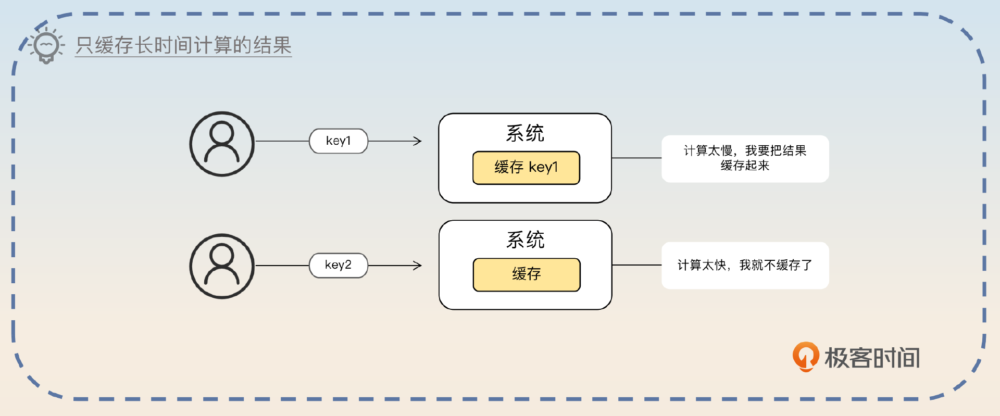
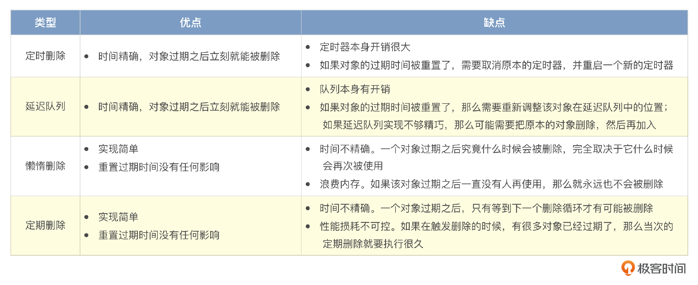
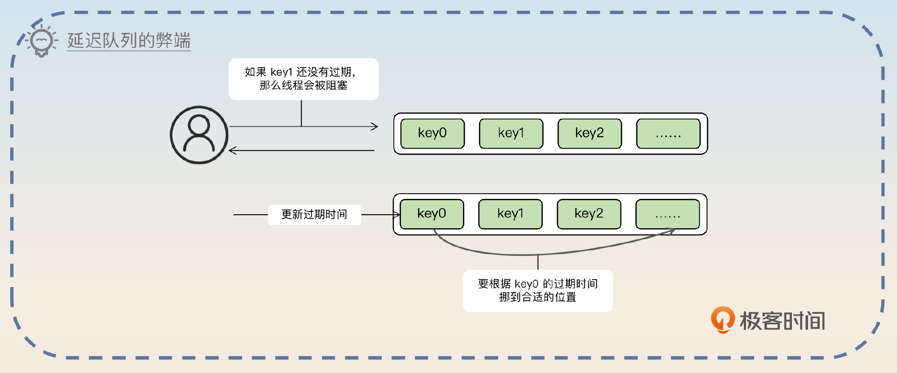
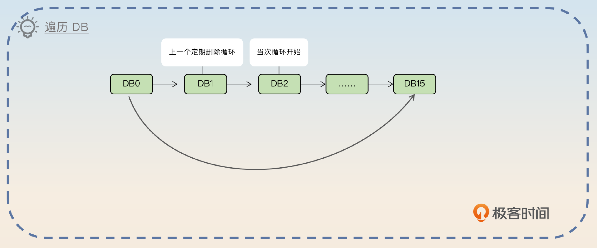
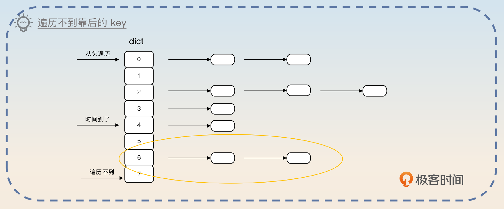
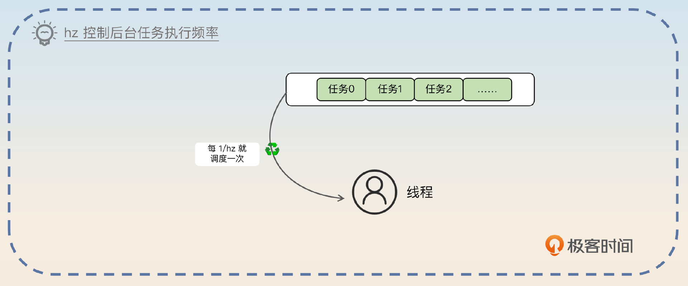
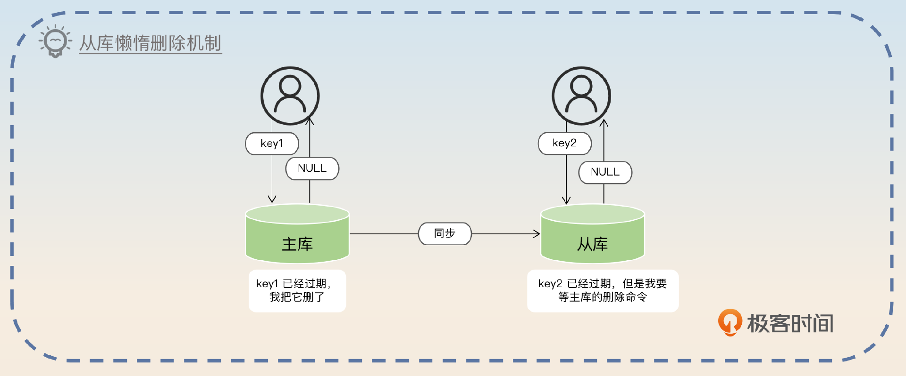
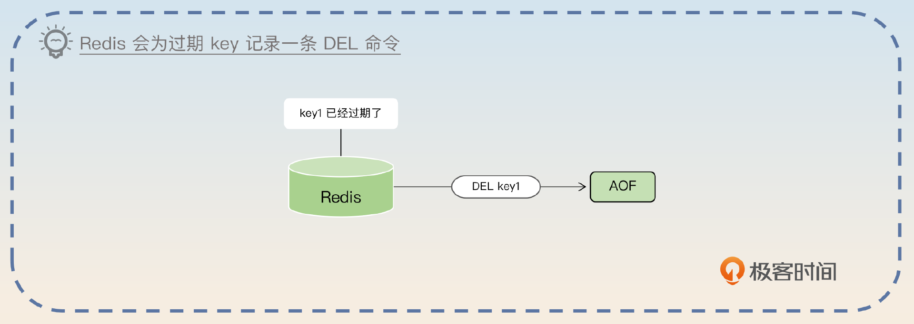
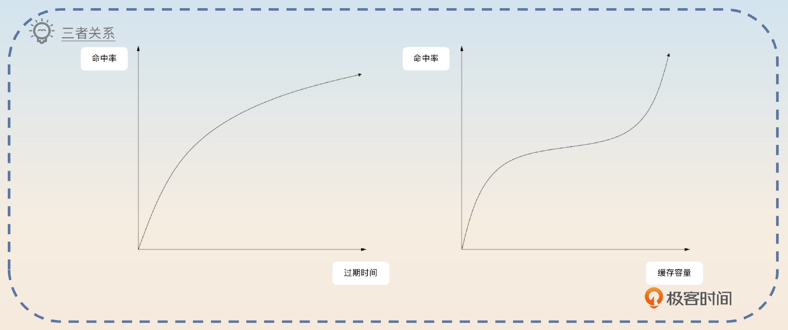
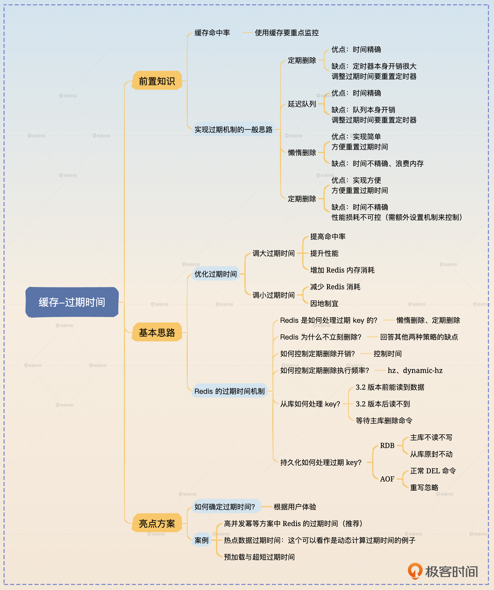

# 31｜缓存过期：为什么 Redis 不立刻删除已经过期的数据？
你好，我是大明。今天我们来讨论一个全新的话题——缓存。

缓存在实践中、面试中的重要性不言而喻。应该说，缓存用好了就能解决你大部分的性能问题。反过来，如果缓存没有用好，那么系统性能是不可能好的。

缓存在面试中也分成两个方向：一个是理论上缓存的设计，包括 Redis 的原理；一个是在实践中使用缓存的案例，聚焦在怎么使用缓存，怎么解决一致性问题。

那么今天我们先从第一个话题缓存的过期时间开始。

## 缓存命中率

缓存命中率是我们用来衡量缓存效果的关键指标。它的计算方式是缓存命中次数除以查询总次数。

在实践中，你要努力把缓存命中率提高到 90% 以上。不过，缓存命中率也受到业务模式的影响，有一些业务是没有办法做到 90% 以上的。

比如说有一些场景是缓存计算时间很长的结果，但是大部分请求都是小请求，也就是都不会命中缓存，这种时候缓存命中率可能连一半都没有。但是因为这些小请求计算很快，所以走实时计算响应时间也能接受，而且实时计算的数据更加准确。

## 实现过期机制的一般思路

从系统设计的角度来说，过期之类的机制可以考虑使用四种思路来实现。

- 定时删除：是指针对每一个需要被删除的对象启动一个计时器，到期之后直接删除。
- 延迟队列：也就是把对象放到一个延迟队列里面。当从队列里取出这个对象的时候，就说明它已经过期了，这时候就可以删除。
- 懒惰删除：是指每次要使用对象的时候，检查一下这个对象是不是已经过期了。如果已经过期了，那么直接删除。
- 定期删除：是指每隔一段时间就遍历对象，找到已经过期的对象删除掉。

  针对这四种思路的优缺点，你可以参考下面的表格。

大部分的缓存框架，比如Redis，它们都使用了懒惰删除和定期删除结合的策略。定时删除和延迟队列对于缓存这种场景来说，性能太差。

## 面试准备

你在面试前，需要弄清楚一些信息。

- 你的业务是如何使用缓存的，命中率有多少？业务高峰的时候消耗了多少内存？
- 你的业务使用缓存的时候过期时间是多少？当时为什么设置成这个过期时间？
- 有没有一些不一般的业务场景，你确定过期时间的时候是费了比较多精力的？
- 你有没有调整过缓存的过期时间，怎么调整的？你为什么这么调整？最好就是调大过期时间和调小过期时间的案例你各准备一个。

在面试过程中，面试官可能会直接问你缓存中间件的原理。比如说你的简历上提到了 Redis，那么面试官就可能直接问你 Redis，进一步就可能问到 Redis 的过期 key 的删除策略。

另外一种可能是你在和面试官聊项目的时候，你讲到你项目中使用了缓存，于是面试官就可能会问你具体细节，也就包括缓存的过期时间等内容。

如果面试官问到了这些问题，也可以用本节课的内容来回答。

1. 你是如何确定缓存的过期时间的？
2. 过期时间过长或者过短有什么问题？
3. 怎么优化缓存的命中率？
4. Redis 是如何处理过期 key 的？是立刻删除吗？
5. 当你读 Redis 从库的时候，有可能读到过期 key 吗？
6. Redis 的 RDB 或者 AOF 是如何处理过期 key 的？

## 基本思路

优化过期时间有两个方向。第一个是调大过期时间，提高缓存命中率，并提高性能。

> 早期我优化过一个缓存的过期时间，从十分钟延长到了二十分钟，缓存命中率从 80% 提升到了 90%。当然，代价就是 Redis 中缓存了更多的 key，占用了更多内存。

又或者是减少过期时间，从而减少 Redis 的消耗。

> 我刚进我们公司的时候，发现我们公司的过期时间基本上都是统一的半小时，而没有考虑具体的业务特征。后来我排查之后，发现很多业务根本用不了半小时。比如说我把一个业务的过期时间降低到 10 分钟，缓存命中率基本上没有变化。经过这样的排查之后，Redis 的开销降了 30%。

在你提到了缓存过期时间之后，面试官就很可能问你，你使用的缓存是如何删除过期对象的？这个时候你要根据自己使用的缓存来回答，但是基本上不会超出我在前置知识里面讲到的四种思路。这里我以 Redis 为例来说明。

> 我使用的是 Redis，Redis 的过期删除机制简单来说就是懒惰删除和定期删除。懒惰删除是指Redis 会在查询 key 的时候检测这个 key 是否已经过期，如果已经过期，那么 Redis 就会顺手删除这个 key。
>
> 单纯使用懒惰删除肯定是不行的，因为一个 key 过期之后，可能一直没有被使用过。所以 Redis 结合了定期删除策略。Redis 每运行一段时间，就会随机挑选出一部分 key，查看是否过期，如果已经过期了，就把 key 删除掉。Redis 的定期删除要比我这里讲的复杂很多，毕竟 Redis 是一个追求高性能的中间件，所以肯定要有复杂的机制控制住定期删除的开销。

最后一句也就是为了引出后面的亮点。当你回答完这一句之后，就可以等着面试官追问了。面试官追问的问题会有很多，我们一个个看。

### 为什么不立刻删除？

一个经典问题就是，为什么不立刻删除过期的 key？答案就是做不到，或者即便能做到，代价也太高。

最简单的做法就是我在前置知识里面提到的，每一个 key 启动一个定时器，到时间了就删掉。但是这里会有2个问题。

1. key 太多了，一个 key 一个计时器，Redis 承受不住那么大的计时器开销。
2. 修改过期时间的时候，要重置计时器的时间，这会进一步带来额外的开销。

所以这个思路肯定不行。

那么还有一种思路就是把所有的 key 额外再按照过期时间组一个延迟队列，排在最前面的就是最近要过期的。不过这个思路也有3个问题。

1. 延迟队列的本身开销很大，尤其是在 key 很多的情况下。
2. 修改过期时间需要调整延迟队列中各个 key 的顺序。
3. 延迟队列一般需要一个线程配合使用，如果引入这个线程，那么 Redis 就需要做更多并发控制，性能会下降。

总的来说，你在回答的时候可以抓住关键点 **性能** 来回答。

> 理论上来说，并不是做不到，只不过代价比较高昂不值得而已。
>
> 最简单的做法就是使用定时器，但是定时器本身开销太大，还得考虑在更新过期时间的时候重置定时器。另外一种思路就是使用延迟队列，但是延迟队列本身开销也很大，修改过期时间也要调整延迟队列，还要引入大量的并发控制。
>
> 综合来看，并不值得。而定期删除和懒惰删除的策略虽然看上去可能浪费内存，但是这个浪费很少，并且对响应时间也没那么大的影响。

既然没办法立刻删除，只能定期删除，那么我们怎么控制这个开销呢？

### Redis 是怎么控制定期删除开销的？

假如说现在 Redis 有 100 万 key，那么显然 Redis 在定期删除过期 key 的时候，是不可能遍历完这 100 万个 key 的。而 Redis 也确实没有遍历全部的 key，简单来说 Redis 会在每一个循环中遍历 DB。如果当次定期删除循环没有遍历完全部 DB，那么下一个循环就会从当次最后遍历的 DB 的下一个继续遍历下去。

针对每一个 DB，都会有这样一个步骤。

1. 如果 DB 里存放的 key 都没有设置过期时间，那么遍历下一个 DB。
2. 从设置了过期时间的 key 中抽一批，默认一批是 25 个。
3. 逐个检查这些 key。如果这个 key 已经过期了，那么执行删除操作。
4. 每遍历 16 个 key，就检测执行时间。如果执行时间已经超过了阈值，那么就中断这一次定期删除循环。
5. 如果这一批过期的 key 比例超过一个阈值，那么就抽取下一批 key 来检查，这个阈值也是可以通过参数来控制的。

上面这个步骤你记不住也没关系，因为在面试中很少会考察 Redis 的源码，而且 Redis 这部分的代码修改过很多次，也无从面起。

你只需要按照我最后总结出来的来回答就可以了。

> 在每一个定期删除循环中，Redis 会遍历 DB。如果这个 DB 完全没有设置了过期时间的 key，那就直接跳过。否则就针对这个 DB 抽一批 key，如果 key 已经过期，就直接删除。
>
> 如果在这一批 key 里面，过期的比例太低，那么就会中断循环，遍历下一个 DB。如果执行时间超过了阈值，也会中断。不过这个中断是整个中断，下一次定期删除的时候会从当前 DB 的下一个继续遍历。
>
> 总的来说， **Redis 是通过控制执行定期删除循环时间来控制开销**，这样可以在服务正常请求和清理过期 key 之间取得平衡。

这个时候，有些面试官会问为什么要随机抽样，同一个 DB 内按照顺序遍历下去不就可以吗？你就要回答 **确保每个 key 都能遍历到**。

> 随机只是为了保证每个 key 都有一定概率被抽查到。假设说我们在每个 DB 内部都是从头遍历的话，那么如果每次遍历到中间，就没时间了，那么 DB 后面的 key 你可能永远也遍历不到。

你可以进一步总结大部分缓存控制开销的套路，也就是 **控制时间或者控制个数**。

> 在一些本地缓存的实现里面，也基本上会控制住这个开销。但是做法会比较简单。一种做法是循环的每个迭代都检测执行时间，超过某个阈值了就中断循环。另外一种做法是遍历够了就结束，比如说固定遍历 10000 个。当然也可以考虑两种策略混合使用。

实际上，Redis 抽样 key 的算法变过几次，不过这部分内容在面试中是不会考察的，所以准备面试的话其实不需要深入了解。但是如果你想要参考 Redis 来设计本地缓存，那么就可以深入了解一下。

### 如何控制定期删除的频率？

在 Redis 里面，定期删除的频率可以通过 hz 参数来控制。不过 hz 控制的是所有的后台任务，并不是单独控制这一个定期删除循环。

假如说 hz 的值是 N，那么就意味着每 1/N 秒就会执行一次后台任务。举例来说，如果 hz=10，那么就意味着每 100ms 执行一次后台任务。

正常来说，Redis 这个值不要超过 100。越大就意味着后台任务执行的频率越高，CPU 使用率越高。

与之对应的是一个 dynamic-hz 选项。在开启了这个选项之后，hz 的值会被认为是一个基数，而实际的值是 Redis 自己动态计算的。

所以如果面试官问到了如何控制这个频率，你就可以回答 hz 和 dynamic-hz。

> 在 Redis 里面有一个参数叫做 hz，它代表的是 Redis 后台任务运行的频率。正常来说，这个值不需要调，即便调整也不要超过 100。与之相关的是 dynamic-hz 参数。这个参数开启之后，Redis 就会在 hz 的基础上动态计算一个值，用来控制后台任务的执行频率。

在这之后有一个问题，就是 Redis 在使用了主从集群的时候，如果查询从库，有没有可能查询到过期的数据？

### 从库处理过期 key

在 Redis 3.2 之前有一个非常著名的 Bug，就是你在从库查询一个 key 的时候，即便这个 key 已经过期，但是你还是能够拿到数据。后来这个 Bug 在 3.2 修复了。当下如果你在从库上查询 key，而这个 key 已经过期了，那么 Redis 从库会返回给你 NULL。

注意，从库和主库的区别是，主库发现 key 过期后会执行删除操作。但是从库不会，从库会等待主库的删除命令。

有时候面试官可能会问你，如果一个 key 过期了，那么还能不能拿到这个 key 的值？这时候你就应该知道，面试官问的是这个 Bug，你区分回答 3.2 之前的行为和 3.2 之后的行为就可以。

> 在 Redis 的 3.2 版本之前，如果读从库的话，是有可能读取到已经过期的 key。后来在 3.2 版本之后这个 Bug 就被修复了。不过从库上的懒惰删除特性和主库不一样。主库上的懒惰删除是在发现 key 已经过期之后，就直接删除了。但是在从库上，即便 key 已经过期了，它也不会删除，只是会给你返回一个 NULL 值。

因为讨论到了从库之类的问题，那么可能会把话题引导到主从同步，以及 Redis Sentinel 和 Redis Cluster 等问题上，课程后面也会讨论这些。

Redis 本身也有持久化机制，那么问题来了，Redis 在持久化的时候怎么处理这些过期的 key？

### 持久化处理过期 key

Redis 里面有两种持久化文件，RDB 和 AOF。

RDB 简单来说就是快照文件，也就是当 Redis 执行 SAVE 或者 BGSAVE 命令的时候，就会把内存里的所有数据都写入 RDB 文件里。后续主库可以载入这个文件来恢复数据，从库也可以利用这个文件来完成数据同步。对于 RDB 来说，一句话总结就是 **主库不读不写，从库原封不动。**

也就是说，在生成 RDB 的时候，主库会忽略已经过期的 key。在主库加载 RDB 的时候，也会忽略 RDB 中已经过期的 key。而从库则是整个 RDB 都加载进来，因为从库在加载完 RDB 之后，很快就能从主库里面收到删除的指令，从而删除这个过期的 key。

AOF 是之前我们就提到过的 Append Only File。Redis 用这个文件来逐条记录执行的修改数据的命令。不管 Redis 是定期删除，还是懒惰删除过期 key， **Redis 都会记录一条 DEL 命令**。

因为每一条修改命令都要记录，所以 AOF 就会很大。这时候 Redis 就会考虑重写整个 AOF，也就是直接把整个内存中的数据写下来，写完就可以把之前的 AOF 文件都删了。在重写过程中，Redis 会忽略已经过期的 key。

## 亮点方案

这一次的亮点方案我给你准备了理论和实践两方面的内容。理论上是讨论该如何确定一个合理的过期时间，而实践方面我给你三个有特色的过期时间案例。

### 如何确定过期时间？

确定过期时间是那种看起来很简单，但是如果之前没有认真思考过就会栽跟头的问题。在回答这个问题之前，你可以想到，如果缓存容量足够大，那么缓存就可以设置成永不过期，所有的请求都会百分百命中。但是问题是我们没有足够的资源。

所以在实践中就是根据你希望的缓存命中率来确定缓存过期时间。缓存命中率越高，就需要越多的缓存容量，越长的过期时间。

所以你要 **先揭示这三者之间的关系**，然后通过一个简单的例子说明你是如何确定具体的过期时间的。

> 一般我们是根据缓存容量和缓存命中率确定过期时间的。正常来说，越高缓存命中率，需要越多的缓存容量，越长的过期时间。所以最佳的做法还是通过模拟线上流量来做测试，不断延长过期时间，直到满足命中率的要求。当然，也可以从业务场景出发。比如说，当某个数据被查询出来以后，用户大概率在接下来的三十分钟内再次使用这个对象，那么就可以把过期时间设置成 30 分钟。

这个回答是非常正统的，但是有些时候如果公司资源不足，比如说你原本需要 3G 内存才能满足 90% 的命中率，结果公司只能给你 1G，这个时候你就只能缩短过期时间了，这个时候命中率也会跟着下降。你可以进一步补充这个点。

> 如果公司的缓存资源不足，那么就只能缩短过期时间，当然代价就是缓存命中率降低。

在这个回答里面，你反复提到了命中率，那么面试官很可能会问你如何确定缓存命中率。你可以说 **根据用户体验来确定**。

> 缓存命中率要根据用户体验来确定。比如说要求 90% 的用户都能直接命中缓存，以保证响应时间在 100ms 以内，那么命中率就不能低于 90%。又或者公司规定了接口的 99 线或者平均响应时间，那么根据自己接口命中缓存和不命中缓存的响应时间，就可以推断出来命中率应该多高。
>
> 举个例子，如果公司要求平均响应时间是 300ms，命中缓存响应时间是 100ms，没命中缓存的响应时间是 1000ms，假设命中率是 p，那么 p 要满足$100 \\times p +1000 \\times (1-p) = 300$。

在这个回答里面，p 计算出来大概是 0.78。但是你在面试的时候只需要回答这个等式就可以了，并不需要真的计算出来 p。

### 确定过期时间的案例

接下来你在面试的时候可以考虑用一些案例来证明你对计算缓存的过期时间很有经验。你可以先引出这个话题。

> 理论上是要根据用户体验来确定过期时间，更加直观的做法是根据重试的时间、数据的热度来确定过期时间。

#### 高并发幂等方案中 Redis 的过期时间

第一个是之前我们说过的布隆过滤器-Redis-唯一索引的高并发幂等方案中，确定 Redis 的过期时间的方法。

> 之前我设计过一个支持高并发的幂等方案，里面用到了 Redis。这个 Redis 会缓存近期已经处理过的业务 key，那么为了避免穿透这个缓存，缓存的过期时间就很关键了。如果过短，缓存命中率太低，请求都落到数据库上，撑不住高并发；如果过长，那么会浪费内存。
>
> 所以这个过期时间是和重复请求相关的，例如在我的某个业务里面，重试是很快的，基本上在 10 分钟内就能重试完毕，那么我就把这个 Redis 的 key 的过期时间设置为 10 分钟。
>
> 类似的思路也可以用于重试机制。比如说如果流程很漫长，那么可以考虑缓存中间结果，比如说中间某个步骤计算的结果。当触发重试请求的时候，就直接利用中间结果来继续执行。而这些中间结果的过期时间，就会触发重试的时间。

实际中很多过期时间都是根据重试机制来确定的，不过也有一些过期时间是根据数据是不是热点来确定的。

#### 热点数据过期时间

简单来说，就是越热的数据，过期时间越长。也就是说，如果你能够确定什么样的数据是热点数据，那么这一部分数据你就可以设置更长的过期时间。反过来，一个数据越冷，你就可以将过期时间设置得越短。

> 也可以考虑根据数据是否是热点来确定过期时间。热点数据我们就会设置很长的过期时间，但是非热点数据，过期时间就可以设置得短一些。比如说我们的业务每个小时都会计算一些榜单数据，那么这些榜单对应的缓存过期时间就是一个小时。
>
> 又比如说当某个大 V 发布了一个新作品之后，这个新作品的缓存时间可以保持在数小时。因为我们可以预期大 V 的粉丝会在这几小时内看完这个新作品。而一个已经发布很久的作品，即便要缓存，缓存时间也要设置得比较短，因为这个时候并没有什么人来看。

此外还有一个比较奇诡的方案，就是缓存预加载与超短过期时间。

#### 预加载与超短过期时间

在一些业务场景里面，用户的行为是可以预料的。比如说列表页和详情页，用户在看到列表页之后，下一个动作比较大的可能就是点击列表页里的某项，查看详情。例如在搜索的时候，用户有意识地搜索了某个关键字，那么看到结果列表页之后，他大概率就会点击列表页中的头几项进一步查看详情。

抽象地来说，就是用户访问 A 数据的时候，大概率会访问 B 数据。所以你在返回 A 数据时，顺便把 B 数据准备好，丢到缓存里面。那么进一步考虑，这个用户不管有没有访问 B 数据，别人都是用不上的。而且用户也不会一直访问 B 数据，可能就是一分钟或者更短的时间内访问一次两次。所以这个时候你可以把缓存时间设置得很短，来控制住缓存的内存使用率。

所以，也可以认为这个方案就是用 **内存换响应时间**。

> 早期我们有一个业务场景，就是用户会搜索出一个列表页，然后用户大概率就会点击列表页前面的某些数据。因此我做了一个简单的性能优化，就是预加载缓存。当用户访问列表页的时候，我会异步地把列表页的第一页的数据加载出来放到缓存里面。因为我可以预计的是，接下来用户会直接使用查看列表页中内容的详情信息。那么就会直接命中缓存，而不必再次查询。
>
> 当然，因为用户也不一定就会访问，而且就算访问了也就是只访问一两次，因此过期时间可以设置得很短，比如说用一分钟。

这个方案应该说，在实践中的局限性很大，你只有在我提到的这种关联性很强的业务场景中才能使用。但是拿出去面试，就很有用，因为它能体现你对缓存过期时间以及对具体业务场景的深刻理解。

## 面试思路总结

让我们来总结一下这节课的主要内容。

首先在前置知识里面我介绍缓存命中率和实现过期机制的一般思路，你可以结合自己使用的各种缓存来理解。在实践中，我也非常建议你关注一下自己使用的缓存命中率，并且尝试优化一下。

我们这节课还重点解决了Redis 中和过期时间有关的问题，分别是：

- Redis 具体是怎么处理过期 key 的？懒惰删除加定期删除。
- Redis 为什么不立刻删除？实现立刻删除的代价太高。
- Redis 是怎么控制定期删除的开销的？总的来说是控制执行时间。
- 怎么控制 Redis 的定期删除频率？通过 hz 参数和 dynamic-hz 参数控制。
- 从库是怎么处理过期 key 的？查询返回 NULL，删除等主库命令。
- Redis 持久化怎么处理过期 key？对于 RDB 来说，主库不读不写，从库原封不动。对于 AOF 来说，正常追加 DEL 命令，重写则是不管。

## 思考题

最后请你来思考2个问题。

1. 你有没有用过本地缓存？你知道它是如何删除过期 key 的吗？
2. 你有没有遇到过动态确定过期时间的场景？比如说根据请求特征、计算时间、重要性、优先级等，为同一个业务场景的不同请求设置不同的过期时间。

欢迎你把自己的经验分享到评论区和我互动，也欢迎你把这节课的内容分享给需要的朋友，我们下节课再见！