# 34｜缓存一致性问题：高并发服务如何保证缓存一致性？
你好，我是大明。今天我们来聊一个面试缓存必然会涉及的一个问题：怎么保证数据一致性？

上一节课我详细分析了各个缓存模式，你会发现这些缓存模式要么存在数据丢失的可能，要么在某一段时间内总是会不一致。那么有没有能够彻底解决缓存一致性的方案呢？

这节课我就带你分析各种可行的解决方案，并且告诉你这些方案在保障数据一致性上，究竟能够做到什么地步。

为了方便你理解后面的内容，我们先来看 double-check 模式。

## double-check 模式

double-check 是并发里为了兼顾并发安全和性能经常采用的一种代码模式。它的基本思路可以总结为检查、加锁、检查，所以也叫做 double-check。double-check 经常用在使用读写锁的场景。这里我用伪代码来描述它的基本思路。

```go
func doubleCheck() {
  rlock() // 加读锁
  if !checkSomething() {
    // 执行一些动作
    return
  }
  runlock() // 释放读锁
  lock()
  if !checkSomething() {
  // 执行一些动作
    return
  }
  // 执行另外一些动作
  lock()
}

```

比如，先加读锁检测数据是否存在，如果存在就直接返回，否则就释放读锁，加写锁，再次检查数据是否存在，存在就直接返回，不存在就根据业务计算数据并返回。

double-check 还有一些变种。第一个变种是在第一次检查的时候，什么锁都不加，这个变种一般用在分布式锁下，因为分布式锁没有读锁。另外一个变种是用原子操作来取代读锁，但是前提是你用原子操作就可以完成检查。

一般来说，你可以把 double-check 作为自己优化并发代码的一个措施，纳入到整个性能优化方案里面。

## 面试准备

这里我先来问你几个问题。

- 每一个你使用了缓存的地方，你是如何解决一致性问题的？
- 如果没有解决，你能容忍多久不一致？
- 当数据不一致的时候，你多久能发现，多久能修复，有没有自动发现和修复机制？

你看看你是否能答上来，如果答不上来的话，我建议你整理一下。因为当你在简历或者项目里面有任何一个地方提到了缓存，面试官都有可能询问数据一致性相关的内容。

实际上很多时候面试官也知道越追求严格的数据一致性，代价也就越大。所以你在回答数据一致性的问题的时候，要强调的是你知道数据一致性的问题，而且你不仅知道，你还知道能有多不一致，能在多长时间内达成一致。

并且，数据一致性是一个非常考验分析并发场景的地方，因此你在面试之前，可以试着自己分析一下你使用的缓存方案里面有哪些场景会引起数据不一致。

## 基本思路

### 不一致的根源

在你讲到任何数据不一致的时候，你都可以先揭示两个不一致的来源。

- 源自操作部分失败
- 源自并发操作

你能讨论到这两个来源，就算是一个亮点，因为很少有人能仔细分析这些问题。

> 要想彻底解决数据一致性问题，就首先要搞清楚数据不一致的两个来源。第一个是操作部分失败，第二个是并发更新。

#### 源自操作部分失败

这个是最难解决的。之前你在 [分布式事务](https://time.geekbang.org/column/article/678287)、 [消息丢失](https://time.geekbang.org/column/article/687062) 两节课里面已经看到了类似的问题，也就是在分布式环境下，你很难保证多个操作要么都成功，要么都失败。而在更新数据的时候，即便是最简单的模型，也是要求你更新数据库和更新缓存要么都成功，要么都失败。

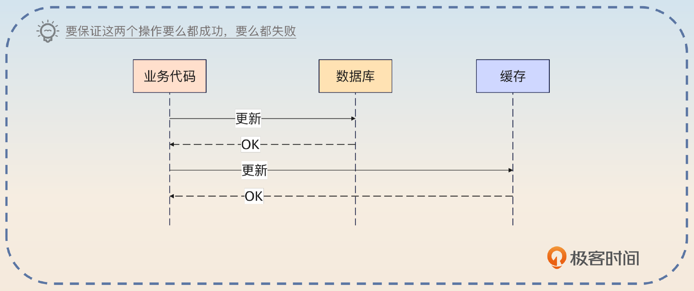

显然，这是一个分布式事务问题。那么通过前面的学习，你应该知道已有的分布式事务里面，追求的都是最终一致性。即便你认为 XA 事务能够解决一致性问题，但是缓存基本上没有支持 XA 事务的。

好在缓存有点特殊。所以在这节课的后面我给出了一个结合本地事务和分布式锁的无限接近强一致性的方案。所以这里的结论就是，源自部分失败造成的数据不一致是不可避免的。

> 我举一个例子来说明操作部分失败，在最简单的模型里面，就是更新数据库和更新缓存两个步骤。理论上来说要保证数据一致性，就必须要保证这两个更新要么都成功，要么都失败，不能有中间状态。也就是说，这是一个分布式事务问题。而现在缓存中间件包括 Redis，都不支持分布式事务。因此这个问题就决定了数据不一致是不可避免的。

你可以进一步总结拔高。

> 在能够彻底解决操作部分失败的问题之前，都只能说尽可能避免不一致，并且尽快达成一致，这也就包括重试失败操作、数据自动校验并修复等措施。

#### 源自并发操作

上一节课我给你分析各种缓存模式遇到的数据不一致的问题，都是从这个角度出发的。源自并发操作的数据不一致，在某种程度上来说，是可以解决的。比如说在缓存模式中提到的 Write Back 模式。

解决这一类的数据不一致，核心是确保同一个时刻只有一个线程在更新数据库和缓存。在分布式环境下，这也就意味着即便你有几百个实例，依旧只能有一个实例上的一个线程在更新数据。

> 另外一个导致数据不一致的原因是并发操作，比如说多个线程同时更新数据库和缓存，在这种情况下有可能先更新数据库的线程后更新缓存，导致数据不一致。

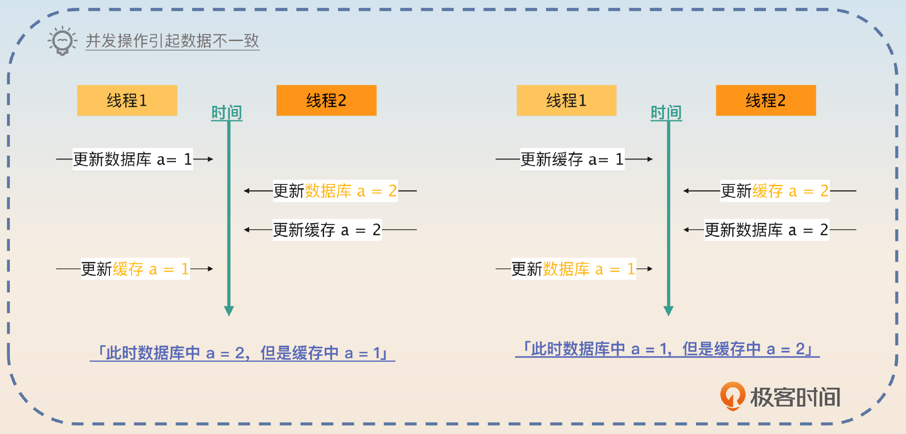

然后你可以解释这个是可以解决的。

> 并发操作的数据不一致问题，是可以解决的。比如说在缓存模式里面，Write Back 就可以，虽然它会丢数据。又或者使用分布式锁，也可以控制并发更新。

你在这个回答里面，提到了缓存模式，自然就可以把话题引到上一节课的内容上，记得跟面试官深入剖析每一个缓存模式可能存在的数据不一致的场景。

你在这个回答里面还提出了一个解决方案：分布式锁，那么自然也会把话题引导到分布式锁上。

### 解决方案

针对上面两个根源的分析，我想你已经看出来了，要想解决部分失败的问题，你只能考虑分布式事务，而且如果你追求的是强一致性，那么你就需要用强一致性的分布式事务。显然，之前我们就学过，排除 XA 这个存在争议的方案，目前并没有解决方案。

所以你只能考虑解决并发操作带来的不一致问题。

> 要想解决并发操作带来的问题，可以使用缓存模式、分布式锁、消息队列或者版本号。

分布式锁中有很多细节可以作为你的亮点方案，所以我们最后再聊，这里我们先来看消息队列和版本号的方案。

#### 消息队列

既然使用分布式锁是为了保证同一时刻只有一个线程在更新数据，那么为什么不让更新请求都跑到消息队列上排个队呢？

思路也很简单，就是结合之前在有序消息里面讲到的方案，让针对同一个业务的更新请求保持有序。消费者挨个将消息取出来，然后更新数据库和缓存。这种做法一样能够保证在同一时刻对同一个数据只有一个线程在更新。

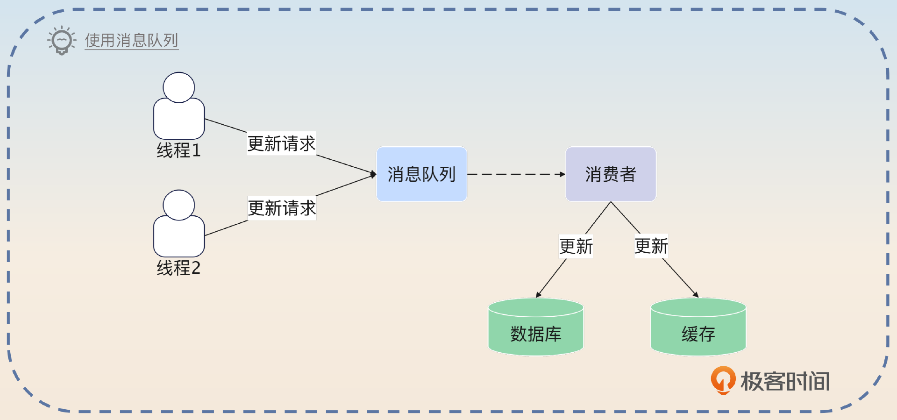

> 针对一些可以异步更新数据的场景，可以考虑将更新请求都发送到消息队列上。但是要注意的是，同一个业务的消息必须是有序的，不然更新数据会出错。消费者在取出消息之后，执行更新。而且消费者在更新失败之后，可以多次重试，对业务也没有什么影响。这个方案也是追求最终一致性的，强一致性还是用不了。

这里有一个变种，就是先更新数据库，再发送消息到消息队列，让消费者去更新缓存。

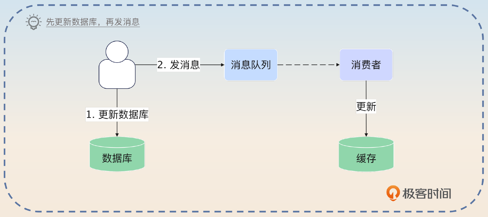

但是如果消费者依赖消息中的数据来更新缓存，那么就会有并发问题，因为先更新数据库的不一定先发消息。

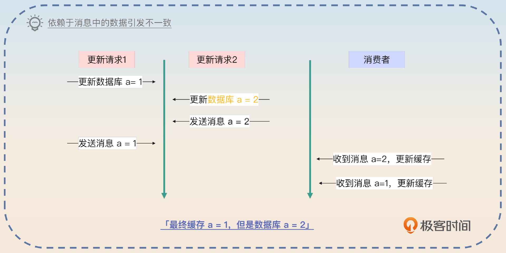

所以最多就是把消息当成一个触发器，收到消息就去更新缓存，但是是查询数据库中的数据来执行更新。但是我个人认为，既然要先更新数据库，为什么不用缓存模式中的 Refresh Ahead，引入 Canal 之类的来更新缓存呢，这样效果更好。

#### 版本号

版本号也能解决并发更新的问题。它的基本思路就是每一次更新版本号都要加一，然后低版本数据不能覆盖高版本的数据。

在这种思路之下，前面在缓存模式里面出现过的很多数据不一致的场景，都能得到解决。比如说在 Cache Aside 里面，加上版本号之后，就不会出现不一致的问题了。

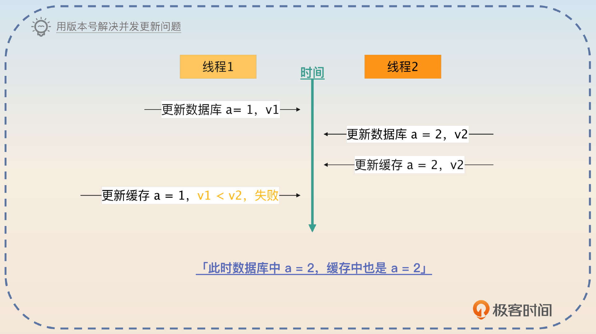

> 另外一个思路是使用版本号来控制并发更新，每个数据都有一个对应的版本号，在更新的时候版本号都要加一。每一次在更新的时候都要比较版本号，版本号低的数据不能覆盖版本号高的数据。

那么这个方案有没有缺点呢？有，版本号本身是一个比较难维护的东西。

> 这个方案的缺点是需要维护版本号，最好是在数据库里面增加一个版本字段。那么后面在更新缓存的时候，比如说更新 Redis，就得使用 lua 脚本，先检测缓存的版本号，再执行更新了。不过也可以考虑用更新时间来替代版本号，一样可以。

事实上，在正常的面试中，你能分析清楚数据不一致的两个根源，然后回答出消息队列和版本号两个方案，已经算是答得比较好的了。不过有一个问题，我觉得还是要进一步介绍一下，防止你在面试的时候被问住，那就是在多级缓存里面怎么更新的问题。

#### 多级缓存

多级缓存是指你在业务中使用了多个缓存，比如说本地缓存 \+ Redis + 数据库的架构。

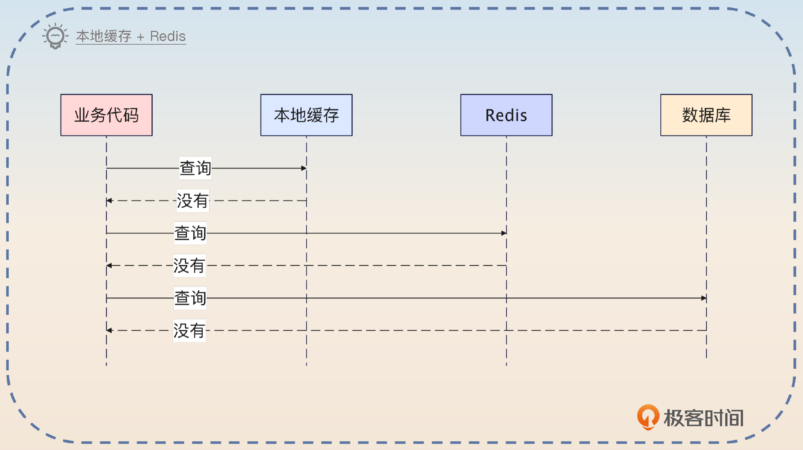

在这种架构下，更新数据的时候，需要考虑更新本地缓存、Redis 和数据库的顺序。

首先你可以明确的一点是， **数据库是最准确的数据源，所以你肯定是优先更新数据库的**。剩下的无非就是先更新本地缓存还是先更新 Redis 的事情了。

坦白说，如果只是考虑数据一致性的问题，你随便更新哪个都会不一致。硬要矮个子里面挑高个的，我认为更新本地缓存应该先于Redis。

> 在使用本地缓存和 Redis 缓存的时候，我的更新顺序是，先更新数据库，再更新本地缓存，最后更新 Redis。先更新数据库是因为数据库应该是最准确的数据源。
>
> 其次更新本地缓存，理由有三个：一是更新本地缓存几乎不会失败；二是查询的时候是先查询本地缓存的，先更新本地缓存可以确保用户能够拿到最新的数据；三是即便后续 Redis 更新失败，因为本地缓存中数据是存在的，所以也不会查询到 Redis 中不一致的数据。

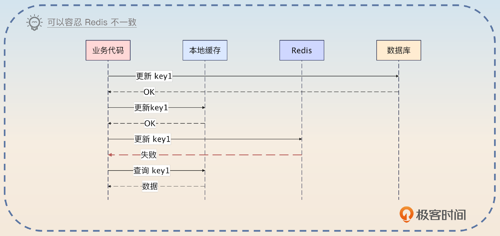

从上面这个图你也可以看出来，引入了本地缓存和 Redis 缓存之后，数据不一致性的概率就更加大了，你可以按照前面几节课我分析各种不一致场景的思路去分析，我就不重复了。

## 亮点方案

### 一致性哈希和缓存

这个亮点方案你在微服务部分已经见过了，这一次是进一步深入讨论。你先回顾一下一致性哈希负载均衡算法和本地缓存的方案。

这个方案主要解决的是并发更新的问题，因为它通过哈希负载均衡算法做到某一个 key 只有一个服务端节点在处理。因此你将本地缓存换成 Redis 也一样可以。

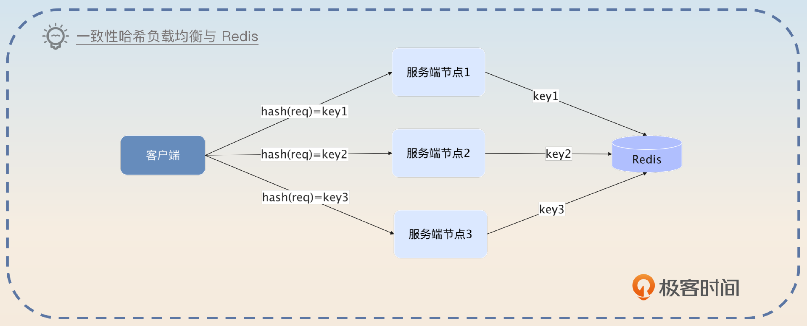

你在面试缓存一致性的时候也不要忘记提起这个方案。但是我没有细说一个点，就是怎么更新数据？因为即便是同一个 key 的请求都落在同一个节点上，依旧存在并发更新的问题。这个时候你就需要使用到缓存模式中的 singleflight 模式了。你在介绍完基本方案之后，要注意提一下这个。

> 在使用了这种负载均衡算法之后，更新缓存的时候要使用 singleflight 模式，那么就可以做到同一个 key 一定落在同一个节点上，并且这个节点上最多只有一个线程在更新数据。如果有多个更新请求，那么它们会轮流更新数据库和缓存。

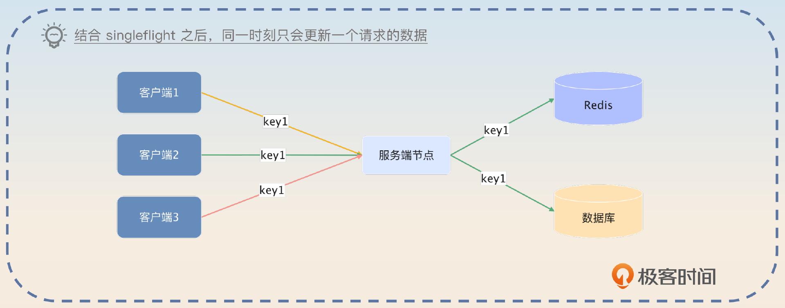

此外，当时我也提到一个问题，在节点上线或者下线的时候，就会引起不一致的问题，那么怎么解决呢？

我们先来看节点下线。节点下线其实是最好处理的，因为下线之后，新的请求都会被打到另外一个节点上，也就是只有一个节点在处理某个 key 的请求。但是如果节点上线，也就是扩容的话，就会引起不一致的问题。

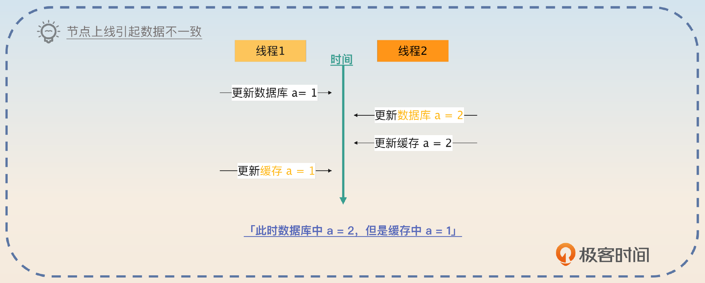

解决的思路其实也很简单，既然问题出在新节点加入之后的短时间内，有两个节点在处理写请求，那么停掉一个就可以了。所以你在介绍完基本想法以及可能存在数据不一致的问题之后，补充这个说明。

> 解决这种数据不一致的思路也很简单，就是在新节点上线的一小段时间内，不要读写缓存，等待老节点上的请求自然返回。你可以预想一下，如果你们公司的响应时间是要求在 1s 以内，那么新节点上来的头 2s，就可以不用读写缓存。虽然这两秒的请求响应时间会很差，但是也能避开数据不一致的问题。

这个方案的好处就是结合了负载均衡、数据一致性、并发场景分析，包括解决方案都很出其不意，非常适合面试的时候展示。

除了这些以外，还有一个分布式锁的亮点方案，你也可以进一步聊一聊。

### 分布式锁方案

分布式锁方案很多人用，但是很少有人给你解释清楚里面的弯弯绕绕。这里我先给你解释安全、性能不错，但是一致性比较差的思路，再给你介绍无限接近强一致性、但是隐患比较多的思路。

#### 思路一：先本地事务，后分布式锁

这个思路是先执行本地事务，然后加分布式锁，删除缓存，释放分布式锁。

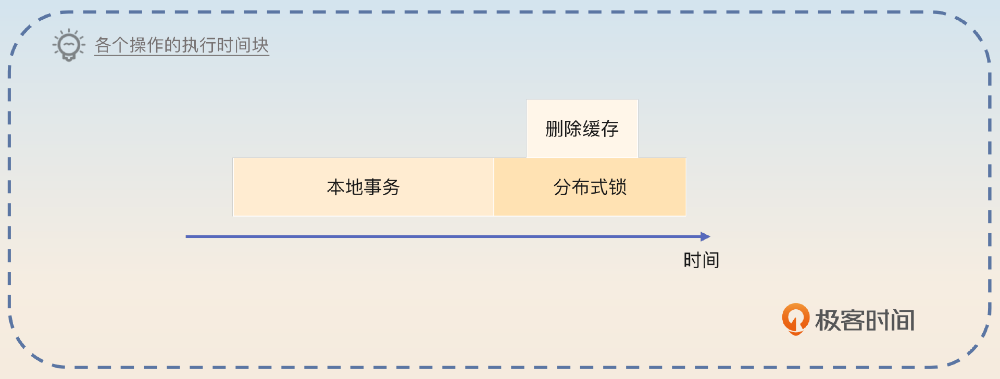

显然，如果单纯这样做，肯定会有不一致的问题，你可以看一下示意图。

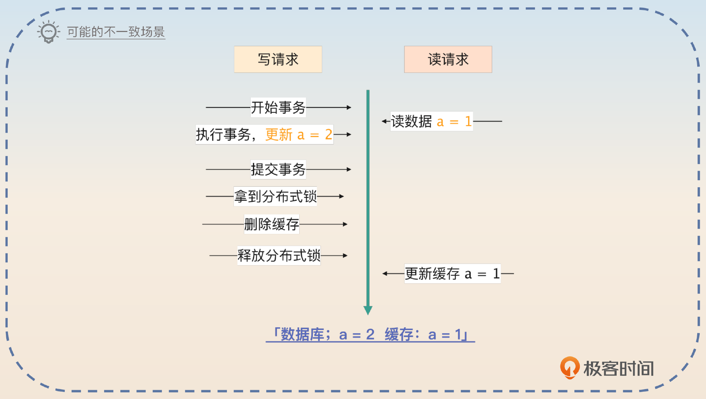

为了避免这个并发更新的问题，你需要在缓存未命中回查数据库的时候，加上分布式锁。

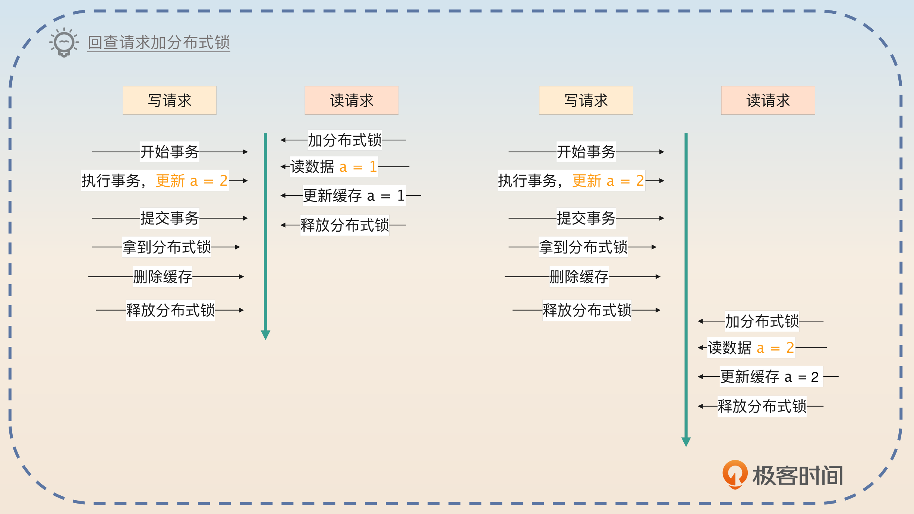

所以你抓住先本地事务，后分布式锁的顺序来回答。

> 我之前用过分布式锁来尝试解决并发更新的问题，基本思路是先执行本地事务，在事务提交之后加分布式锁，然后删除缓存。而在读请求来了的时候，先读缓存。如果缓存未命中，再加分布式锁，然后从数据中加载数据回写缓存，再释放分布式锁。

注意这里的关键点是读请求第一次读缓存的时候，没有加分布式锁，这是保证高性能的关键。这里还有一个优化思路是应用 double-check 机制。

> 当然，这里也可以进一步优化，在读请求缓存未命中加上了分布式锁之后，再次读一下缓存，看看有没有别的线程已经加载好了数据。

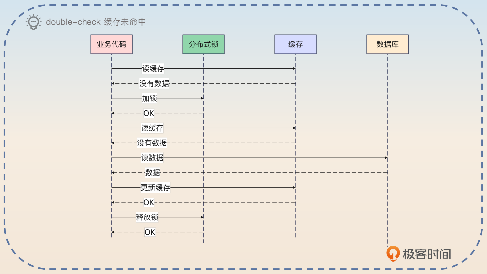

显然，这个只解决了并发更新的问题。你可能想到了，既然我有一个本地事务，那么我能不能在本地事务还没提交的时候，就把缓存删除？这也就是我们的第二个思路。

#### 思路二：先删除缓存，再提交事务

这一个思路的核心是把删除缓存的操作放在数据库事务里，你可以看一下基本思路图。

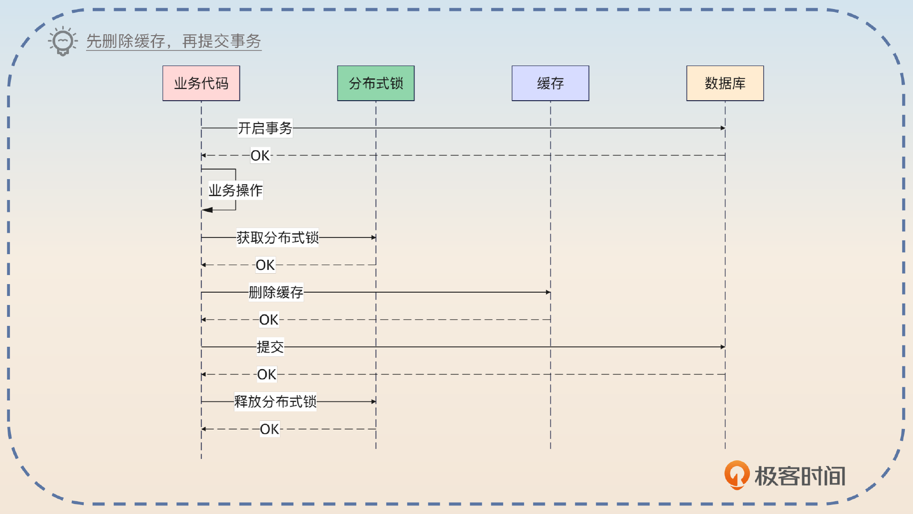

你在面试的时候先简要介绍思路。

> 另外一个思路是尝试在数据库提交事务之前就删除缓存。它的思路是先开启本地事务，执行事务操作。然后获取分布式锁，删除缓存。紧接着提交事务，释放分布式锁。当然，在缓存未命中回查的时候，还是要先加分布式锁，避免并发更新的问题。

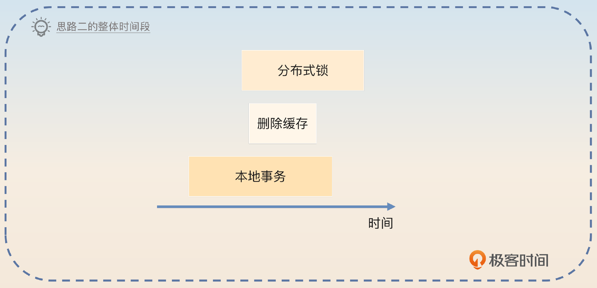

回答到这里，如果面试官反应灵敏，他就可能会追问你删除缓存和提交事务两个动作的失败问题，那么你就回答这两种情况。

> 有两种主要失败场景。一是删除失败了，那么事务不会提交，数据是一致的。二是删除成功了，事务提交失败了，数据依旧是一致的，也就是多删了一次缓存而已。

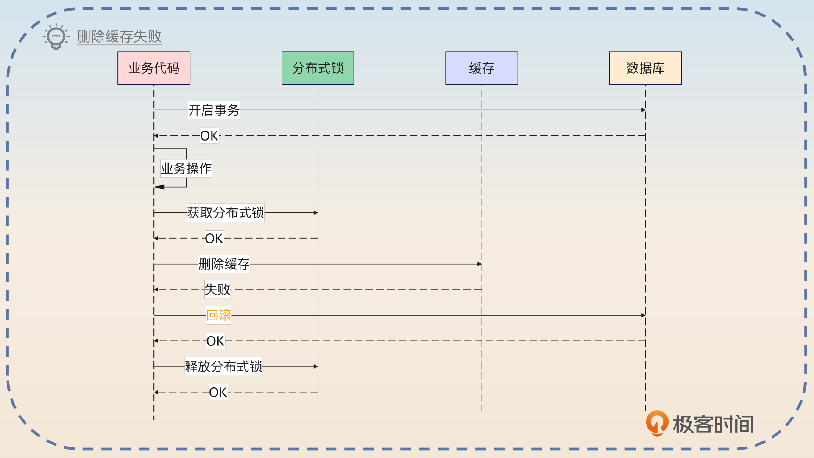

那么这个做法是不是强一致性的呢？答案是无限接近强一致性。

> 这种解决思路已经非常非常接近强一致性了。不过这里有两个条件，如果满足了就可以认为是达成了强一致性的效果。
>
> 第一，分布式锁本身必须是可靠的，也就是一个线程拿了分布式锁，其他线程绝对不可能拿到同一个分布式锁。
>
> 第二，在删除缓存超时的时候会继续重试直到确认删除成功。

那么这个方案有没有缺点呢？有，而且很大。

> 这一个方案最大的缺点就是本地事务比较容易超时。比如说分布式锁被人抢占了，那么在等待分布式锁的时候，就可能超时。当然，如果本身网络不稳定导致一直无法删除缓存，也会引起本地事务超时。

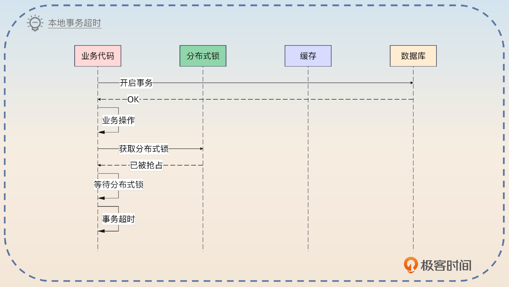

超时问题其实有方案来缓解。

> 可以考虑先加分布式锁，再开启本地事务，然后删除缓存，提交事务，最后释放分布式锁。代价就是分布式锁的持有时间变长了。并且删除缓存本身依旧在本地事务里面，还是可能导致本地事务超时。

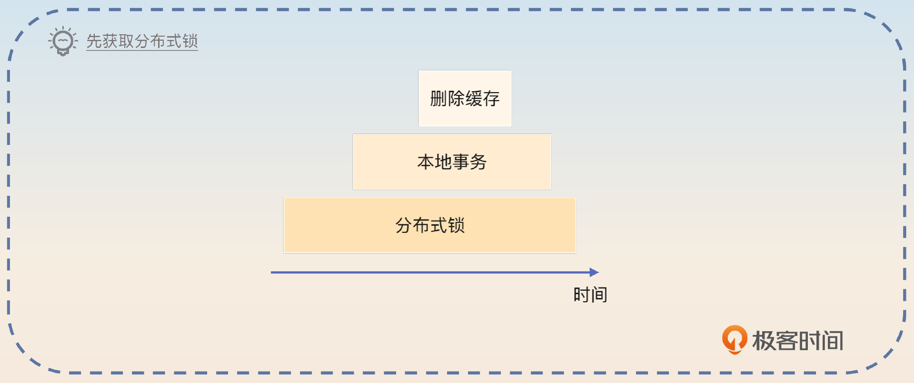

整个方案里面，你几乎都是在围绕分布式锁来做文章，所以面试话题十有八九会被引导到分布式锁上，课程后面会有详细分析，你要结合在一起学习。

## 面试思路总结

这一节课我们介绍了 double-check，然后在面试思路里面分析了引起不一致的两个根源：操作部分失败和并发操作。总的来说，并发操作容易解决，比如说使用缓存模式就很容易解决并发更新的问题，除此之外使用消息队列或者版本号也同样可以解决问题。

然后我进一步讨论了负载均衡那一节课里引入的一致性哈希负载均衡算法和缓存结合使用的方案，重点讨论了使用分布式锁来解决一致性问题的两个思路。第一个思路比较中规中矩，先提交本地事务，再加分布式删除缓存。第二个思路能达成一种无限接近强一致性的效果，核心是先删除缓存，再提交事务，但是它严重依赖分布式锁的可靠性。

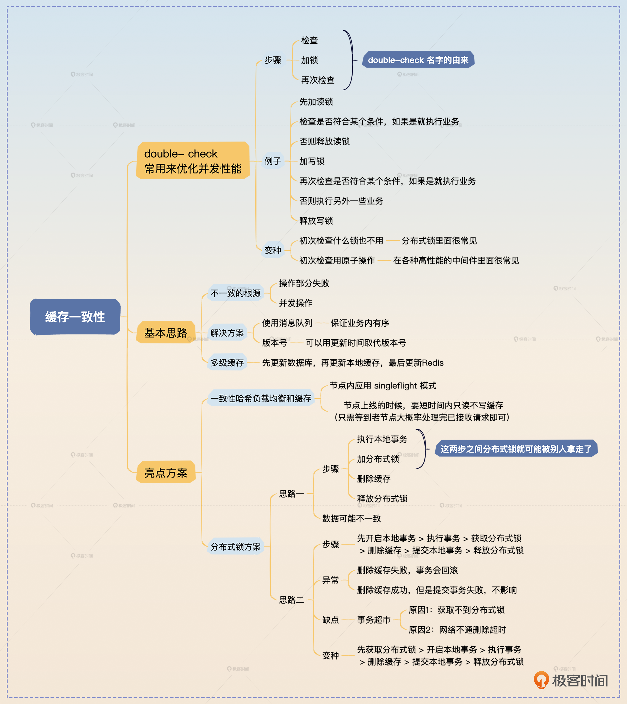

## 思考题

最后，请你来思考两个问题。

- 在分布式方案的思路二里面，我是说先提交事务，再释放分布式锁，那么顺序能不能反过来？
- 有一种使用分布式锁的方案是先加分布式锁，然后执行本地事务并且提交，最后删除缓存，释放分布式锁。这种方案有什么缺点？有没有什么场景可能出现数据不一致？

欢迎你把你的思考分享到评论区，也欢迎你把这节课的内容分享给需要的朋友，我们下节课再见！