# 36｜Redis 单线程：为什么 Redis 用单线程而 Memcached 用多线程？
你好，我是大明。今天我们来探讨一下Redis 高性能的原因。

这个问题在面试中还是很常见的，原因也很简单，除了 Redis 你基本上没有听过其他采用单线程模型的中间件，所以这就凸显了 Redis 的与众不同。

而且这个问题也很有现实意义。大部分时候对 Redis 的一些高级应用，比如前面提到的利用 Redis 实现一个分布式锁，其中有一个很重要的假设就是 Redis 是线程安全的，没有并发问题。而 Redis 是单线程的这一点就保证了线程安全的特性。

那么今天我就带你来看一下，Redis 的高性能究竟是怎样做到的。

## Redis 是单线程的含义

你在学习 Redis 的时候，肯定听过一句话，Redis 是单线程的。而实际上，Redis 并不是单线程的。业界说 Redis 是单线程的，是指它在处理命令的时候，是单线程的。在 Redis 6.0 之前，Redis 的 IO 也是单线程的，但是在 6.0 之后也改成了多线程。

但是其他部分，比如说持久化、数据同步之类的功能，都是由别的线程来完成的。因此严格来说，Redis 其实是多线程的。

## 面试准备

这一部分的面试内容基本上都是纯理论的，所以你需要做几件事情。

- 了解你使用的其他中间件，在 IO 上是否使用了 epoll，以及是否使用了 Reactor 模式。
- 了解你们公司有没有使用 Redis 的多线程，如果用了，那么弄清楚最开始的决策理由以及相比单线程性能究竟提升了多少。
- 了解清楚你使用的 Redis 的性能瓶颈。

如果你用的 Redis 真的启用了多线程模式，你就可以将这一点纳入到你的性能优化方案中。有关 Redis 的线程模型面试是纯理论面试，所以你需要记忆的东西很多。有时间的话可以把 Redis 的源码下载下来，看看和网络 IO 处理有关的部分，加深印象。

当你和面试官聊到了这些话题的时候，你就可以用这节课的知识来回答。

- 网络 IO 问题。
- 其他也用 epoll的中间件。
- 多线程的Memcache，Memcache 用了多线程，但是 Redis 用了单线程。
- Redis 的性能问题。

## 面试思路

一般来说，面试官都会问你“为什么 Redis 是单线程的，但是又能做到高性能？”很多人会下意识地回答：“因为 Redis 是完全内存操作的。”这个理由很关键，但是这并不是面试官想要的答案，他希望你回答的是 Redis 的 IO 模型。

所以要回答这个问题，你首先要澄清 Redis 单线程的含义。

> 我们通常说的 Redis 单线程，其实是指处理命令的时候Redis是单线程的。但是 Redis 的其他部分，比如说持久化其实是另外的线程在处理。因此本质上，Redis 是多线程的。特别是 Redis 在 6.0 之后，连 IO 模型都改成了多线程的模型，进一步发挥了多核 CPU 的优势。

然后你先点明两个关键点：内存操作和高效 IO 模型。

> Redis 的高性能源自两方面，一方面是 Redis 处理命令的时候，都是纯内存操作。另外一方面，在 Linux 系统上 Redis 采用了 epoll 和 Reactor 结合的 IO 模型，非常高效。

这个时候他肯定就会问你，什么是 epoll，什么是 Reactor 模式。

### epoll 模型

**简单来说就是 epoll 会帮你管着一大堆的套接字。每次你需要做啥的时候，就问问哪些套接字可用**。读数据，就是找出那些已经收到了数据的套接字；写数据，就是找出那些可以写入数据的套接字。

而在 Linux 系统里面，套接字就是一个普通的文件描述符，因此 epoll 本质上是管着一堆文件描述符。

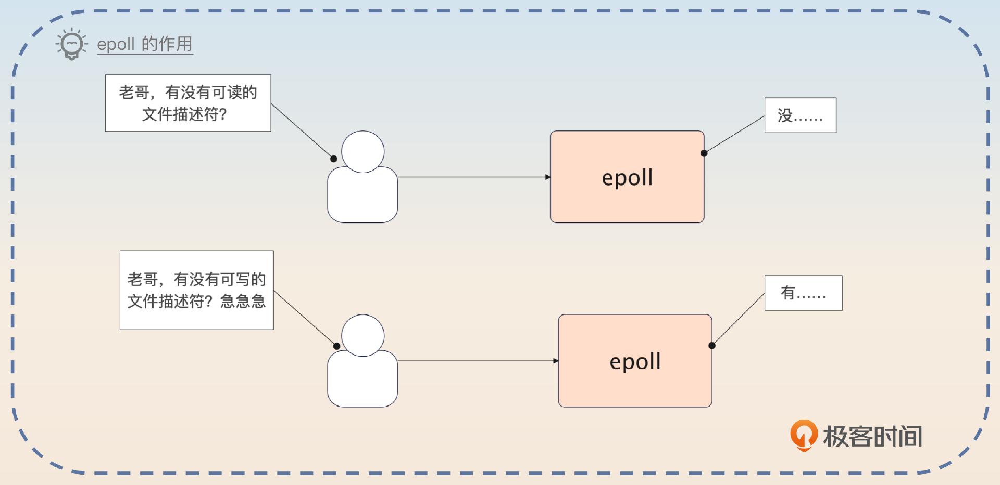

你记住： **epoll = CRUD 文件描述符**。

> Redis 使用的是 epoll 来处理 IO。在 Linux 里面，万物都是文件，和网络 IO 有关的套接字也是文件。所以 epoll 要做的事情，就是管理这些文件描述符。或者用一句话来描述：epoll 就是增删改查文件描述符。

你再介绍一下 epoll 的基本结构和系统调用。

> epoll 里面有两个关键结构。一个是红黑树，每一个节点都代表了一个文件描述符。另外一个是双向链表，也叫做就绪列表。
>
> 为了维护 epoll 的结构，有三个关键的系统调用。
>
> 1. epoll\_create：也就是创建一个 epoll 结构
> 2. epoll\_ctl：管理 epoll 里面的那些文件描述符，简单说就是增删改 epoll 里面的文件描述符。
> 3. epoll\_wait：根据你的要求，返回符合条件的文件描述符，也就是查。

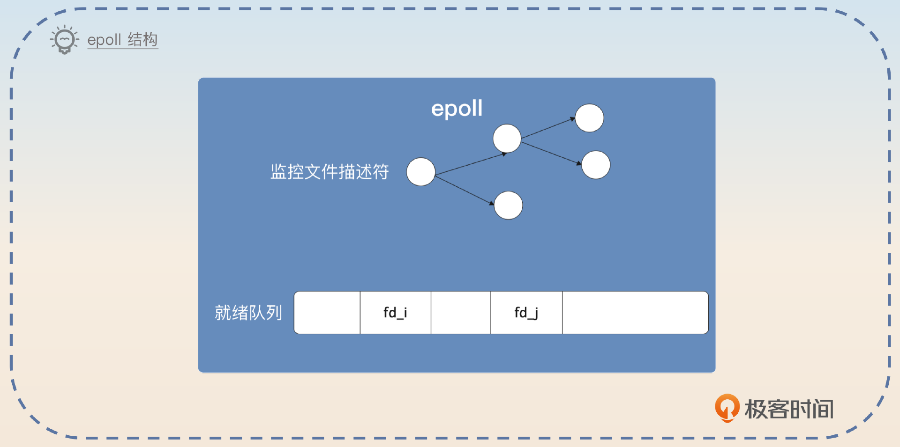

那么显然你可以猜到，如果你写一个从网络中读取数据的程序，看起来应该是这样的。

```go
epoll = epoll_create();
// fd 是一个套接字对应的文件描述符，并且告诉它，你关心读事件
// 你可以加很多个
epoll_ctl(epoll, ADD, fd, READ)
while true {
  // 你需要可读数据的套接字，等待时间是 1000 毫秒
  fds = epoll_wait(epoll, READ, 1000)
  // 一步步处理
}

```

你可以进一步补充 epoll 是怎么把文件描述符挪到就绪列表的。

> 需要注意的是，epoll 并不是在我发起 epoll 调用的时候才把文件描述符挪到就绪列表的。而是在 epoll 创建之后，不管你有没有发起 epoll\_wait 调用，只要文件描述符满足条件了，就会被挪到就绪列表。

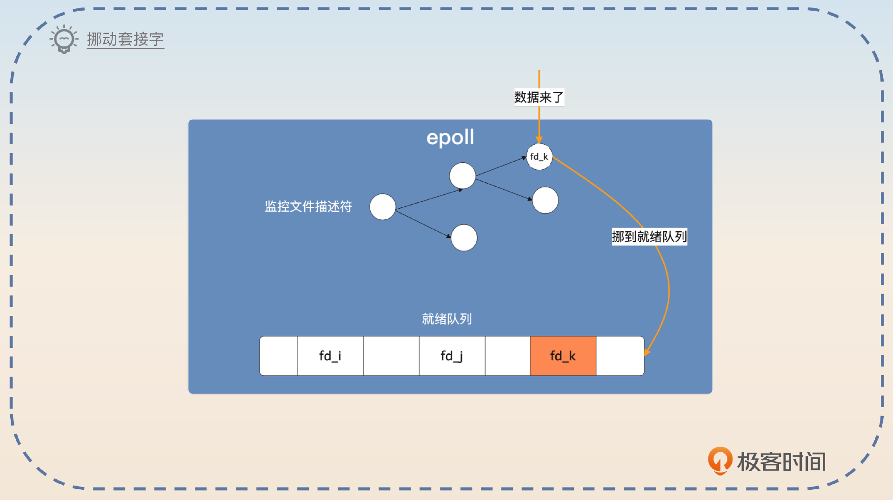

### 发起 epoll 调用

因此，当你发起 epoll\_wait 的时候，有两种情况。第一种情况是就绪列表里面有符合条件的套接字，直接给你。

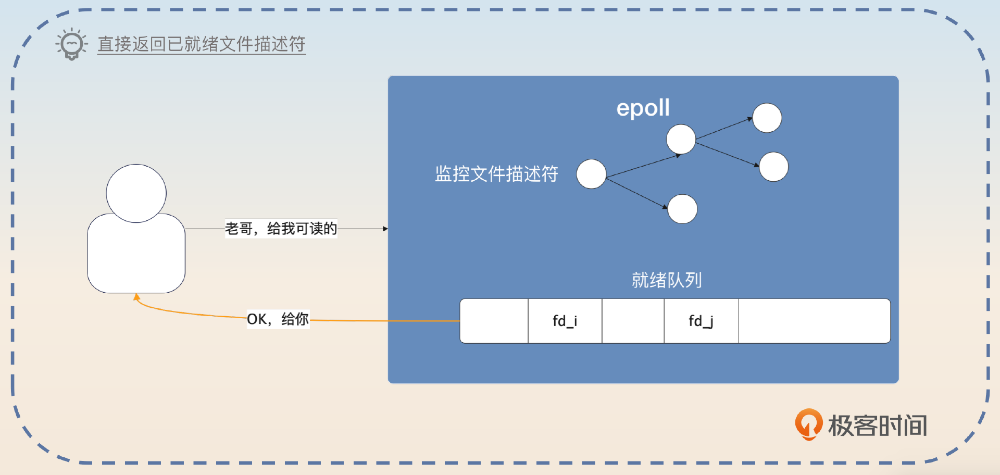

第二种情况就是就绪列表里面没有符合条件的套接字，这时候传入不同的超时时间，会有不同的响应。记住关键词，-1 永远阻塞，0 立刻返回，正数等待直到超时。

> 如果在发起超时调用的时候，传入的超时时间是 -1，那么调用者会被阻塞，直到有满足条件的文件描述符。如果传入的超时时间是 0，那么会立刻返回，不管有没有满足条件的文件描述符。如果传入的是正数 N，那么就会等待最多 N 毫秒，直到有数据或者超时。

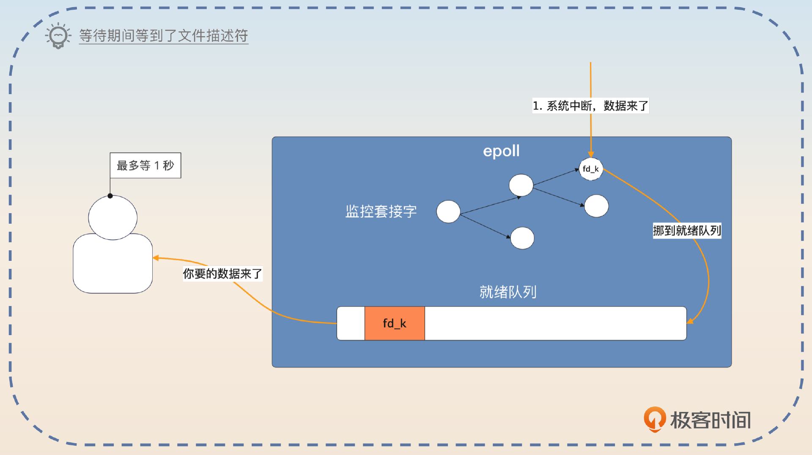

### 亮点：epoll 与中断

紧接着，你可以刷一个亮点，就是 epoll 怎么知道数据来了？又或者 epoll 怎么知道超时了？答案是中断，也就是你在操作系统基本原理里面学到的中断。

> 每一个和 IO 有关的文件描述符都有一个对应的驱动，这个驱动会告诉 epoll 发生了什么。比如说，当有数据发送到网卡的时候，会触发一个中断。借助这个中断，网卡的驱动会告诉 epoll，这里有数据了。而超时也是利用了中断，不过是时钟中断。时钟中断之后，内核会去检查发起 epoll\_wait 的线程有没有超时，如果超时了就会唤醒这个线程。调用者就会得到超时响应。

这部分内容我建议你主动提起，因为很少有面试官会在面试中追问到这里。而且，你可以将比较上层的应用原理和底层的中断机制关联在一起，能体现你计算机基础很扎实。

### epoll、poll 和 select

在面试中，epoll、poll 和 select 有时候会一起问。也就是让你分析这三种模型，并且解释三者的优劣。

前面你已经掌握了最难的 epoll 了，而 poll 和 select 比 epoll 简单多了。

我们先来看 select。你发起 select 调用的时候会传给 select 一堆代表连接的文件描述符，内核会帮你检查这些文件描述符。

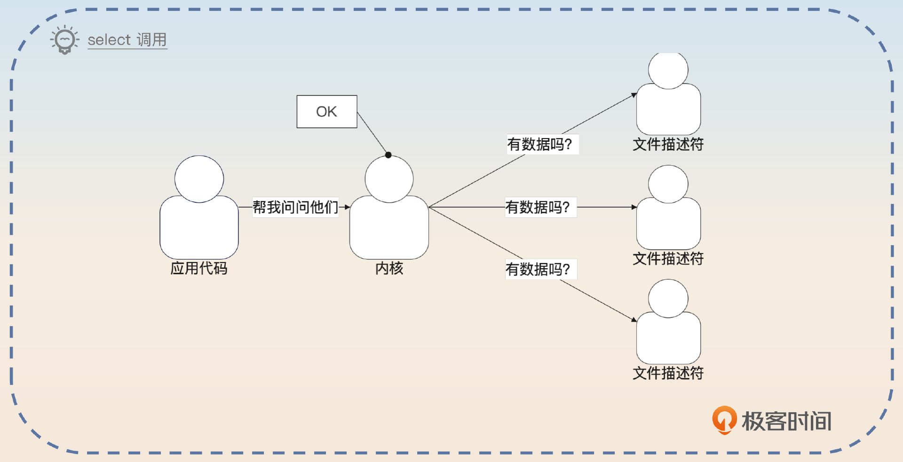

它和 epoll 的区别是，你必须要发起 select 调用，内核才会一个个帮你问。也就是说，select 调用缺乏 epoll 那种即便你不调用 epoll\_wait，epoll 也会把准备好的文件描述符放到就绪列表的机制。一句话来说，就是 **epoll 会提前帮你准备好符合条件的文件描述符，但是 select 不会。**

select 用起来的伪代码就像这样：

```plain
readfds = [] // 一堆文件描述符，作为候选
writefds = [] // 也是一堆文件描述符，作为候选
execpfds = [] // 还是一堆文件描述符，作为候选
select(readfds, writefds, excepfds) // 从这些描述符里面挑出符合条件的

```

在 select 方法内部，内核会遍历你传入的这些候选文件描述符，找出你要的。poll 和 select 的基本原理一样。

三者的区别我列了一个表格，你在面试的时候可以强调一下和性能有关的几个点。

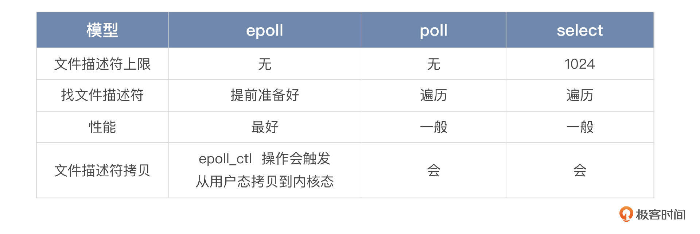

在面试中你主要面 epoll 的细节，poll 和 select 你大概提一下就可以。一般情况下你能解释清楚 epoll，就能赢得竞争优势了。

在搞清楚了 Redis 使用的系统调用之后，还有一个面试的点，就是 Redis 使用的 Reactor 模式。

### Reactor 模式

Reactor 模式也是广泛使用的 IO 模式，它的性能很好，Redis 也用了 Reactor 模式。

用一句话来说明 Reactor 模式：一个分发器 + 一堆处理器。

一般来说，客户端和服务端的 IO 交互主要有两类事件：连接事件和读写事件。那么 Reactor 里面的分发器就是把连接事件交给 Acceptor，把读写事件交给对应的 Handler。这些 Handler 最终会调用到你真正需要读写数据的业务代码。

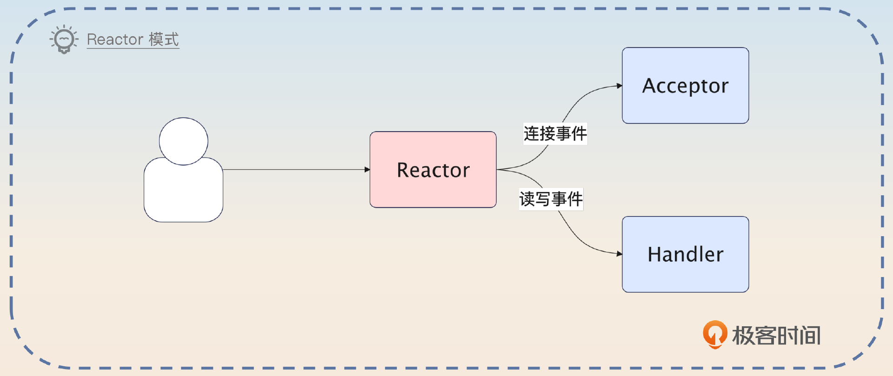

结合前面讲的 epoll，你基本上就能猜到，Redis 的 Reactor 就是调用了 epoll，拿到创建连接的套接字，或者可读写的套接字，转发给后面的 Acceptor 或者 Handler。

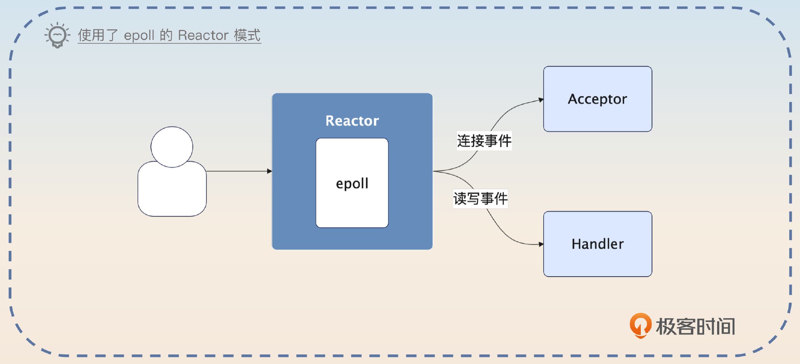

在搞清楚这一点之后，接下来你就能够理解各种 Reactor 的变种了。变种基本上可以分成三类。

- 把 Accetor 做成多线程。
- 把 Handler 做成多线程。
- 把 Reactor 做成多线程。Reactor 的主线程只监听连接创建的事件，监听到了就交给其他线程处理。其他线程则是监听读写事件，然后调用对应的 Handler 处理。

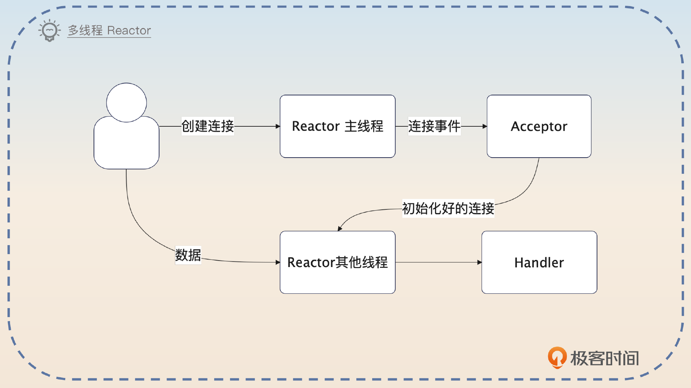

Redis 的特殊之处在于，Redis 是单线程的。也就是说，Reactor、Handler、Acceptor 都只是一个逻辑上的区分，实际上都是同一个线程。

所以当面试官问到的时候，你就把这两者结合在一起回答。

> 为了保证性能最好，Redis 使用的是基于 epoll 的 Reactor 模式。
>
> Reactor 模式可以看成是一个分发器 + 一堆处理器。Reactor 模式会发起 epoll 之类的系统调用，如果是读写事件，那么就交给 Handler 处理；如果是连接事件，就交给 Acceptor 处理。

然后强调一下单线程的 Redis 是怎么使用这个 Reactor 模式的。

> Redis 是单线程模型，所以 Reactor、Handler 和 Acceptor 其实都是这个线程。
>
> 整个过程是这样的：
>
> 1. Redis 中的 Reactor 调用 epoll，拿到符合条件的文件描述符。
> 2. 假如说 Redis 拿到了可读写的描述符，就会执行对应的读写操作。
> 3. 如果 Redis 拿到了创建连接的文件描述符，就会完成连接的初始化，然后准备监听这个连接上的读写事件。
>
>
>
>
>    后面在 6.0 的时候，Redis 改成了多线程模型，但是基本原理还是 Reactor + epoll。

最后，你提到了 Redis 的 6.0 新模型，那么面试官就可能会问你两个问题。

- 同样是基于内存的缓存中间件，为什么 Memcache 用的是多线程模型，而 Redis 用的是单线程模型？
- Redis 为什么最终又引入了多线程模型？和原本的单线程模型比起来，区别在哪里？

## 亮点一：为什么 Memcache 使用多线程？

坦白来说，我个人认为这就是一个设计者的偏好问题，因为两者的优缺点都是很明显的。

你在回答的时候，也就是回答两者的优缺点，再随便补充一点个人理解就可以了。你可以先回答 Redis 使用单线程模式的原因。

> Redis 使用单线程模式的理由有很多。首先有两个显著的优点：不会引入上下文切换的开销，也没有多线程访问资源的竞争问题。其次 Redis 是一个内存数据库，操作很快，所以它的性能瓶颈只可能出现在网络 IO 和内存大小上，是不是多线程影响不大。最后，单线程模式比较好理解，调试起来也容易。

紧接着回答 Memcache 的设计。

> Memcache 采用了多线程设计，那么带来的后果就是会有线程上下文切换的开支，并且多线程模式下需要引入锁来保护共享资源。优点则是 Memcache 会比 Redis 更充分地利用多核 CPU 的性能。

毕竟我们都不是 Redis 的设计者，也难以说清楚究竟是什么因素促使设计者下定决心使用单线程模型。下面的这一段话是我的个人理解，你可以替换成你自己的思考。

> 我之前注意到有些人在网上发布了Redis 和 Memcache 的性能对比。基本上就是有些时候 Redis 好一点，有些时候 Memcache 好一点。
>
> 我就觉得既然 Redis 用单线程模型都能取得这种不相上下的性能表现，就说明 Redis 的选择还是很正确的。即便如此，后面 Redis 在 6.0 的时候，还是引入了多线程模型，期望进一步利用多核 CPU 的优势。

## 亮点二：Redis 为什么引入多线程？

引入多线程的原因只有一个，那就是性能。

> Redis 在 6.0 引入多线程的原因只有一个，在高并发场景下可以利用多个线程并发处理 IO 任务、命令解析和数据回写。这些线程也被叫做 IO 线程。默认情况下，多线程模式是被禁用了的，需要显式地开启。

当然要想答好这个问题，你不能只解释为什么引入多线程，还要结合 Reactor 和 epoll 来解释在启用了多线程模型之后，Redis 是如何运作的。

如果刨除 Redis 主线程和 IO 线程之间的交互细节，那么多线程模式下的 Redis 的 Reactor 和 epoll 结合在一起的形式就是像图片里展示的这样。

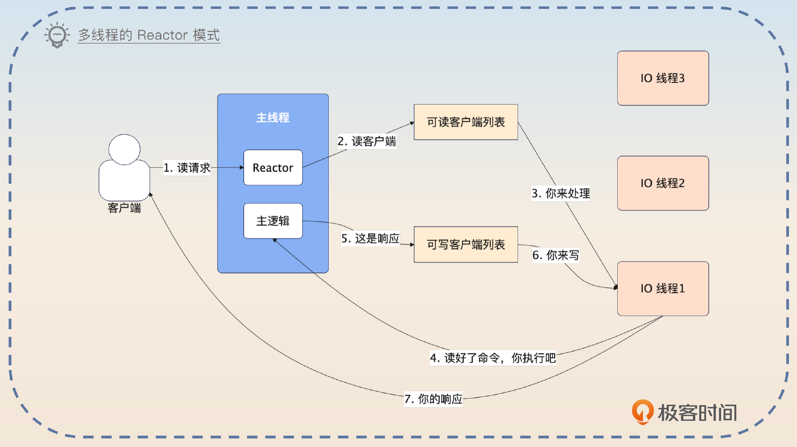

你这样介绍整个设计。

> 当 Redis 启用了多线程之后，里面的主线程就要负责接收事件、创建连接、执行命令。Redis 的 IO 线程就负责读写数据。
>
> 我用一个请求的处理过程来解释一下整个设计。当客户端发出请求的时候，主线程会收到一个可读的事件，于是它把对应的客户端丢到可读的客户端列表。一个 IO 线程会被安排读写这个客户端发过来的命令，并且解析好。紧接着主线程会执行 IO 线程解析好的命令，并且把响应放回到可写客户端列表里面。IO 线程负责写回响应。整个过程就结束了。
>
> 所以整个 Redis 在多线程模式下，可以看作是单线程 Reactor、单线程 Acceptor 和多线程 Handler 的 Reactor 模式。只不过 Redis 的主线程同时扮演了 Reactor 中分发事件的角色，也扮演了接收请求的角色。同时多线程 Handler 在 Redis 里面仅仅是读写数据，命令的执行还是依赖于主线程来进行的。

紧接着你要补充一个业界比较多人认同的观点，就是不到逼不得已不要启用 Redis 多线程模型。

> 虽然说现在 Redis 的 IO 改成多线程之后能够有效利用多核性能，但是大部分情况下都是不推荐使用多线程模式的。道理很简单，Redis 在单线程模式下的性能就足以满足绝大多数使用场景了，那么用不用多线程已经无所谓了。

接下来，你根据你们公司的实际情况来选择一个回答。

第一个回答是介绍你们公司使用了多线程模型。

> 我司的 Redis 早期的时候就触及了单线程的性能瓶颈，后来在开启了多线程之后，能支撑的 QPS 大概提升了 50%，效果还是很不错的。

你最好在自己公司里面测试一下性能提升的幅度。有些时候面试官可能会问你用了几个线程，你回答公司的实际情况就行。

另外一个回答是你们公司没有用多线程模型。

> 早期我们公司虽然遇到过 Redis 的性能瓶颈，但还是没有启用多线程模型，而是改成了使用 Redis Cluster（或者扩大了 Redis Cluster 规模）。我个人认为，Redis Cluster 一样能够解决性能瓶颈问题，而且相比多线程模式，Redis Cluster 的可用性更好，解决性能问题的效果也更好。

## 面试思路总结

这一节课，我首先澄清了一个观点“Redis 是单线程的”，实际上强调的是命令的执行过程是单线程的。

在面试过程中，Redis 的高性能主要分成两个部分：epoll 和 Reactor 模式。你要注意在回答的时候解释清楚 Redis 究竟是怎么把这两者结合在一起的。简单来说就是 Reactor 通过 epoll 这个调用知道发生了什么，然后分发给后面的 Acceptor 和 Handler。

记住，在单线程里面，Reactor 模式里面各个组件实际上都是同一个线程。那么相应的 epoll 结构、基本原理以及和中断的关系，你也需要记住。

最后，我们讨论了两个问题。

- 为什么 Memcache 使用多线程？虽然明面上你可能也认为就是设计者的偏好而已，但是你在回答的时候还是要分析单线程多线程的优劣，最后讲一下自己的体会。
- Redis 为什么引入多线程？核心还是为了充分利用多核性能。要想在这个问题里面赢得优势，你需要说清楚在多线程模式下，Redis 中的 Reactor 模式是如何运作的。

要强调的一点就是，今天这部分内容用于面试应该是够了，毕竟在面试的时候很少有面试官会要求你答出 Redis 的源码究竟是怎么实现的。不过我还是建议你如果有时间的话，去看看 Redis 的底层源码，这样会对这节课的内容有更深刻的理解。。

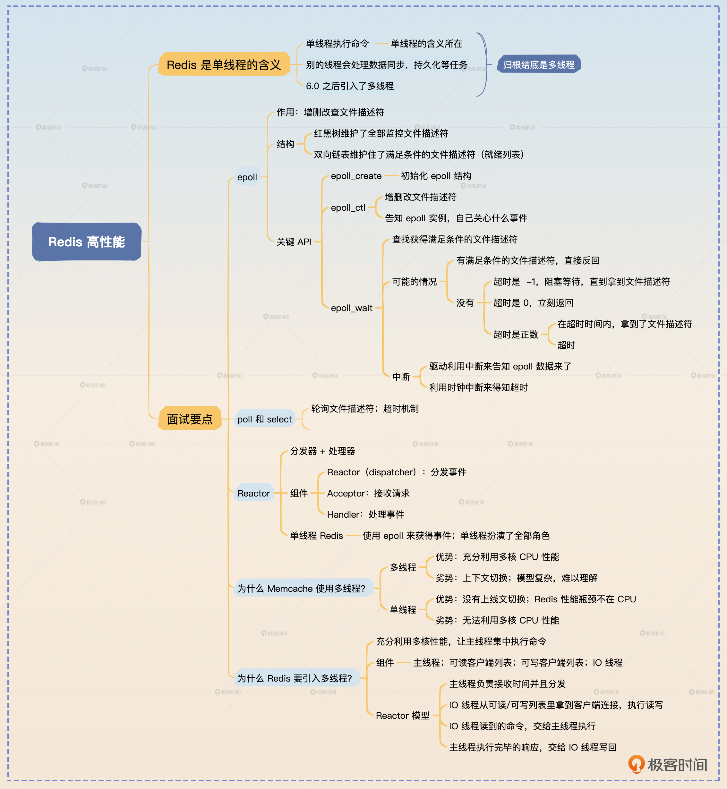

## 思考题

最后请你来思考两个问题。

- 我在 Memcache 里面吐槽说为什么它用多线程而 Redis 用单线程，可能就是设计者的偏好问题，你是如何看待这个问题的？
- 你认为在 Redis 遇到性能瓶颈的时候，是应该优先考虑使用多线程模式还是应该考虑 Redis Cluster 增加新节点来解决？

欢迎你在评论区分享自己的观点，也欢迎你把这节课分享给其他朋友，我们下节课再见！