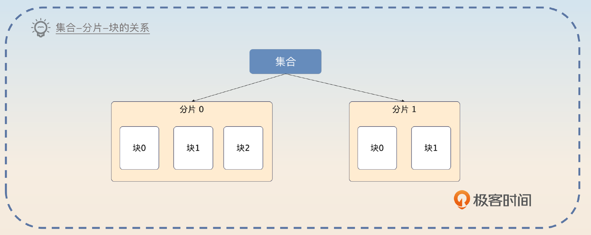
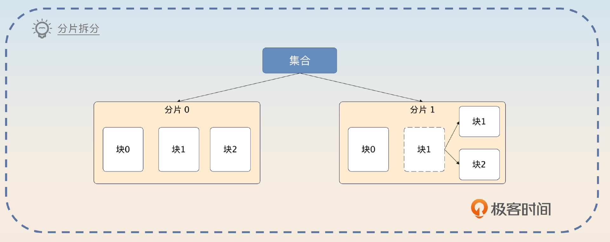
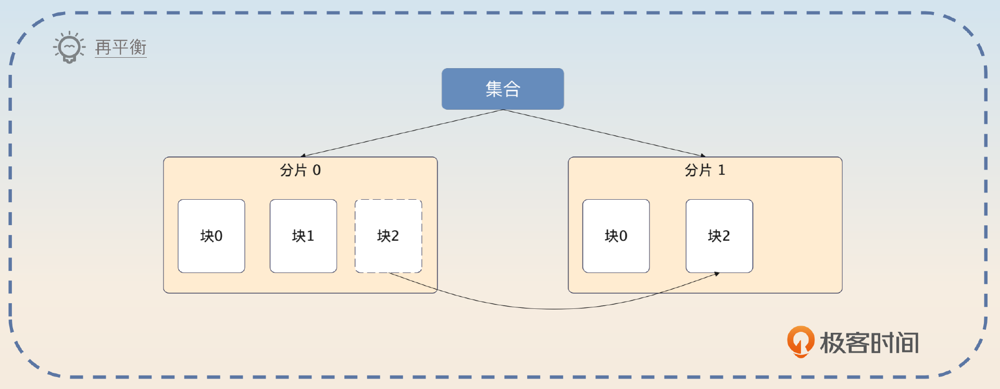
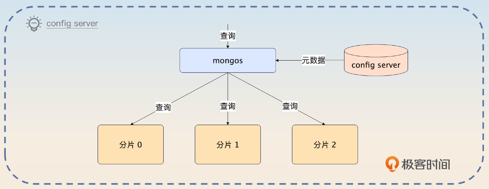
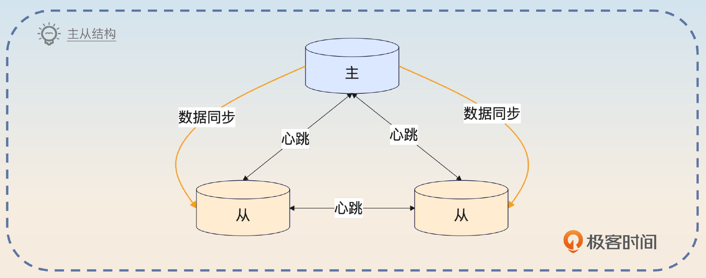
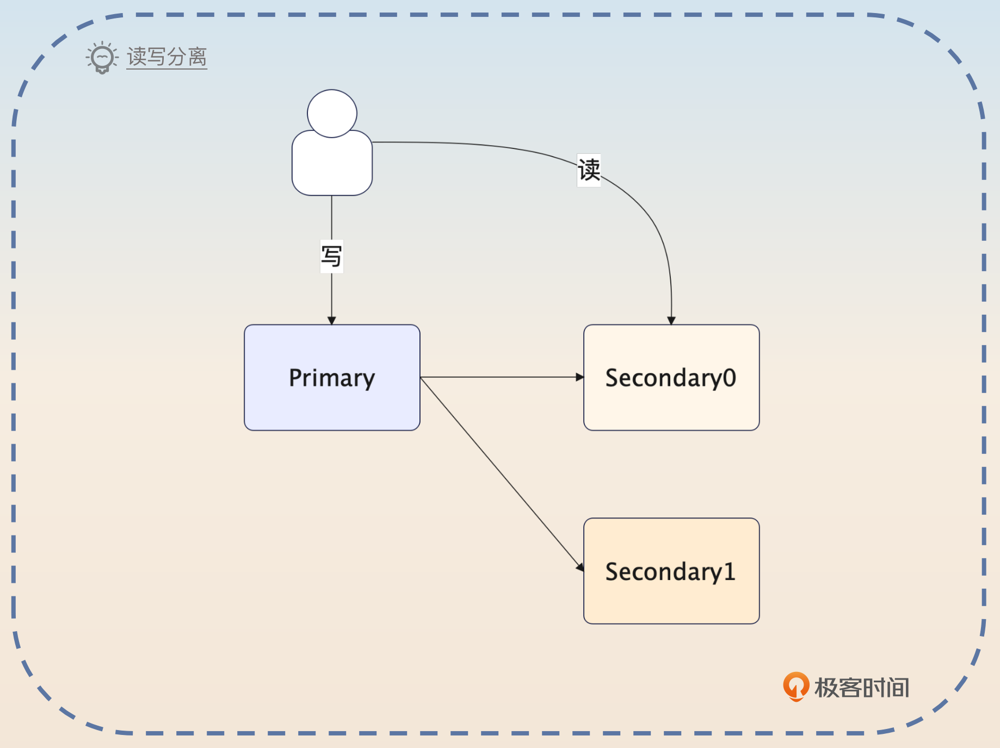
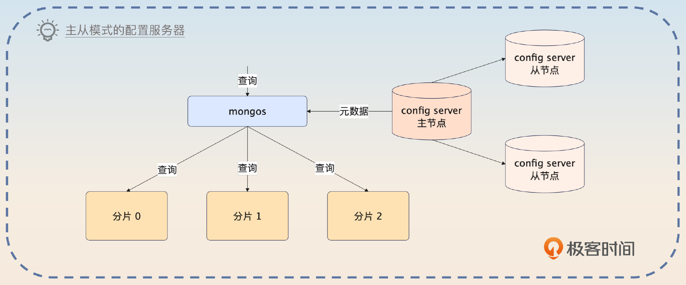
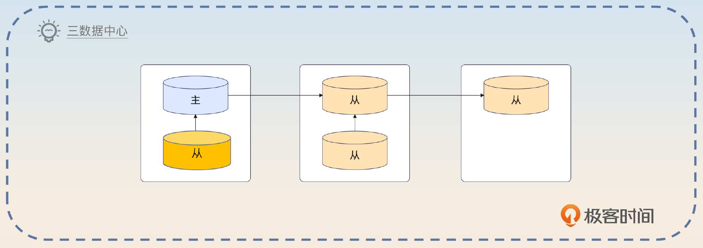
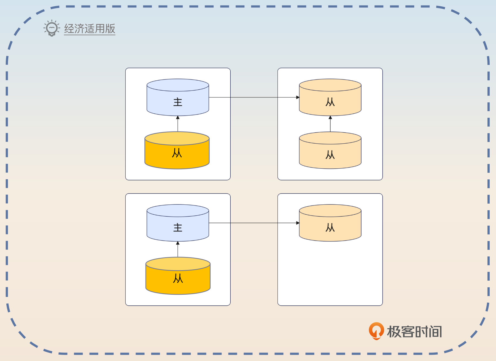
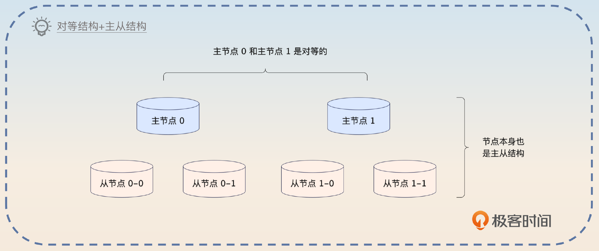

# 41｜MongoDB：MongoDB 是怎么做到高可用的？
你好，我是大明。今天我们看另外一个 NoSQL 数据库，也就是大名鼎鼎的 MongoDB。

MongoDB 是出现得比较早的文档型数据库，应该说早期我们谈到 NoSQL 的时候，第一个想到的就是 MongoDB。到现在，很多公司内部都使用了 MongoDB 来保存一些偏向文档类型的数据。

今天我们就先来学习一下 MongoDB 的基本原理，并看看 MongoDB 是如何保证高可用的。

## 为什么用 MongoDB？

在讨论之前，你要知道我们为什么要用 MongoDB？因为在很多情况下用 MongoDB 能够解决的问题，MySQL 同样也可以解决。

就我个人来说，使用 MongoDB 的决策理由第一个就是灵活性，其次是它的横向扩展能力。

- MongoDB是灵活的文档模型。也就是说，如果我预计我的数据可以被一个稳定的模型来描述，那么我会倾向于使用 MySQL 等关系型数据库。而一旦我认为我的数据模型会经常变动，比如说我很难预料到用户会输入什么数据，这种情况下我就更加倾向于使用 MongoDB。
- MongoDB 更容易进行横向扩展。虽然关系型数据库也可以通过分库分表来达成横向扩展的目标，但是比 MongoDB 要困难很多，后期运维也要复杂很多。而这一切在 MongoDB 里面都是自动的，你基本不需要操心。

当然，对于一般的中小型公司来说，MongoDB 都不是必须使用的存储中间件，大部分时候使用关系型数据库也能应付一般的文档存储需求。

## MongoDB 的分片机制

当下，跟数据存储和检索有关的中间件基本上都会支持分片。或者说我们步入了分布式时代之后诞生的中间件，基本上都会考虑分片机制。MongoDB 也不例外。

在 MongoDB 里，你可以使用所谓的分片集合（collection）。每一个分片集合都被分成若干个分片，如果按照关系型数据库分库分表的说法，那么集合就是逻辑表，而分片就是物理表。

每个分片又由多个块（chunk）组成。在最新版本的默认情况下，一个块的大小是 128 MB。

如果一个块满足了下面这两个条件里的任何一个，就会被拆分成两个块。

- 整个块的数据量过多了。比如说默认一个块是 128MB，但是这个块上放的数据超过了 128 MB，那么就会拆分。
- 块上面放了太多文档，这个阈值是平均每个块包含的文档数量的 1.3 倍。也就是说，如果平均每个块可以放 1000 个文档，如果当前块上面放了超过 1300 个文档，那么这个块也会被切分。

这两个条件简单记忆就是 **数据太多和文档太多。**

接下来就是讨论 MongoDB 的神奇的地方了。在分库分表里面，经常会遇到的一个问题是，不同的表之间数据并不均衡，有的多有的少。所以这就要求你在设计分库分表方案的时候，要尽可能准确预估每一个物理表的数据，确保均衡。

而在 MongoDB 里面，它会自动平衡不同分片的数据，尽量做到每个分片都有差不多的数据量，整个机制也叫做负载均衡。只不过 **一般意义上的负载均衡强调的是流量负载均衡，而这里强调的数据量负载均衡。**

而发现数据不均匀之后，迁移数据的过程也叫做 **再平衡**（rebalance）。再平衡过程本质上就是 **挪动块**。

那么什么时候才会触发再平衡过程呢？MongoDB 设定了一些阈值，超过了这个阈值就会触发再平衡的过程。你可以看一下具体的阈值表。

举个例子，如果一个集合里面最大的分片有9个块，而最少的集合有7个块，那么就会触发再平衡过程。

那块迁移究竟是怎么进行的呢？这里假设我们要迁移块 A，这个过程就包含七个步骤。

1. 平衡器发送 moveChunk 命令到源分片上。
2. 源分片执行 moveChunk 命令，这个时候读写块 A 的操作都是源分片来负责的。
3. 目标分片创建对应的索引。
4. 目标分片开始同步块 A 的数据。
5. 当块 A 最后一个文档都同步给目标分片之后，目标分片会启动一个同步过程，把迁移过程中的数据变更也同步过来。
6. 整个数据同步完成之后，源分片更新元数据，告知块 A 已经迁移到了目标分片。
7. 当源分片上的游标都关闭之后，它就可以删除块 A 了。

应该说，这个过程和别的中间件的数据迁移过程都差不多。

## MongoDB 的配置服务器

当引入了分片机制之后，MongoDB 启用了配置服务器（config server）来存储元数据。这些元数据包括分片信息、权限控制信息，用来控制分布式锁。其中分片信息还会被负责执行查询 mongos 使用。

MongoDB 的配置服务器有一个很大的优点，就是就算主节点崩溃了， 但是它还是可以继续提供读服务。这和别的中间件不一样，大多数中间件的主从结构都是在主节点崩溃之后完全不可用，直到选举出了一个新的主节点。

但是不管怎么说，配置服务器在 MongoDB 里面是一个非常关键的组件。甚至可以说，一旦配置服务器有问题，就算只是轻微地性能抖动一下，对整个 MongoDB 集群的影响都是很大的。

## MongoDB 的复制机制

你也可以把MongoDB的复制机制理解成 MongoDB 的主从机制。简单来说，MongoDB 的副本也是 MongoDB 实例，它们和主实例持有一样的数据。在 MongoDB 里面，用 Primary 来代表主实例，而用 Secondary 来代表副本实例。主从实例合并在一起，也叫做一个复制集（Replica Set）。

类似于数据库的读写分离机制，你也可以在 MongoDB 上进行读写分离。

既然有主从，那么肯定也有主从集群和数据同步。在 MongoDB 里面，主从之间的数据同步是通过所谓的 oplog 来实现的，从这一点来看，这个 oplog 很像 MySQL 的binlog。

不过在 MongoDB 里面，oplog 是有一些缺陷的。第一个缺陷就是在一些特定的操作里，oplog 可能会超乎想象地大。这主要是因为 oplog 是幂等的，所以任何操作都必须转化成幂等操作。

你可以简单一点儿来理解，任何对 MongoDB 里数据的操作，最后都会被转化成一个 set 操作。所以可以预计的是，就算你只是更新了数据的一小部分，但是生成的 oplog 还是 set 整个数据。

第二个缺陷是 oplog 是有期限的。或者说，MongoDB 限制了 oplog 的大小。当 oplog 占据了太多的磁盘之后，就会被删除。就算某个从节点来不及同步，oplog 也是会被删除的。这个时候，这个从节点就只能重新发起一次全量的数据同步了。

## 写入语义

MongoDB 的写入语义和Kafka 的写入语义非常像。也就是说你可以通过参数来控制写入数据究竟写到哪里。而写入语义对性能、可用性和数据可靠性有显著的影响。

在 MongoDB 里面，写入语义也叫做 Write Concern，它由 w、j 和 wtimeout 三个参数控制。

对于 w 来说，它的取值是这样的：

- majority：要求写操作已经同步给大部分节点，也是 MongoDB 的默认取值。这个选项的可用性很强，但是写入的性能比较差。
- 数字 N：如果 N 等于 1，那么要求必须写入主节点；如果 N 大于 1，那么就必须写入主节点，并且写入从节点，这些节点数量加在一起等于 N；如果 N 等于 0，那么就不用等任何节点写入。这种模式下性能很好，但是你也可以想象到，在这个模式下虽然客户端可能收到了成功的响应，但是数据也会丢失。
- 自定义写入节点策略：具体来说就是你可以给一些节点打上标签，然后要求写入的时候一定要写入带有这些标签的节点。这个在实践中用得比较少，但是如果你们公司采用了的话，非常适合用来面试。

j 选项控制数据有没有被写到磁盘上。对于 j 来说它的取值就是 true 或者 false。

最后一个参数 wtimeout，就是指写入的超时时间，它只会在 w 大于 1 的时候生效。需要注意的是，在超时之后 MongoDB 就直接返回一个错误，但是在这种情况下，MongoDB 还是可能写入数据成功了。

## 面试准备

除了上面这些基础知识，你还要在公司内部弄清楚和 MongoDB 有关的信息。

- 你负责的业务或者你们公司有没有使用 MongoDB？主要是用来做什么？
- 为什么你要用 MongoDB？用 MySQL 行不行？
- 你用 MongoDB 的时候，你的文档支持分片吗？如果支持分片，那么是按照什么来分片的？
- 你用 MongoDB 的业务有多少数据量，MongoDB 上的并发有多高？
- 你们公司的 MongoDB 是怎么部署的，主从节点有多少？有没有多数据中心的部署方案？
- 你使用 MongoDB 的写入语义是什么？也就是说 w 和 j 这两个参数的取值是什么？

站在你个人成长的角度，我建议你在某个问题可以用 MySQL 来解决，但是看起来用 MongoDB 更好的时候，尽量选用 MongoDB。尤其是你还没接触过 MongoDB 的话，正好趁着机会接触一下。

当面试官和你聊到了这些话题的时候，你也可以引导到这节课的内容上。

- Kafka 的 acks 机制，那么你可以引申到 MongoDB 的写入语义上。
- 其他中间件的对等结构，或者主从结构，你可以引导到 MongoDB 的分片和主从机制上。
- Kafka 的元数据，你可以结合 MongoDB 的元数据来一起回答。

另外，如果面试官问到了 MongoDB 数据不丢失的问题，你记得结合前置知识里面的写入语义，参考我在 Kafka 里分析的思路来回答。你在整个 MongoDB 的面试过程中，要注意和不同的中间件进行对比，凸显你在这方面的积累。

## 主从结构

MongoDB 的高可用其实和别的中间件的高可用方案不能说一模一样，但是可以说是一脉相承。比如说在 MySQL 里面，你就接触过了分库分表和主从同步。在 Redis 里面，你也看到了 Redis 的主从结构；在 Kafka 里，分区也是有主从结构的。

所以你要先介绍你启用了主从同步。

> 我们这个系统有一个关键组件，就是 MongoDB。但是在最开始的时候，MongoDB 都还没有启用主从，也就是一个单节点的。因此每年总会有那么一两次，MongoDB 崩溃不可用。所以我做了一件很简单的事情，就是把 MongoDB 改成了主从同步，最开始的时候业务量不多，为了节省成本，我们就用了推荐的配置一主两从。这种改变的好处就是当主节点崩溃之后，从节点可以选举出一个新的主节点。

当然在这个回答里面，你可以直接说你所在的公司，用了几个主从节点。要是面试官问到了主从同步，你就回答 oplog 的内容就可以了。

### 引入仲裁节点

另外一种面试思路是说你在公司引入了仲裁节点（Aribiter）。所谓的仲裁节点是指这个节点参与主从集群的主节点选举，但是只参与投票，就类似于 Elasticsearch 里的仅投票节点。

这种机制你在别的中间件里面也见过了。这一类节点的好处就在于它们只参与投票，也就是只关心主从选举，所以只需要很少的资源就可以运行起来。

> 最开始的时候，我们公司只是部署了一主两从，两个从节点都会同步数据。后面为了进一步提高可用性，我引入了仲裁节点。这些仲裁节点被部署在轻量级的服务器上，成本非常低。在引入了这些仲裁节点之后，就算有一个从节点崩溃了，整个集群也基本没什么影响，因为这个时候还是有足够的节点可以投票。

### 启用主从模式的配置服务器

在前置知识里面，你也知道了配置服务器是 MongoDB 中的关键组件，一旦出现问题，对整个集群的可用性都有很大的影响。那么配置服务器能使用主从结构吗？

答案是可以的。

实际上，MongoDB 本身也是推荐使用主从结构的配置服务器。

> 我们 MongoDB 最开始部署的时候，配置服务器并没有启用主从模式，毕竟当时是想着节省资源。但是后面发现，配置服务器这个对集群的影响太大了，一旦不可用，整个集群就基本不可用了。在这种情况下，我们只好引入了主从结构的配置服务器。目前我们公司的配置服务器本身就有一主两从。

紧接着你可以补充这个做法的好处。

> 虽然主节点还是存在崩溃的可能，但是在主节点崩溃之后会有主从选举。更加重要的是，在主节点崩溃之后，整个配置服务集群还是可读的。而我们也知道，在一个 MongoDB 集群里面，元数据也是读多写少的。两者一结合，整个 MongoDB 集群的可用性就提高了。

### 多数据中心的主从结构

在主从结构这里，再深入一些的话，就需要聊一聊 **多数据中心的主从结构**。MongoDB 里面有一个推荐的架构，你可以看一下示意图。

不过正常来说，大部分公司没那么多资源部署，那么一个简化版本就是用两个数据中心，部署一主三从或者一主两从。

> 我们公司本身业务规模比较大，对 MongoDB 的依赖也很严重，所以我们还部署了多数据中心的主从结构。我们有两个数据中心（可以同城，可以异地），其中一个数据中心，部署了一主一从，另外一个数据中心部署了两个从节点。那么万一一个数据中心崩溃了，另外一个数据中心也还是可用的。

然后在主从选举的时候，我们也会倾向于选择和主节点在同一个数据中心的从节点，也就是图里面深黄色的从节点。因为正常来说同一个数据中心内部的从节点，数据会比较新。

> 同时为了保证在主从选举的时候优先选择同一个数据中心的节点，我们还调整了从节点的优先级。也就是说，我们先把同一个机房的节点都设置成比较高的优先级，那么主节点大概率就会从这个机房选出来。

当然，如果你们公司本身就使用了这种多数据中心的主从结构，那么就可以用你们公司的多数据中心主从结构来回答。

在整个主从结构都面完了之后，你进一步总结一下。

> 基本上目前主流的这种大型中间件，在提高可用性上用的方法无外乎就是分片和主从结构。除了 MongoDB，类似的还有 Redis、Elasticsearch、Kafka。

## 引入分片

那么第二个可以提高可用性的点，就是引入分片。从理论上来说，分片既可以提高性能，又可以提高可用性。

在 MongoDB 里面，引入分片要比关系型数据库简单多了。你可以直接说你在开发新业务的时候就启用了分片功能。

> 随着我们业务的增长，我们后面使用 MongoDB 的时候，都要求开启分片功能，来进一步提高可用性和性能。

另外一种面试思路就是为已有的数据添加分片功能。这个面试思路你要谨慎使用，因为通过我和小伙伴们的经历，我们都一致认为，这个部分比较容易遇到问题。如果你没实际操刀过，面试官问细节你就可能答不上来。

> 为了进一步提高可用性和性能，我还在我的业务上引入了分片。不过因为现在已经有数据了，所以这算是一个比较危险的操作。因此我在业务低峰期的时候，在运维的协助下，把集合改成了分片集合。

最后也要进一步总结升华一下。

> 目前来说，支持大数据高并发的中间件基本上也有类似的分片功能。或者说，这一类的中间件明面上都是对等结构，而对等结构里面的每一个“节点”又是一个主从集群。就算是关系型数据库的分库分表，也可以看作是这种对等结构+主从结构的模式。

## 调整写入语义

就像之前你在 MySQL 和 Kafka 里见到的，像这种写入语义一般都有两种调整思路，一个是朝着可用性的角度调整，另一个是朝着性能的角度调整。

这里我们以可用性为例。

> 最开始的时候，我们遇到过一个 Bug，就是数据写入到 MongoDB 之后，偶尔会出现数据丢失的问题。因为之前我在 Kafka 上也遇到过类似的问题，所以我就怀疑是不是写入语义没做好。然后我就去排查，果然有发现，在这个数据丢失的场景下，Write Concern 的 w 取值不是默认的 majority，而是 1，也就是说只需要主节点写入就可以。
>
> 很明显，在这种情况下，万一写入之后主节点崩溃了，那么从节点就算被提升成主节点，也没有这一条数据。所以，后面我就把这个改回了 majority。同时我还去排查了一个 j 参数，确认设置成了 true。这样一来，数据就不太可能丢失了。

## 面试思路总结

在前置知识部分，我们了解了用 MongoDB的原因，主要是为了灵活的文档模型和易于横向扩展。其次了解了MongoDB 在可用性上最基本的机制：分片和复制，还有支撑分片和复制机制的配置服务器。这部分内容很容易引申到数据可靠性的问题上，所以为了以防万一，我们详细讲解了写入语义的问题。最后通过引入主从机制、引入分片和调整写入语义三个主要措施构建了一个高可用方案。

在 MongoDB 的面试里面，你始终要记住一点，就是把 MongoDB 和别的中间件进行横向对比，最好的方式是自己总结出一张思维导图或者表格，更加一目了然。

## 思考题

最后请你来思考两个问题。

- 我提到 MongoDB 的配置服务器，有一个显著特点是主节点崩溃了还可以继续提供读服务，你还见过别的中间件有类似设计吗？
- 现在你来准备一段话，介绍你在接手一个系统后，把原本存储在 MySQL 中但是更适合放在 MongoDB 的部分数据，迁移到了 MongoDB，你会怎么介绍呢？

欢迎你把你的话术分享到评论区，我们互相帮助，互相学习，同时也欢迎你把这节课分享给其他朋友，我们下节课再见！