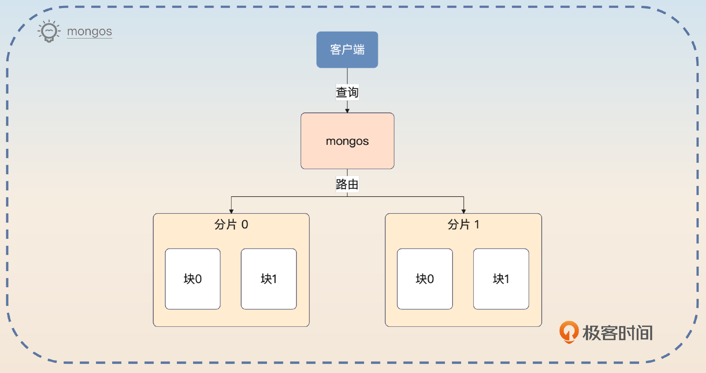
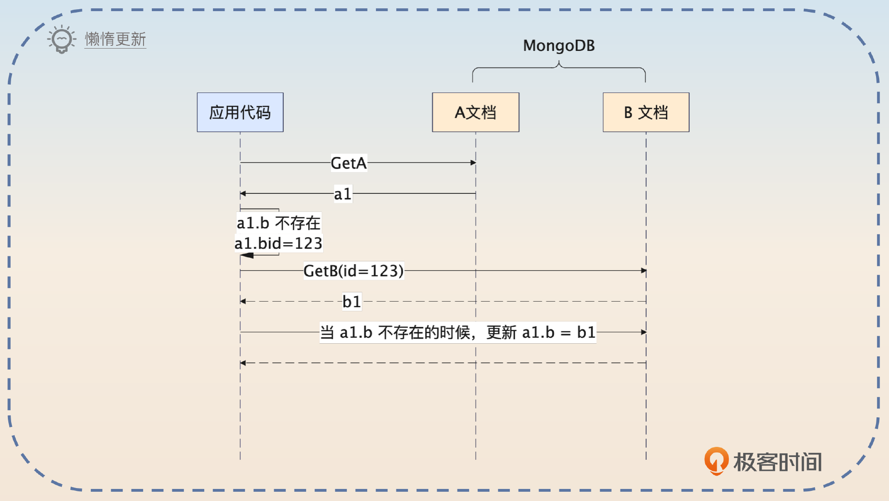

# 42｜MongoDB高性能：怎么优化MongoDB的查询性能？
你好，我是大明。今天我们来学习 MongoDB 的另外一个热点面试主题——优化 MongoDB 的查询性能。

就像之前我多次提到的，任何中间件的面试说到底就是以高可用、高性能和高并发为主。高性能和高并发可以说是孪生兄弟，你做到了高性能，基本上就做到了高并发。

在面试中，性能优化一直被看作是一个高级面试点，因为只有对原理了解得很透彻的人，在实践中才能找准性能问题的关键点，从而通过各种优化手段解决性能问题。

在这之前，我们先来看看 MongoDB 的查询过程，这样方便你理解后面的优化手段。

## MongoDB 的查询过程

MongoDB 在分片之后肯定会有一些机制来保证查询能够准确找到数据。说到这里，你肯定想到了分库分表的查询过程。在分库分表中，查询的执行过程中最重要的一步，就是计算数据可能在哪个目标表上。如果实在计算不出来，那么只能考虑使用广播。

而MongoDB 也需要考虑类似的问题。在 MongoDB 里面，有一类实例叫做 mongos，这些实例就是负责路由查询到目标表上，还有合并结果集。

而在分库分表中，计算目标表是分库分表中间件或者分库分表代理完成的。

## MongoDB 的 ESR 规则

在 MongoDB 里面设计索引的时候就要考虑所谓的 ESR 规则。ESR 代表的是 E（Equality）、S（Sort）和 R（Range），也就是相等、排序和范围。你在设计索引的时候，按照 ESR 规则来排列你的索引列。

比如说，你用 A 进行等值查找，用 B 进行排序，用 C 进行范围查询，那么就应该是 ABC。如果你是 BAC，那么就违背了 ESR 规则。

而且 ESR 的三个元素是可以重复的，只要相对顺序不变就可以。

- EESR：两个等值列是可以的。
- ESSR：两个排序列也是可以的。
- ER：没有排序列也是可以的。
- ERR：两个范围列也是可以的。

因此你在设计索引、优化索引的时候就是要让索引尽可能符合 ESR 规则。

## 面试准备

除了上面的这些基础知识，在面试前你还需要在公司内部收集一些信息。

- 你们公司有没有遇到过 MongoDB 慢查询的问题？如果有，那么引发慢查询的原因是什么？最终又是怎么解决的？
- 你有没有优化过 MongoDB 的索引？如果有，是怎么优化的？
- 你们公司 MongoDB 的参数有没有调整过？如果调整过，调过哪些？为什么调整？
- 你们公司 MongoDB 的平均查询时间多长？99 线以及 999 线是多少？

你可以把 MongoDB 的性能优化、MySQL 查询性能优化、Elasticsearch 性能优化三个合并在一起。也就是说你整个面试思路就是讨论它们三个的性能优化手段。

比如：

- 在讨论到 MySQL 索引优化的时候，提起优化 MongoDB 的索引。
- 在讨论到分库分表分页查询的时候，提起 MongoDB 里的 mongos。
- 在讨论 Elasticsearch 分片的时候，也可以提起 MongoDB 的分片。

你可以通过这样的横向对比，树立起一个掌握了各种中间件性能优化方法论的形象，从而加深面试官对你的印象，赢得竞争优势。

## 优化MongoDB 查询

### 方案1：使用覆盖索引

这里我是借鉴了 MySQL 里的说法。你应该知道，在 MySQL 上使用覆盖索引的最大好处就是不需要回表，从索引里就可以直接拿到你需要的数据。

在 MongoDB 里也可以用这样的手段。也就是说，如果有一个索引上有你要查询的全部数据，那么 MongoDB 就不用把整个文档加载出来。最直观的做法就是在查询中使用 projection 方法指定字段，而且这些字段都是索引字段。

这算是最基本的优化手段，在真实的工作场景里也很常见。因为最开始开发者为了省事，通常都是直接把所有的字段都查询出来，后续随着数据量增长才会遇到性能问题。

> 之前我做过一个很简单的优化。我们早期有一个业务查询，就是把整个文档都加载起来。后面我发现，这个查询的调用者大部分其实不需要整个文档，只需要里面的几个字段。所以我就额外提供了一个新的查询接口，这个查询接口只会返回部分字段。这样优化之后，大部分查询都是改用新接口，MongoDB 也不需要把整个文档都加载出来，性能提升了至少 30%。

你可以进一步总结升华一下。

> 也不仅仅是查询，就算是在更新的时候，也要尽可能做到只更新必要的字段。比如说在一些业务场景下，出于快速研发的角度，我们可能会考虑前端把整个文档传过来，后端就直接更新整个文档。但是如果能够做到只传来修改过的字段，那么就可以只更新必要的字段了。这样性能也更好。

### 方案2：优化排序

这又是一个你在 MySQL 里见过的优化手段。在 MongoDB 里面，如果能够利用索引来排序的话，那么直接按照索引顺序加载数据就可以了。而如果不能利用索引来排序的话，就必须在加载了数据之后，再次进行排序，也就是进行内存排序。

可想而知，如果内存排序，再叠加分页查询的话，性能就会更差。比如说你要查询 `skip(100000).limit(100)`，那么最坏的情况下，MongoDB 要把所有的文件都加载到内存里进行排序，然后找到从 100000 开始的 100 条数据。

优化的思路也类似于之前在 MySQL 里面讲的。第一种是把查询优化成利用索引来排序，可以考虑修改查询，也可以考虑修改索引。比如说你可以新建索引。

> 我还优化过一个分页查询。早期的时候，有一个查询是需要排序加分页的，但是最开始数据量不多，所以随便写了也没问题。但是后面数据量上来之后，这个地方查询就越来越慢。看到这个排序加分页的查询，我的第一个想法就是这个查询肯定是内存排序，不然不会那么慢。我一排查，还真是这样。后来我就创建了一个新的索引，确保排序的时候可以直接利用索引来排序。

另外一种优化思路是借鉴我们在分库分表里面提到的禁止跨页查询，也就是说每次查询带上上一次查询的极值作为查询条件。

> MongoDB 的分页查询还有一种优化方式，但是这种优化方式需要业务折中。也就是原本分页向后翻页是通过偏移量来进行的，那么现在可以通过修改查询条件，在查询语句里带上前一页的排序字段的极值。比如说我们的查询是根据创建时间 create\_time 倒序排序，那么就可以优化成查询条件里上一批最小的 create\_time，接近于 `WHERE create_time <= $last_min_create_time 的语义`。

注意，这里的极值是最大值还是最小值，跟你的排序有关。

另外你可以进一步把这个话题引导到 MySQL 和分库分表上。

> 总体来说，MongoDB 的分页查询面临的问题和关系型数据库分页查询面临的问题差不多，而在分片集合上进行分页查询面临的问题，也和分库分表的问题差不多。总之，分页查询如果不小心的话，是比较容易出现性能问题的。

既然 MongoDB 会有这种分页的问题，那么分片情况下处理分页的 mongos 岂不是就容易成为瓶颈吗？

是的，所以你就可以考虑增加 mongos 的数量。

### 方案3：增加 mongos 数量

在前置知识里面你已经知道了，如果是分片集合的话，查询都要靠 mongos 来执行路由，并且合并结果集。

换一句话来说，mongos 就是查询的性能瓶颈，它可能是 CPU 瓶颈，可能是内存瓶颈，也可能是网络带宽瓶颈。我举一个例子你就知道了，比如说你有分页查询，那么 mongos 就必须要求各个分片查询到结果之后，自己再排序，选出全局分页里对应的数据。

因此，在实践中你要密切关注查询性能，并且在发现查询很慢的时候，就要去看看是不是 mongos 引起的。

> 之前我还优化过 mongos。不过 mongos 实例能优化的不多，主要就是增加 mongos 实例。而且最好是独立部署mongos，独享系统的 CPU 和内存资源。

另外一种面试的思路是隔离。也就是考虑到 mongos 本身容易成为性能瓶颈，并且你也不能无限增加 mongos 实例，所以如果公司资源足够，你应该让核心业务使用独立的 mongos 实例，或者说独立的 MongoDB 集群。

> 并且，为了保证核心服务的查询效率和稳定性，我都是单独准备了一个集群给核心服务，这样可以保证核心服务的 mongos 互相之间没有影响。

### 方案4：拆分大文档

这算是很常见的一种优化手段了。在一些特定的业务场景中，你会有一些很大的文档，这些文档有很多字段，并且有一些特定的字段还特别大。

那么你就可以考虑拆分这些文档。

> 大文档对 MongoDB 的性能影响还是很大的。就我的个人经验来说，我认为可以考虑从两个角度出发去拆分大文档。
>
> 1. 按照字段的访问频率拆分。也就是访问频繁的放一个文档，访问不频繁的拆出去，作为另外一个文档。
> 2. 按照字段的大小来拆分。也就是小字段放在一个文档，大字段拆出去，作为另外一个文档。
>
>
>
>
>    之前我就拆分过一个文档，非常庞大。而且在业务中，有一些庞大的字段根本用不上。在这种情况下，我一次拆出了三个文档。
>
> 3. 访问频繁的小字段放在一起，作为一个文档。
> 4. 把访问不频繁的大字段拆出去，作为一个文档。这个地方我觉得可以进一步优化为特定的巨大的字段可以直接拿出去，作为一个单独的文档。
> 5. 剩余的合并在一起，作为一个文档。
>
>
>
>
>    这样做的优点很明显，比较多的业务查询其实只需要第一种文档，极少数会需要第二种文档。但是缺点也同样明显，如果调用者需要整个文档，也就意味着我需要查询三次，再合并组成一个业务上完整的文档。

你还可以升华一下。

> 当然，拆分终究是下策，最好还是在一开始使用 MongoDB 的时候就约束住文档的大小。

不过还有一个和这种策略完全相反的优化手段：嵌入文档。

### 方案5：嵌入文档

所谓的嵌入文档是指如果 A 文档和 B 文档有关联关系，那么就在 A 文档里面嵌入 B 文档，做成一个大文档。

相当于原本 A 文档和 B 文档都是单独存储的，可能在 A 文档里面有一个 B 文档的 ID 字段，又或者在 B 文档里有 A 的文档 ID。那么你可以考虑合并这两个文档。

你可以这么介绍你的方案。

> 早前我们有一个过度设计的场景，就是有两个文档 A 和 B。其中 A 里面有一个 B 的文档 ID，建立了一对一的映射关系。但是实际上，业务查询的时候，基本上都是分成两次查询，先把 A 查询出来，再根据 A 里面的文档 ID 把 B 也查出来。
>
> 后面这个地方慢慢成为了性能瓶颈，我就尝试了优化这个地方。我的想法是既然 A 和 B 在业务上联系那么紧密，我可以直接把它们整合成一个文档。整合之后，一次查询就能拿到所有需要的数据了，直接节约了一个 MongoDB 查询，业务响应时间提高了，而且 MongoDB 的压力也变小了。

那么如果面试官问你怎么直接整合成一个文档呢？你就可以考虑说你采用的是懒惰的、渐进式的整合方案。

> 我采用的是懒惰策略来整合文档。也就是说，如果我先查询 A 文档之后发现 A 文档还没有嵌入 B 文档，那么我就查询 B 文档，嵌入进 A 文档之后，直接更新 A 文档。在更新 A 文档的时候，要采用乐观锁策略，也就是在更新的条件里面，加上 A 文档不包含 B 文档这个条件。
>
> 我这个业务有一个好处，就是没有直接更新 B 文档的场景，都是通过 A 来操作 B 文档，所以并不需要考虑其他的并发问题。

这种懒惰更新策略里的最后一步更新动作，实际上就是一个乐观锁。所以你可以尝试把话题引导到乐观锁上。

不过，嵌入整个文档是很罕见的优化手段。更加常用的是嵌入部分字段，也叫做冗余字段。这种优化手段在关系型数据库里也很常见。比如说 A 经常使用 B 的某几个字段，那么就可以在 A 里面冗余一份。不过这种冗余的方案会有比较严重的数据一致性问题。只有在你能够容忍这种数据不一致的时候，才可以应用这个方案。

在现实中最常见的场景就是在别的模块的文档里面冗余用户的昵称、头像，这样可以避免再次去用户文档里查询昵称或者头像。毕竟昵称和头像在很多时候，都不是什么关键字段。

### 方案6：操作系统优化

前面提到的都是查询本身的优化，那么根据之前我们在 Kafka、Elasticsearch 里准备面试的思路，我们也需要为 MongoDB 准备一些操作系统优化的点。这里我列出来一些简单的、你之前接触过的点。

首先就是内存优化。

在 MongoDB 里，索引对性能的影响很大，所以你应该尽可能保证有足够的物理内存来存放所有的索引。这个类似于前面 MySQL 里讨论索引的时候说到的，预估查询的耗时有一个基本的假设，就是索引都是放在内存里的。所以优化内存差不多就是使用钞能力，加大内存。

进一步，你也能够想到，swap 对 MongoDB 的影响也很大。你同样需要避免触发交换，也就是可以调小 vm.swappiness 这个参数。

## 面试思路总结

这一节课，我们先分析了 MongoDB 的查询过程，目的是让你知道 mongos 在其中的关键作用。在设计索引的过程中要注意遵循 ESR 规则。

后面我列举了覆盖索引、优化排序、增加 mongos 数量、拆分大文档、嵌入文档和操作系统优化几个性能优化方案。不过我知道业界肯定还有很多其他精妙绝伦的方案，你有兴趣可以进一步去搜集。

我想再强调一次，不管是 SQL 查询优化、Elasticsearch 查询优化，还是这里的 MongoDB 查询优化，都有非常多的手段可以考虑，我们没办法全部列举出来，课程中没有提到的方案，就需要靠你自己去探索了。不过也欢迎你把你自己遇到的或者实践过的方案分享出来，众人拾柴火焰高，希望最终可以形成一个小型的知识库。

最后还是想要再叮嘱你一下，在面试的时候要提前准备好优化方案，在面试过程中注意引导。不然如果面试官自由发挥，手写一个查询让你优化，撞上你不知道的手段或者你没有见过的案例，你就回答不出来了。

## 思考题

最后请你来思考两个问题。

- 在操作系统优化的时候，我并没有提到网络和磁盘 IO 方面的优化，那么你认为这两个角度可以怎么优化？对 MongoDB 的效果好不好？
- MongoDB 性能优化还有很多手段，你有没有用过什么很有特色的方案或者说让你印象深刻的方案？

欢迎你分享出来，如果你觉得这节课的内容对你有帮助，也欢迎你分享给需要的朋友，我们下节课再见！