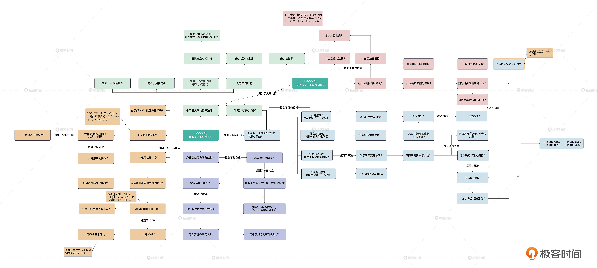
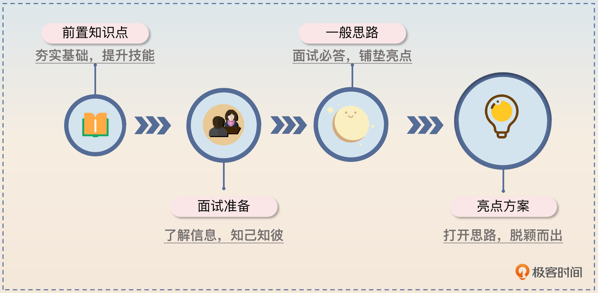
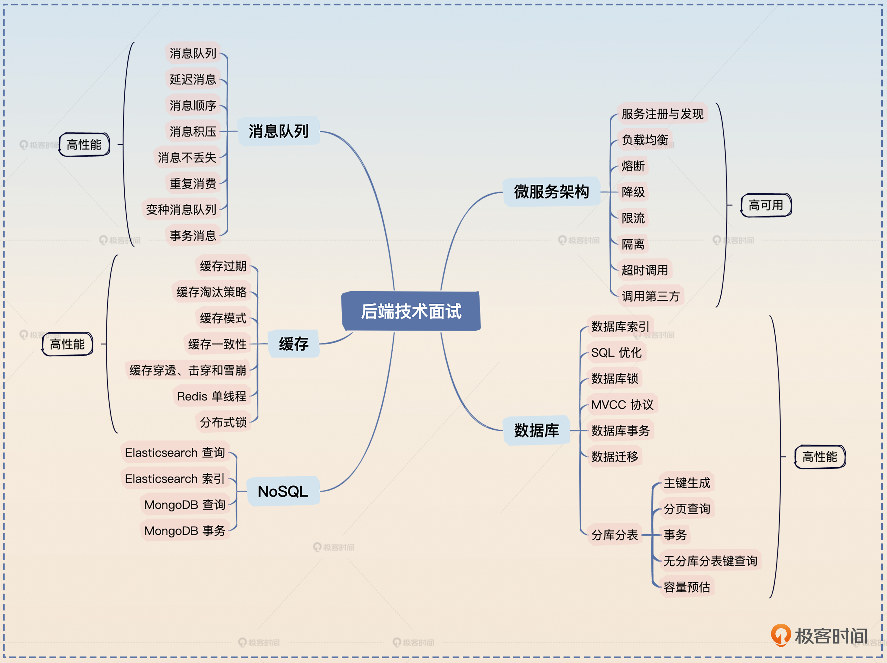

# 开篇词｜面试如戏，台上一分钟，台下十年功
你好，我是大明，一名热爱开源的IT猛男。欢迎你的加入，从今天开始我们一起升级打怪，通关后端技术面试。

作为一名早期从事业务开发转型成为中间件研发的工程师，我一直奋战在互联网一线，擅长设计和实现中间件，包括Web、ORM、微服务框架、网关、分库分表、IM等，积累了很多造高并发、大流量轮子的经验。除了工作之外，我也一直活跃在开源社区，学习、交流最新的技术，现在是Beego的PMC和Apache Dubbo的Committer。

在我的职业生涯中曾跳过几次槽，都很幸运地得到了自己理想的岗位，甚至被朋友笑称“offer收割机”，因为几乎每次跳槽我都是手捏好几个大厂 offer，按心意选择。如果你也想像我一样拥有选择的权利，可以加入进来，我会把我自己多年珍藏的经历分享给你，助你顺利通关。

## 机会永远留给有准备的人

那怎样做才能成为下一个offer收割机呢？

我想除了平时工作中的稳扎稳打，面试前的准备工作也是必要的。因为我们都知道面试从来都不是件简单的事，好的岗位永远是竞争最激烈的地方。想要在高手如云的竞技场上展现自己的优势，让自己脱颖而出，以下几点必不可少：

1. 扎实的基础知识，基础是一切的开始，我们平时就要做好技术积累。
2. 一些成功或失败的项目经历，这些经历能让你看到更多细节，无论是经验还是教训都很有价值。
3. 所在领域的最佳实践，让我们的工作更加专业、高效，避免很多问题。
4. 一些独到的观点或创新性的方案，这是让你崭露头角的关键。

可其实很多人都做不到这几点。这些年我一直担任极客时间训练营的讲师，带过2000多个学员，这个过程中我发现 **很多人不知道怎么面试，也不知道怎么准备面试。**

- 有的人明明知道有一些问题肯定会被问到，但面试前还是不好好准备，要么回答得模棱两可，要么答非所问，从而错失offer。
- 有的人不知道怎么包装自己的项目经历，凸显自己解决方案的优点，以至于看上去非常平淡，没办法给人留下深刻印象。
- 还有人简历写得花里胡哨，但是实际上一问三不知，简历和经历完全对不上。

比如之前我曾看到有的人简历上写了 **微服务架构**，但当我问他们服务治理的时候，他们的反应让我非常诧异。他们有的说：“啊，服务治理是啥？”，有的说：“啊！我们公司体量太小了，都不需要服务治理”，一句话就暴露了短板。

在发现这些问题之后，我就开始有意识地整理后端技术面试中的重难点、梳理面试的思路和亮点方案，并辅以一些经典案例来佐证。希望能够帮助更多的人在面试过程中有条理地表达自己、突显自身优势，并最终获得理想的职位。下面这张微服务架构面试思路图，就是我的成果之一。后面每学完一章的内容，我都会整理出一张这样的图片，来帮助你梳理知识点，建立起自己的知识框架。

这里还要单独强调一下这门课程的一个特殊的设计—— **亮点方案**。虽然面试成功很大程度上取决于你对面试官的问题是否能做到对答如流，但别忘了，并不是说你回答出全部问题就能拿到 offer，更重要的一点是要比别的候选者回答得更出彩。因此在上述每一个主题之下，我都会教你如何展示自己的亮点，期待一下吧。

## 从实践中来，到实践中去

说了这么多关于面试的事情，是不是整个课程就只能用在面试上呢？

当然不是，我在课程中展示的所有案例都是我在工作场景中摸爬滚打多年摸索出来的，可以说这门课程是来自于实践，最终也将回归实践。 **所有的案例和方案都是可以拿到生产环境中去实践的**。

- 如果你是工作不久，经验不足的小白，可以把前面的知识点当作台阶，把里面的最佳实践作为样板，去大刀阔斧地应用在实际的生产环境中。
- 如果你已经有了一些基础和经验，就可以通过前面系统的知识夯实自己的基础，通过里面的亮点方案，为自己目前的工作找到新的解决思路。
- 如果你正准备跳槽，那这门课程可以说是为你量身打造的了，它将成为你的助手，帮你快速搭建起自己的知识框架，助你面试通关。

我在课程中也多次强调，这些方案我们应该尽可能地去应用一下，并不只是为了面试，也是为了提高自身技术实力。所以不要只关注课程中的套路和话术，其中的知识点和经典案例也需要你好好消化，以应对未来真实工作场景中复杂多变的情况。

## 课程设计

为了满足这些需求，我选取了后端工程师在面试和工作场景中必知必会的5个热点领域：微服务、数据库、消息队列、缓存和NoSQL。掌握这些核心技术能够为我们系统的高可用、高性能保驾护航，同时也能为我们的后端职业生涯开一扇窗。

**第一章：微服务架构**

微服务架构可以将大型应用拆分为多个小型服务，提高开发效率与性能。这个部分我们将学习最重要的几个服务治理手段，包括服务注册与发现、负载均衡、熔断、降级、限流、优雅调用第三方等。你可以根据具体情况选择不同的服务治理策略，来保证服务的高可用。

**第二章：数据库与MySQL**

数据库和MySQL是存储数据的技术基础，其性能和稳定性关系到整个系统的效率和可靠性。这部分我们主要了解数据库索引、事务、SQL 优化、不停机数据迁移、分库分表等核心知识点与解决方案，让你能够懂原理、晓优化、重实践。

**第三章：消息队列**

消息队列和Kafka在分布式系统中担任着异步处理、流式计算等重要的角色，是构建高性能、可靠的分布式系统的必要工具。这部分我会带你了解消息队列的高可用和高性能原理以及实践中常见的问题，如积压、重复消费、消息可靠性等。让你上能理论压众人，下能实践解忧愁。

**第四章：缓存**

所谓缓存用得好，性能没烦恼。缓存可以大大提高系统的访问速度，减轻数据库访问压力。这部分内容基本涵盖了最热门的缓存模式、缓存击穿、雪崩、穿透等问题的解决方案，我将带你深入Redis的高可用和高性能原理，让你成为一个精通各种缓存奇技淫巧的人。

**第五章：NoSQL**

随着这些年行业技术栈演进，NoSQL 已经变得日益重要。这一模块我们会在掌握了基本的NoSQL概念和原理的基础上，对 MongoDB 和 Elasticsearch 常见的面试热点进行探讨，包括性能调优、高可用和高性能方案，帮助你更加全面地准备后端技术面试。

工作中的重难点也必然会成为面试中的常考点，所以我们这门课程也并不是只会教你面试的套路，更多的是 **技术之间的联系、灵活多变的方案、处理问题的思路，以及沟通时的引导策略。** 如果你可以透过表面的知识点和面试的话术，掌握这些更深层次的技能，那么你收获的就不只是一两个offer那么简单了。

古人讲究“兵马未动，粮草先行”，这门课就是我们“广积粮”的好机会。现在就业市场变化莫测，前有互联网领域增速放缓，后有AI技术大爆发，企业也在时刻准备着调整自己的方向。不过无论怎样变化和调整，高端人才始终是稀缺资源，我们只有花时间做好充足的准备，坚定地拓展自己的技术面，才能让自己拥有超强的竞争力，为未来的自己赢得选择的权利。

亡羊补牢，为时不晚。你可以从现在开始，从这门课程开始，准备起来，相信你一定可以！