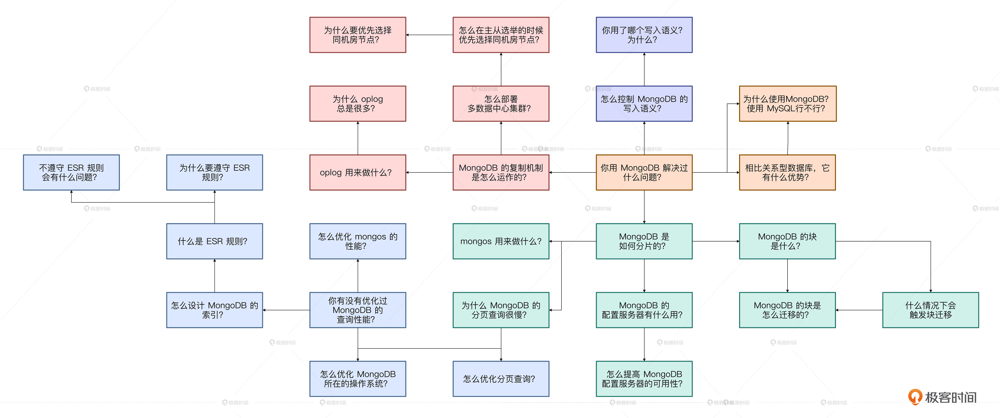
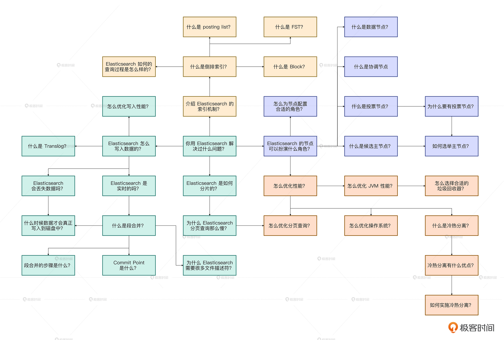

# 模拟面试｜NoSQL面试思路一图懂
你好，我是大明。

不知不觉已经到了课程的最后一章了。这一章的内容虽然较前几章来说没那么多，但是NoSQL的内容还是很重要的，尤其是近几年，在面试中出现的频次越来越高。所以为了让你对这部分内容掌握得更加牢固，我列出了一些问题，帮助你编织出自己的知识网络。

这些问题基本上都来自于我们的课程中，可以检验你的学习效果，如果你发现你并不能很好地回答出这些问题，那么我希望你可以回到课程中去好好复习一下，把基础打牢。

## 39｜Elasticsearch 高可用：怎么保证 Elasticsearch 的高可用？

01. Elasticsearch 的节点有什么角色？一个节点可以扮演多个角色吗？
02. 在实践中，怎么合理安排不同节点扮演的角色？
03. 什么是候选主节点和投票节点？投票节点可以被选为主节点吗？为什么要引入投票节点？
04. 可以说一下你们公司的 Elasticsearch 是如何部署的吗？性能如何？
05. 你用 Elasticsearch 解决过什么问题？为什么用 Elasticsearch？可以用别的框架吗？
06. Elasticsearch 为什么引入分片？为了解决什么问题？
07. 当一个写入请求发送到 Elasticsearch 之后，发生了什么？
08. Elasticsearch 是实时的吗？
09. Elasticsearch 的 Translog 是拿来干什么的？它可以保证数据一定不丢失吗？
10. 什么是 Commit Point？用来干什么？
11. Elasticsearch 在合并段的时候，会影响到已有的查询吗？一个查询怎么知道应该用合并前的段，还是应该用合并后的段？
12. 如果我的写入数据流量很大，怎么保证我的 Elasticsearch 不会崩溃？
13. 你知道什么是协调节点吗？它的作用是什么？怎么保证协调节点高可用？

## 40｜Elasticsearch查询：怎么优化 Elasticsearch 的查询性能？

1. 你的业务写入和查询的性能如何？Elasticsearch 的性能瓶颈是多少？
2. 如何设计 Ealsticsearch 的索引？
3. 你有没有优化过 Elasticsearch 的查询性能？怎么优化？为什么可以这么优化？
4. 为什么 Elasticsearch 的分页查询也那么慢？可以怎么优化？
5. 你有没有优化过 Elasticsearch 的 JVM？怎么优化的？
6. 如果 Elasticsearch 经常出现 Full GC，怎么排查和优化？
7. 怎么为 Elasticsearch 选择适合垃圾回收算法？
8. swap 对 Elasticsearch 有什么影响？应该怎么调整？
9. 为什么 Elasticsearch 容易出现文件描述符耗尽的问题？可以怎么优化？

## 41｜MongoDB：MongoDB 是怎么做到高可用的？

01. 你们公司的 MongoDB 是如何部署的？可用性有多高？
02. 你用 MongoDB 解决过什么问题？你为什么要用 MongoDB？用 MySQL 行不行？
03. 和关系型数据库比起来，MongoDB 有哪些优势？
04. MongoDB 是如何分片的？
05. MongoDB 的块是什么？
06. 什么情况下会触发块迁移？怎么迁移？
07. MongoDB 的负载均衡（再平衡）是指什么？
08. MongoDB 的配置服务器有什么作用？
09. MongoDB 的复制机制是怎样的？
10. 为什么 MongoDB 的 oplog 总是很多？
11. 怎么控制 MongoDB 的写入语义？你用的是什么语义？为什么用这个语义？
12. 有没有遇到过配置服务器崩溃的问题？怎么提高配置服务器的可用性？
13. 当 MongoDB 的主节点崩溃之后，如何选出一个新的主节点？
14. 怎么样可以让 MongoDB 在主从选举的时候优先选择同机房的从节点？

## 42｜MongoDB高性能：怎么优化 MongoDB 的查询性能？

01. 你的业务里面使用 MongoDB 的性能如何？能撑住多大的读写流量？
02. 你有没有遇到过 MongoDB 的性能问题？后面是如何解决的？
03. 当我一个查询请求落到了 MongoDB 之上后，MongoDB 是怎么执行这个查询的？
04. mongos 是什么？拿来干什么？怎么优化它的性能？
05. 怎么设计 MongoDB 的索引？怎么判定一个索引是否合适？
06. 什么是 ESR 规则？为何要遵守 ESR 规则？不遵守行不行？
07. 大文档有什么问题？可以怎么解决大文档引发的问题？
08. 什么时候要嵌入文档？有什么优势？
09. 怎么优化 MongoDB 的排序（分页）查询？
10. 为什么要尽可能只查询必要的字段？
11. 怎么优化 MongoDB 所在的操作系统？这些优化为什么会有效果？

## 一图懂

最后，我把这两章的内容汇总成了两张图片，你可以再结合图片好好复习一下这一章的内容。至此，这门课程的正文部分就结束了，希望你可以从这四十余讲的内容里有所收获。